# 024：相关性分析

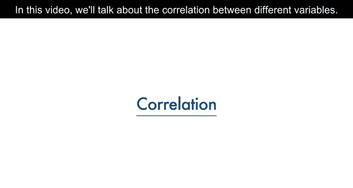

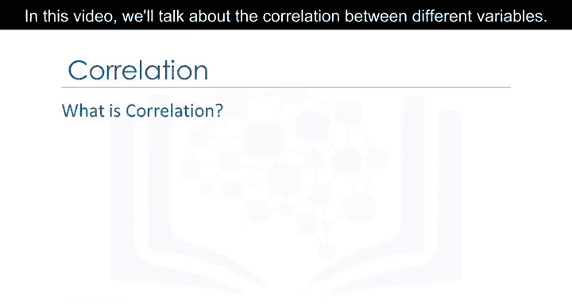

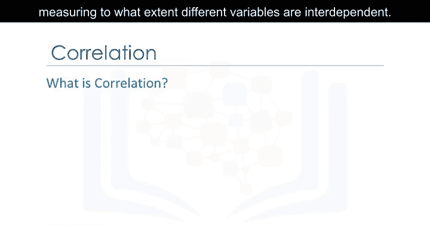

在本节课中，我们将学习相关性分析的基本概念，了解如何衡量不同变量之间的相互依赖程度，并通过实际案例掌握如何使用Python进行相关性分析。

## 概述：什么是相关性？

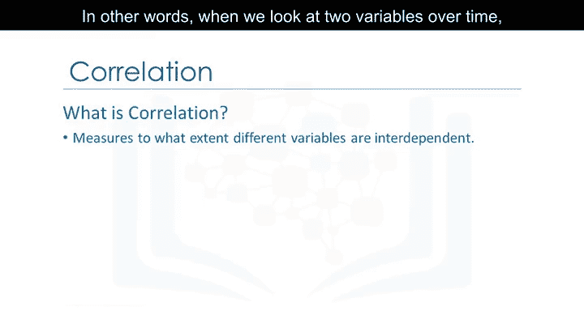

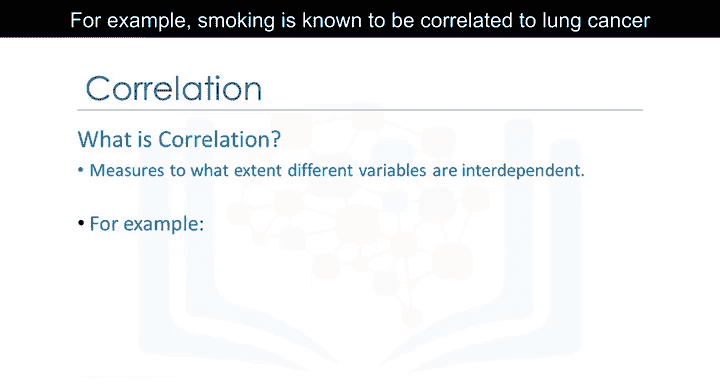

相关性是一种统计指标，用于衡量不同变量之间相互依赖的程度。

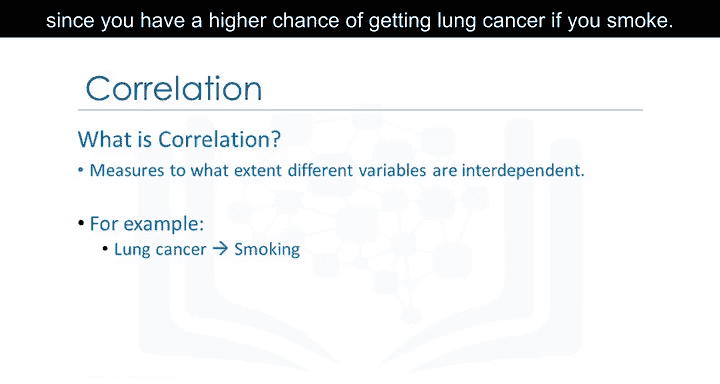

换句话说，当我们观察两个变量随时间的变化时，如果一个变量发生变化，另一个变量会如何随之改变。例如，吸烟与肺癌之间存在相关性，因为吸烟会增加患肺癌的风险。

另一个例子是雨伞和降雨量之间的相关性。降雨量越大，使用雨伞的人就越多。如果不下雨，人们通常不会携带雨伞。因此，我们可以说雨伞和降雨量是相互依赖的，根据定义，它们是相关的。

需要明确的是，相关性并不意味着因果关系。我们可以说雨伞和降雨量是相关的，但没有足够的信息断定是雨伞导致了降雨，还是降雨导致了雨伞的使用。在数据科学中，我们通常更关注相关性本身。

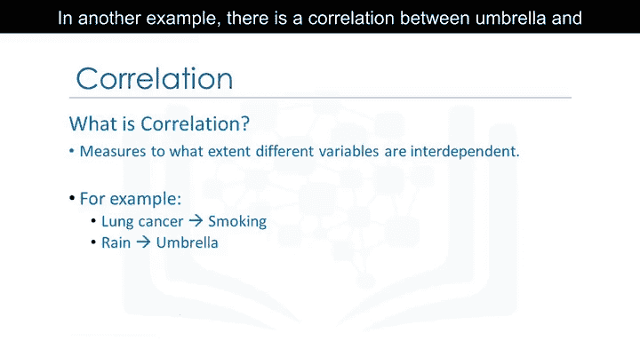

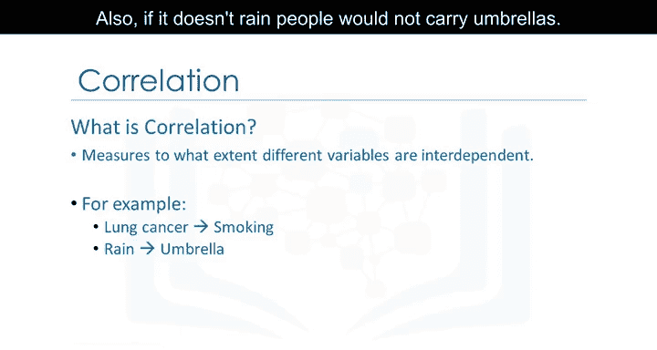

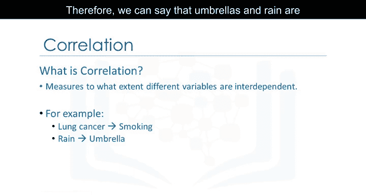

## 正相关示例：发动机大小与价格

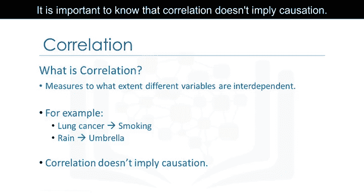

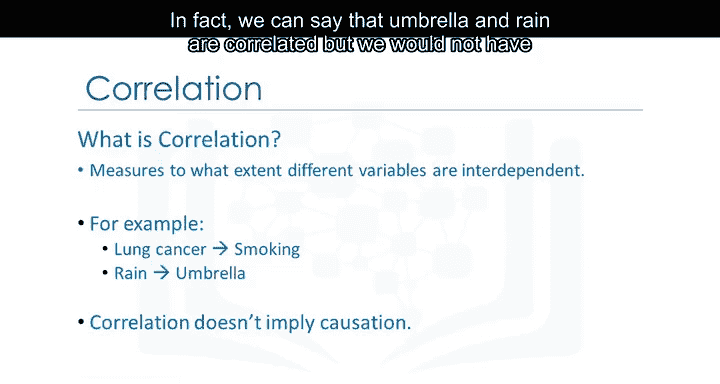

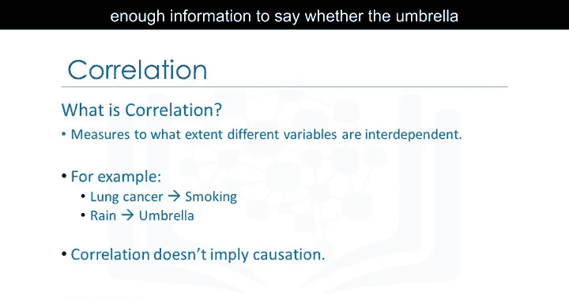

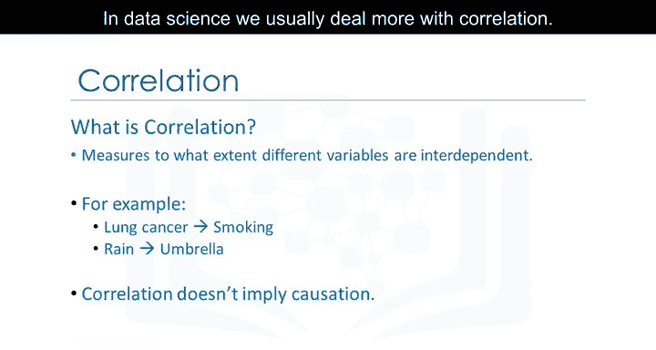

上一节我们介绍了相关性的基本概念，本节中我们来看看一个具体的正相关示例：汽车发动机大小与价格之间的关系。

为了分析这两个变量，我们可以使用散点图并添加一条回归线（线性线），以直观展示两者之间的关系。

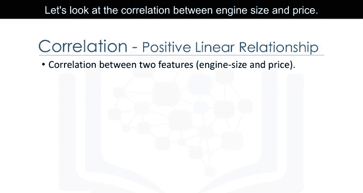

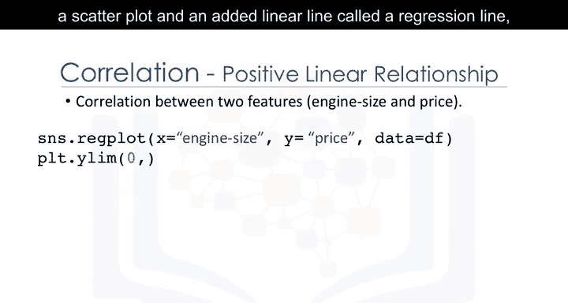

该图表的主要目的是观察发动机大小是否对价格产生影响。在这个例子中，穿过数据点的直线非常陡峭，这表明两个变量之间存在正向的线性关系。随着发动机尺寸值的增加，价格值也随之上升，且直线的斜率为正。因此，发动机大小与价格之间存在正相关。

我们可以使用Seaborn库的`regplot`函数来创建这个散点图。

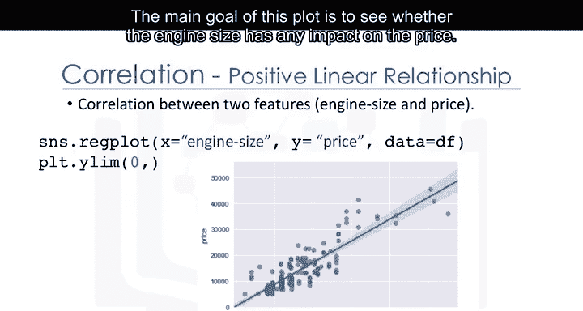

```python
import seaborn as sns
sns.regplot(x='engine-size', y='price', data=df)
```

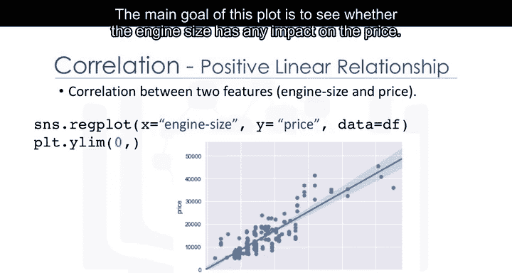

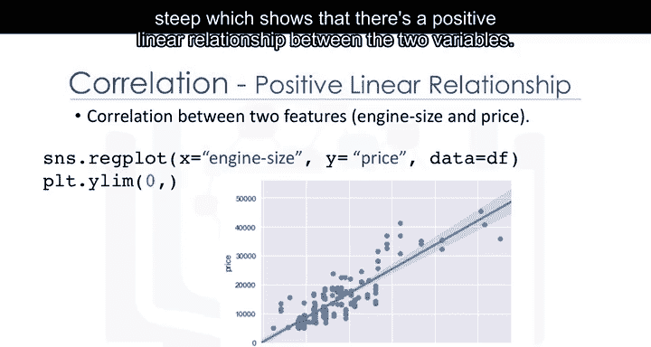

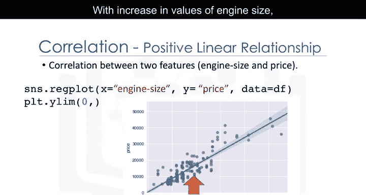

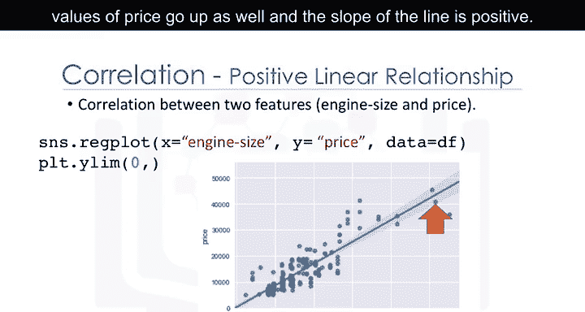

## 负相关示例：高速公路油耗与价格

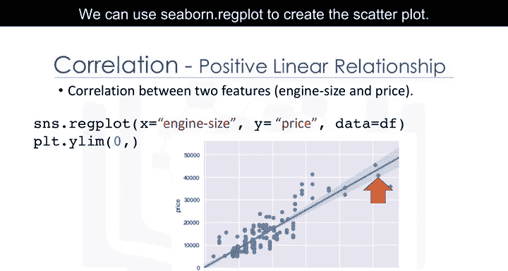

了解了正相关后，现在让我们看看负相关的例子：高速公路每加仑行驶里程（油耗）对汽车价格的影响。

从图中可以看出，当高速公路油耗值上升时，价格值下降。因此，高速公路油耗与价格之间存在负向的线性关系。尽管这种关系是负向的，但直线的斜率仍然较陡，这意味着高速公路油耗仍然是预测价格的一个有效指标。这两个变量被称为具有负相关性。

## 弱相关或无相关示例

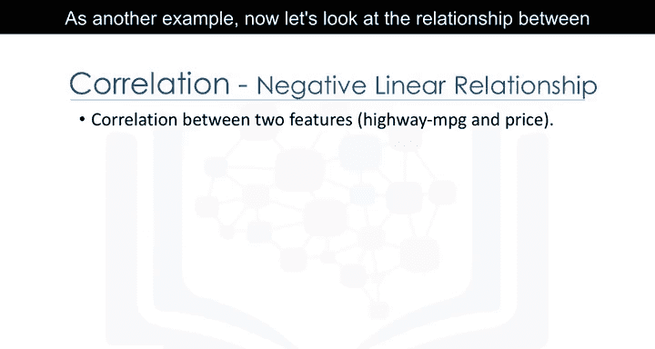

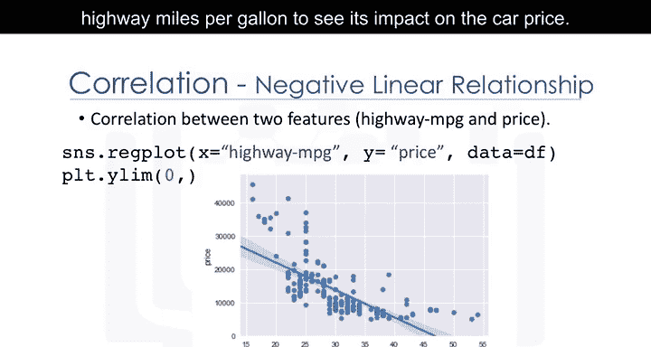

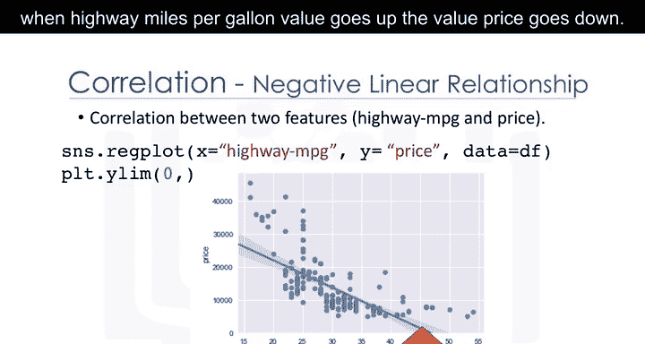

最后，我们来看一个弱相关或无相关的例子。例如，峰值转速（RPM）的低值和高值都对应着低价格和高价格。因此，我们无法使用峰值转速来可靠地预测价格值。

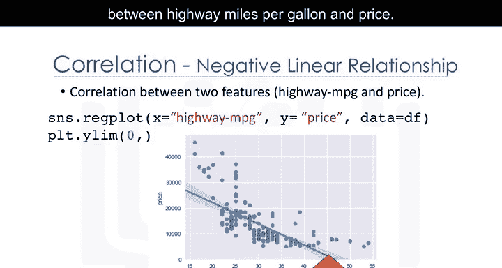

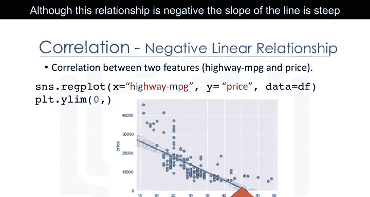

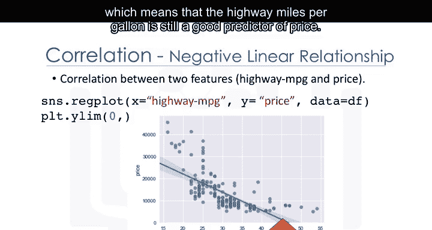

## 总结

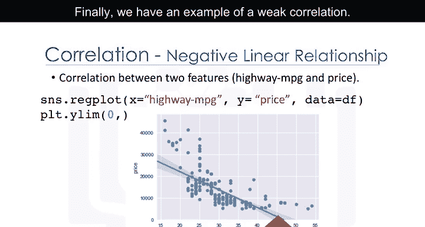

本节课中，我们一起学习了相关性分析的核心概念。我们了解到相关性是衡量变量间相互依赖程度的统计指标，并区分了正相关、负相关以及弱相关。通过汽车数据集的具体示例，我们使用散点图和回归线可视化了发动机大小与价格的正相关关系，以及高速公路油耗与价格的负相关关系。重要的是要记住，相关性并不等同于因果关系。在数据科学实践中，理解变量间的相关性是进行有效分析和预测的基础。