# 025：Python分组操作


在本节课中，我们将学习如何使用Pandas库进行数据分组操作。分组是数据分析中的一项核心技能，它允许我们根据数据的类别将数据集划分为多个子集，进而对每个子集进行独立的分析和计算。通过分组，我们可以更清晰地观察不同类别数据之间的差异和关系。


## 概述：为什么需要分组？


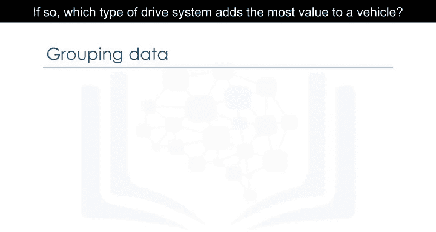

假设我们想了解不同类型的驱动系统（前驱、后驱和四驱）与车辆价格之间是否存在关系。如果存在关系，哪种驱动系统能为车辆增加最多的价值？为了回答这些问题，我们需要将数据按照驱动系统的类型进行分组，然后比较不同组之间的结果。

在Pandas中，这可以通过`groupby`方法实现。


## 分组操作基础

`groupby`方法用于处理分类变量。它将数据根据该变量的不同类别划分为多个子集。你可以根据单个变量进行分组，也可以通过传入多个变量名来根据多个变量进行分组。

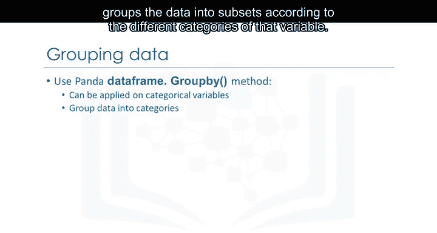

以下是分组操作的基本步骤：

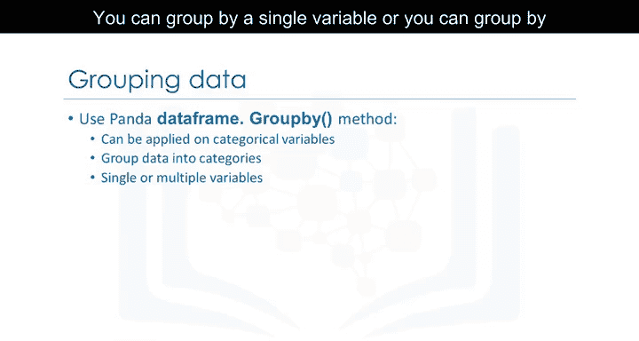

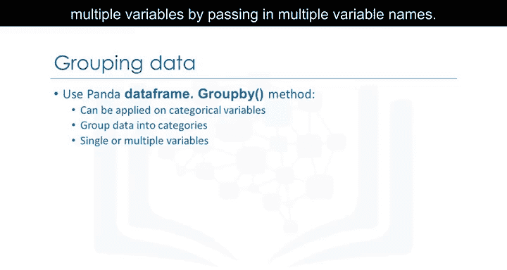

1.  选择需要分析的数据列。
2.  使用`groupby`方法指定分组依据的列。
3.  对分组后的数据应用聚合函数（如求平均值、求和等）。

## 实践：计算平均价格


让我们通过一个例子来具体说明。假设我们想找出车辆的平均价格，并观察不同车身样式和驱动系统类型之间的价格差异。

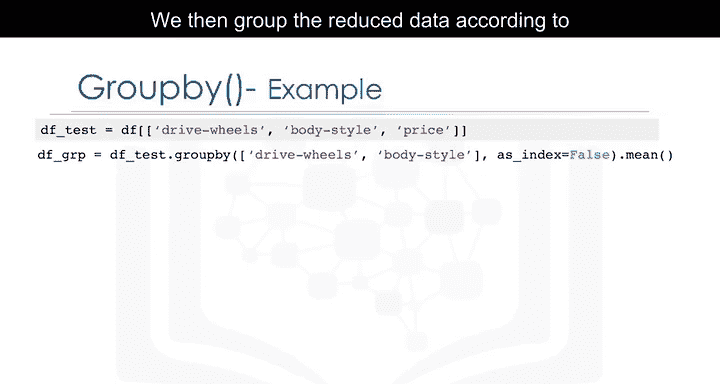

首先，我们选取感兴趣的三列数据：`drive-wheels`（驱动系统）、`body-style`（车身样式）和`price`（价格）。

```python
df_selected = df[['drive-wheels', 'body-style', 'price']]
```

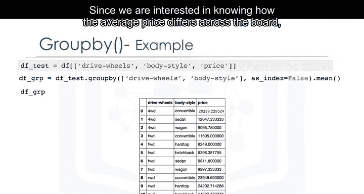

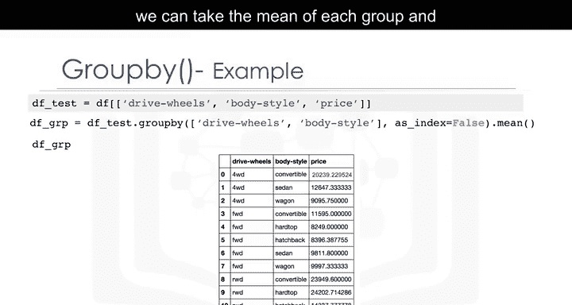

接着，我们根据`drive-wheels`和`body-style`对筛选后的数据进行分组。

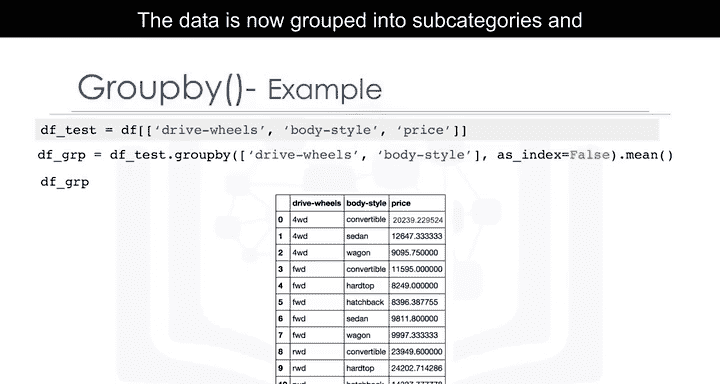

```python
df_grouped = df_selected.groupby(['drive-wheels', 'body-style'])
```

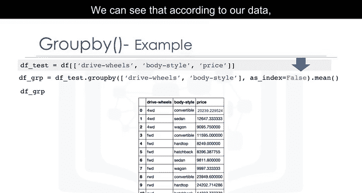

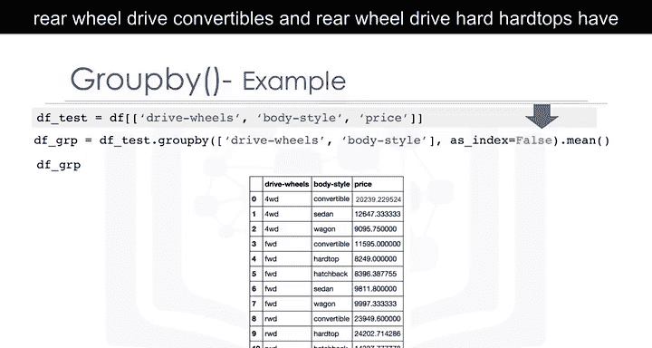

由于我们关注的是平均价格，我们在分组后对每个组应用`mean()`函数来计算平均值。

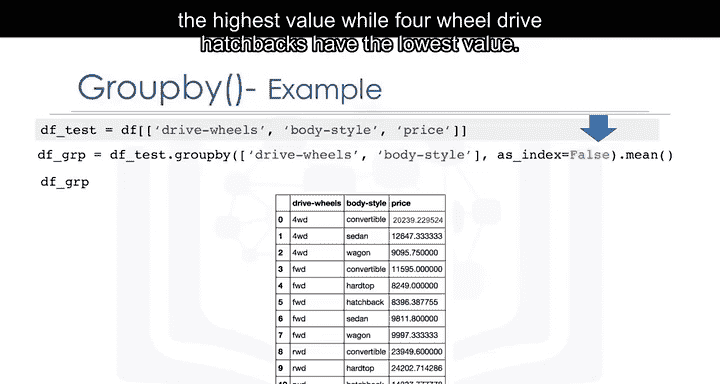

```python
df_grouped_mean = df_grouped.mean()
```

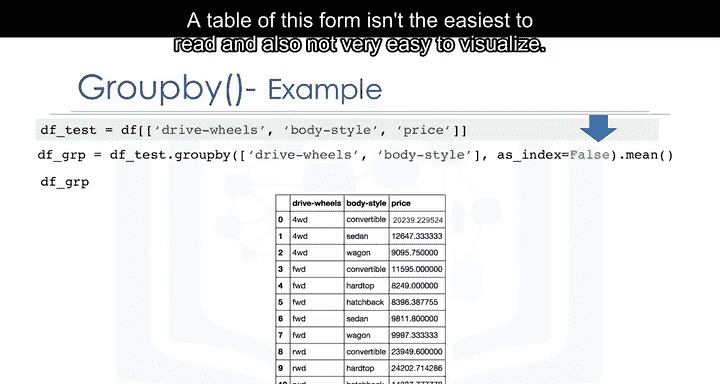

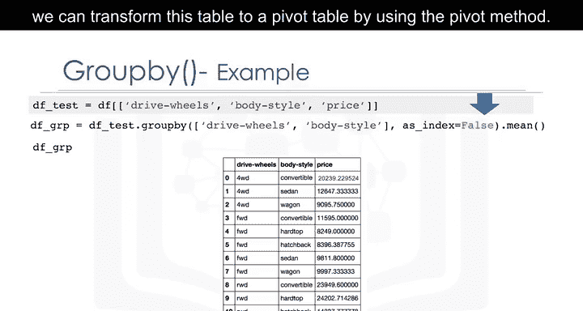

现在，数据被分组为多个子类别，并且只显示每个子类别的平均价格。从结果中我们可以看到，根据我们的数据，后驱敞篷车和后驱硬顶车的价值最高，而四驱掀背车的价值最低。

## 从分组表到透视表

上述分组结果以表格形式呈现，但可能不够直观，也不易于可视化。为了更容易理解，我们可以使用`pivot`方法将这个表格转换为透视表。

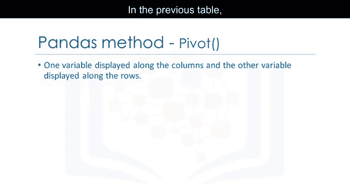

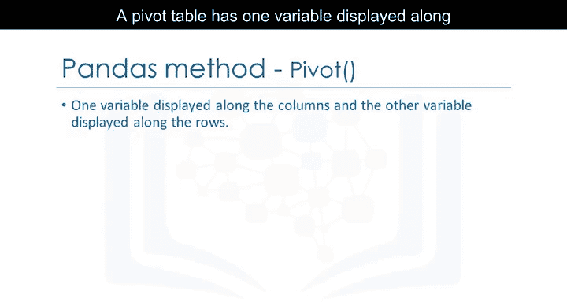

在之前的表格中，`drive-wheels`和`body-style`都列在列中。透视表则将其中一个变量显示在列上，另一个变量显示在行上。

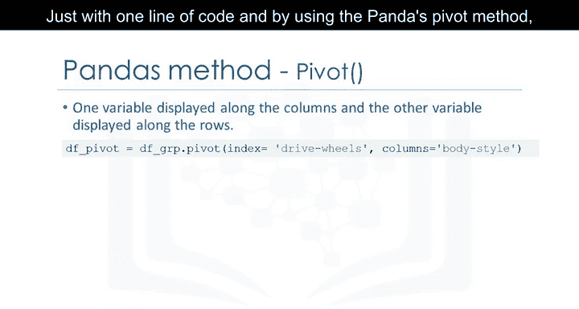

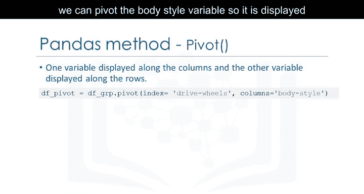

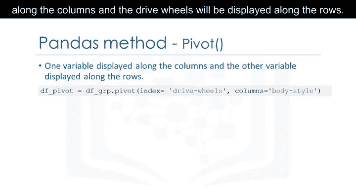

通过一行代码，使用Pandas的`pivot`方法，我们可以将`body-style`变量作为列，将`drive-wheels`变量作为行。

```python
df_pivot = df_grouped_mean.pivot(index='drive-wheels', columns='body-style')
```

现在，价格数据变成了一个矩形网格，更易于观察。这类似于Excel电子表格中常用的数据透视表。

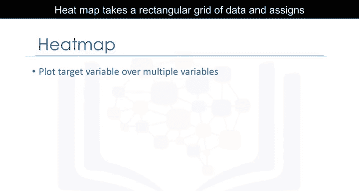

## 可视化：热力图

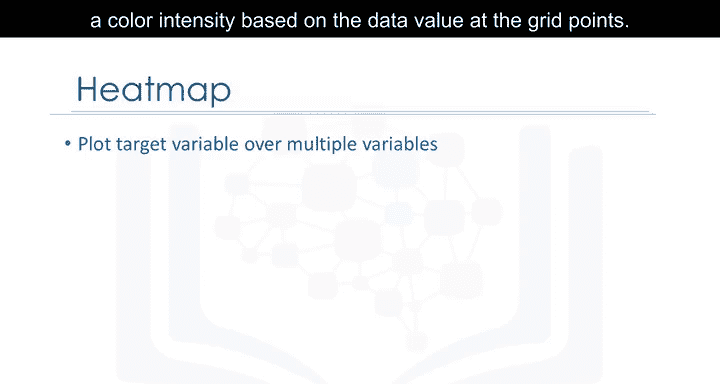

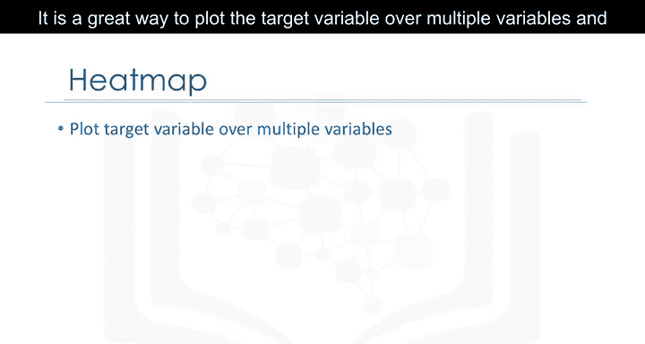

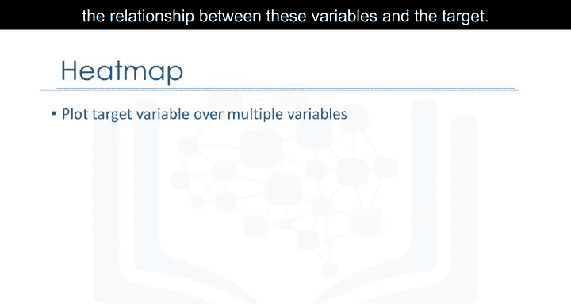

另一种表示透视表的方法是使用热力图。热力图接收一个矩形数据网格，并根据网格点上的数据值为其分配颜色强度。这是一种在多个变量上绘制目标变量的绝佳方式，可以直观地获取这些变量与目标变量之间关系的线索。

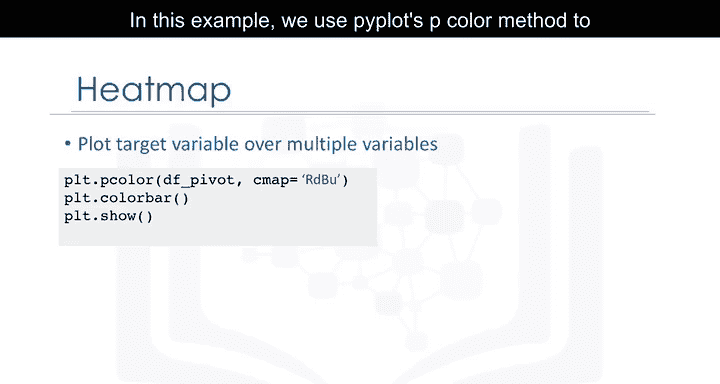

在本例中，我们使用Matplotlib的`pcolor`方法来绘制热力图，将之前的透视表转换为图形形式。

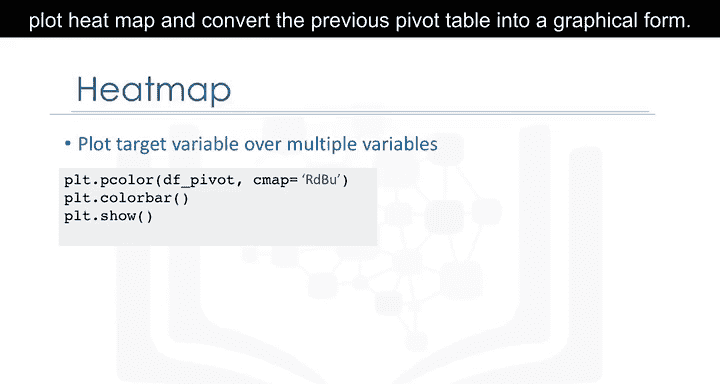

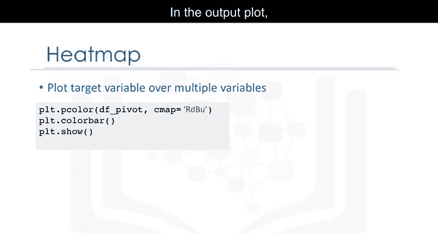

```python
plt.pcolor(df_pivot, cmap='RdBu')
plt.colorbar()
plt.show()
```

我们指定了红-蓝配色方案。在输出图中，X轴编号代表不同类型的车身样式，Y轴编号代表不同类型的驱动系统。平均价格根据其值以不同颜色绘制。根据颜色条，我们可以看到热力图的上半部分价格似乎更高，而下半部分价格较低。

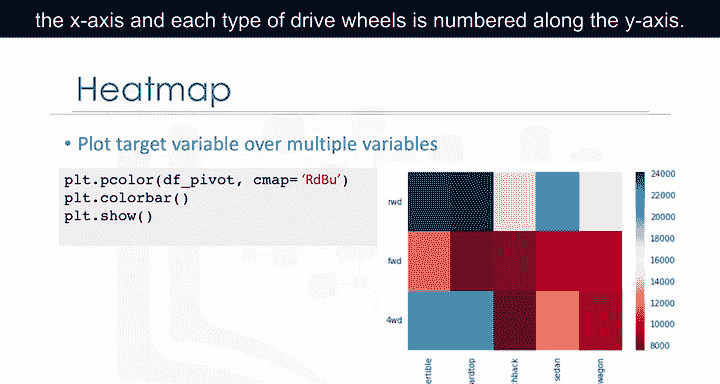

## 总结

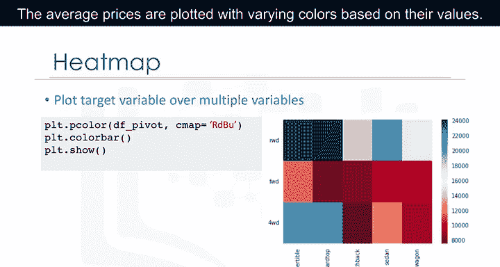

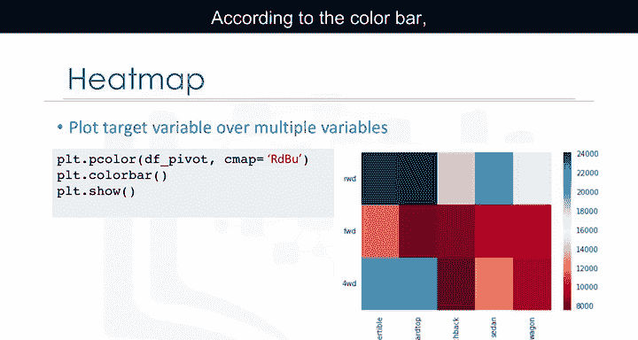

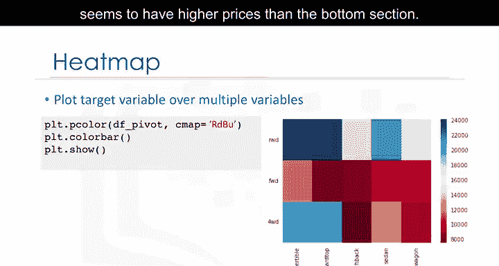

本节课我们一起学习了Pandas中的分组操作。我们首先了解了分组的概念及其在数据分析中的重要性。接着，我们通过一个具体示例，演示了如何使用`groupby`方法根据多个变量对数据进行分组，并计算每个组的统计量（如平均值）。然后，我们学习了如何将分组结果转换为更直观的透视表，并最终通过热力图进行可视化展示，从而更清晰地揭示数据中隐藏的模式和关系。掌握这些技能将帮助你更有效地探索和理解数据集。