# 026：相关性统计

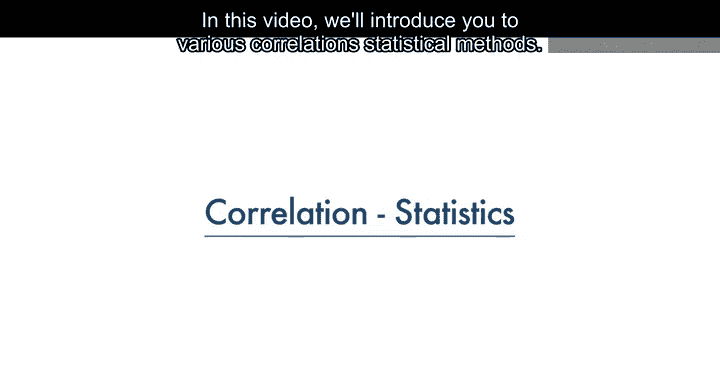

在本节课中，我们将学习相关性统计方法。相关性用于衡量两个连续数值变量之间关系的强度和方向。我们将重点介绍皮尔逊相关系数，并学习如何解读其计算结果，包括相关系数和P值。最后，我们将通过一个汽车数据的例子，演示如何计算相关性并利用热力图进行可视化分析。

---

## 🔍 皮尔逊相关系数

上一节我们介绍了相关性统计的概念，本节中我们来看看最常用的皮尔逊相关系数。这是一种衡量两个连续数值变量之间线性关系强度的方法。

皮尔逊相关方法会给出两个值：**相关系数**和**P值**。

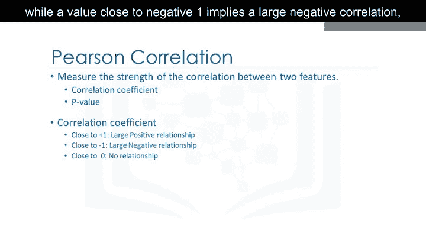

### 相关系数的解读

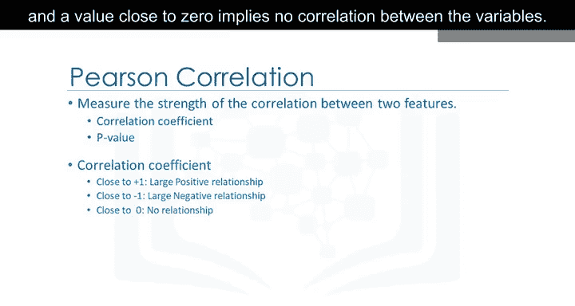

相关系数的取值范围在-1到1之间。

*   **相关系数接近1**：表示存在**强正相关**。即一个变量增加时，另一个变量也倾向于增加。
*   **相关系数接近-1**：表示存在**强负相关**。即一个变量增加时，另一个变量倾向于减少。
*   **相关系数接近0**：表示两个变量之间**没有线性相关**。

### P值的解读

P值用于衡量我们对计算出的相关系数的确信程度。

以下是P值的解读指南：

*   **P值 < 0.001**：为我们对计算出的相关系数提供了**强确信度**。
*   **0.001 ≤ P值 < 0.05**：提供了**中等确信度**。
*   **0.05 ≤ P值 < 0.1**：提供了**弱确信度**。
*   **P值 ≥ 0.1**：**无法确信**存在相关性。

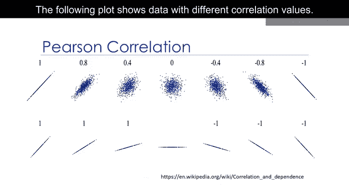

当**相关系数接近1或-1**，并且**P值小于0.001**时，我们可以说存在强相关性。

---

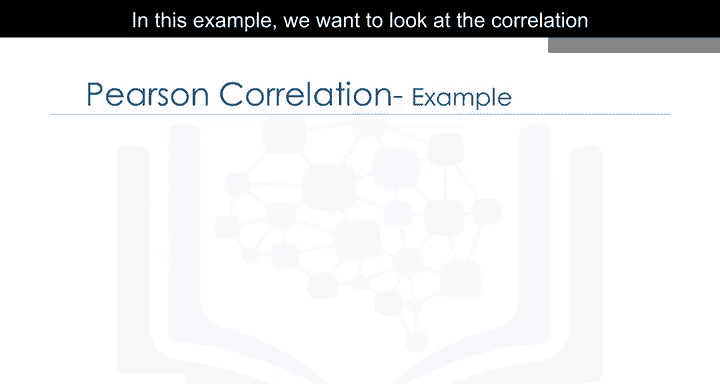

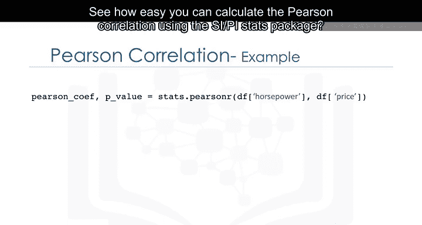

## 🚗 实例分析：马力与价格的相关性

了解了皮尔逊相关系数的原理后，我们通过一个实例来应用它。本例中，我们将分析汽车的马力与价格之间的相关性。

使用Python的`scipy.stats`包可以轻松计算皮尔逊相关系数。

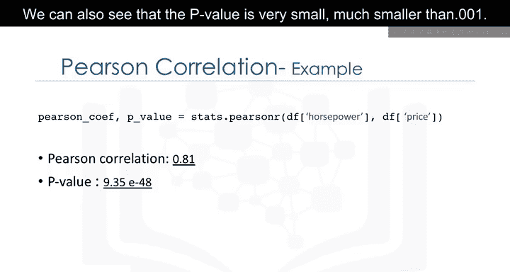

```python
# 示例代码：使用scipy.stats计算皮尔逊相关系数和P值
from scipy import stats
stats.pearsonr(horsepower, price)
```

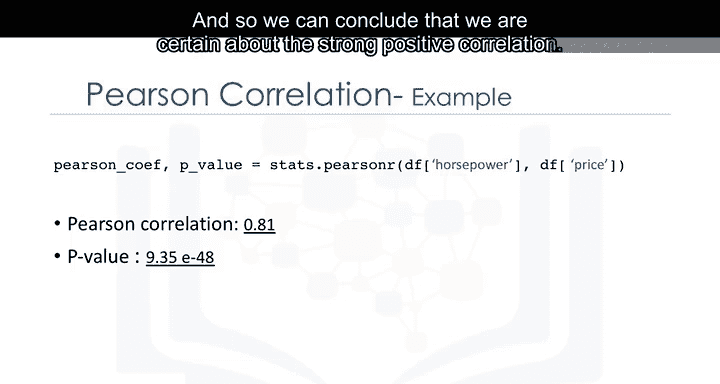

计算结果显示，**相关系数约为0.8**（接近1），**P值远小于0.001**。

因此，我们可以得出结论：马力与汽车价格之间存在**强正相关**，并且我们对此结论有很高的确信度。

---


## 🗺️ 相关性热力图

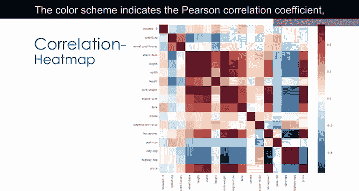

在分析了两个变量之后，我们可以将视野扩大到所有变量。通过计算数据集中所有数值变量两两之间的皮尔逊相关系数，可以创建一张相关性热力图。

热力图使用颜色深浅来表示相关系数的大小，从而直观展示任意两个变量之间关系的强度。

在生成的热力图中，我们可以看到一条深红色的对角线。这条线上的值都显示出高度相关性，这是合理的，因为对角线表示的是每个变量与自身的相关性，其值始终为**1**。


这张相关性热力图为我们提供了不同变量之间相互关系的概览，最重要的是，它清晰地展示了各个变量与目标变量“价格”之间的关系。

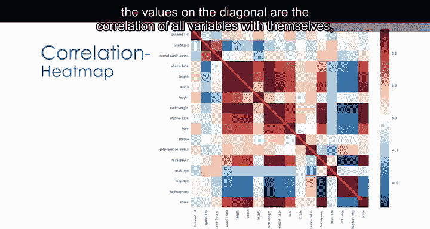

---

## 📝 总结

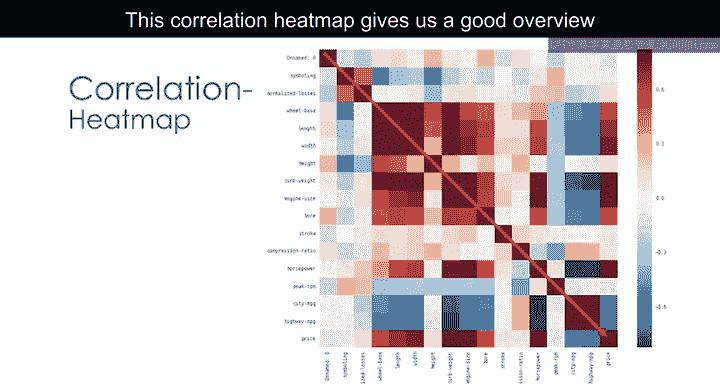


本节课中我们一起学习了相关性统计的核心知识。我们介绍了**皮尔逊相关系数**，它用于衡量两个连续变量间的线性关系（`r`接近±1表示强相关，接近0表示无相关）。同时，我们学习了**P值**的意义，它决定了我们对相关性结论的确信程度（`P < 0.001`表示强确信）。最后，我们通过Python代码进行了实战计算，并利用**热力图**对所有变量间的相关性进行了可视化分析，这能帮助我们快速发现数据中的重要关系模式。