# 028：相关性分析

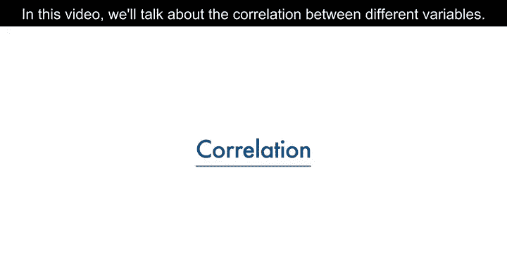

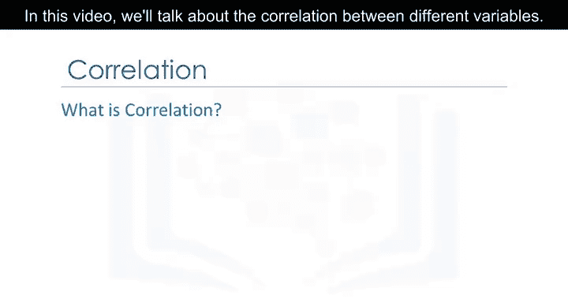

在本节课中，我们将要学习相关性分析。相关性是数据分析中的一个核心概念，它帮助我们理解不同变量之间是否存在关联，以及这种关联的强度和方向。通过本课的学习，你将能够识别并解释变量间的相关关系，并理解其与因果关系的区别。

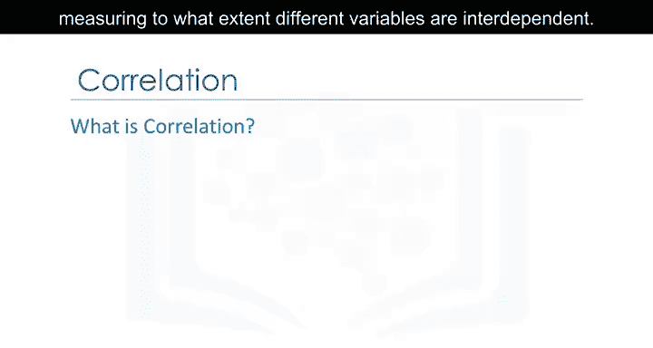

## 🔗 什么是相关性？

上一节我们介绍了数据分析的基本流程，本节中我们来看看一个关键的统计度量：相关性。

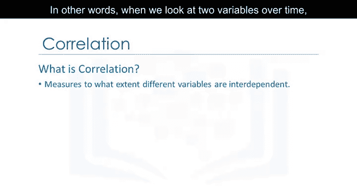

相关性是一种统计指标，用于衡量不同变量在多大程度上是相互依存的。换句话说，当我们观察两个变量随时间的变化时，如果一个变量发生变化，这种变化会如何影响另一个变量。

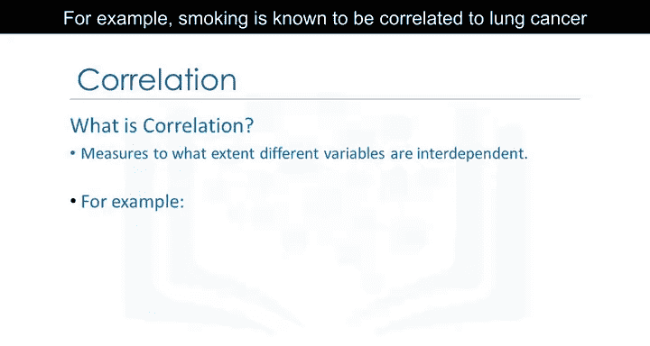

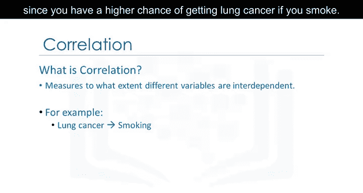

例如，吸烟与肺癌之间存在相关性，因为吸烟会提高患肺癌的几率。

## 🌂 相关性与因果关系

理解相关性后，一个至关重要的点是区分相关性与因果关系。

相关性并不意味着因果关系。我们可以说雨伞和降雨是相关的，但我们没有足够的信息断定是雨伞导致了降雨，还是降雨导致了人们使用雨伞。在数据科学中，我们通常更多地处理相关性，而非急于下因果结论。

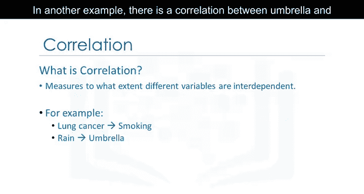

## 📈 正相关示例：发动机大小与价格

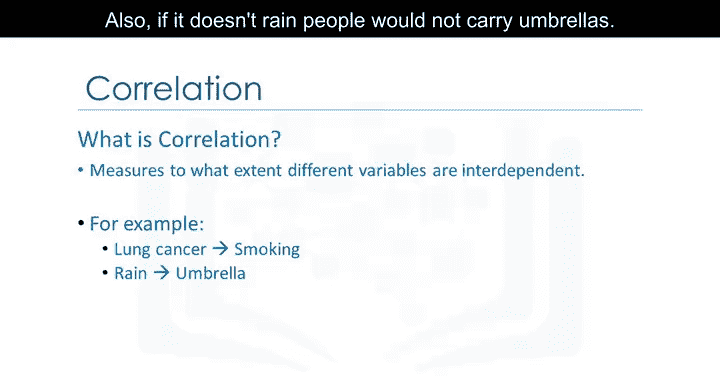

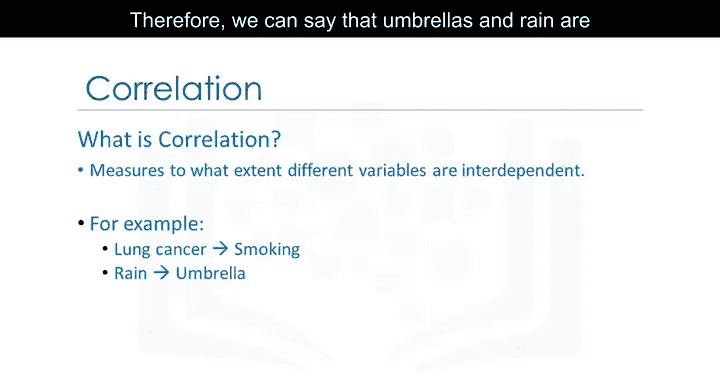

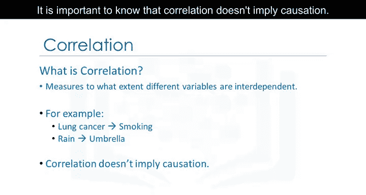

现在，让我们通过具体例子来观察相关性。我们将可视化两个变量：发动机大小和汽车价格。

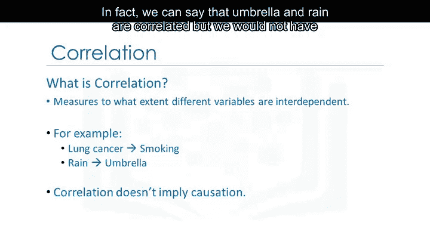

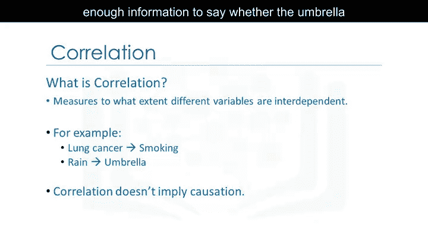

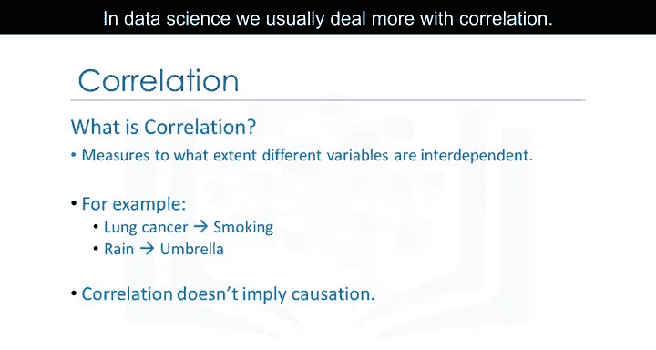

我们将使用散点图并添加一条称为回归线的直线来可视化这两个变量，这条线指示了两者之间的关系。

这个图表的主要目标是观察发动机大小是否对价格有影响。在这个例子中，你可以看到穿过数据点的直线非常陡峭，这表明两个变量之间存在**正线性关系**。随着发动机尺寸值的增加，价格值也随之上升，且直线的斜率为正。因此，发动机大小与价格之间存在**正相关**。

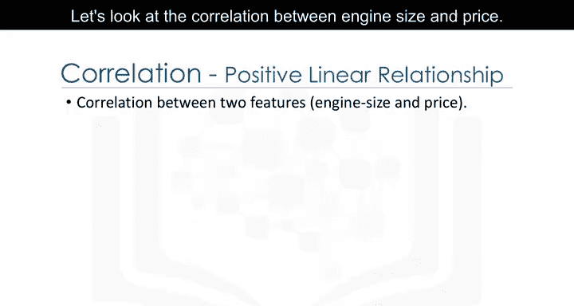

我们可以使用Seaborn库的`regplot`函数来创建这个散点图。核心代码如下：
```python
import seaborn as sns
sns.regplot(x='engine-size', y='price', data=df)
```

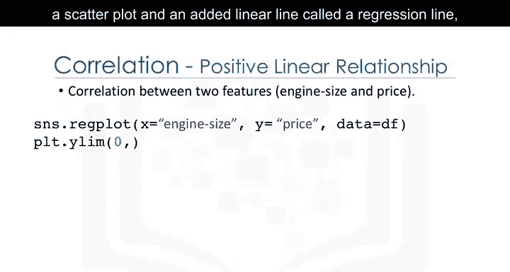

## 📉 负相关示例：高速公路油耗与价格

接下来，我们看看另一个例子：高速公路每加仑英里数（油耗）与汽车价格的关系。

从图中可以看出，当高速公路油耗值上升时，价格值下降。因此，高速公路油耗与价格之间存在**负线性关系**。虽然这种关系是负向的，但直线的斜率依然陡峭，这意味着高速公路油耗仍然是预测价格的一个良好指标。这两个变量被称为具有**负相关**。

## ➰ 弱相关示例：峰值转速与价格

最后，我们来看一个弱相关的例子：峰值转速（RPM）与价格。

在这个例子中，无论是低峰值转速还是高峰值转速，都对应着低价格和高价格。因此，我们无法有效地使用峰值转速来预测价格值。这表明两者之间的相关性非常弱。

## 📝 本节总结

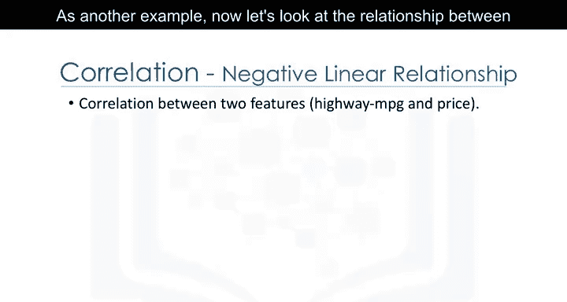

本节课中我们一起学习了相关性分析。我们了解到：
*   相关性是衡量变量间相互依存程度的统计指标。
*   相关性**不等于**因果关系。
*   正相关意味着一个变量增加时，另一个也增加。
*   负相关意味着一个变量增加时，另一个减少。
*   通过散点图和回归线可以直观地判断相关性的方向和强度。

掌握相关性分析是理解数据中变量关系的重要一步，为后续的建模和预测分析奠定基础。