# 029：相关性统计

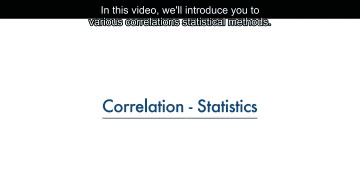

在本节课中，我们将学习如何衡量连续数值变量之间关系的强度，即相关性统计。我们将重点介绍皮尔逊相关系数，并学习如何解读其结果，包括相关系数和P值。最后，我们将通过一个汽车数据的例子，演示如何计算相关性并利用热力图进行可视化分析。

---

## 🔍 皮尔逊相关系数简介

上一节我们介绍了数据分析的基本概念，本节中我们来看看如何量化变量之间的关系。衡量连续数值变量之间相关性强度的一种方法是使用皮尔逊相关系数。

皮尔逊相关系数方法会给出两个值：**相关系数**和**P值**。

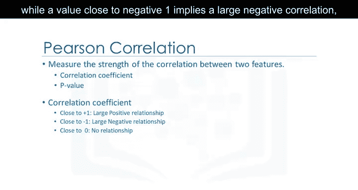

---

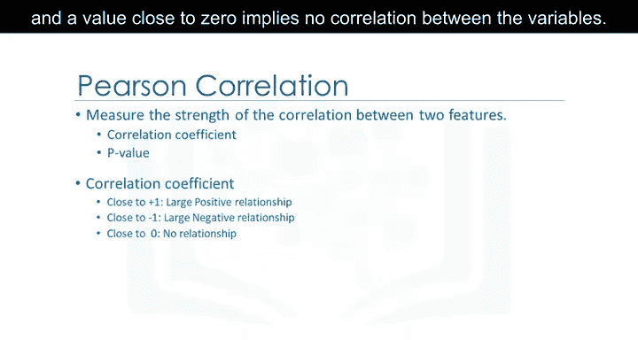

## 📈 如何解读相关系数

那么，我们如何解读这些值呢？对于相关系数：

*   一个接近 **1** 的值意味着存在**强正相关**。
*   一个接近 **-1** 的值意味着存在**强负相关**。
*   一个接近 **0** 的值意味着变量之间**没有相关性**。

---

## 🎯 如何解读P值

接下来，P值会告诉我们对于计算出的相关性有多大的把握。

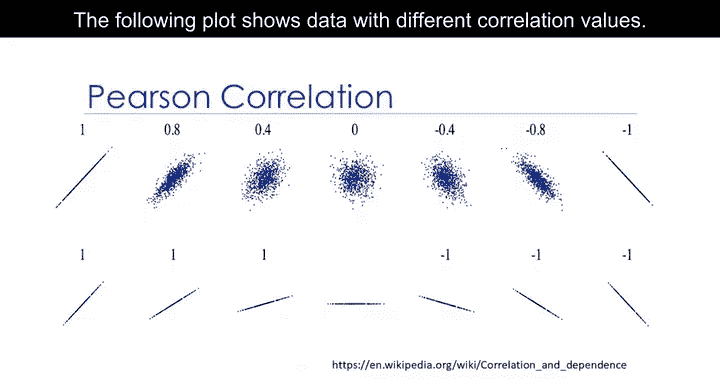

以下是P值解读的准则：

*   P值 **小于 0.001**，表明我们对计算出的相关系数有**很强的把握**。
*   P值 **介于 0.001 和 0.05 之间**，表明我们有**中等的把握**。
*   P值 **介于 0.05 和 0.1 之间**，表明我们有**较弱的把握**。
*   P值 **大于 0.1**，则表明我们**完全不能确定**存在相关性。

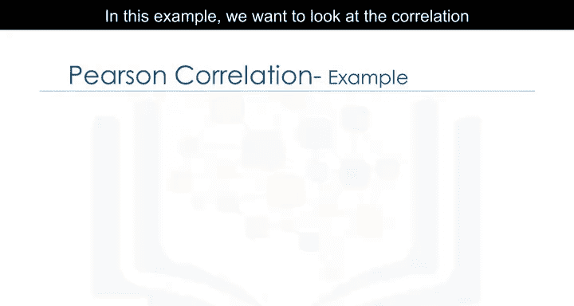

当相关系数接近1或-1，且P值小于0.001时，我们可以说存在强相关性。下图展示了具有不同相关性值的数据。

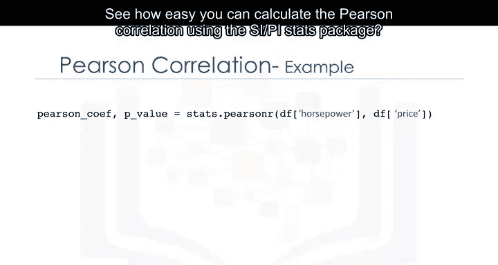

---

## 🚗 实战示例：汽车数据相关性分析

在这个例子中，我们想看看变量“马力”和“汽车价格”之间的相关性。使用`scipy.stats`包可以非常简便地计算皮尔逊相关系数。

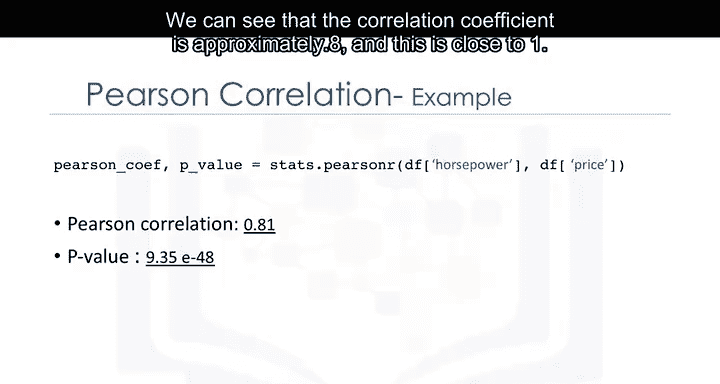

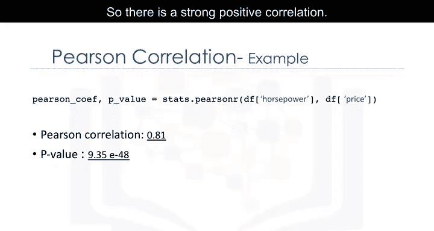

```python
# 示例代码：使用 scipy.stats 计算皮尔逊相关系数
from scipy import stats
stats.pearsonr(df['horsepower'], df['price'])
```

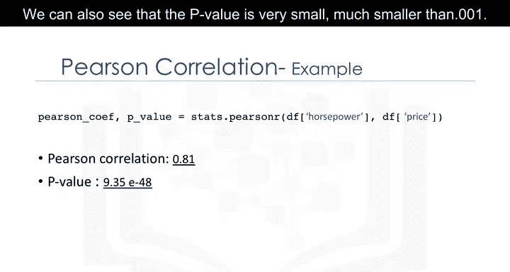

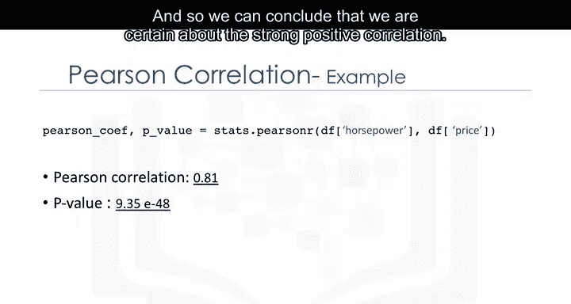

我们可以看到，相关系数大约为**0.8**，这个值接近1，因此存在**强正相关**。我们还可以看到P值非常小，远小于0.001。因此我们可以得出结论：我们确信存在强正相关。

---

## 🗺️ 相关性热力图分析

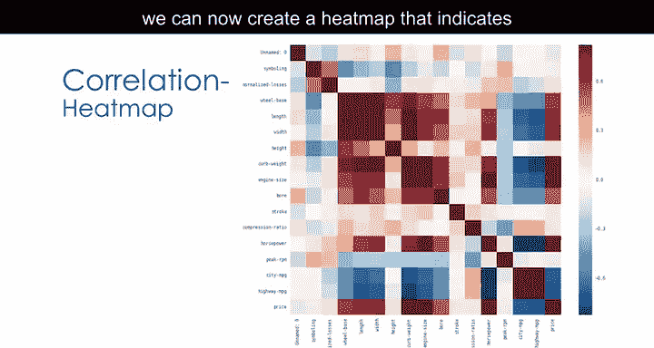


将所有的变量都考虑进来，我们现在可以创建一个热力图，来指示每对变量之间的相关性。配色方案表示皮尔逊相关系数，即两个变量之间相关性的强度。

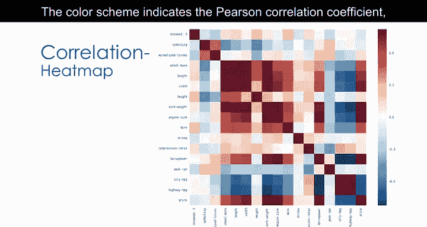

我们可以看到一条深红色的对角线，表明这条对角线上的所有值都高度相关。这很容易理解，因为仔细观察，对角线上的值是所有变量与自身的相关性，其值总是为**1**。

这个相关性热力图很好地概述了不同变量之间是如何相互关联的，最重要的是，这些变量与“价格”是如何关联的。

---

## 📝 课程总结

本节课中，我们一起学习了相关性统计的核心方法。我们介绍了**皮尔逊相关系数**及其两个关键输出：**相关系数**（衡量关系强度与方向）和**P值**（衡量结果的统计显著性）。通过汽车数据的实例，我们实践了如何使用Python计算相关性，并学会了通过**热力图**来直观展示多个变量之间的复杂关系。理解相关性是发现数据中潜在模式和关系的重要一步。