# 031：模型开发

在本节课中，我们将学习如何通过模型开发来预测汽车价格。我们将探讨线性回归、模型评估方法以及如何利用数据特征提升预测准确性。

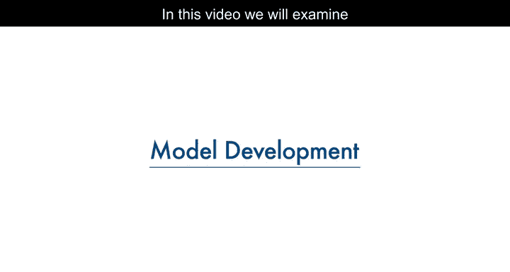

---

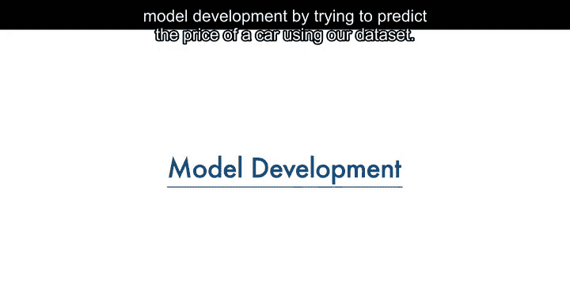

## 🎯 模型开发概述

模型或估计器可被视为一个数学方程，用于根据一个或多个输入值预测目标值。

该过程涉及将一个或多个自变量（特征）与因变量（目标）关联起来。例如，输入汽车的高速公路每加仑英里数作为特征，模型输出的因变量即为价格。

通常，数据越相关，模型预测越准确。

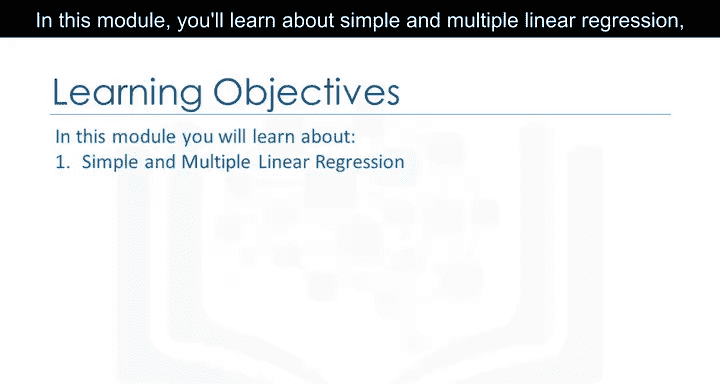

---

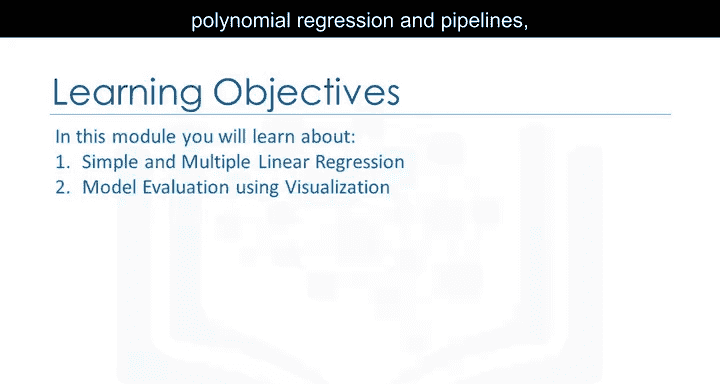

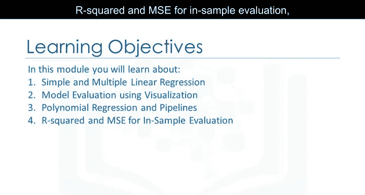

## 🔍 数据的重要性

为了理解为何更多数据至关重要，请考虑以下情况：假设有两辆几乎完全相同的汽车，但粉色汽车的售价显著低于红色汽车。

如果您模型的独立变量或特征中不包含颜色信息，模型将为这两辆车预测相同的价格，而实际上粉色汽车可能售价低得多。

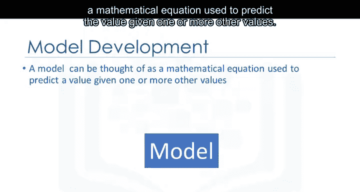

因此，除了收集更多数据，尝试不同类型的模型也是提高预测准确性的关键。

---

## 📈 回归模型类型

在本课程中，您将学习以下三种回归模型：

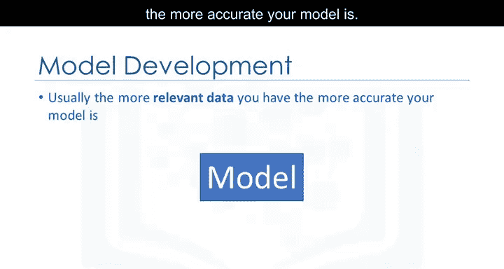

1.  **简单线性回归**
2.  **多元线性回归**
3.  **多项式回归**

---

## 📊 模型评估方法

我们将使用可视化方法评估模型，并介绍多项式回归和管道技术。

对于样本内评估，一个常用的指标是**均方误差**，其公式为：

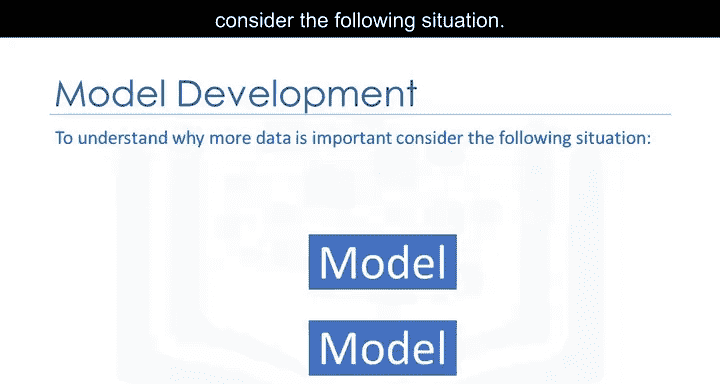

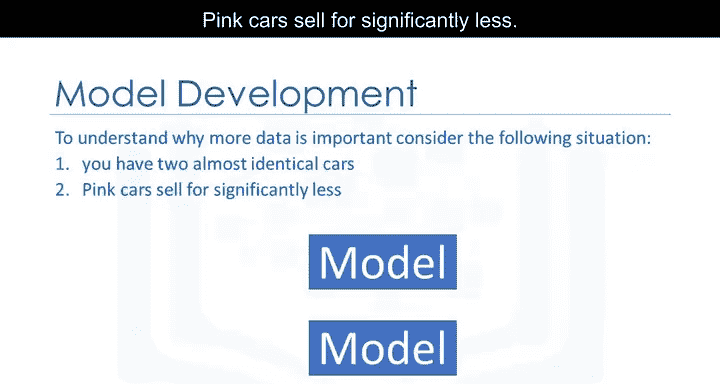

\[
MSE = \frac{1}{n} \sum_{i=1}^{n} (Y_i - \hat{Y}_i)^2
\]

其中，\( n \) 是样本数量，\( Y_i \) 是实际值，\( \hat{Y}_i \) 是预测值。

---

## 🛠️ 预测与决策制定

通过学习这些方法，您将能够进行预测并支持决策制定。例如，您可以确定一辆二手车的公平市场价值。

---

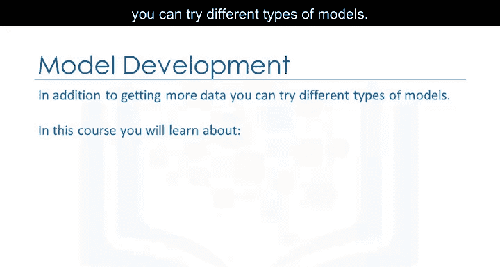

## ✅ 课程总结

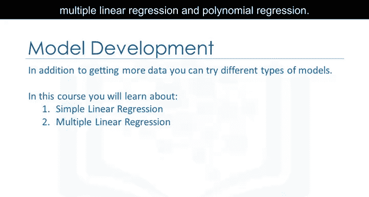

本节课中，我们一起学习了模型开发的基本概念，包括如何将特征与目标变量关联、理解数据量的重要性，并初步了解了简单线性回归、多元线性回归和多项式回归等模型。我们还介绍了使用均方误差进行模型评估的方法，为后续的实际预测和决策制定奠定了基础。