# 035：多项式回归与流水线

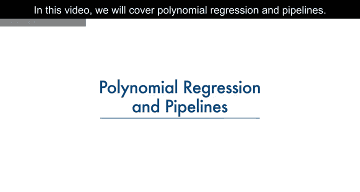

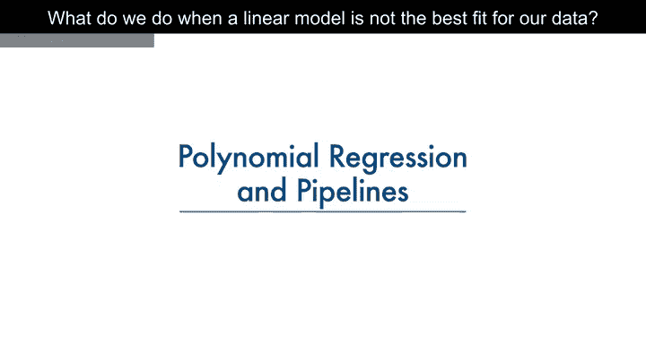

在本节课中，我们将学习多项式回归和流水线。当线性模型无法很好地拟合数据时，多项式回归提供了一种有效的替代方案。流水线则能帮助我们简化代码，将多个数据处理步骤有序地组合在一起。


## 🔍 多项式回归简介

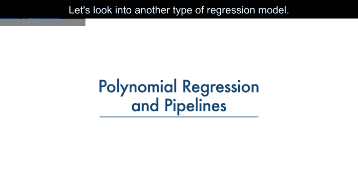

上一节我们介绍了线性回归。本节中我们来看看多项式回归。

多项式回归是广义线性回归的一种特殊形式。这种方法对于描述曲线关系非常有益。


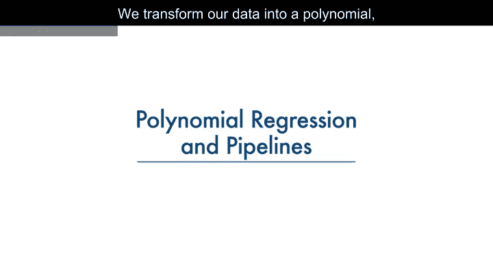

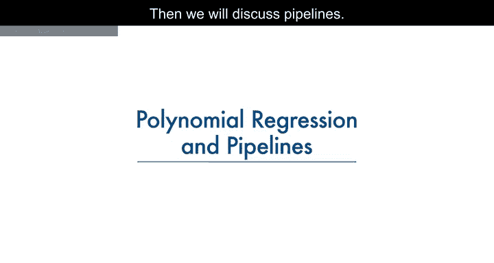

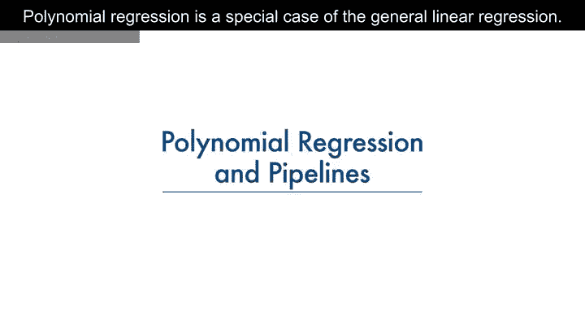

### 什么是曲线关系？

曲线关系是指通过将预测变量平方或设置更高阶项来获得的关系。我们通过变换数据来实现这一点。

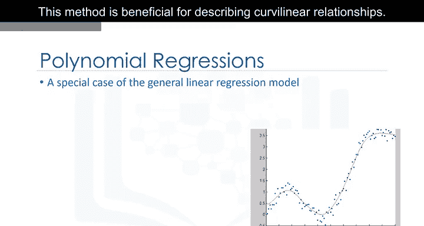

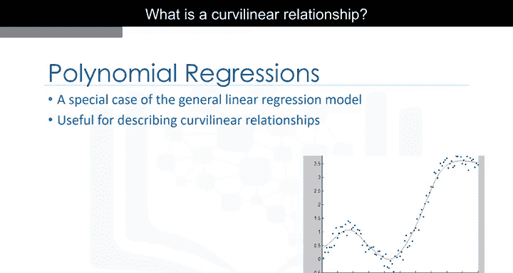

以下是多项式回归的几种常见形式：

*   **二次多项式回归**：模型中的预测变量被平方。我们用括号表示指数。公式为：**y = β₀ + β₁x + β₂x²**。这是一个二阶多项式回归，其函数图像呈现抛物线形状。


*   **三次多项式回归**：模型中的预测变量被立方。公式为：**y = β₀ + β₁x + β₂x² + β₃x³**。这是一个三阶多项式回归。观察图像可以发现，函数具有更多的变化。


当二阶或三阶多项式仍未达到良好拟合时，还可以使用更高阶的多项式回归。改变多项式回归的阶数会显著改变图形的形状。回归的阶数选择至关重要，选择合适的值可以获得更好的拟合效果。

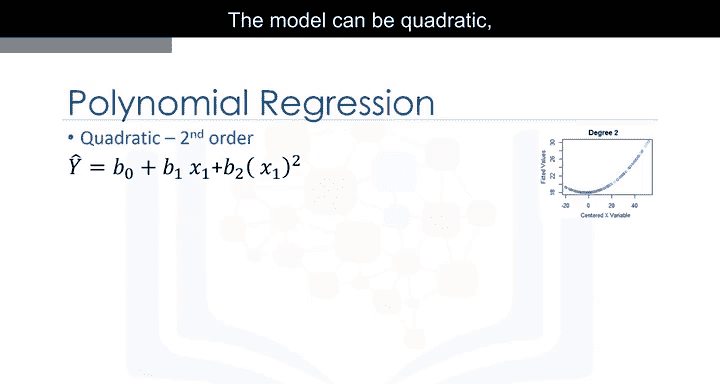

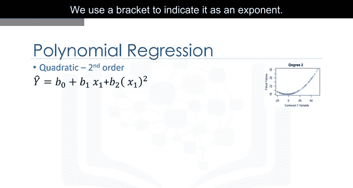

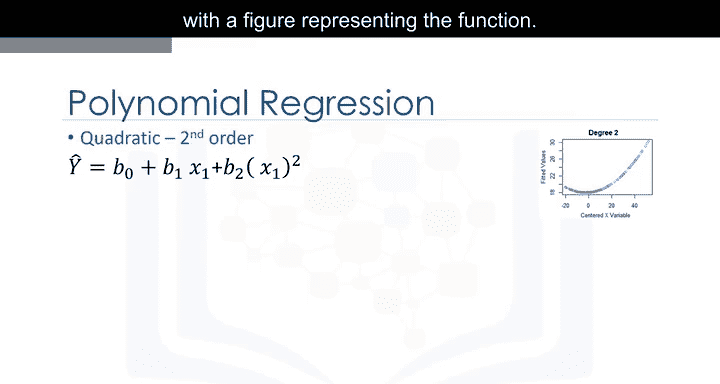

在所有情况下，变量与参数之间的关系始终是线性的。


## 🐍 Python中的多项式回归实现

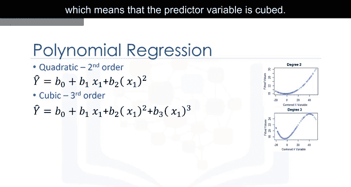

让我们看一个基于数据生成多项式回归模型的例子。

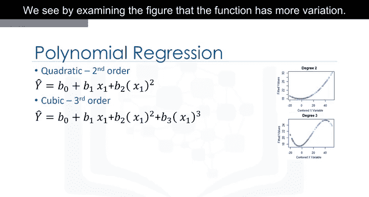

在Python中，我们可以使用`polyfit`函数来实现。


```python
# 示例：使用numpy的polyfit函数拟合一个三阶多项式
import numpy as np

# 假设x和y是已有的数据
# 拟合一个三阶多项式
model = np.polyfit(x, y, 3)
print(model)
```

我们可以打印出模型参数。该模型的符号形式由以下表达式给出：**y = -1.557x³ + 204.8x² + 8965x + 1.37×10⁵**。


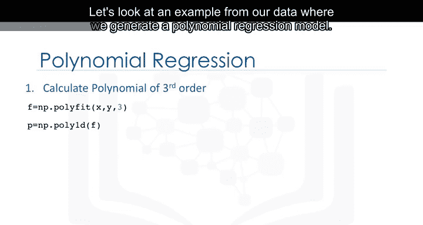

### 多维多项式回归

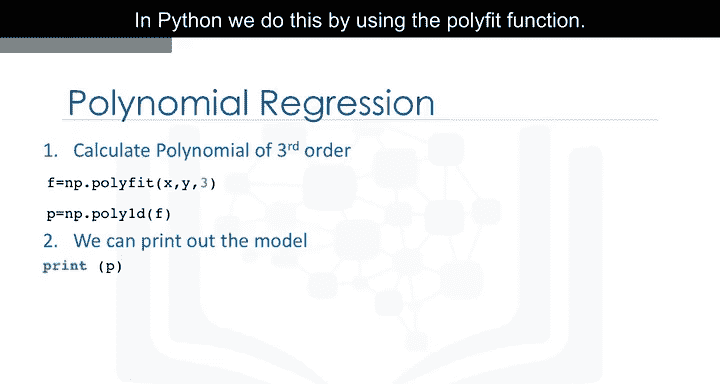

我们也可以进行多维多项式线性回归。表达式可能会变得复杂。以下是一个二维二阶多项式的一部分项示例。

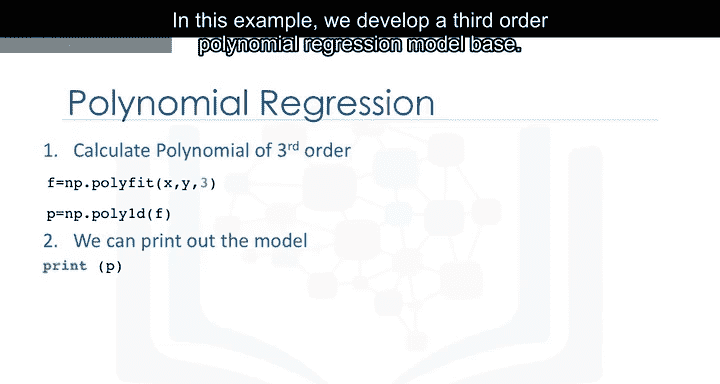

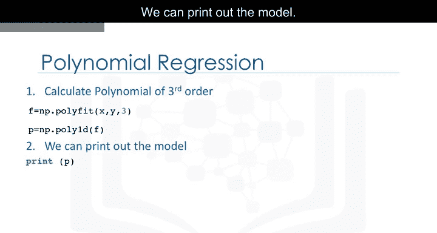

NumPy的`polyfit`函数无法执行这种类型的回归。我们使用scikit-learn中的`preprocessing`库来创建一个多项式特征对象。

以下是创建和转换多项式特征的步骤：

1.  构造器将多项式的阶数作为参数。
2.  然后使用`fit_transform`方法将特征转换为多项式特征。

让我们看一个更直观的例子。


```python
from sklearn.preprocessing import PolynomialFeatures

# 假设我们有一个二维特征数组X
# 创建一个2阶多项式特征对象
pr = PolynomialFeatures(degree=2)
# 转换原始特征
X_poly = pr.fit_transform(X)
print(X_poly.shape)  # 查看新特征的维度
```

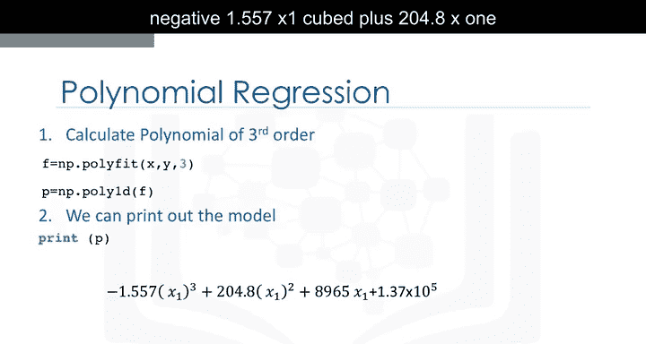

考虑这里显示的特征。应用该方法后，我们转换了数据。现在我们拥有了一组新的特征，它们是原始特征的转换版本。


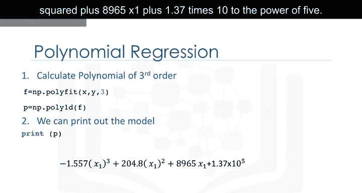

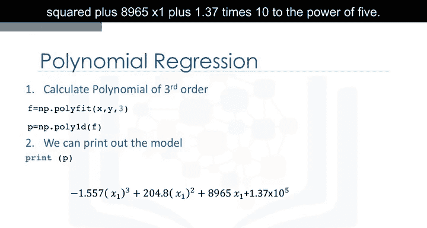

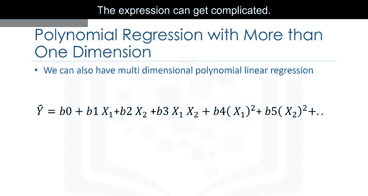

## ⚙️ 数据预处理与标准化

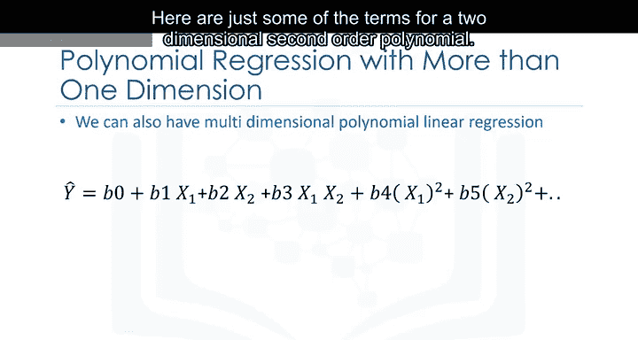

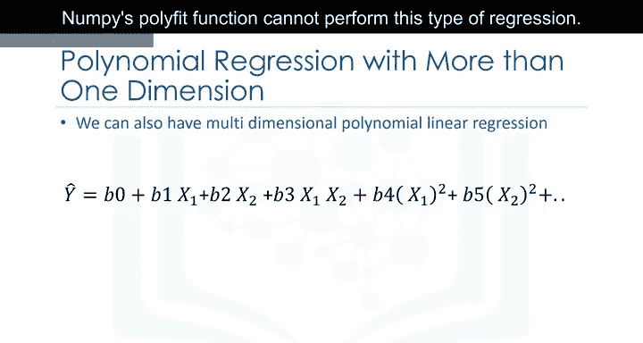

随着数据维度的增加，我们可能希望同时标准化多个特征。在scikit-learn中，我们可以使用`preprocessing`模块来简化许多任务。

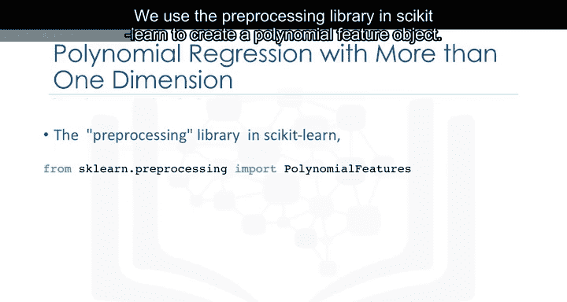

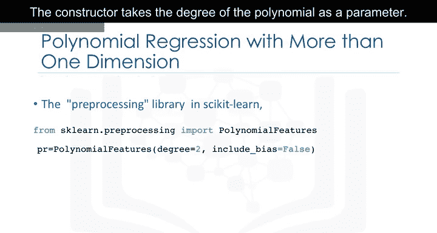

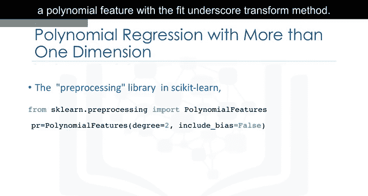

例如，我们可以同时标准化每个特征。

以下是使用`StandardScaler`的步骤：

1.  导入`StandardScaler`。
2.  创建并训练（拟合）该对象。
3.  然后使用它来转换数据。


```python
from sklearn.preprocessing import StandardScaler

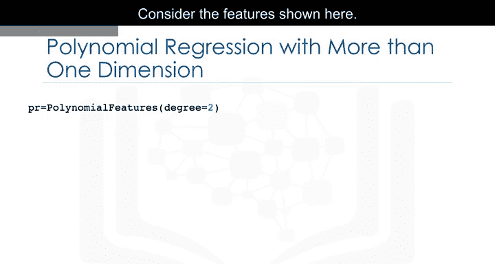

# 创建标准化对象
scale = StandardScaler()
# 拟合数据（计算均值和标准差）
scale.fit(X)
# 转换数据
X_scale = scale.transform(X)
```

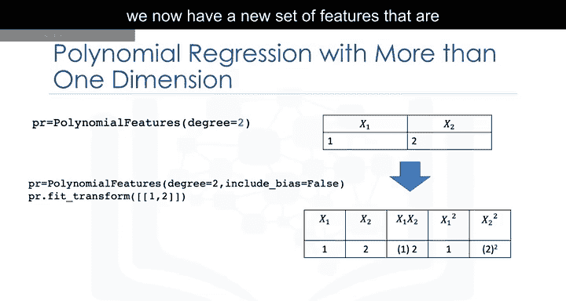

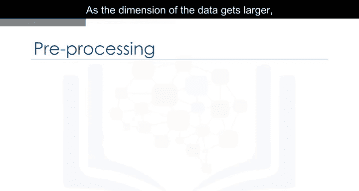

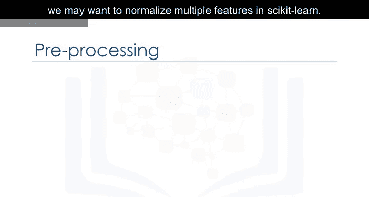

`preprocessing`库中提供了更多的归一化方法以及其他转换功能。


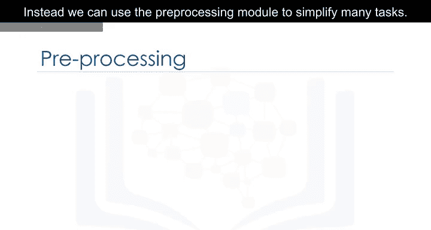

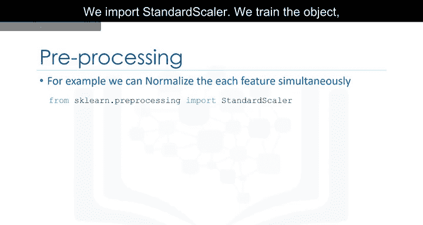

## 🚀 使用流水线简化流程

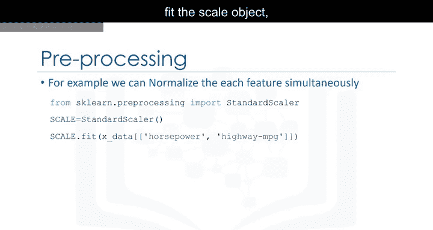

我们可以通过使用流水线库来简化代码。获得预测通常涉及许多步骤，例如归一化、多项式变换和线性回归。我们使用流水线来简化这个过程。

流水线按顺序执行一系列转换，最后一步进行预测。

以下是创建和使用流水线的步骤：

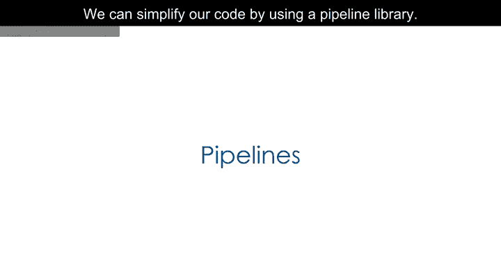

1.  首先导入所有需要的模块，然后导入`Pipeline`库。
2.  创建一个元组列表。元组中的第一个元素包含估计器/模型的名称，第二个元素包含模型构造函数。
3.  将这个列表输入到`Pipeline`构造函数中。


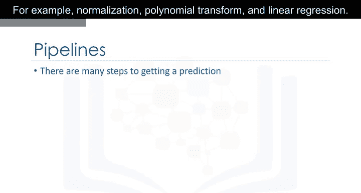

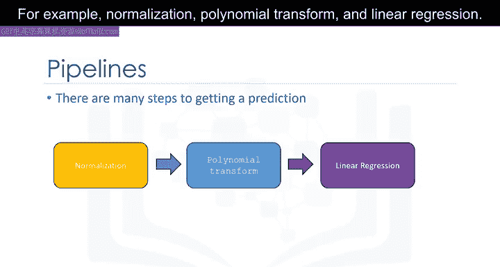

```python
from sklearn.pipeline import Pipeline
from sklearn.preprocessing import StandardScaler, PolynomialFeatures
from sklearn.linear_model import LinearRegression

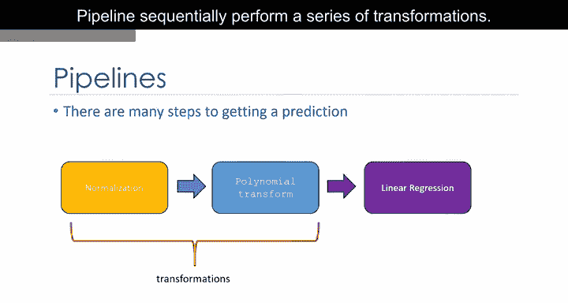

# 创建步骤列表
steps = [
    ('scale', StandardScaler()),
    ('poly', PolynomialFeatures(degree=2)),
    ('model', LinearRegression())
]

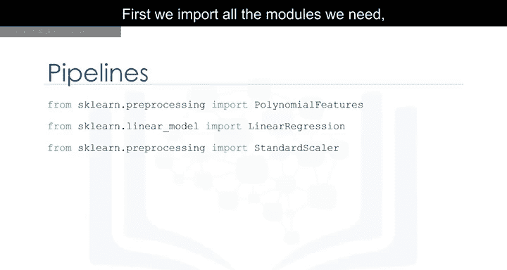

# 创建流水线对象
pipe = Pipeline(steps)

# 训练流水线
pipe.fit(X_train, y_train)

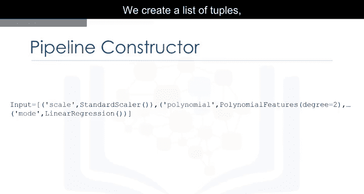

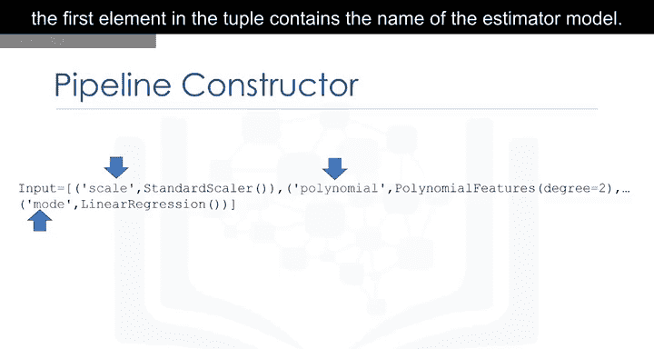

# 进行预测
y_pred = pipe.predict(X_test)
```

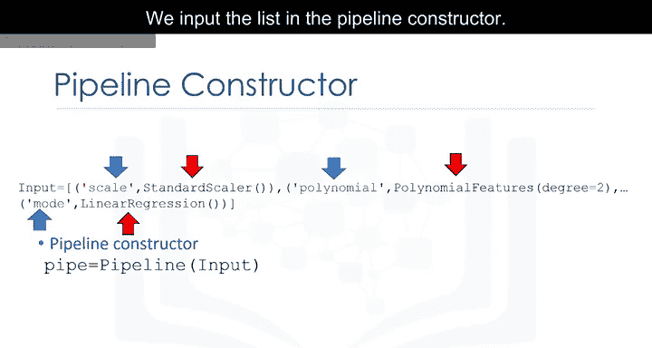

我们现在有了一个流水线对象。我们可以通过对流水线对象应用`fit`方法来训练它。我们也可以用它来生成预测。

该方法会先标准化数据，然后执行多项式变换，最后输出预测结果。


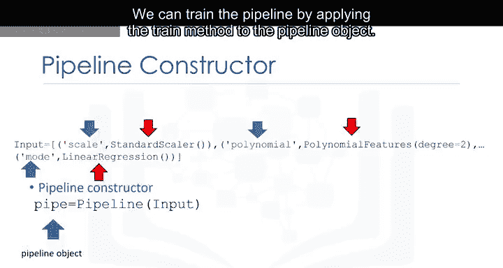

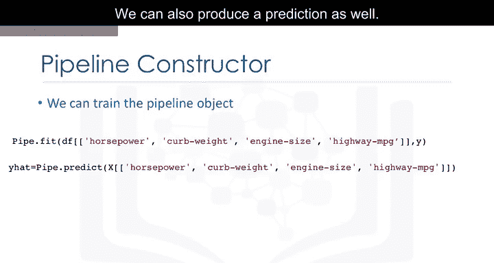

## 📝 课程总结

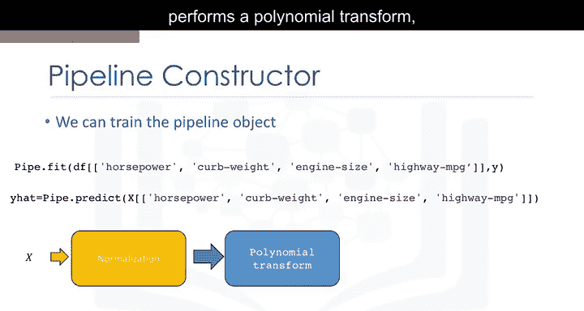

本节课中，我们一起学习了多项式回归与流水线。我们了解到，当数据关系呈曲线时，多项式回归是线性模型的有力补充。通过引入高阶项，我们可以更好地拟合复杂的数据模式。同时，我们掌握了如何使用scikit-learn的流水线功能，将数据预处理、特征工程和模型训练等多个步骤封装成一个简洁、可重复的工作流，这极大地提高了代码的效率和可维护性。