# 036：样本内评估指标

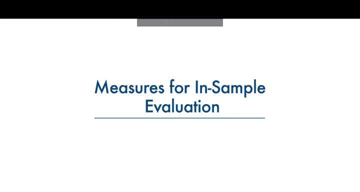

在本节课中，我们将学习如何通过数值指标来评估回归模型的性能。我们将重点介绍两个核心的样本内评估指标：**均方误差**和**R平方**。这些指标能帮助我们量化模型对数据的拟合程度。


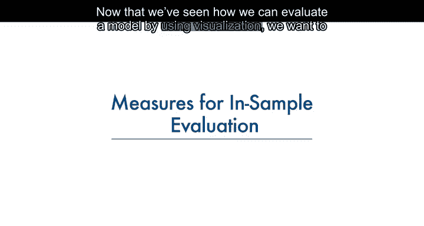

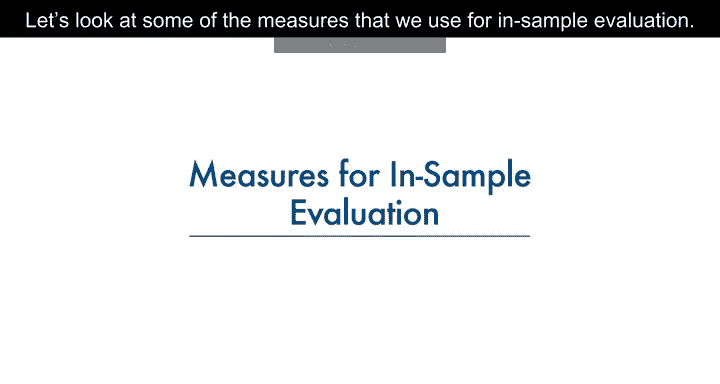

上一节我们介绍了如何通过可视化方法评估模型。本节中，我们来看看如何用数值指标进行更精确的评估。


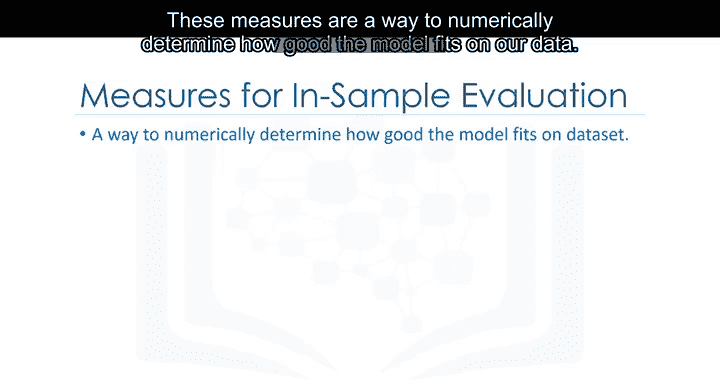

这些指标是一种数值化方法，用于确定模型对数据的拟合程度。


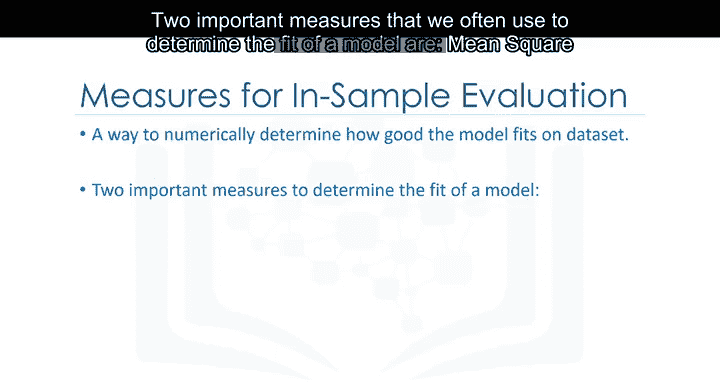

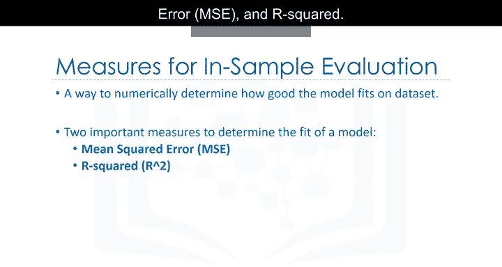

以下是两个常用于确定模型拟合度的重要指标：

*   **均方误差**
*   **R平方**


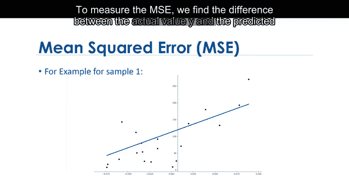

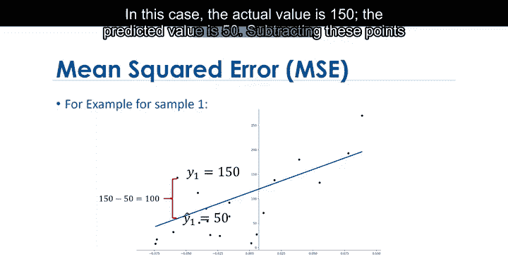

## 📏 均方误差

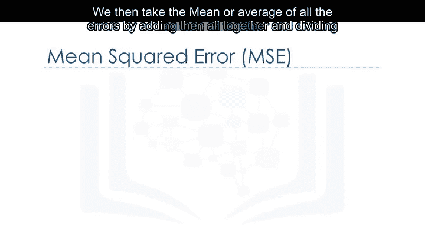

均方误差衡量的是模型预测值与实际值之间的平均平方差。其计算公式为：

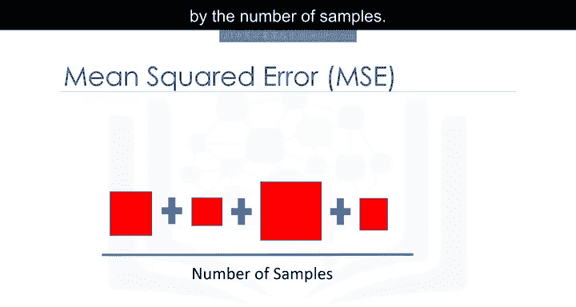

**MSE = (1/n) * Σ (Y_i - Ŷ_i)²**

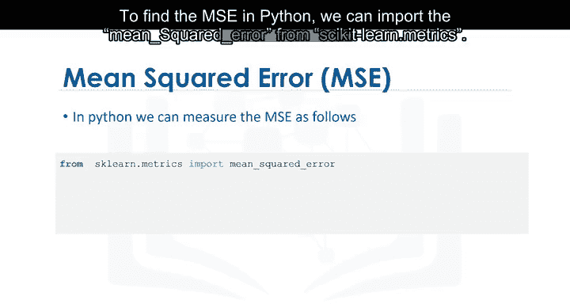

其中：
*   `Y_i` 是第 `i` 个样本的实际值。
*   `Ŷ_i` 是第 `i` 个样本的预测值。
*   `n` 是样本总数。

计算MSE的步骤如下：
1.  计算每个样本的预测误差：`Y_i - Ŷ_i`。
2.  将每个误差值平方。
3.  将所有平方误差求和。
4.  将总和除以样本数量 `n`，得到平均值。


在Python中，我们可以使用scikit-learn库方便地计算MSE：

```python
from sklearn.metrics import mean_squared_error
mse = mean_squared_error(y_actual, y_predicted)
```

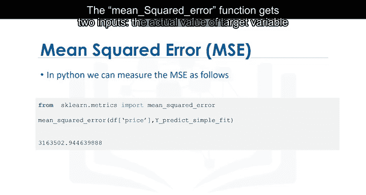

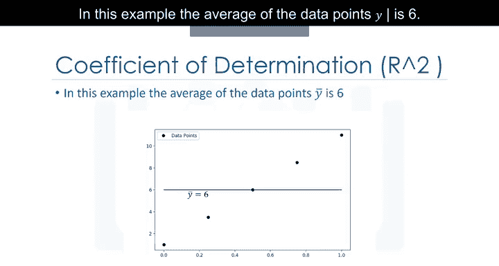

`mean_squared_error` 函数接收两个输入参数：目标变量的实际值数组和目标变量的预测值数组。


## 🔢 R平方

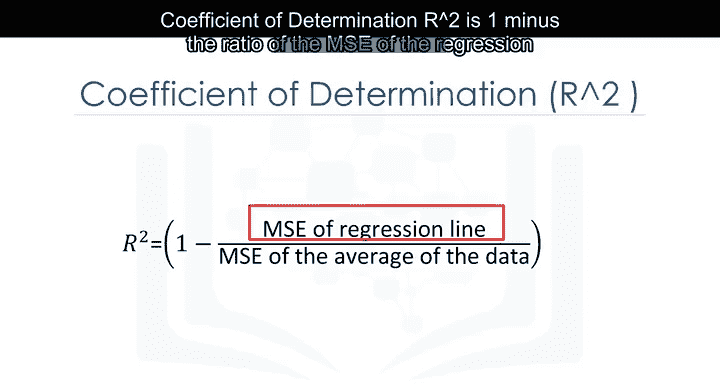

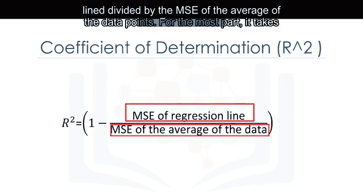

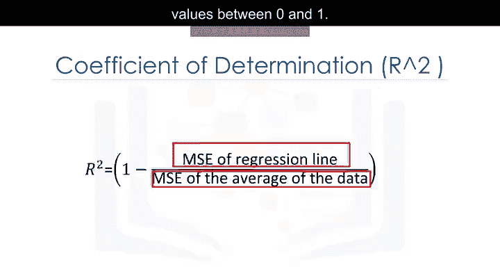

R平方，也称为**决定系数**，用于衡量数据点与拟合回归线的接近程度。它本质上是在比较我们的回归模型与一个简单模型（即数据点的平均值）的优劣。

如果自变量 `X` 是一个好的预测因子，那么我们的回归模型应该比仅仅使用平均值 `Ȳ` 预测得更好。


R平方的计算公式为：

**R² = 1 - (MSE_regression / MSE_mean)**

其中：
*   `MSE_regression` 是回归线的均方误差。
*   `MSE_mean` 是使用数据点平均值 `Ȳ` 作为预测值时的均方误差。

R平方的值通常在0到1之间。


### 理解R平方的值

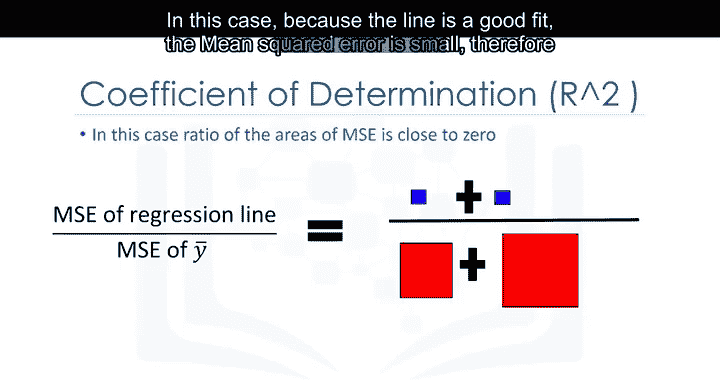

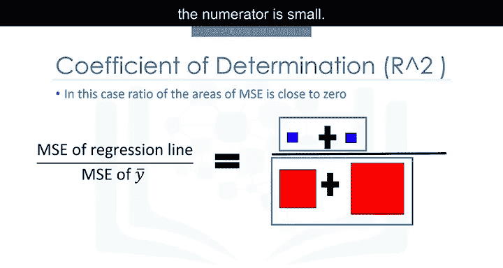

*   **R² 接近 1**：表示回归线对数据的拟合非常好。此时，回归线的MSE远小于平均值的MSE，公式中的比值很小，使得R²接近1。
*   **R² 接近 0**：表示回归线的拟合效果不佳，其预测能力与直接使用数据平均值差不多。此时，回归线的MSE与平均值的MSE大小相近，比值接近1，导致R²接近0。


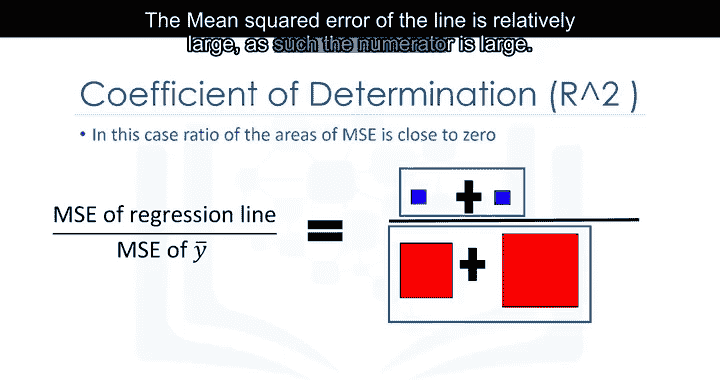

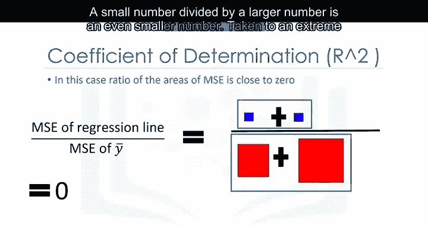

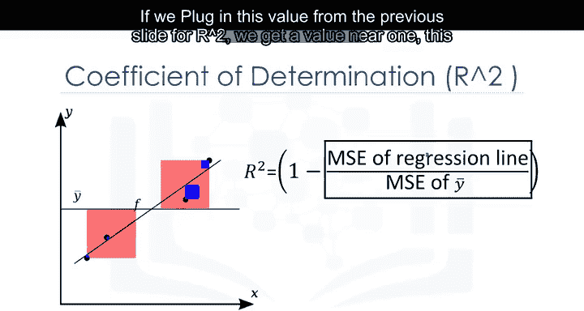

在Python中，我们可以通过线性回归模型的 `score` 方法来获取R平方值：

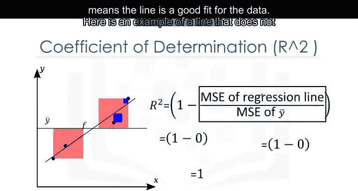

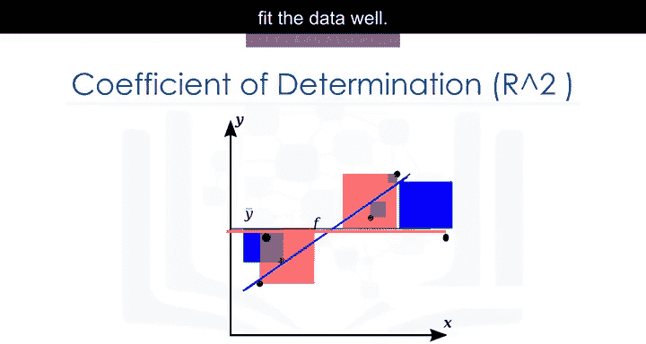

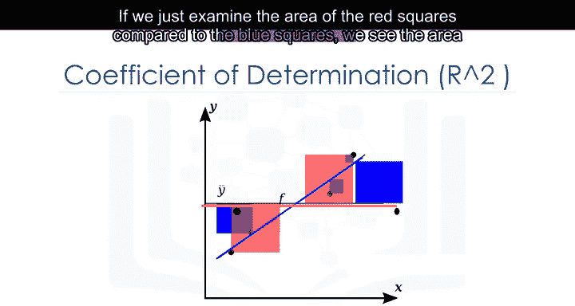

```python
from sklearn.linear_model import LinearRegression
lm = LinearRegression()
lm.fit(X, y)
r_squared = lm.score(X, y)
```

从该示例得到的值（例如0.49695）可以解释为：大约49.695%的价格变化可以由这个简单线性模型来解释。


通常，R平方值介于0和1之间。如果你的R平方值为负数，这可能是由于**过拟合**造成的，我们将在下一个模块中讨论这个问题。


## 📝 总结

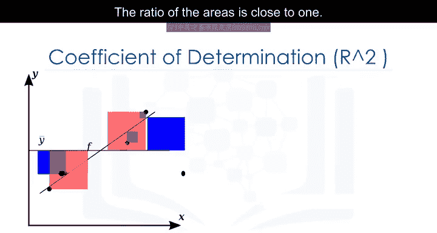

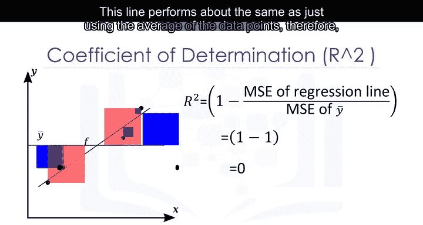

本节课中，我们一起学习了用于回归模型样本内评估的两个核心数值指标：

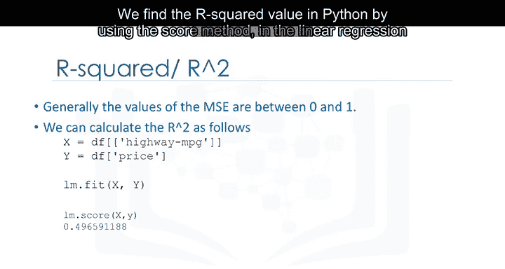

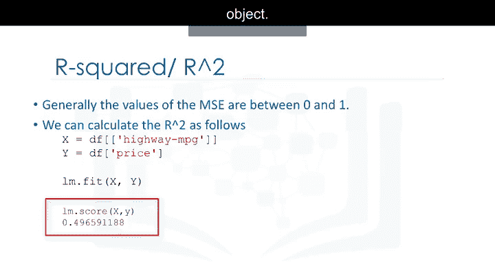

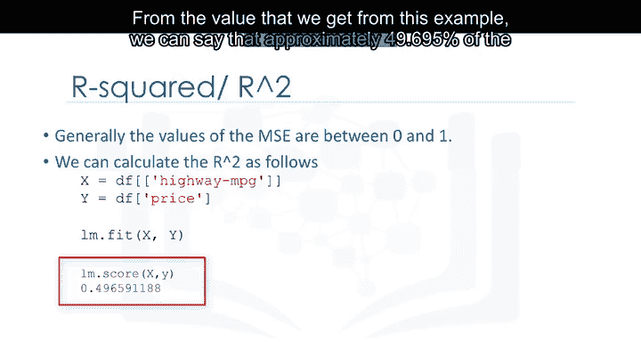

1.  **均方误差**：衡量预测值与实际值之间的平均平方误差，值越小表示模型拟合越好。
2.  **R平方**：衡量模型解释数据变异性的比例，值越接近1表示模型拟合度越高。

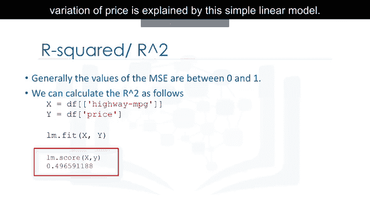

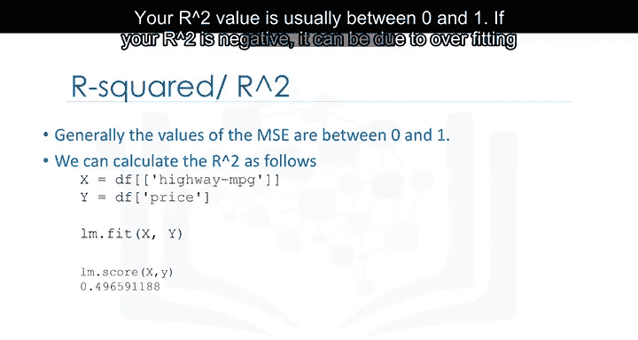

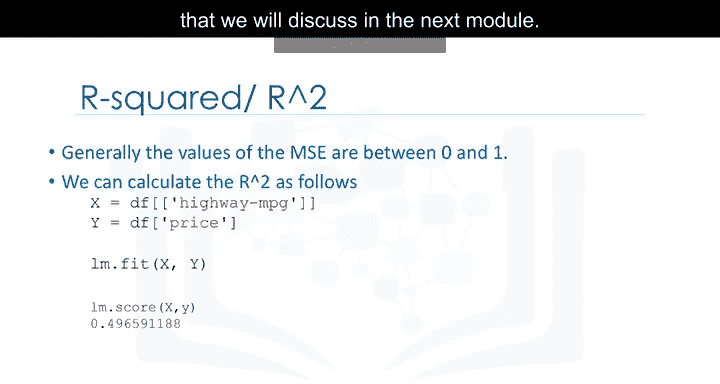

理解并计算这些指标，是评估和比较不同回归模型性能的基础。