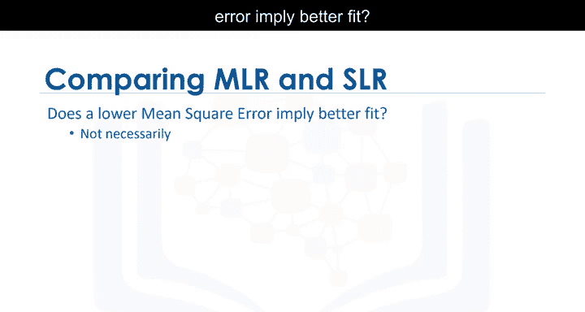

# 038：预测与决策制定 📊


## 概述

在本节课中，我们将学习如何评估和验证回归模型的预测结果，并基于此进行决策。我们将探讨如何判断模型是否正确、如何解读预测值、以及使用哪些可视化与数值指标来评估模型性能。

---

## 模型预测与合理性检查

上一节我们介绍了如何训练模型，本节中我们来看看如何使用模型进行预测并判断其合理性。

首先，使用训练好的模型进行预测。回忆一下，我们使用 `fit` 方法训练模型。现在，我们想知道一辆高速公路油耗为30英里/加仑的汽车价格是多少。

将数值代入 `predict` 方法，我们得到预测价格为 **$13771.30**。

这个结果看起来合理。例如，价格不是负数，也没有极高或极低。

我们可以通过检查 `coef_` 属性来查看模型的系数。回忆一下，用于根据高速公路油耗预测价格的简单线性模型表达式为：

**`price = intercept + coef * highway_mpg`**

系数值对应高速公路油耗特征的倍数。因此，高速公路油耗每增加一个单位，汽车价格大约下降 **$821**。这个数值看起来也合理。

---

## 处理不合理的预测值

有时，模型会产生不合理的值。例如，如果我们绘制高速公路油耗在0到100范围内的模型预测图，会发现价格出现负值。

这可能是因为：
1.  该范围内的数值不现实。
2.  线性假设不正确。
3.  我们没有该范围内汽车的数据。

在本例中，汽车不太可能有那么高的油耗范围，因此我们的模型看起来是有效的。

以下是生成指定范围内数值序列的方法：

```python
import numpy as np
sequence = np.arange(1, 101, 1)
```

*   `np.arange` 函数用于生成序列。
*   第一个参数是序列的起点。
*   第二个参数是序列的终点加一。
*   第三个参数是序列元素之间的步长，本例中为1。

我们可以使用这个序列的输出值来预测新值。输出是一个NumPy数组，但其中许多预测值是负数。

---

## 使用可视化方法评估模型

评估模型时，应首先尝试使用回归图进行可视化。请参阅实验部分了解如何绘制多项式回归图。

对于本例，自变量（高速公路油耗）的影响是明显的。数据趋势显示，随着自变量增加，因变量（价格）下降。该图还显示了一些非线性行为。

检查残差图时，我们发现残差呈现曲线，这暗示了数据存在非线性行为。

对于多元线性回归，分布图是一个很好的评估方法。例如，我们看到价格在30000到50000范围内的预测值不准确。

这表明非线性模型可能更合适，或者我们需要该范围内的更多数据。

---

## 使用数值指标评估模型

均方误差（MSE）或许是判断模型好坏最直观的数值指标。让我们看看不同的均方误差值如何影响模型。

第一张图的均方误差为 **3495**。
第二张图的均方误差为 **3652**。
最后一张图的均方误差为 **12870**。

随着均方误差增大，目标点离预测线越来越远。

正如我们讨论过的，R平方是另一种流行的模型评估方法。它告诉你回归线对数据的拟合程度。R平方值的范围是0到1。

**`R²`** 告诉我们，因变量的变异中有多大比例可以由自变量的回归来解释。

R平方等于1意味着因变量的所有变动都可以完全由自变量的变动来解释。

在R平方为 **0.9986** 的图中，我们看到红色目标点和蓝色预测线。模型看起来拟合得很好，这意味着超过99%的预测变量变异可以由自变量解释。

在R平方为 **0.9226** 的模型中，仍然存在很强的线性关系，模型拟合度仍然良好。

当R平方为 **0.8** 或 **0.6** 时，我们可以直观地看到数值分散在直线周围，但仍然接近直线。我们可以说，80%或60%的预测变量变异可以由自变量解释。

R平方为 **0.61** 意味着大约61%的观测变异可以由自变量解释。

R平方的可接受值取决于你研究的领域和具体用例。Falcon和Miller（1992）建议，可接受的R平方值至少应为 **0.1**。

---

## 关于模型比较的注意事项

较低的均方误差是否意味着更好的拟合？不一定。

多元线性回归（MLR）模型的MSE将小于简单线性回归（SLR）模型的MSE，因为当模型中包含更多变量时，数据误差会减小。

同样，多项式回归的MSE也会小于常规线性回归的MSE。在下一节中，我们将探讨更准确的模型评估方法。

---

## 总结



本节课中，我们一起学习了如何对回归模型进行预测和评估决策。我们了解了检查预测结果合理性的重要性，并掌握了使用回归图、残差图和分布图进行可视化评估的方法。同时，我们学习了均方误差（MSE）和R平方这两个核心数值指标的含义与应用，认识到它们如何量化模型的拟合优度，并了解了在比较不同复杂度模型时解读这些指标的注意事项。