# 039：样本内评估指标

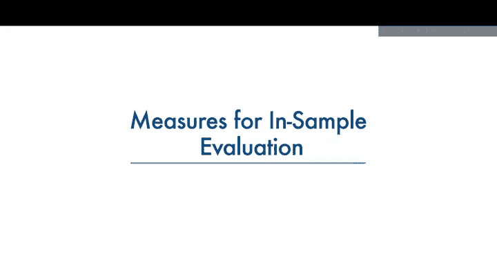

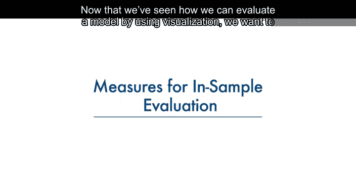

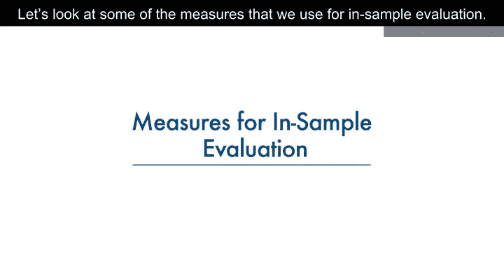

在本节课中，我们将学习如何通过数值指标来评估回归模型的性能。我们将重点介绍两个核心的样本内评估指标：均方误差（MSE）和决定系数（R²）。这些指标能帮助我们量化模型对数据的拟合程度。

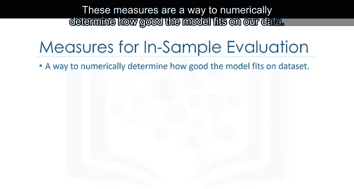

上一节我们介绍了通过可视化方法评估模型，本节中我们来看看如何用数值进行更精确的评估。

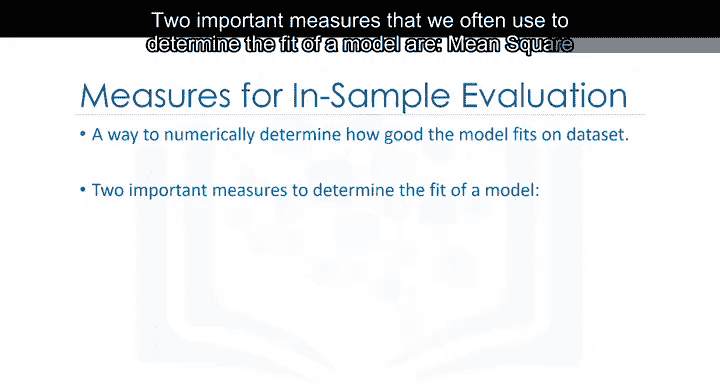

## 📈 数值评估指标概述

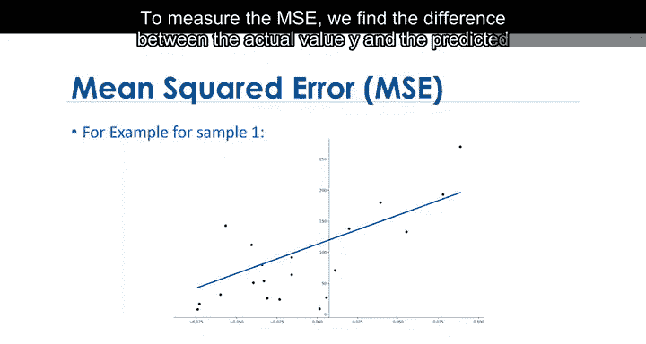

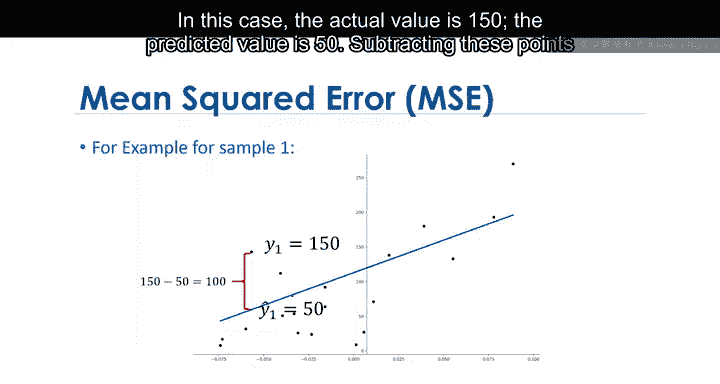

这些指标是一种数值化方法，用于确定模型对数据的拟合程度。

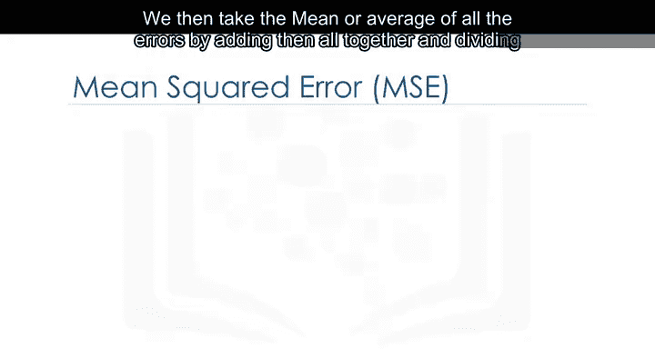

以下是两个常用的重要指标：
*   **均方误差（Mean Squared Error, MSE）**
*   **决定系数（R-squared）**

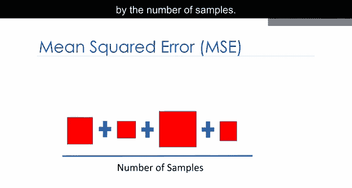

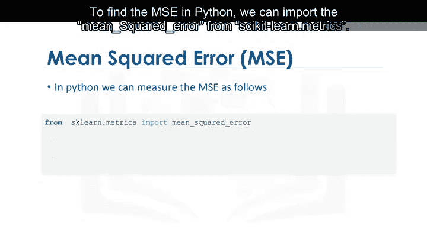

## 🔢 均方误差（MSE）

MSE衡量的是预测值与实际值之间的平均平方误差。计算步骤如下：

1.  计算每个数据点的误差：实际值（Y）减去预测值（Ŷ）。
2.  将每个误差值平方。
3.  对所有平方误差求平均值。

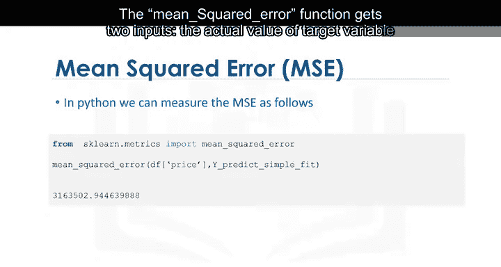

其公式为：
**MSE = (1/n) * Σ (Yᵢ - Ŷᵢ)²**

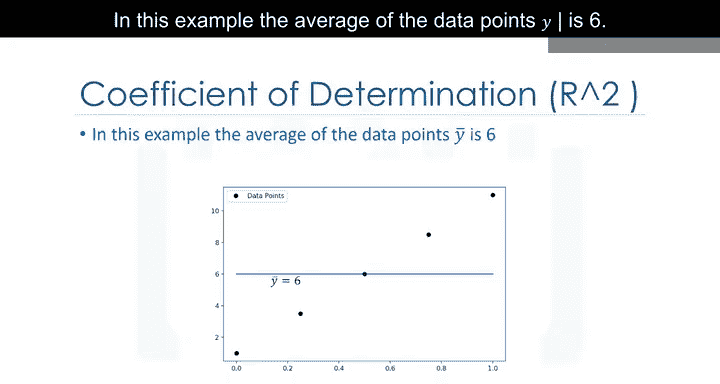

例如，若某点的实际值为150，预测值为50，则误差为100，平方后为10000。MSE是所有此类平方误差的平均值。

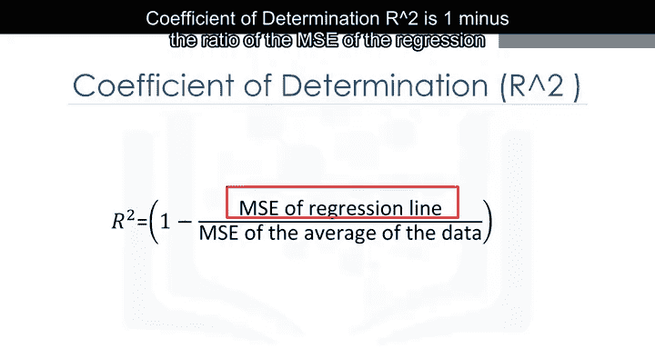

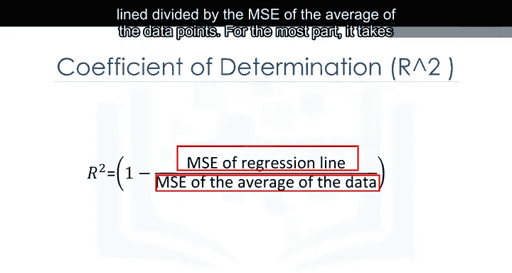

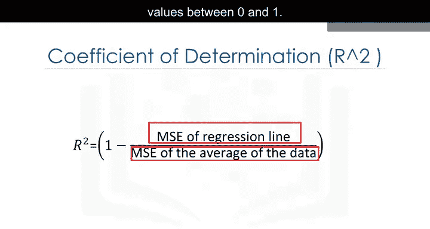

在Python中，我们可以使用`scikit-learn`库中的函数来计算MSE。

以下是计算MSE的代码示例：
```python
from sklearn.metrics import mean_squared_error
mse = mean_squared_error(y_actual, y_predicted)
```
`mean_squared_error`函数接受两个输入：目标变量的实际值数组和预测值数组。

## 📊 决定系数（R²）

R²也称为判定系数，用于衡量数据点与拟合回归线的接近程度，即我们的模型相比简单基准模型（如使用目标变量的均值进行预测）的改善程度。

其计算公式为：
**R² = 1 - (MSE(回归线) / MSE(数据均值))**

R²的值通常在0到1之间。

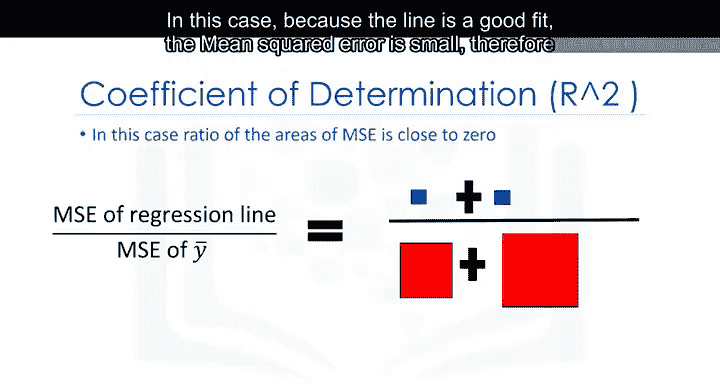

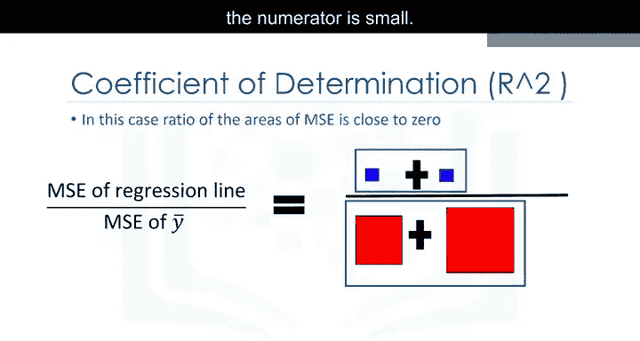

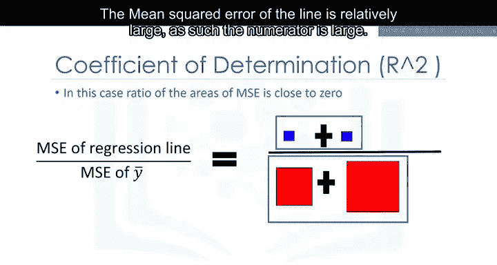

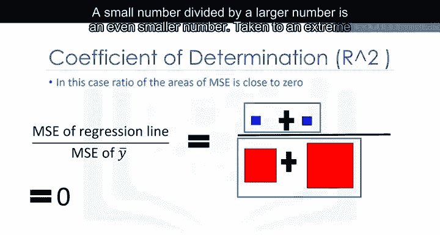

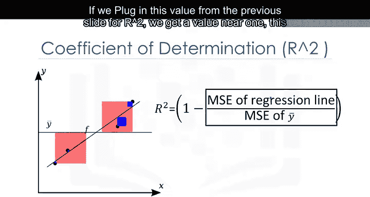

*   **R²接近1**：表示回归线对数据的拟合很好，模型解释了大量方差。
*   **R²接近0**：表示回归线的拟合效果与仅使用数据均值差不多，模型性能不佳。
*   **R²为负值**：可能表明模型存在过拟合问题（我们将在后续模块讨论）。

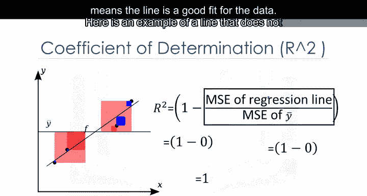

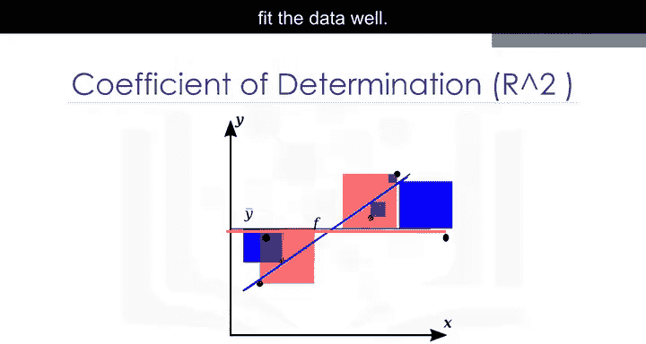

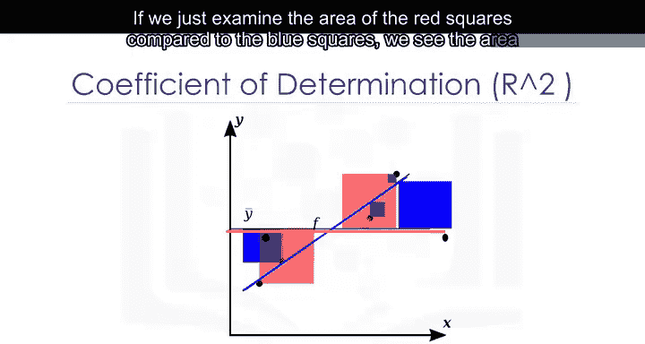

在Python中，我们可以使用线性回归对象的`.score()`方法来获取R²值。

以下是获取R²值的代码示例：
```python
from sklearn.linear_model import LinearRegression
lm = LinearRegression()
lm.fit(X, y)
r_squared = lm.score(X, y)
```
例如，如果得到的R²值为0.49695，我们可以说“该简单线性模型解释了价格约49.695%的变异”。

## 🎯 本节总结

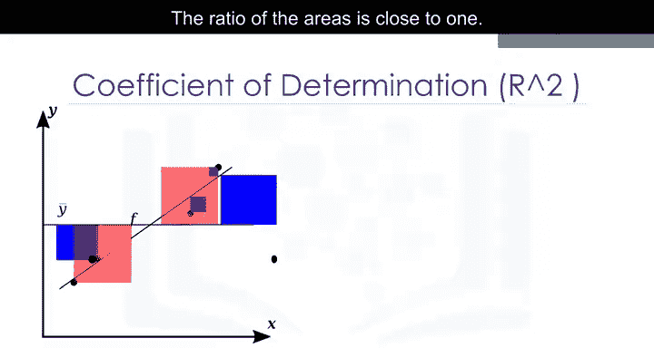

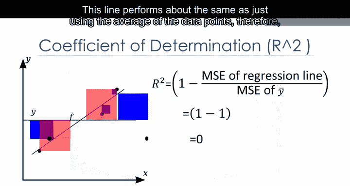

本节课中我们一起学习了用于回归模型样本内评估的两个核心数值指标：
1.  **均方误差（MSE）**：衡量预测误差的平均大小，值越小表示模型拟合越好。
2.  **决定系数（R²）**：衡量模型相对于简单均值模型的解释能力，值越接近1表示模型拟合度越高。

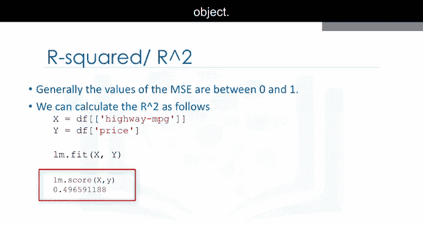

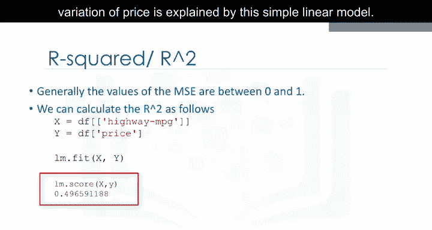

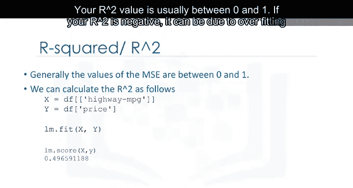

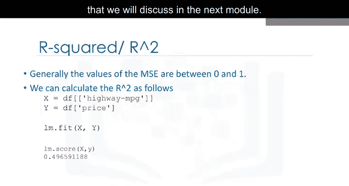

理解这些指标对于评估和比较不同模型的性能至关重要。