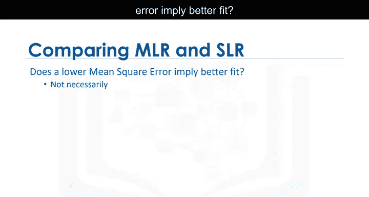

# 040：预测与决策制定 📊


在本节课中，我们将学习如何评估预测模型的正确性，并基于模型结果进行决策制定。我们将探讨模型评估的多种方法，包括可视化、数值指标以及如何解读这些结果。

---

## 模型评估与合理性检查

上一节我们介绍了模型训练，本节中我们来看看如何判断模型是否正确。首先，你需要确保模型的结果是合理的。

以下是评估模型合理性的核心步骤：

1.  **使用可视化工具**：通过图表直观地观察数据与模型的拟合情况。
2.  **计算数值评估指标**：使用量化指标来评估模型性能。
3.  **比较不同模型**：通过对比不同模型的评估结果来选择最佳模型。

让我们看一个预测的例子。回想一下，我们使用 `fit` 方法训练模型。现在，我们想预测一辆高速公路油耗为30英里/加仑的汽车价格。

将数值代入 `predict` 方法，我们得到预测价格为 **$13771.30**。

这个结果看起来是合理的。例如，价格不是负数，也没有极高或极低。

我们可以通过检查 `coef_` 属性来查看系数。回想一下，用于根据高速公路油耗预测价格的简单线性模型表达式为：

**`价格 = 截距 + 系数 * 高速公路油耗`**

这个系数对应着高速公路油耗特征的倍数。因此，高速公路油耗每增加一个单位，汽车价格大约下降 **$821**。这个值看起来也是合理的。

---

## 处理不合理的预测值

有时你的模型会产生不合理的值。例如，如果我们为高速公路油耗在0到100的范围内绘制模型，我们会得到负的价格预测值。

这可能是因为：
1.  该范围内的数值不现实。
2.  线性假设不正确。
3.  我们没有该范围内汽车的数据。

在本例中，汽车不太可能有那么高的燃油里程，因此我们的模型看起来是有效的。

为了在指定范围内生成一系列值，我们需要导入 `numpy`，然后使用 `numpy.arange` 函数生成序列。

```python
import numpy as np
sequence = np.arange(1, 101, 1)
```

*   第一个参数是序列的起点。
*   第二个参数是序列的终点加一。
*   最后一个参数是序列中元素之间的步长。本例中为1，表示序列每次递增1。

我们可以使用输出来预测新值。输出是一个 `numpy` 数组，其中许多值是负数。

---

## 可视化评估方法

使用回归图可视化数据是你应该尝试的首要方法。请参阅实验部分以了解如何绘制多项式回归图。

对于这个例子，自变量的影响是明显的。在这种情况下，随着因变量增加，数据呈下降趋势。该图还显示了一些非线性行为。

检查残差图，我们看到残差具有曲线，这表明存在非线性行为。

分布图是评估多元线性回归的好方法。例如，我们看到价格在30000到50000范围内的预测值不准确。

这表明非线性模型可能更合适，或者我们需要该范围内的更多数据。

---

## 数值评估指标

均方误差（MSE）或许是判断模型好坏最直观的数值指标。让我们看看不同的均方误差值如何影响模型。

第一张图的均方误差为 **3495**。
第二张图的均方误差为 **3652**。
最后一张图的均方误差为 **12870**。

随着均方误差增加，目标点离预测点越来越远。

正如我们讨论过的，**R平方**是另一种流行的模型评估方法。它告诉你回归线对模型的拟合程度。R平方值的范围是0到1。

**`R平方 = 1 - (残差平方和 / 总平方和)`**

R平方告诉我们因变量的变异中有多少百分比是由自变量的回归解释的。

R平方为1意味着因变量的所有变动完全由自变量的变动解释。

在这张图中，我们看到红色的目标点和蓝色的预测线，R平方为 **0.9986**。模型看起来拟合得很好。这意味着超过99%的预测变量变异可以由自变量解释。

这个模型的R平方为 **0.9226**。仍然存在很强的线性关系，模型仍然拟合良好。

R平方为0.8或0.6的数据，我们可以直观地看到数值分散在直线周围。它们仍然接近直线，我们可以说预测变量80%的变异可以由自变量解释。

R平方为 **0.61** 意味着大约61%的观测变异可以由自变量解释。

R平方的可接受值取决于你研究的领域和你的具体用例。Falcon和Miller（1992）建议，可接受的R平方值应至少为0.1。

---

## 关于模型比较的注意事项

较低的均方误差是否意味着更好的拟合？不一定。

多元线性回归模型的MSE将小于简单线性回归模型的MSE，因为当模型中包含更多变量时，数据的误差会减小。多项式回归的MSE也将小于常规回归的MSE。

在下一节中，我们将探讨更准确的模型评估方法。

---

## 总结



本节课中我们一起学习了如何评估预测模型。我们介绍了通过检查预测值的合理性、使用回归图和残差图进行可视化分析，以及计算均方误差和R平方等数值指标来评估模型性能。记住，没有单一的“最佳”指标，结合使用多种方法并根据具体场景判断是做出正确决策的关键。