# 041：模型评估与优化

在本节课中，我们将学习如何评估和优化机器学习模型。模型评估能告诉我们模型在真实世界中的表现。我们将重点介绍如何将数据划分为训练集和测试集，以及如何使用交叉验证来更准确地估计模型的泛化能力。

---

## 模型评估简介

模型评估告诉我们模型在真实世界中的表现。在之前的模块中，我们讨论了样本内评估。样本内评估告诉我们模型对已给定的训练数据的拟合程度。它不能估计训练好的模型预测新数据的能力。

解决方案是拆分我们的数据，使用样本内数据（即训练数据）来训练模型。其余的数据称为测试数据，用作样本外数据。这些数据随后被用来近似估计模型在真实世界中的表现。

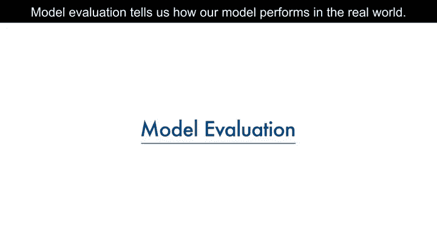

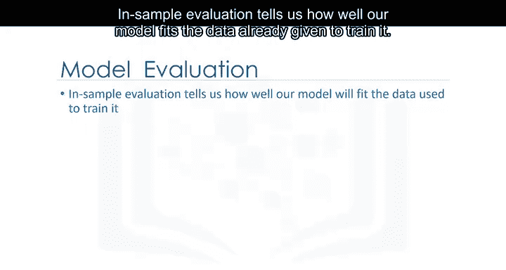

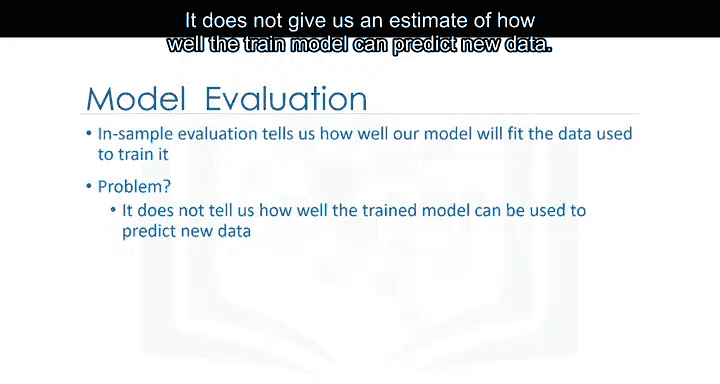

将数据分离为训练集和测试集是模型评估的重要部分。我们使用测试数据来了解模型在真实世界中的表现。

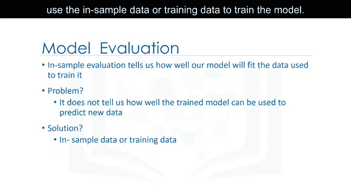

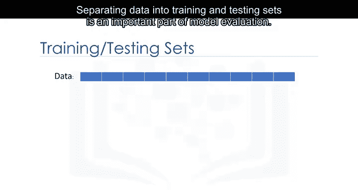

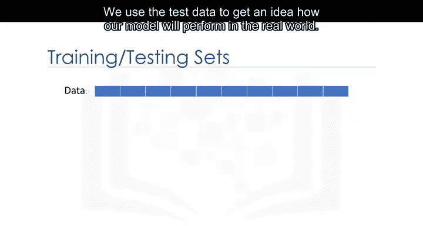

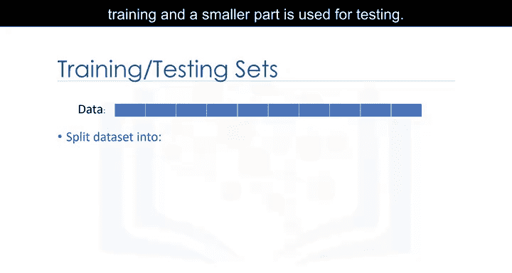

---

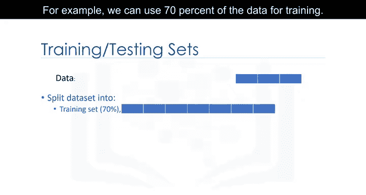

## 数据划分：训练集与测试集

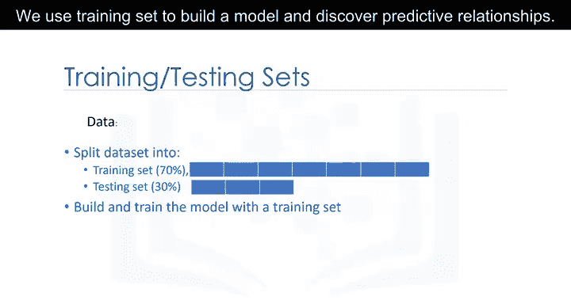

当我们拆分数据集时，通常大部分数据用于训练，较小部分用于测试。例如，我们可以使用70%的数据进行训练，然后使用30%的数据进行测试。

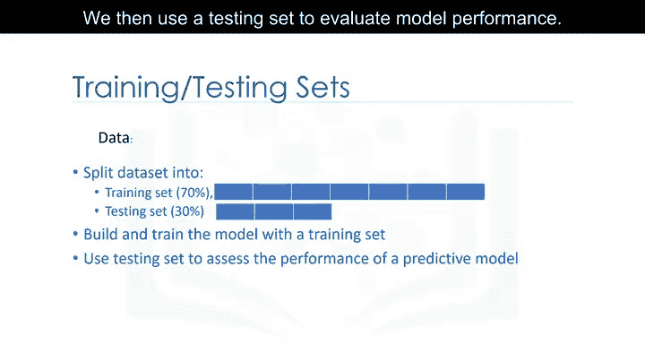

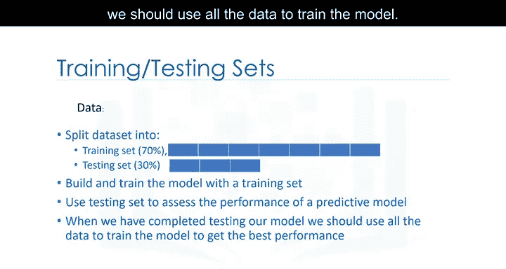

我们使用训练集来构建模型并发现预测关系。然后我们使用测试集来评估模型性能。当我们完成模型测试后，应该使用所有数据来重新训练模型。

---

## 使用Scikit-learn进行数据划分

Scikit-learn包中一个用于拆分数据集的流行函数是 `train_test_split` 函数。该函数将数据集随机拆分为训练子集和测试子集。

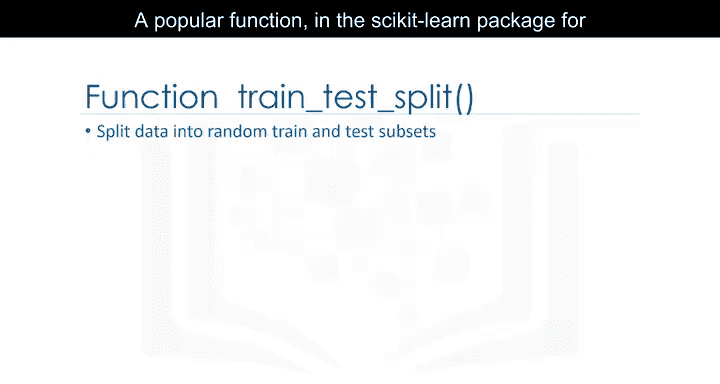

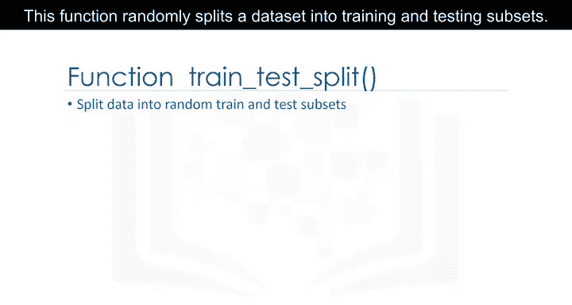

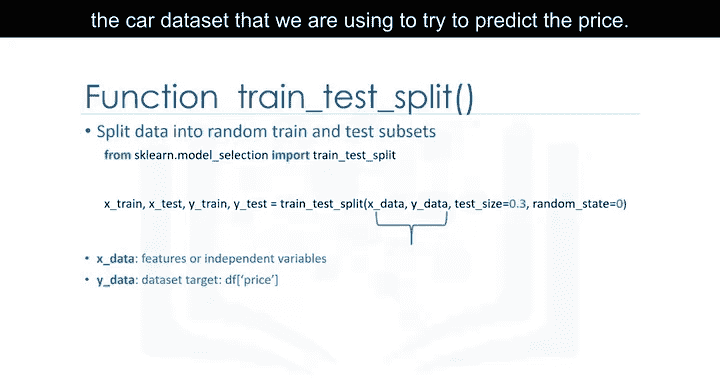

以下是一个示例代码片段。此方法从 `sklearn.model_selection` 导入。

```python
from sklearn.model_selection import train_test_split

X_train, X_test, y_train, y_test = train_test_split(X_data, y_data, test_size=0.3, random_state=42)
```

输入参数 `y_data` 是目标变量。在汽车评估示例中，它将是价格。`X_data` 是预测变量列表。在本例中，它是我们用来预测价格的数据集中的所有其他变量。

输出是一个数组：`X_train` 和 `y_train` 是用于训练的子集。`X_test` 和 `y_test` 是用于测试的子集。在本例中，`test_size` 是测试集数据的百分比，这里是30%。`random_state` 是用于随机数据集拆分的随机种子。

---

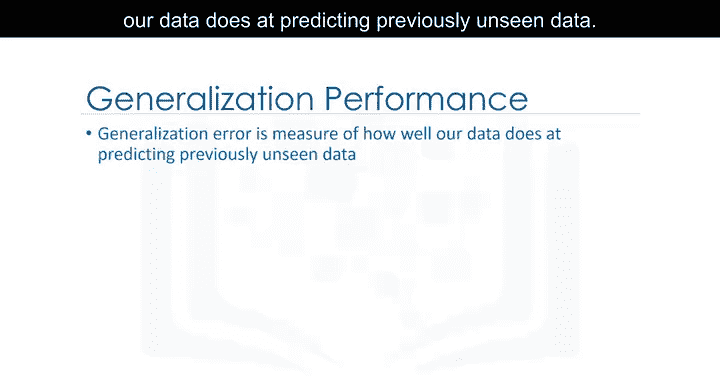

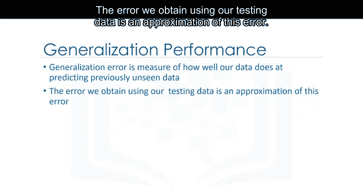

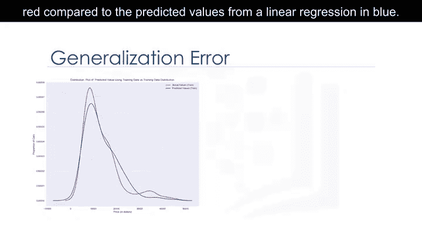

## 泛化误差

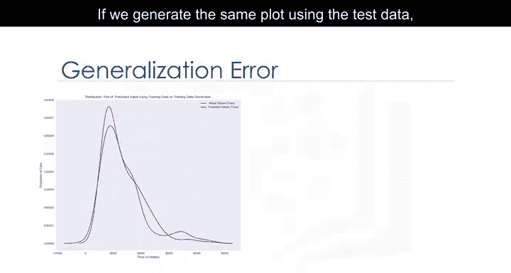

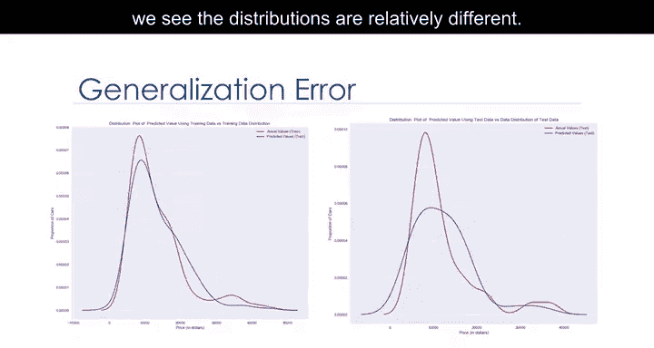

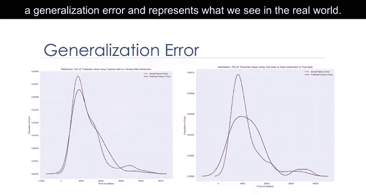

泛化误差是衡量我们的数据在预测先前未见数据时表现如何的指标。我们使用测试数据获得的误差是此误差的近似值。

下图显示了以红色表示的实际值分布与以蓝色表示的线性回归预测值分布的比较。我们看到分布有些相似。如果我们使用测试数据生成相同的图，我们会看到分布相对不同。这种差异是由于泛化误差造成的，它代表了我们在现实世界中看到的情况。

---

## 训练数据量与模型性能

使用大量数据进行训练可以为我们提供确定模型在真实世界中表现如何的准确方法，但性能的精度会较低。

让我们用一个例子来澄清这一点。这个靶心图的中心代表正确的泛化误差。假设我们使用90%的数据进行训练，10%的数据进行测试，对数据进行随机抽样。第一次实验时，我们得到了训练数据的良好估计。如果我们再次实验，用不同的样本组合训练模型，我们也会得到一个好结果，但结果将不同于第一次运行实验时的结果。

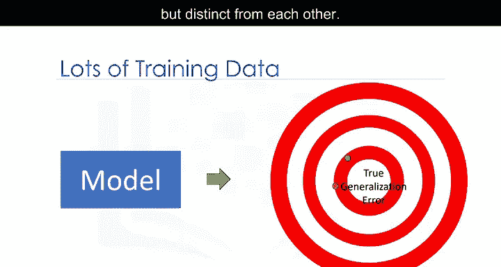

重复使用不同的训练和测试样本组合进行实验，结果相对接近泛化误差，但彼此不同。重复这个过程，我们得到了泛化误差的良好近似，但精度很差，即所有结果彼此之间差异极大。

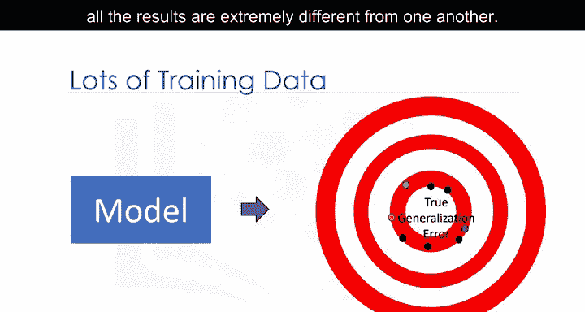

如果我们使用较少的数据点来训练模型，并使用更多的数据点来测试模型，泛化性能的准确性会降低，但模型将具有良好的精度。

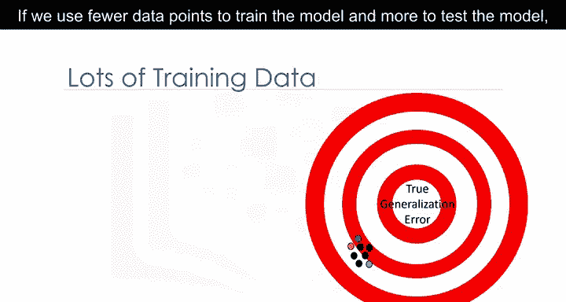

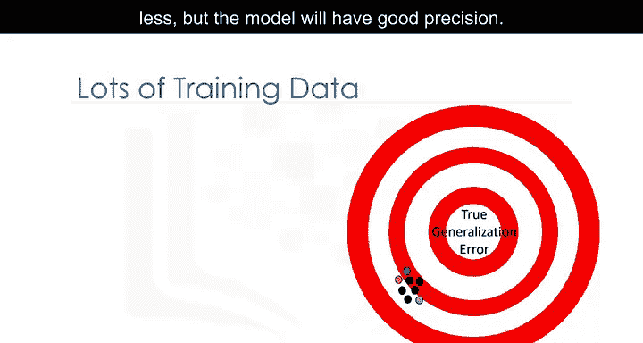

上图展示了这一点。我们所有的误差估计都相对接近，但它们离真实的泛化性能更远。

---

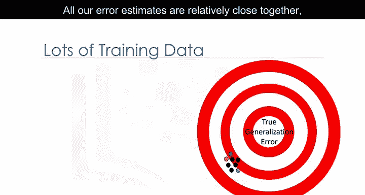

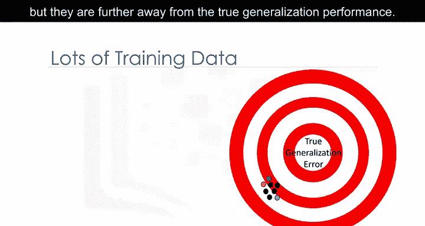

## 交叉验证

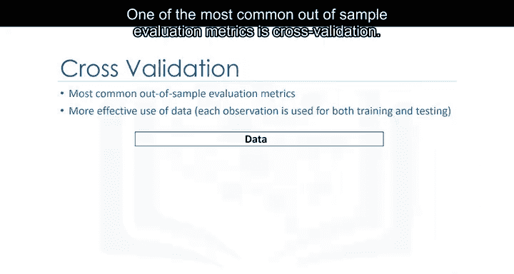

为了克服这个问题，我们使用交叉验证。最常见的样本外评估指标之一是交叉验证。

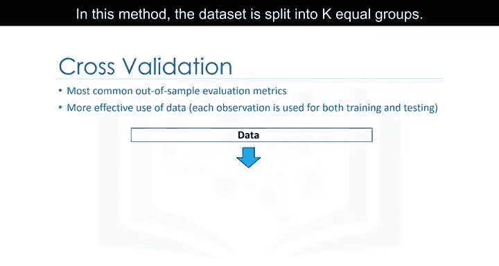

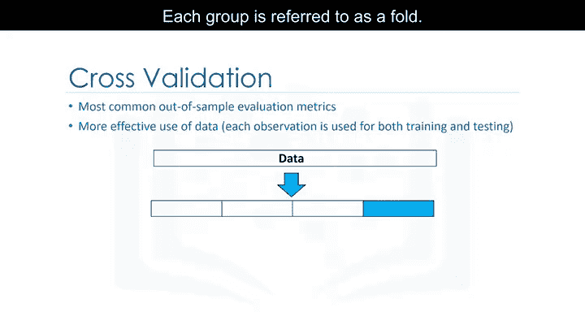

在这种方法中，数据集被分成K个相等的组。每个组被称为一个“折”。例如，四折。一些折可以用作训练集，我们用它来训练模型，其余部分用作测试集，我们用它来测试模型。

例如，我们可以使用三折进行训练，然后使用一折进行测试。这个过程会重复进行，直到每个分区都既用于训练又用于测试。最后，我们使用平均结果作为样本外误差的估计。评估指标取决于模型，例如R平方。


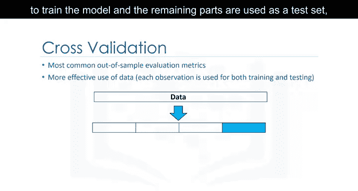

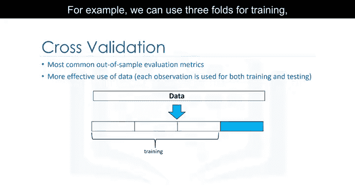

---

## 应用交叉验证

应用交叉验证的最简单方法是调用 `cross_val_score` 函数，该函数执行多次样本外评估。

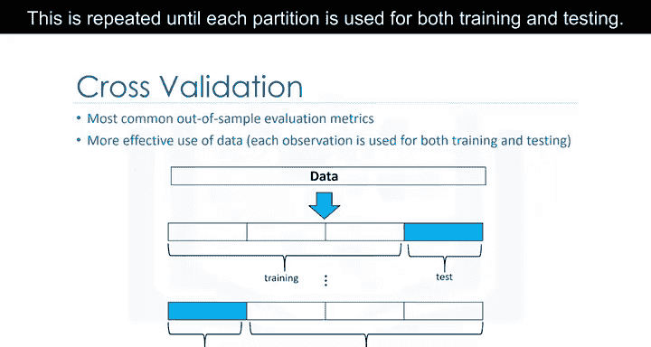

此方法从Scikit-learn的模型选择包导入。

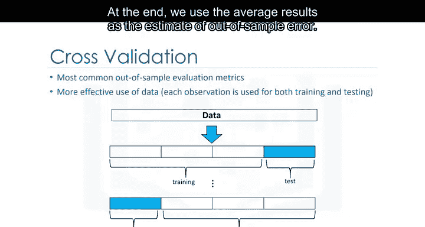

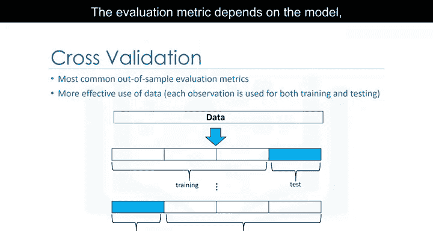

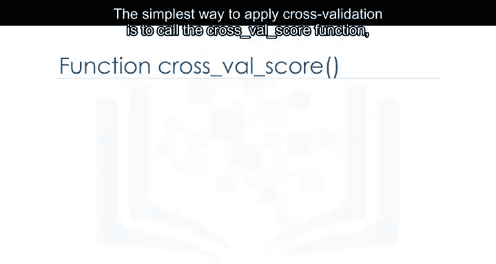

```python
from sklearn.model_selection import cross_val_score
from sklearn.linear_model import LinearRegression

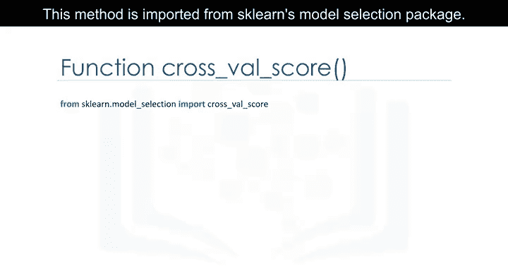

lr = LinearRegression()
scores = cross_val_score(lr, X_data, y_data, cv=3)
```

我们然后使用函数 `cross_val_score`。第一个输入参数是我们用于进行交叉验证的模型类型。在这个例子中，我们初始化了一个线性回归模型或对象 `lr`，我们将其传递给 `cross_val_score` 函数。其他参数是 `X_data`（预测变量数据）和 `y_data`（目标变量数据）。

我们可以通过 `cv` 参数管理分区的数量。这里 `cv=3`，意味着数据集被分成三个相等的分区。该函数返回一个分数数组，每个被选为测试集的分区对应一个分数。我们可以使用NumPy中的 `mean` 函数将结果平均在一起，以估计样本外R平方。

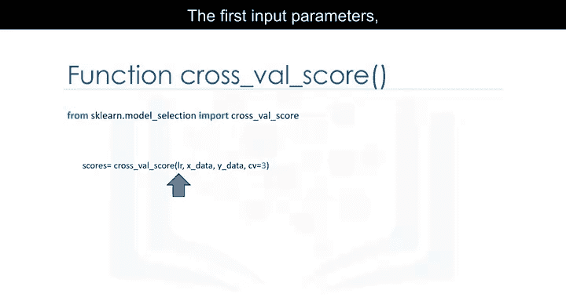

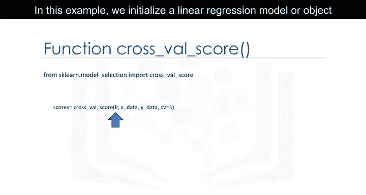

---

## 交叉验证过程详解

让我们看一个动画。首先，我们将数据分成三折。我们使用两折进行训练，剩余的一折进行测试。模型将产生一个输出。我们将使用该输出来计算一个分数。在R平方（即决定系数）的情况下，我们将该值存储在一个数组中。

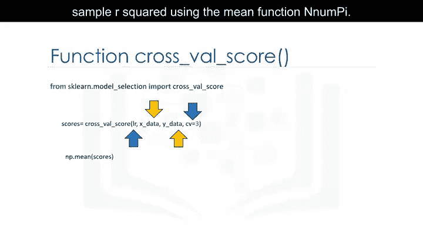

我们将重复这个过程，使用两折进行训练，一折进行测试。保存分数，然后使用不同的组合进行训练，剩余的一折进行测试。我们存储最终结果。`cross_val_score` 函数返回一个分数值，告诉我们交叉验证的结果。

---

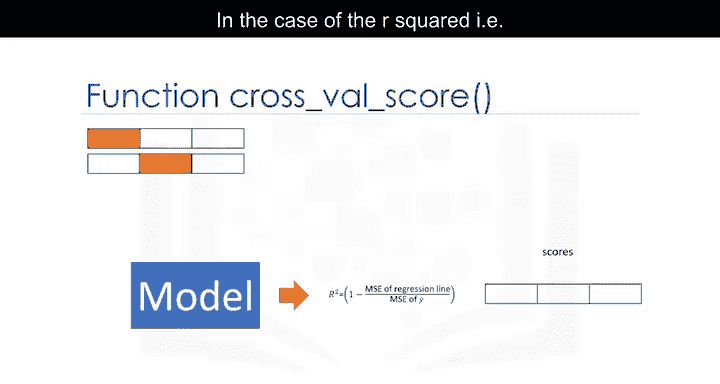

## 获取预测值

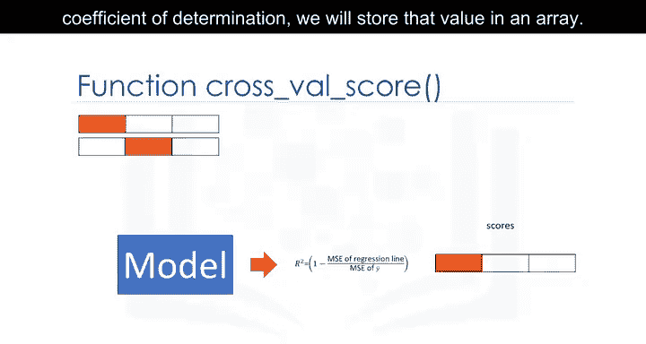

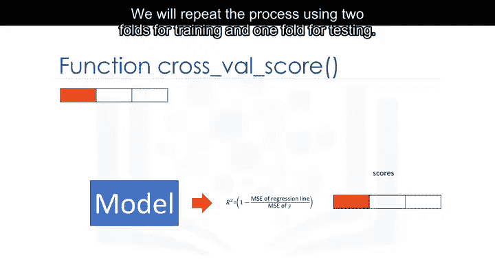

如果我们想要更多信息呢？如果我们想知道在计算R平方值之前，我们的模型提供的实际预测值呢？

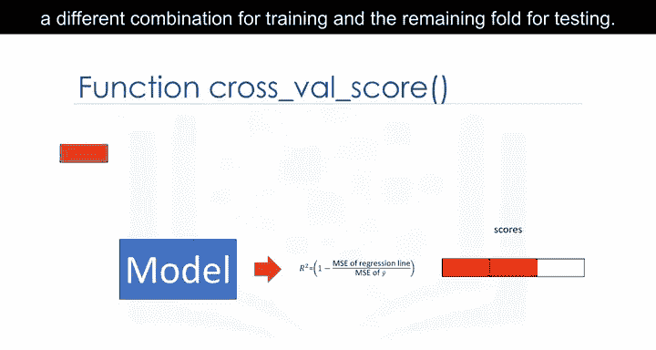

为此，我们使用 `cross_val_predict` 函数。输入参数与 `cross_val_score` 函数完全相同，但输出是预测值。让我们说明这个过程。

首先，我们将数据分成三折。我们使用两折进行训练，剩余的一折进行测试。模型将产生一个输出，我们将其存储在一个数组中。

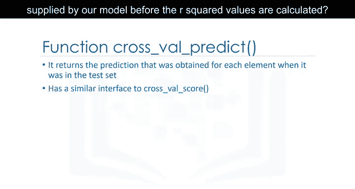

我们将重复这个过程，使用两折进行训练，一折进行测试。模型再次产生一个输出。最后，我们使用最后两折进行训练。然后，我们使用测试数据。这最后的测试折产生一个输出。这些预测存储在一个数组中。

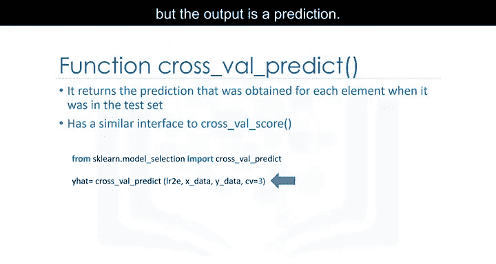

---

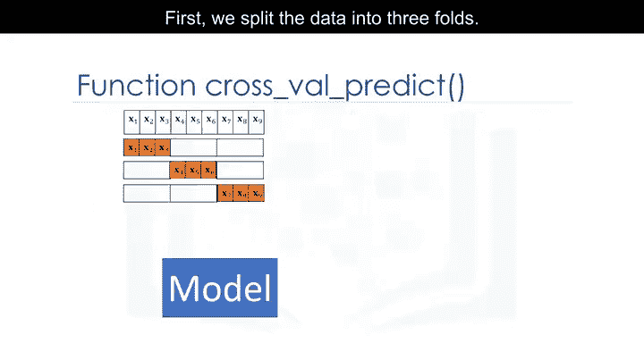

## 总结

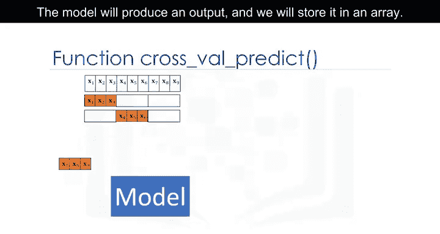

在本节课中，我们一起学习了模型评估与优化的核心概念。我们了解到，为了准确评估模型在真实世界中的表现，必须将数据划分为训练集和测试集。我们介绍了使用Scikit-learn的 `train_test_split` 函数进行数据划分的方法。

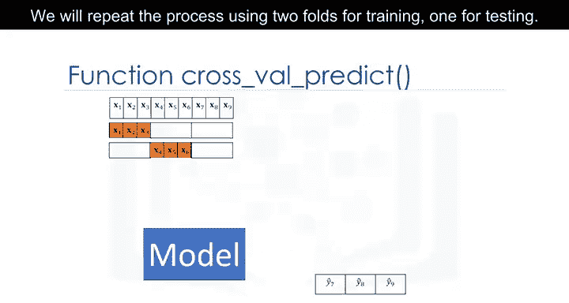

更重要的是，我们探讨了泛化误差的概念，并认识到单一的训练-测试划分可能无法稳定地估计模型性能。因此，我们引入了交叉验证技术，它通过多次划分和平均结果，提供了对模型泛化能力更可靠、更精确的估计。我们学习了如何使用 `cross_val_score` 函数获取模型的评估分数，以及如何使用 `cross_val_predict` 函数获取具体的预测值。

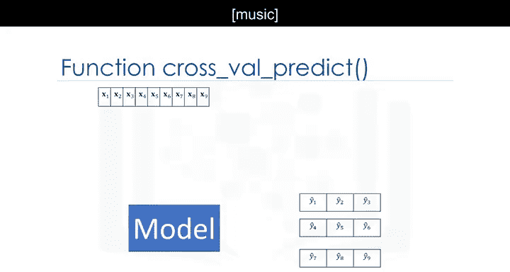

掌握这些技术是构建稳健、可靠机器学习模型的关键步骤。