# 045：网格搜索 🔍

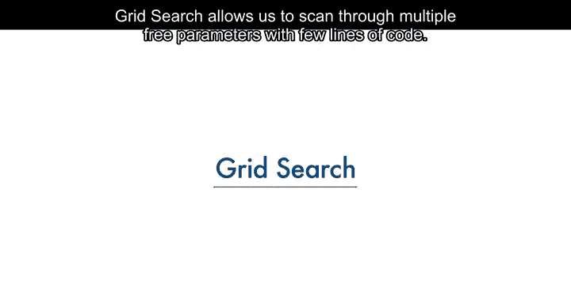

在本节课中，我们将学习一种强大的机器学习工具——网格搜索。网格搜索允许我们通过几行代码，系统地扫描和评估多个超参数的不同取值，从而帮助我们找到模型的最佳配置。

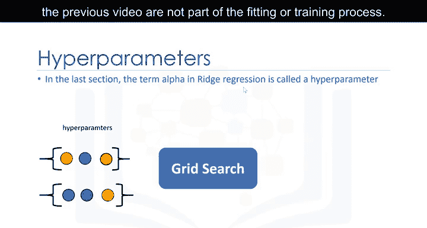

---

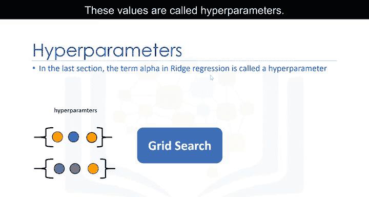

## 什么是网格搜索？ 🤔

网格搜索使我们能够用少量代码扫描多个自由参数。

像上一节视频中讨论的 `alpha` 项这样的参数，并不属于模型的拟合或训练过程本身。这些值被称为**超参数**。

Scikit-learn 提供了一种方法，可以自动使用交叉验证来迭代这些超参数。这种方法就叫做**网格搜索**。

---


## 网格搜索的工作原理 ⚙️

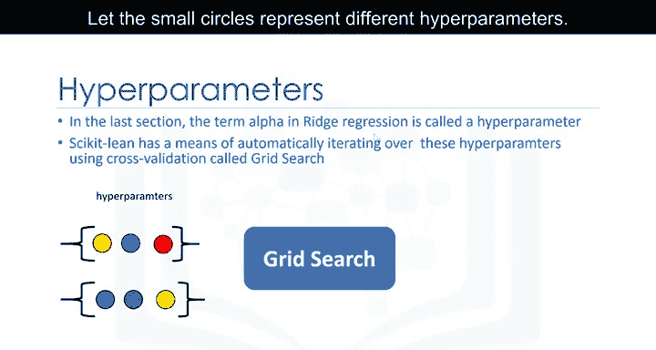


上一节我们介绍了超参数的概念，本节中我们来看看网格搜索是如何工作的。

网格搜索接收你想要训练的模型（或对象）以及超参数的不同取值。然后，它会计算不同超参数取值下的均方误差或 R 平方值，从而让你选择最佳值。

让我们用小圆圈代表不同的超参数取值。我们从一个超参数值开始训练模型，然后使用不同的超参数值再次训练模型。我们持续这个过程，直到穷尽所有不同的自由参数值。每个模型都会产生一个误差。我们选择那个能最小化误差的超参数。


---

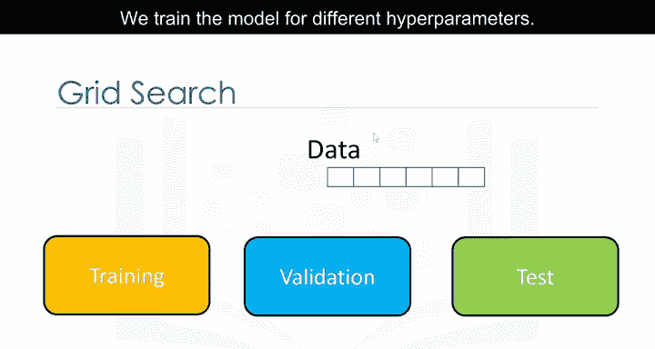

## 数据集划分与验证 📊

为了进行有效的网格搜索，我们需要将数据集分为三个部分：**训练集**、**验证集**和**测试集**。

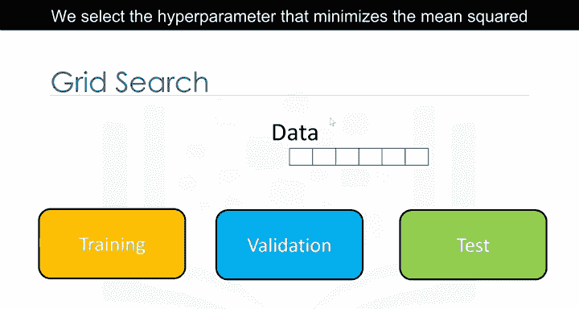


以下是网格搜索在数据集上的工作流程：

1.  我们为不同的超参数值训练模型。
2.  我们使用验证集计算每个模型的 R 平方值或均方误差。
3.  我们选择在验证集上能最小化均方误差或最大化 R 平方值的超参数。
4.  最后，我们使用测试数据来评估模型的最终性能。


---

## 在Scikit-learn中识别超参数 🔍


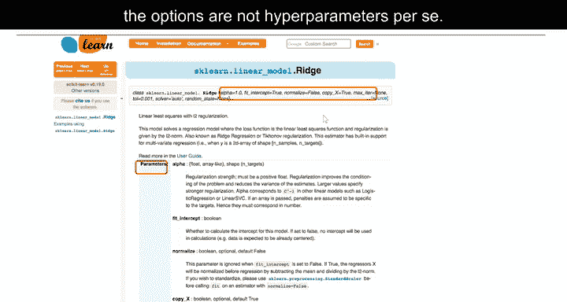

这是 Scikit-learn 的网页，其中给出了对象构造函数的参数。需要注意的是，对象的属性也被称为参数。在本模块中，我们不会严格区分，尽管有些选项本身可能不被视为超参数。我们将重点关注超参数 `alpha` 和归一化参数。


---

## 定义参数网格 📋

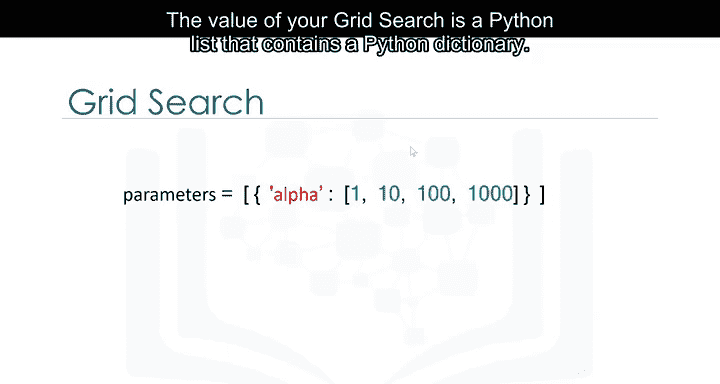

网格搜索的核心是一个包含 Python 字典的 Python 列表。

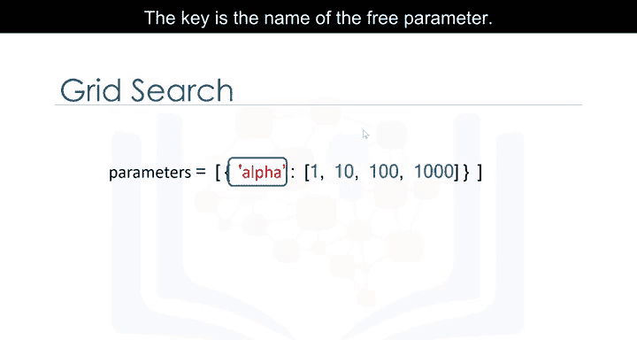

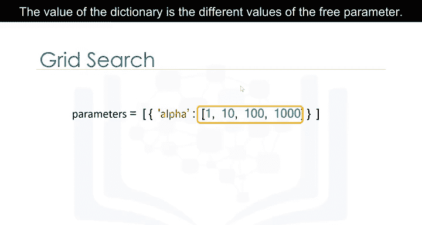

以下是定义参数网格的要点：
*   字典的键是自由参数的名称。
*   字典的值是该自由参数的不同取值。


这可以看作是一个包含各种自由参数取值的表格。我们还需要指定模型对象。

---

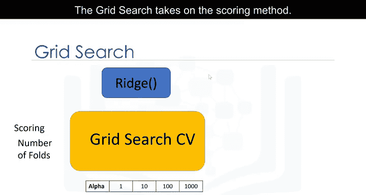

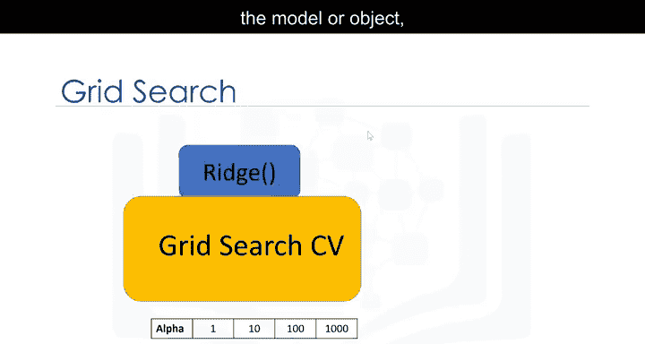

## 创建网格搜索对象 🛠️

网格搜索对象需要指定评分方法（本例中是 R 平方）、交叉验证的折数、模型对象以及自由参数的取值。

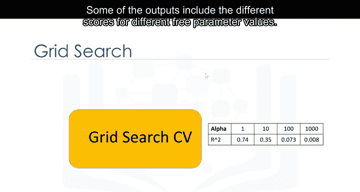

一些输出包括不同自由参数值对应的不同分数（本例中是 R 平方），以及具有最佳分数的自由参数值。

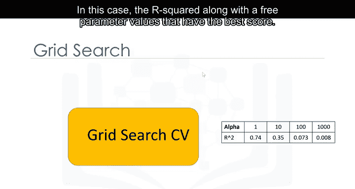

---

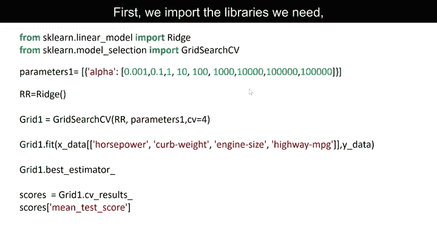


## 实践：单参数网格搜索 💻

首先，我们导入所需的库，包括 `GridSearchCV` 和参数字典。

```python
from sklearn.linear_model import Ridge
from sklearn.model_selection import GridSearchCV
import pandas as pd
```


我们创建一个岭回归对象（模型）。然后创建一个 `GridSearchCV` 对象。输入包括岭回归对象、参数值和交叉验证折数。我们将使用 R 平方作为评分方法（这是默认方法）。接着拟合这个对象。

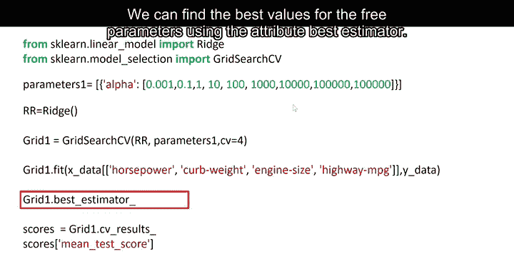

```python
# 创建模型
ridge = Ridge()
# 定义参数网格
parameters = {'alpha': [1, 10, 100]}
# 创建GridSearchCV对象
grid1 = GridSearchCV(ridge, parameters, cv=10)
# 拟合模型
grid1.fit(X_train, y_train)
```

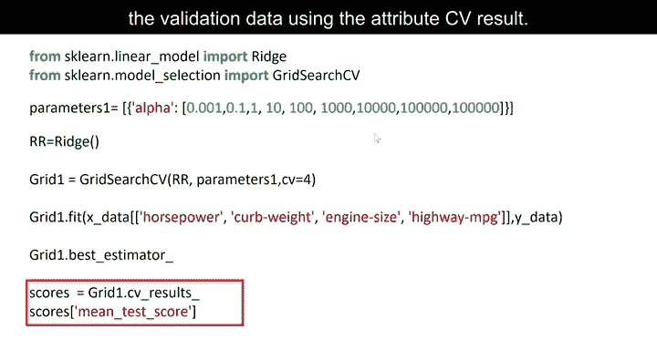

我们可以使用 `best_estimator_` 属性找到自由参数的最佳值。

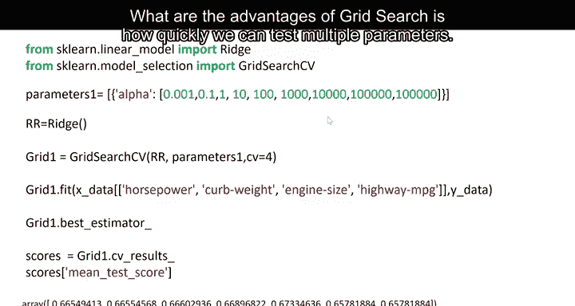

```python
best_model = grid1.best_estimator_
```


我们还可以使用 `cv_results_` 属性获取诸如验证数据上的平均分数等信息。

```python
results = grid1.cv_results_
```

---

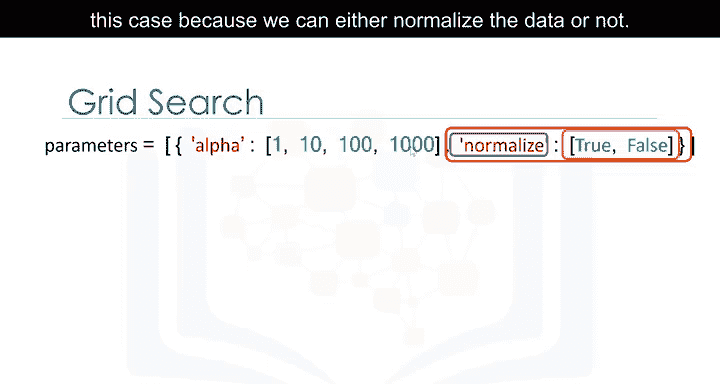

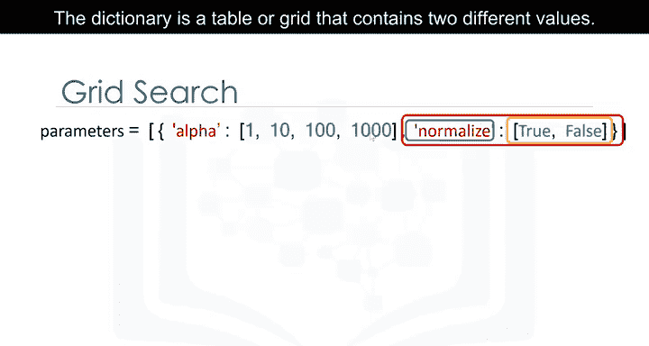

## 实践：多参数网格搜索 🔄

网格搜索的一个优势是能够快速测试多个参数。

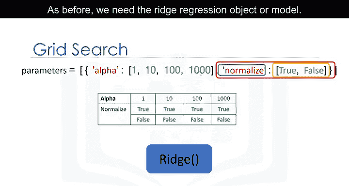

例如，岭回归有一个选项可以归一化数据（如何标准化请参见模块4）。参数字典的第一个元素是 `alpha` 项，第二个元素是 `normalize` 选项。键是参数的名称，值是不同的选项。在本例中，因为我们可以选择是否归一化数据，所以值分别是 `True` 或 `False`。

这个字典是一个包含两个不同取值的表格或网格。和之前一样，我们需要岭回归对象（模型）。过程是相似的，只是我们有了一个包含不同参数值的表格或网格。输出是所有不同参数值组合的分数。

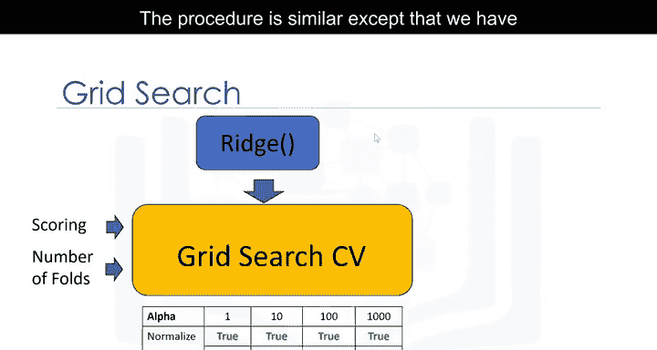

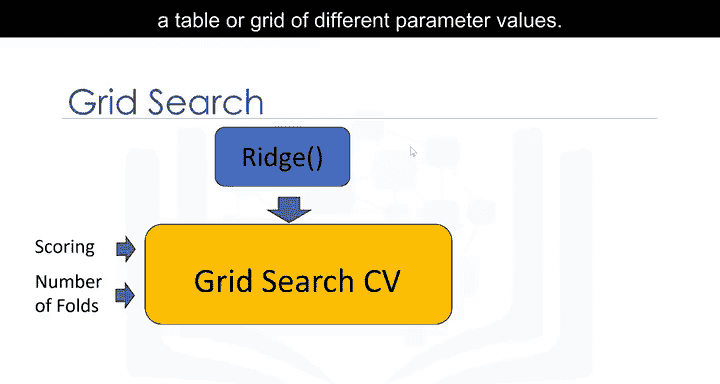

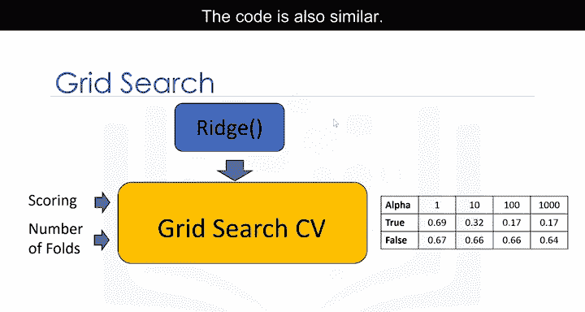

代码也是类似的。字典包含了不同的自由参数值。我们可以找到自由参数的最佳值。不同自由参数的结果分数存储在这个字典 `grid1.cv_results_` 中。

```python
# 定义包含两个参数的网格
parameters = {'alpha': [0.001, 0.1, 1, 10, 100],
              'normalize': [True, False]}
# 创建并拟合网格搜索
grid1 = GridSearchCV(ridge, parameters, cv=10)
grid1.fit(X_train, y_train)
# 打印最佳参数
print(grid1.best_params_)
```

我们可以打印出不同自由参数值的分数。参数值的存储方式如下所示。更多示例请参见课程实验部分。

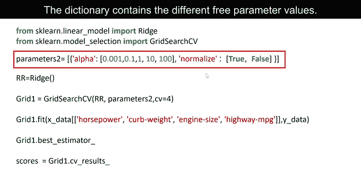

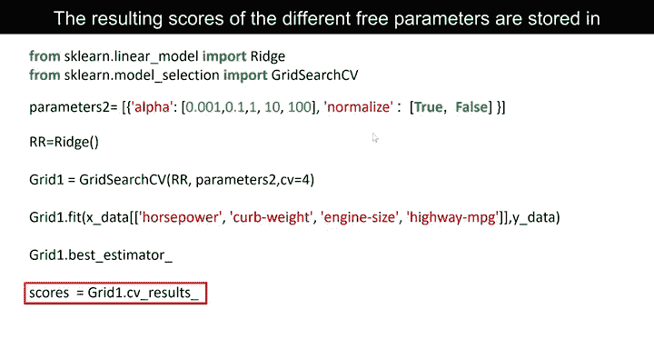

---

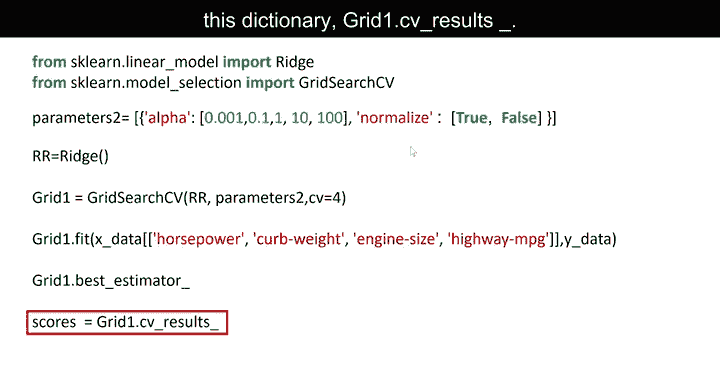

## 总结 📝

本节课中我们一起学习了网格搜索。我们了解到网格搜索是一种自动化超参数调优的强大工具，它通过系统性地遍历预定义的参数组合，并利用交叉验证进行评估，来帮助我们找到模型的最佳配置。我们学习了如何定义参数网格、创建 `GridSearchCV` 对象、进行单参数及多参数搜索，并获取最佳模型和评估结果。掌握网格搜索能显著提高我们构建高效机器学习模型的效率。