# 047：网格搜索 🔍

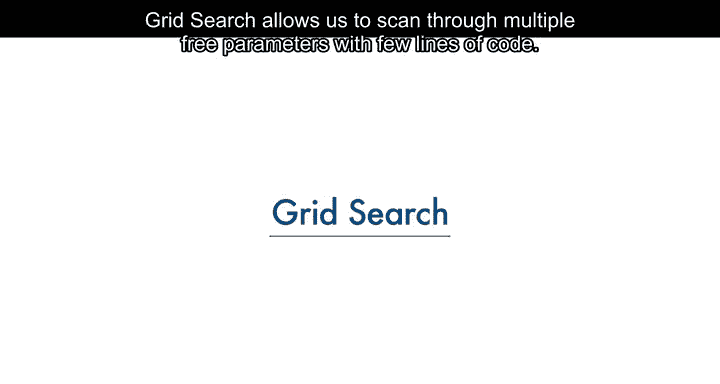

在本节课中，我们将要学习一种强大的机器学习工具——网格搜索。网格搜索允许我们通过少量代码，系统地扫描多个超参数，从而找到模型的最佳配置。我们将了解什么是超参数，以及如何使用Scikit-learn库中的`GridSearchCV`来自动化这一过程。

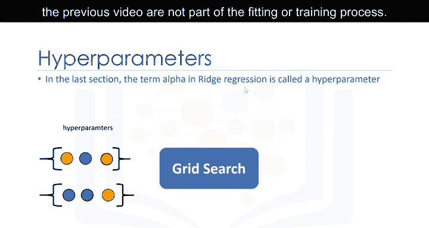

---

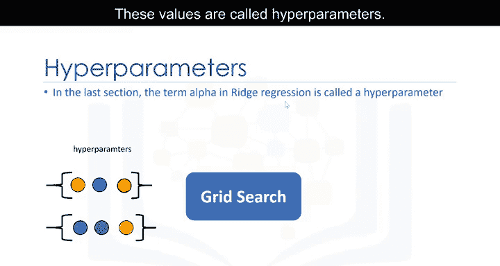

## 什么是网格搜索？🤔

上一节我们介绍了模型训练中的参数概念。本节中我们来看看另一类参数——超参数。

像上一视频中讨论的alpha项这样的参数，并不属于模型的拟合或训练过程。这些值被称为**超参数**。

Scikit-learn提供了一种使用交叉验证自动迭代这些超参数的方法，这种方法就叫做**网格搜索**。

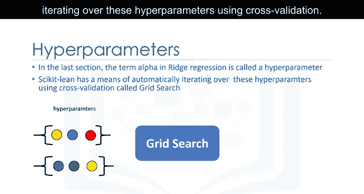

网格搜索接收你想要训练的模型对象以及超参数的不同取值。然后，它会计算不同超参数组合下的均方误差或R平方值，从而让你选择最佳值。

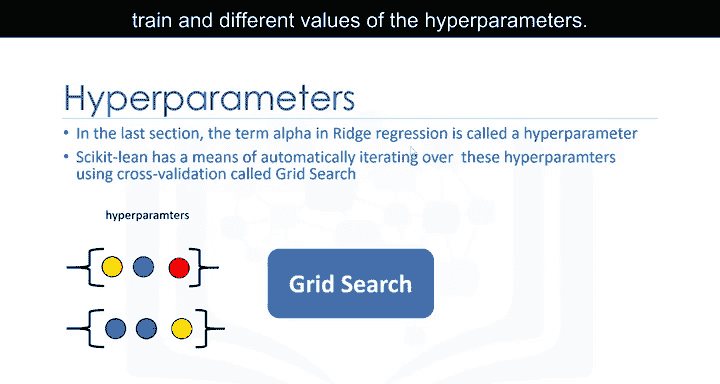


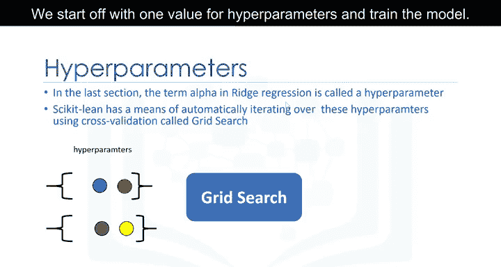

---

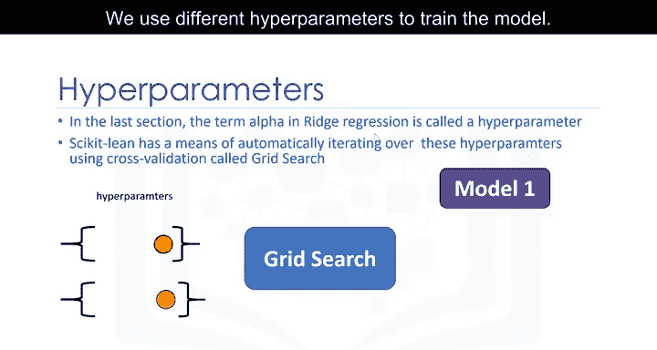

## 网格搜索的工作原理 ⚙️

我们可以将不同的超参数值想象成许多小圆圈。以下是网格搜索的基本步骤：

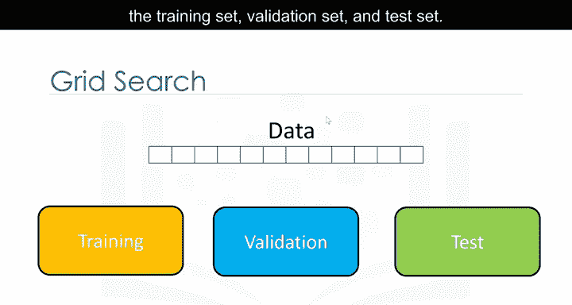

1.  我们从一个超参数值开始训练模型。
2.  使用不同的超参数值再次训练模型。
3.  重复此过程，直到穷尽所有不同的自由参数值。
4.  每个模型都会产生一个误差。
5.  我们选择那个能最小化误差的超参数组合。

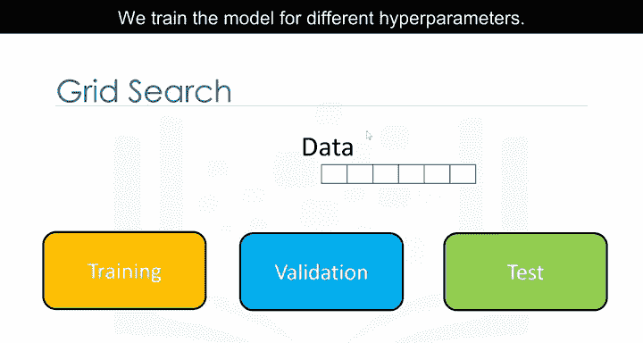

为了客观评估，我们需要将数据集分为三部分：**训练集**、**验证集**和**测试集**。

以下是具体流程：


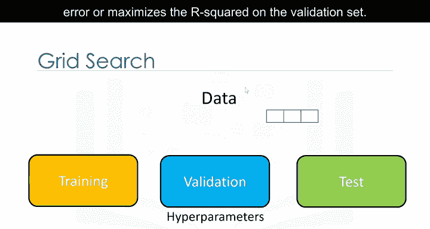

*   我们为不同的超参数组合训练模型。
*   使用验证集计算每个模型的R平方或均方误差。
*   选择在验证集上能最小化均方误差或最大化R平方的超参数。
*   最后，使用测试数据来评估我们最终模型的性能。

---

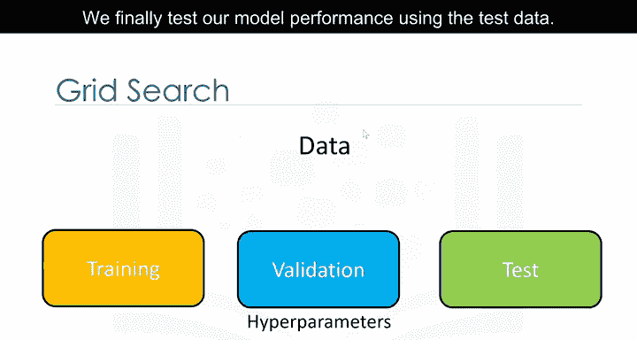

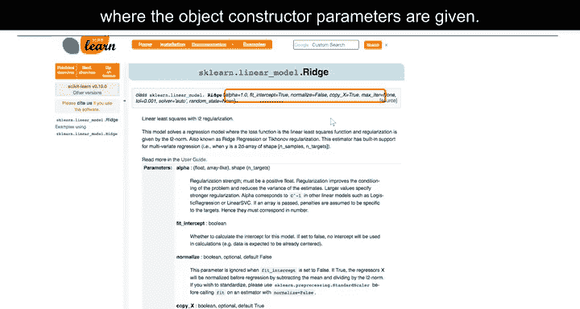

## 在Scikit-learn中定义参数网格 📊

在Scikit-learn的官方文档中，对象构造函数的参数都被列出。需要注意的是，对象的属性也被称为参数。在本模块中，我们不会严格区分，尽管有些选项本身可能不被视为超参数。我们将重点关注超参数`alpha`和归一化参数`normalize`。

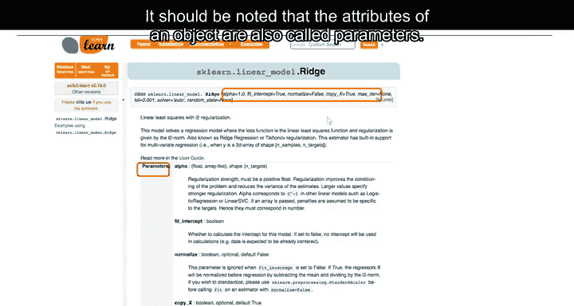

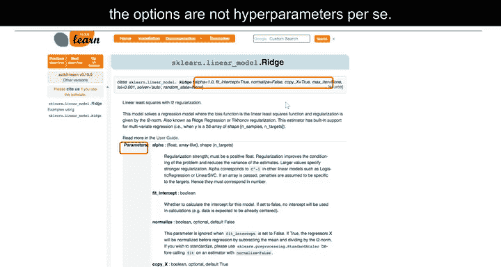

网格搜索的核心是一个Python列表，其中包含一个或多个Python字典。

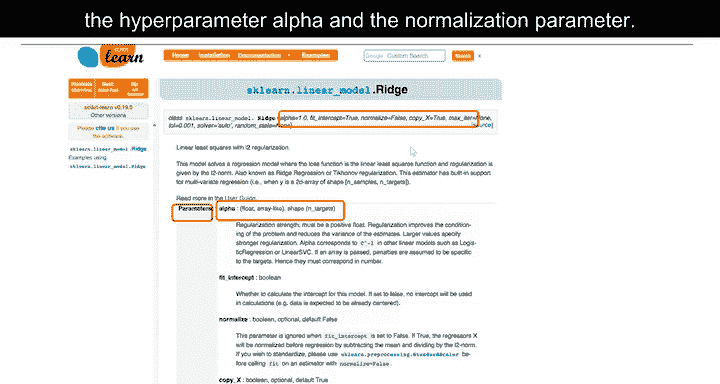

*   **键**是自由参数的名称。
*   **值**是该自由参数的不同取值列表。

这可以看作是一个包含各种自由参数值的表格。我们还需要模型对象本身。


网格搜索需要指定评分方法（本例中为R平方）、交叉验证的折数、模型对象以及自由参数值网格。

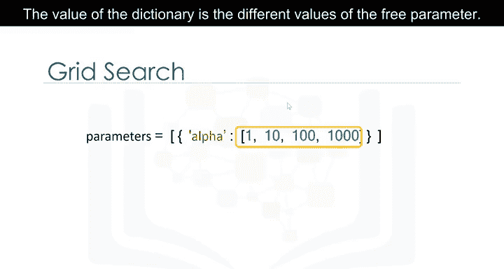

其输出包括不同自由参数值的分数，以及具有最佳分数的自由参数值。

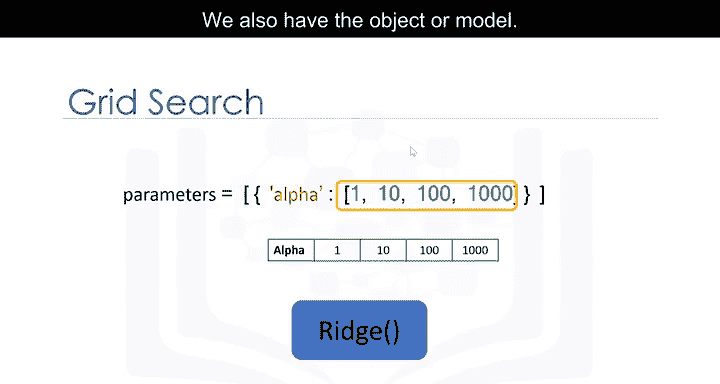

---


## 实践：单参数网格搜索 💻

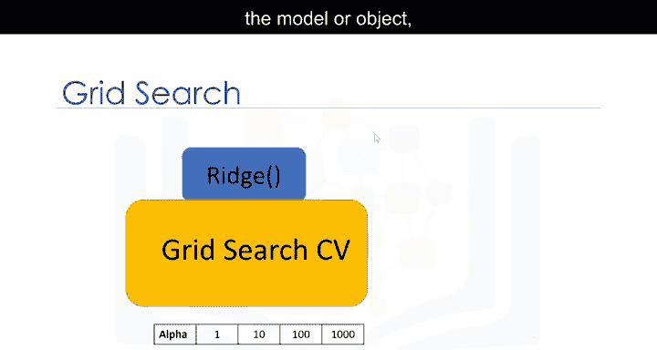

首先，我们导入所需的库，包括`GridSearchCV`和参数字典。


```python
from sklearn.linear_model import Ridge
from sklearn.model_selection import GridSearchCV
```

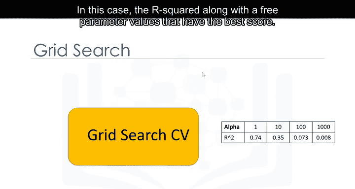

我们创建一个Ridge回归对象（模型），然后创建一个`GridSearchCV`对象。输入包括Ridge回归对象、参数字典和交叉验证折数。我们将使用R平方作为评分方法（这是默认设置）。接着拟合这个对象。

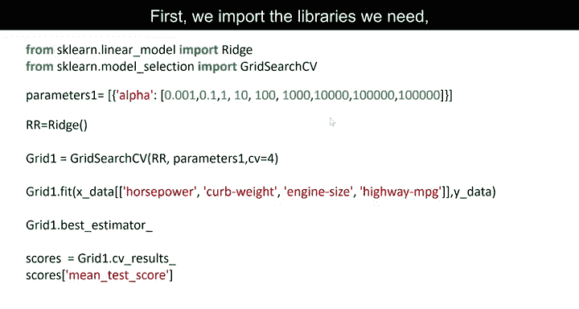

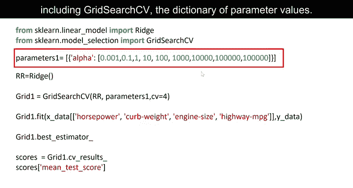

```python
ridge = Ridge()
parameters = {'alpha': [1, 10, 100]}
grid1 = GridSearchCV(ridge, parameters, cv=4)
grid1.fit(X_train, y_train)
```

我们可以使用`best_estimator_`属性找到自由参数的最佳值。

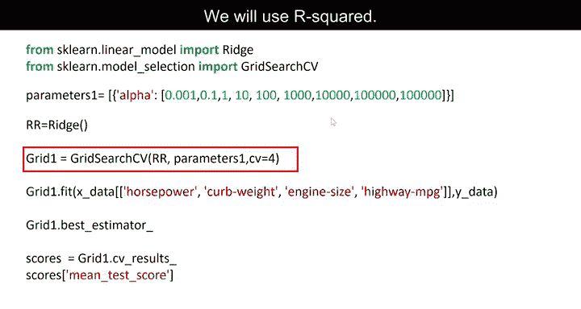

```python
best_model = grid1.best_estimator_
```


我们也可以使用`cv_results_`属性获取诸如验证数据上的平均分数等信息。

```python
results = grid1.cv_results_
```


---

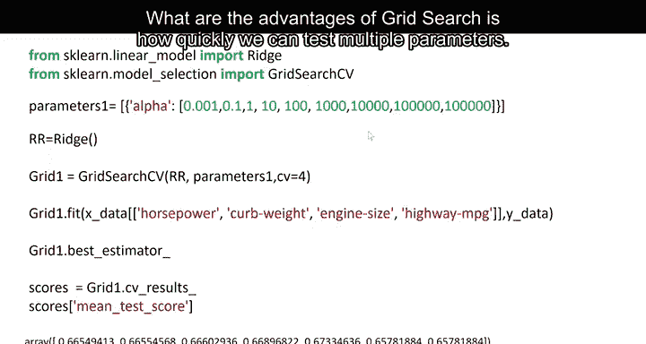

## 实践：多参数网格搜索 🧩

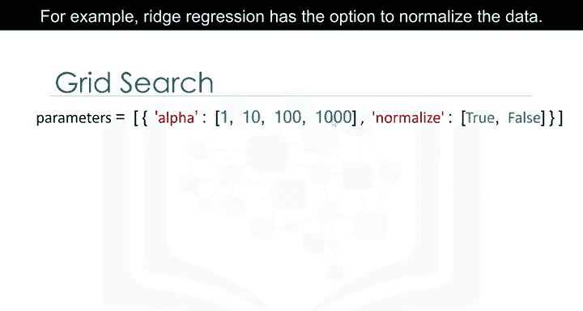

网格搜索的一个优势是能快速测试多个参数的组合。

例如，Ridge回归有一个选项可以归一化数据。参数`alpha`是字典中的第一个元素，第二个元素是`normalize`选项。键是参数名，值是该参数的不同选项。在本例中，因为我们可以选择是否归一化数据，所以值分别是`True`或`False`。

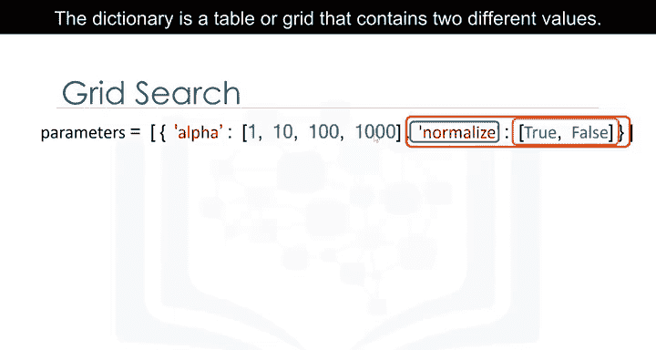

这个字典就是一个包含两个不同参数取值的表格或网格。和之前一样，我们需要Ridge回归对象。

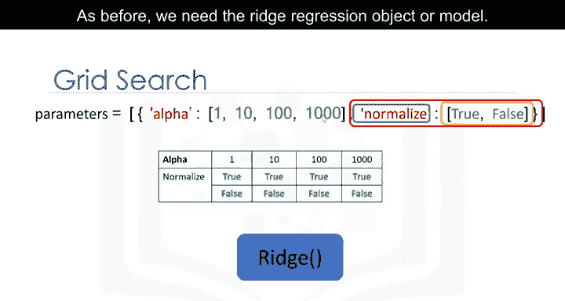

流程是相似的，只是我们有一个包含不同参数值的表格。输出是所有不同参数组合的分数。

代码也类似。字典包含了不同的自由参数值。

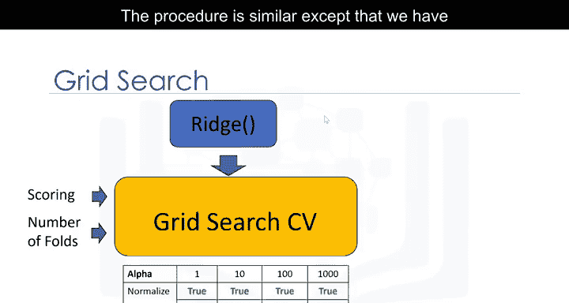


```python
parameters2 = {'alpha': [1, 10, 100], 'normalize': [True, False]}
grid2 = GridSearchCV(ridge, parameters2, cv=4)
grid2.fit(X_train, y_train)
```

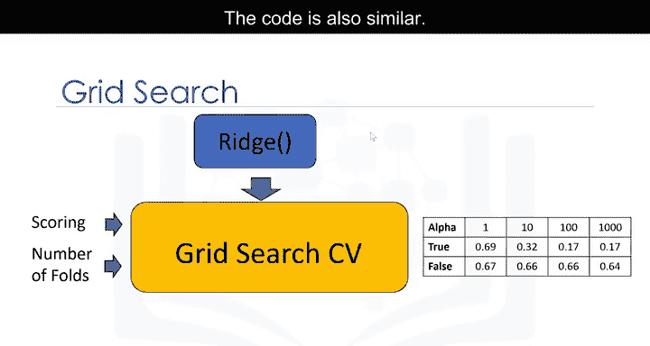

我们可以找到自由参数的最佳值。不同自由参数的结果分数存储在这个字典中：`grid2.cv_results_`。

我们可以打印出不同自由参数值的分数。参数值的存储方式如图所示。更多示例请参阅课程实验部分。

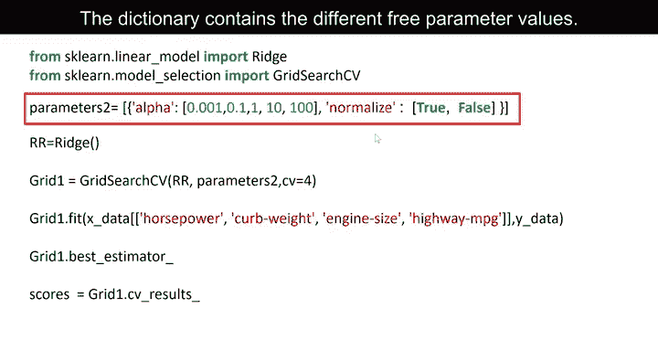

---

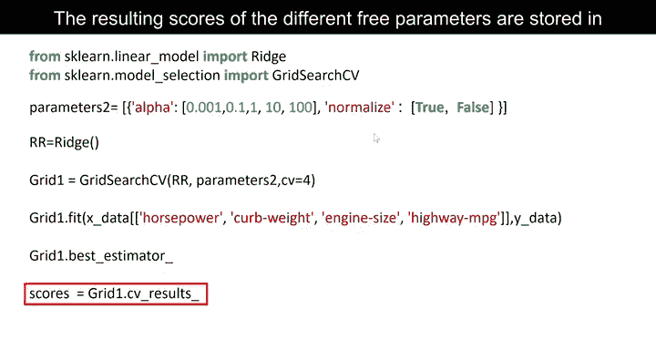

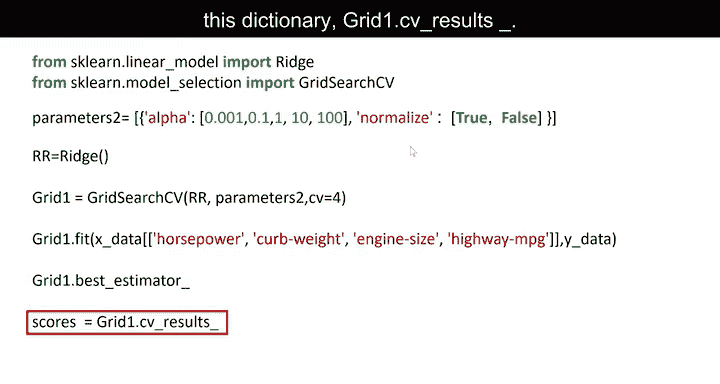

## 总结 📝

本节课中我们一起学习了网格搜索。我们了解到网格搜索是一种自动化超参数调优的强大工具，它通过系统性地尝试超参数的不同组合，并利用交叉验证进行评估，来帮助我们找到模型的最佳配置。我们掌握了如何使用Scikit-learn的`GridSearchCV`来实现单参数和多参数的搜索，并理解了如何解读其结果以选择最优模型。