# 001：数据可视化导论 📊

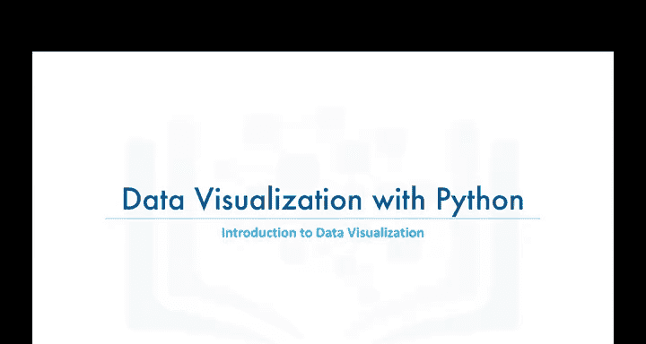

在本节课中，我们将要学习数据可视化的基本概念，并通过一个具体例子，了解如何将一个复杂的图表转化为更有效、更具吸引力且更有影响力的可视化形式。

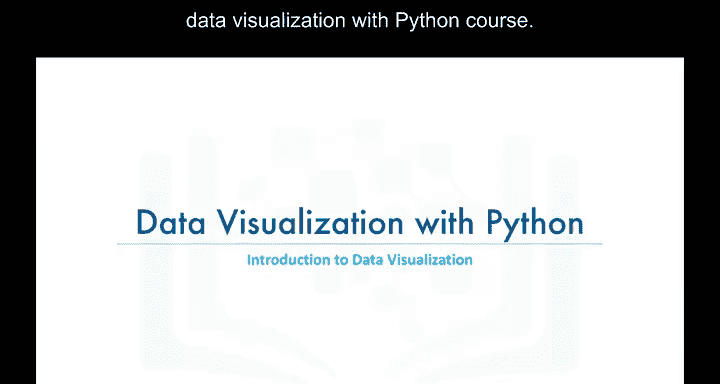

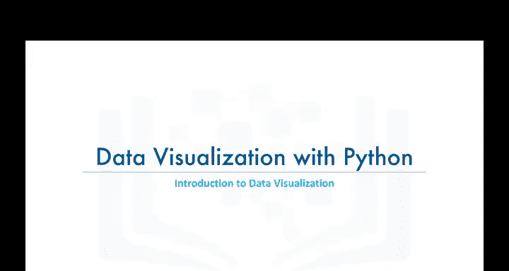

---

大家好，欢迎来到Python数据可视化课程的第一个模块。  
在这个视频中，我们将介绍数据可视化，并通过一个例子展示如何将一个给定的视觉图表转化为更有效、更具吸引力且更有影响力的形式。

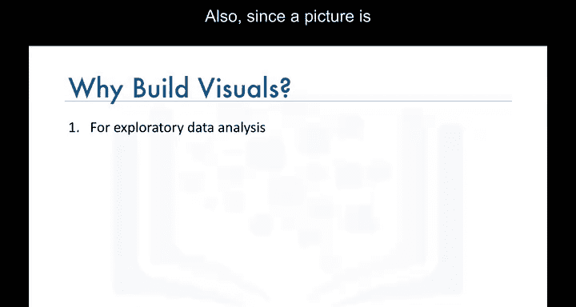

那么，让我们开始吧。

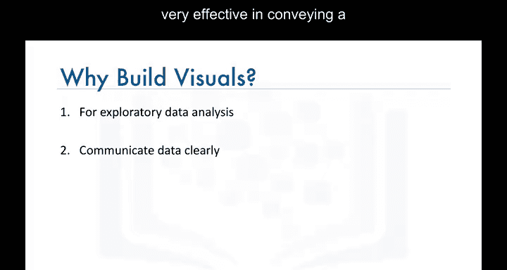

---

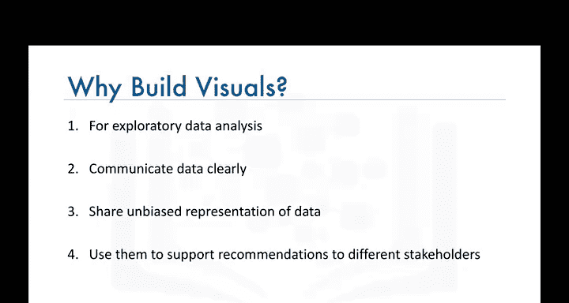

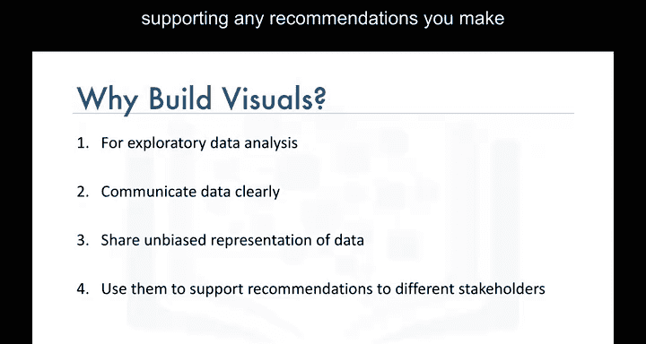

有人可能会问，为什么需要学习如何可视化数据？  
数据可视化是一种以图形化且易于理解的形式展示复杂数据的方法。  
这在探索数据并熟悉数据时尤其有用。  
此外，由于一图胜千言，图表在清晰传达数据描述方面非常有效。

特别是在向观众展示发现或与其他数据科学家共享数据时，图表非常有用。  
此外，在向客户、经理或所在领域的其他决策者提出建议时，图表也非常有价值。

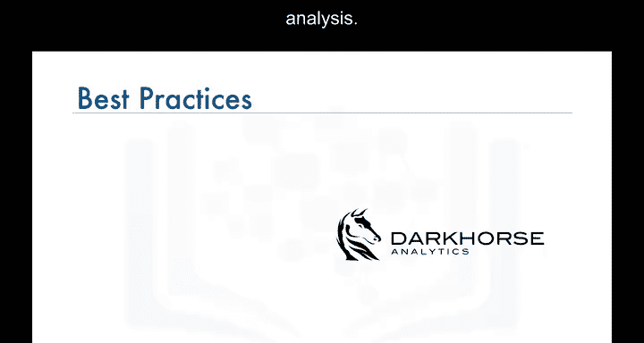

---

Darkro Analytics是一家于2008年从阿尔伯塔大学研究实验室分离出来的公司，在数据可视化方面做了许多引人入胜的工作。  
Darkro Analytics专注于多个领域的定量咨询，包括数据可视化和地理空间分析。

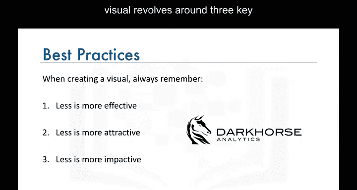

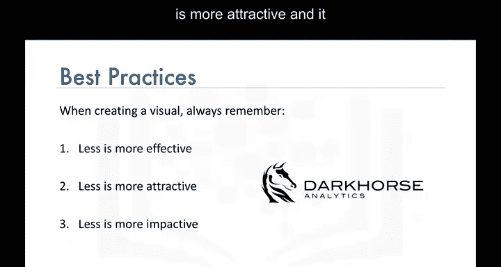

他们在创建可视化图表时的方法围绕三个关键点展开：**少即是多**、**更有效**、**更具吸引力**、**更有影响力**。  
换句话说，为了使图表更具吸引力或更美观而加入的任何功能或设计，都应支持图表所要传达的信息，而不是分散注意力。

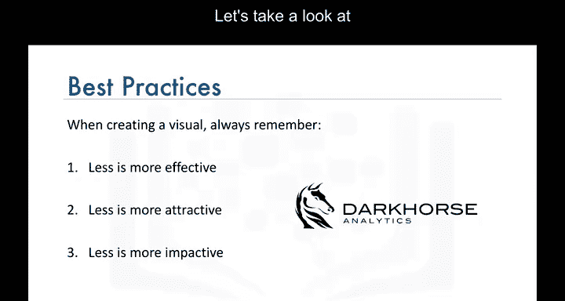

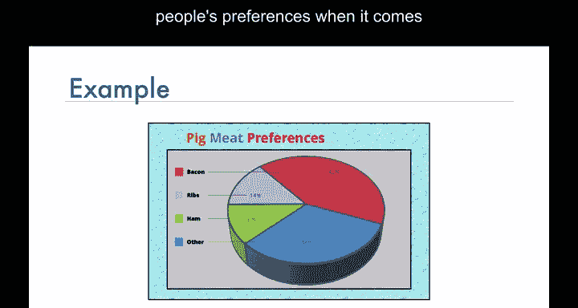

让我们来看一个例子。

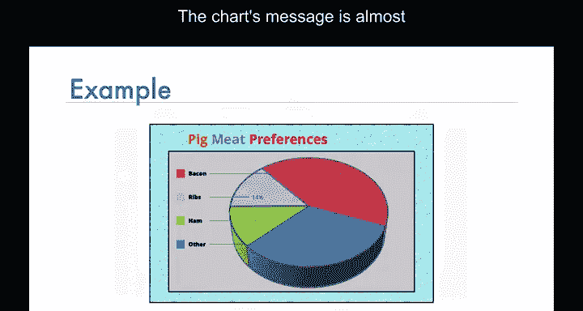

---

这里有一个饼图，看起来展示了人们对不同类型猪肉的偏好。  
图表传达的信息是：在接受调查的人中，近一半的人更喜欢培根，而不是其他类型的猪肉。

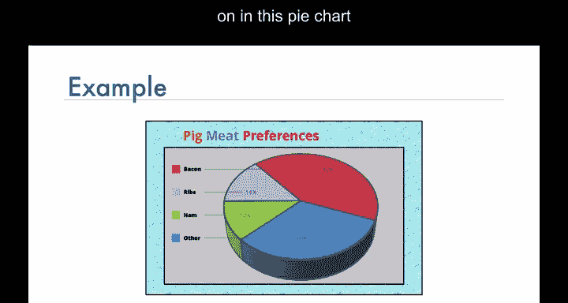

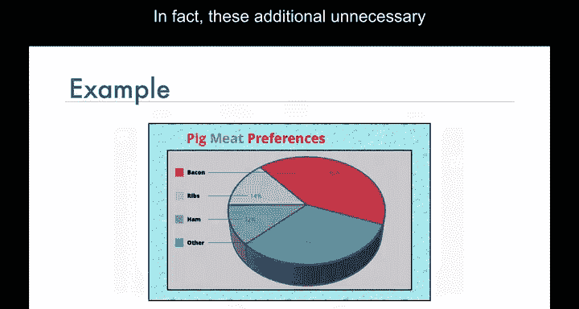

但我相信几乎所有人都同意，这个饼图中包含了许多元素，我们甚至不确定蓝色背景或3D方向等功能是否旨在传达任何信息。

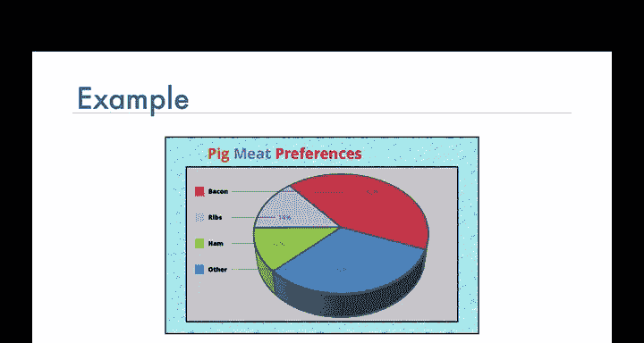

事实上，这些额外的不必要功能会分散主要信息的注意力，并可能使观众感到困惑。

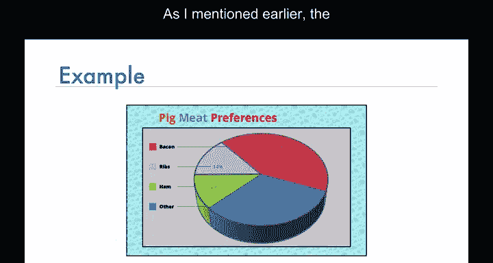

---

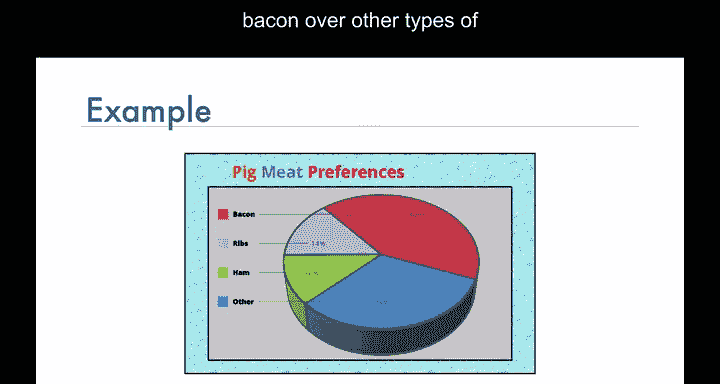

因此，让我们应用Darkro Analytics的方法，将这个图表转化为更有效、更具吸引力且更有影响力的可视化形式。  
如前所述，这里的信息是：人们更可能选择培根，而不是其他类型的猪肉。  
因此，让我们去除一切可能分散核心信息注意力的元素。

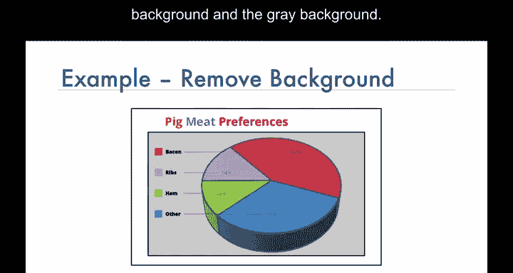

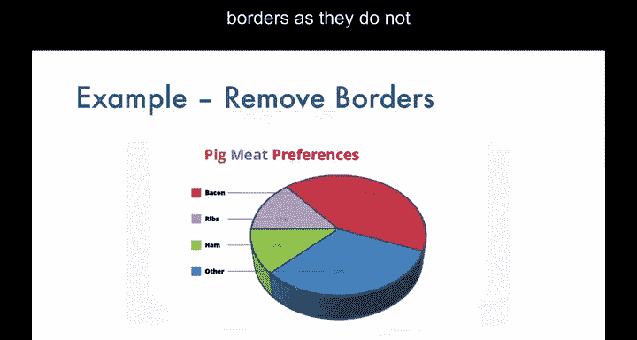

以下是具体步骤：

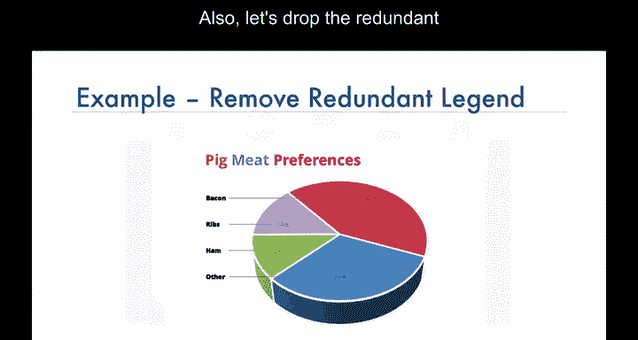

首先，去除蓝色背景和灰色背景。  
其次，去除边框，因为它们不传达任何额外信息。  
接着，去除冗余的图例，因为饼图已经通过颜色进行了标注。  
3D效果没有增加任何额外信息，因此去除它。  
文本阴影也是不必要的，去除它。  
然后，去除不同的颜色。  
最后，去除饼图的扇形块。  
哇，发生了什么？

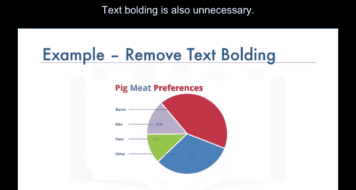

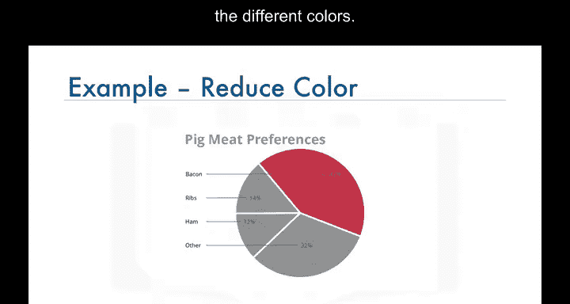

让我们坚持使用线条，使它们更有意义。  
现在，这看起来有点熟悉了。  
是的，这是一个条形图，更具体地说，是一个水平条形图。  
最后，让我们突出显示培根，使其在其他类型的猪肉中脱颖而出。

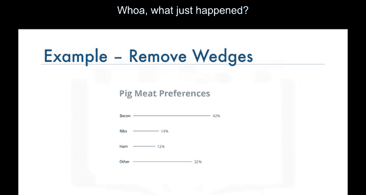

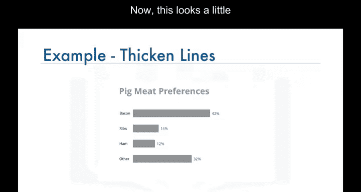

---

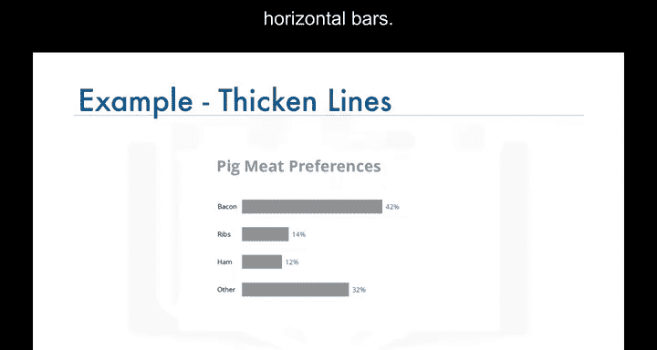

现在，让我们将饼图和条形图并置，比较哪一个更好且更易于理解。  
我希望我们一致同意条形图是两者中更好的选择。它更简单、更清晰、更少分散注意力，且更易于阅读。

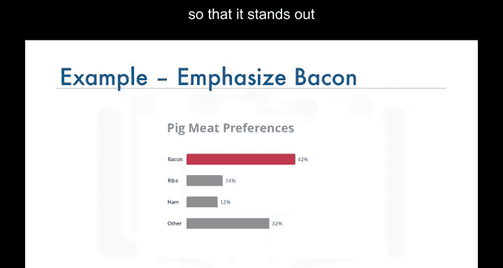

事实上，饼图最近受到了数据可视化专家的批评，他们认为饼图仅在极少数情况下适用。  
相比之下，条形图和图表被认为是快速传达信息的更优方式。

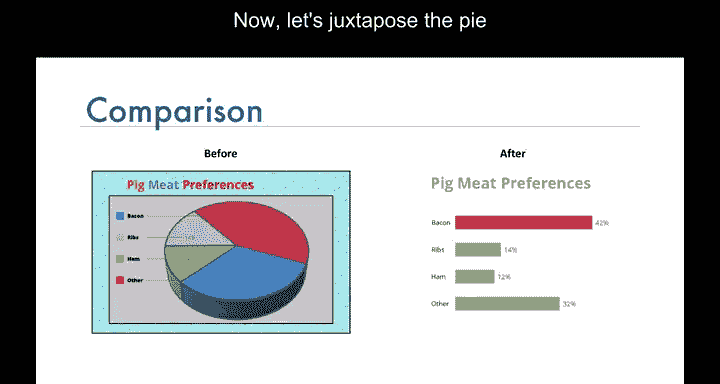

但暂时不用担心这一点。当我们学习如何使用Matplotlib创建饼图和条形图时，会再次回到这一点。

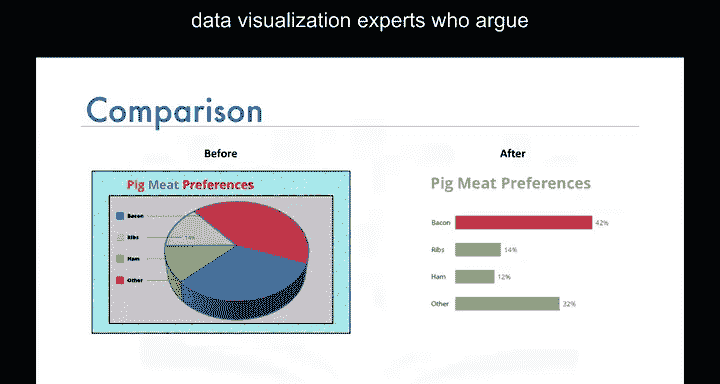

---

如需更多类似且有趣的例子，请查看Darkro Analytics的网站。  
他们还有更多关于如何清理条形图和地理空间数据地图的例子。  
所有这些例子都强化了“少即是多”的概念，即更有效、更具吸引力且更有影响力。

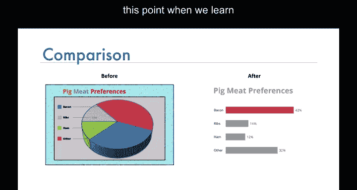

---

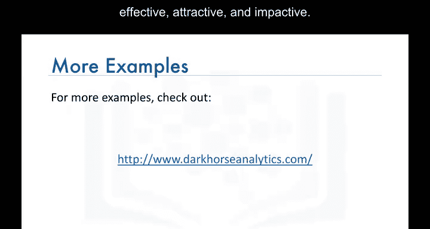

在本节课中，我们一起学习了数据可视化的基本概念，并通过一个具体例子了解了如何优化图表以更有效地传达信息。记住，一个好的可视化图表应该简洁、清晰，并突出核心信息。