# 003：Matplotlib基础绘图


在本节课中，我们将学习如何使用Matplotlib库来创建图表。我们将使用Jupyter Notebook作为开发环境，并重点介绍Matplotlib的脚本接口。通过本课，你将掌握如何绘制基本图表，并了解Matplotlib与Pandas库的集成使用。

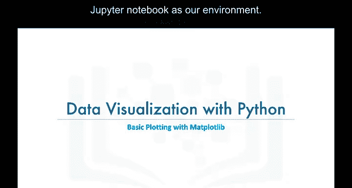

---

## 🎯 Matplotlib简介

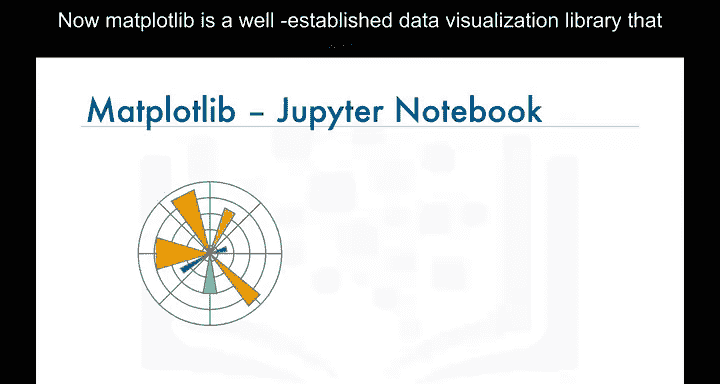

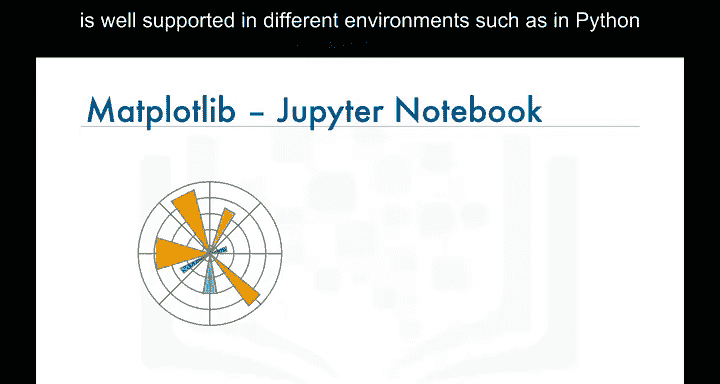

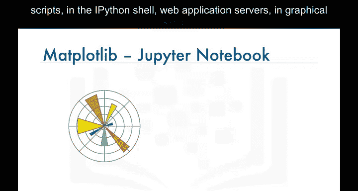

Matplotlib是一个成熟的数据可视化库，它在多种环境中都得到良好支持，包括Python脚本、IPython shell、Web应用服务器、图形用户界面工具包以及Jupyter Notebook。


对于不熟悉Jupyter Notebook的学员，它是一个开源Web应用程序，允许你创建和共享包含实时代码、可视化图表以及解释性文本的文档。

Jupyter对Matplotlib有专门的支持。启动Jupyter Notebook后，你只需导入Matplotlib即可开始使用。

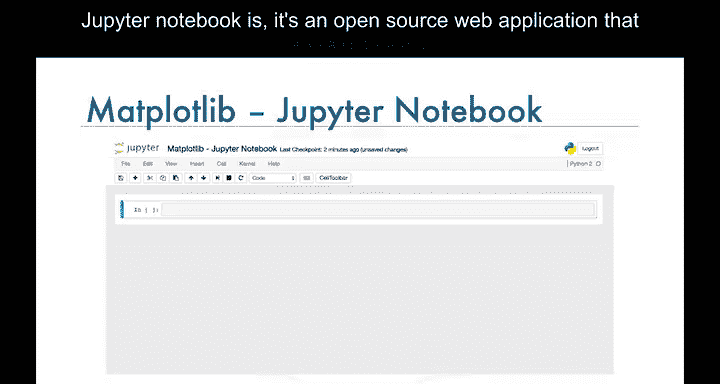

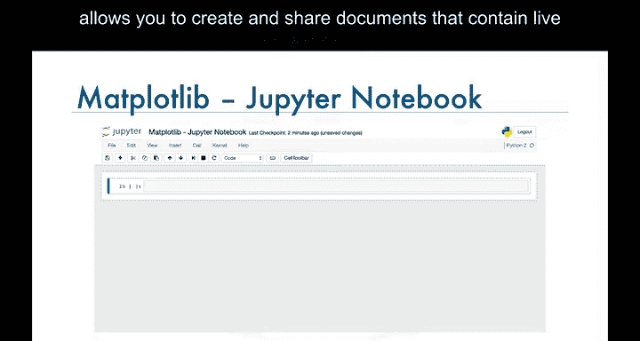

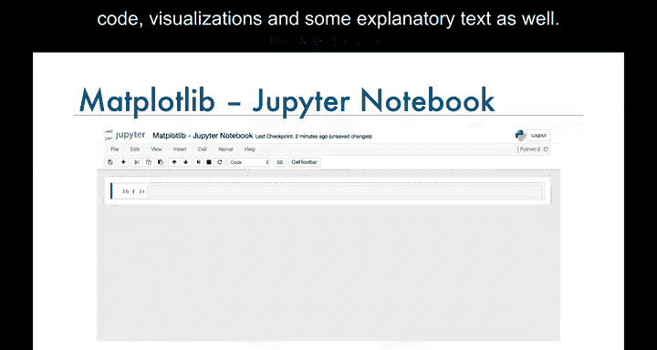

---

## 🛠️ 脚本接口


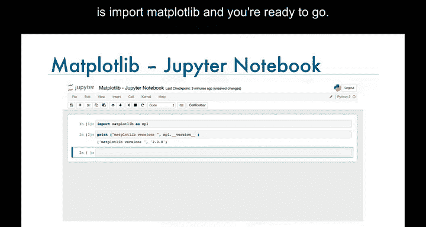

在本课程中，我们将主要使用Matplotlib的脚本接口。换句话说，我们将学习如何使用脚本接口创建几乎所有的可视化工具。


随着课程的深入，你将体会到这个接口的强大之处。你会发现，仅使用一个函数——`plot`函数，就能创建几乎所有常见的可视化工具，例如直方图、条形图、箱线图等。


---

## 📈 基础绘图示例


让我们从一个例子开始。首先，我们将脚本接口导入为`plt`。


```python
import matplotlib.pyplot as plt
```

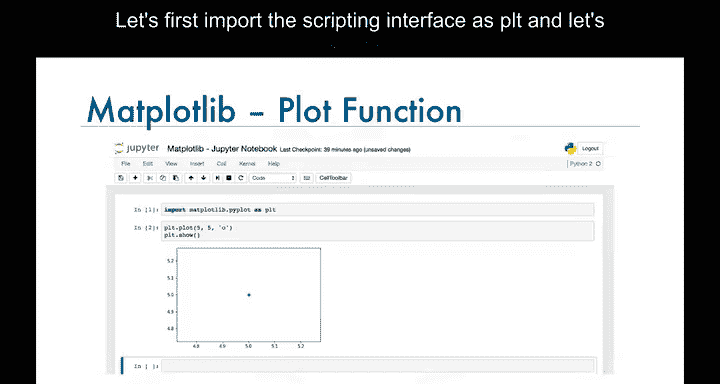

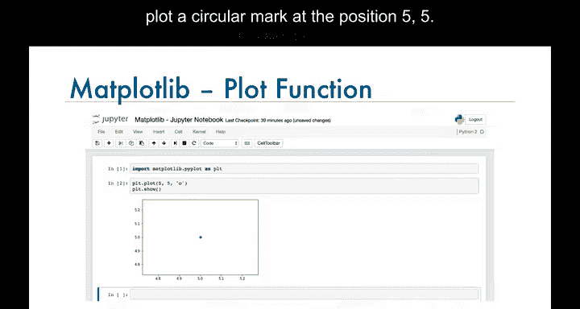

然后，我们在坐标(5,5)的位置绘制一个圆形标记。

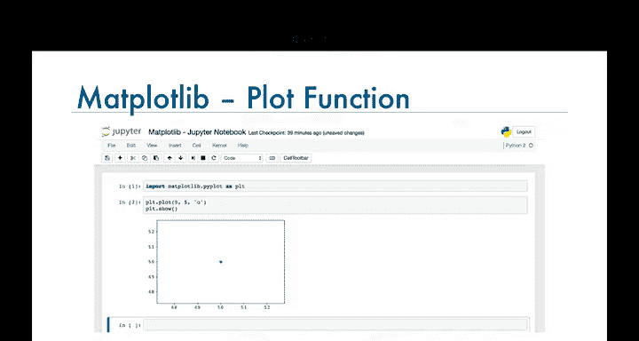

```python
plt.plot(5, 5, 'o')
plt.show()
```


请注意，图表是在浏览器中生成的，而不是在单独的窗口中。

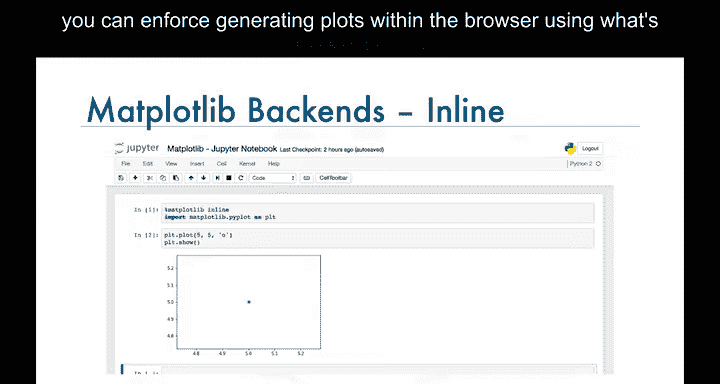

如果图表在新窗口中生成，你可以使用所谓的“魔法函数”来强制在浏览器中生成图表。魔法函数以`%`符号开头。

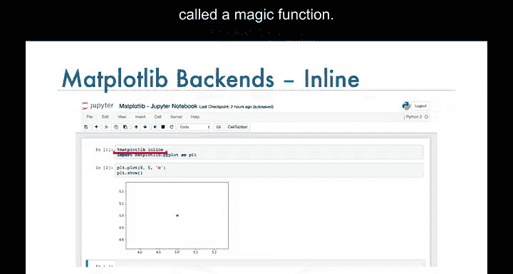

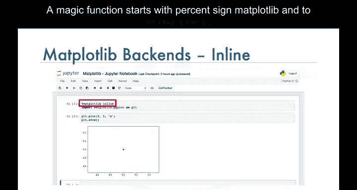

```python
%matplotlib inline
```

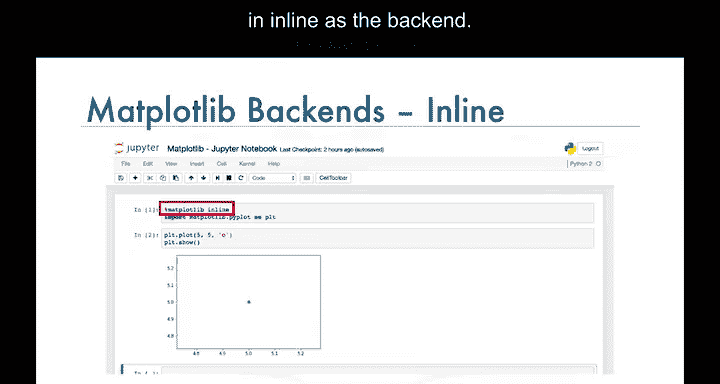

通过传入`inline`作为后端，可以强制图表在浏览器中渲染。Matplotlib有许多不同的后端可用。

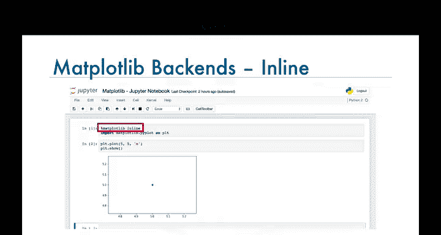

这个后端的一个限制是，一旦图表被渲染，你就无法修改它。因此，在渲染上述图表后，我们无法添加图表标题或为坐标轴添加标签。


你需要生成一个新图表，并在调用`show`函数之前添加标题和坐标轴标签。

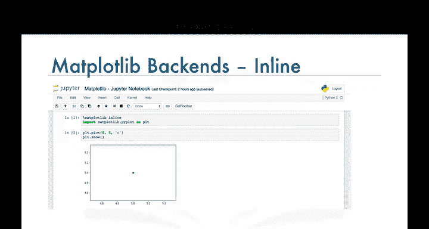

---

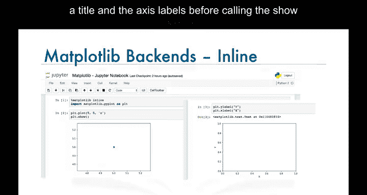

## 🔄 Notebook后端

一个克服此限制的后端是`notebook`后端。使用`notebook`后端时，如果调用`plt`函数，它会检查是否存在活动图表，你调用的任何函数都将应用于这个活动图表。

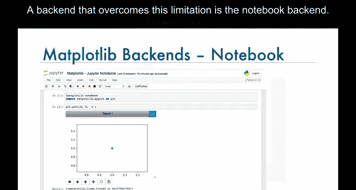


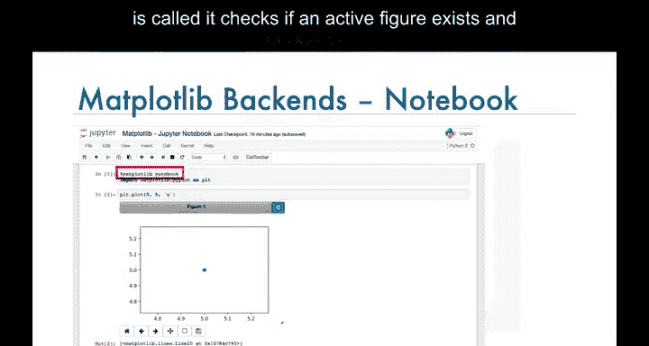

如果不存在活动图表，它会渲染一个新图表。

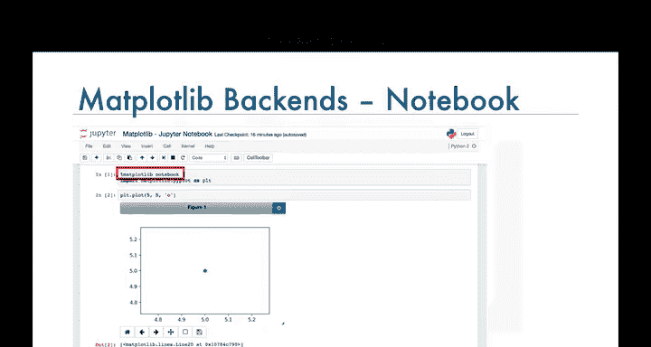

因此，当我们调用`plt.plot`函数在位置(5,5)绘制圆形标记时，后端会检查是否存在活动图表。

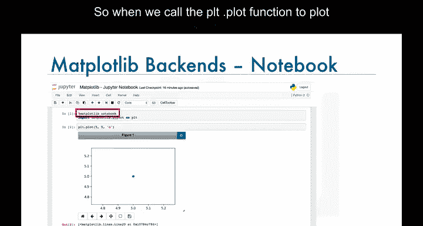

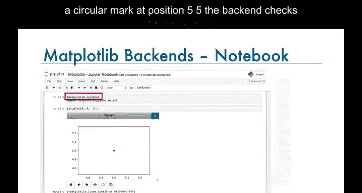

由于没有活动图表，它会生成一个图表，并在位置(5,5)添加一个圆形标记。


这个后端的美妙之处在于，我们现在可以在图表渲染后轻松添加标题或坐标轴标签，而无需重新生成图表。

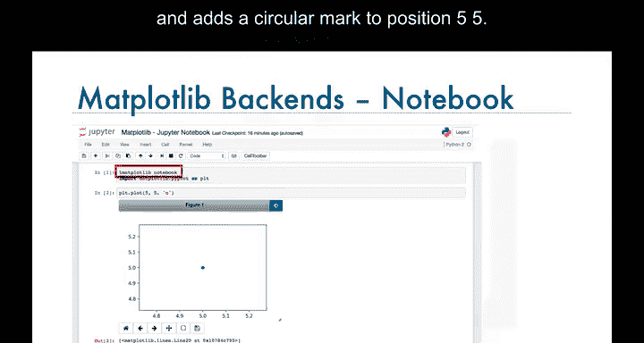

---

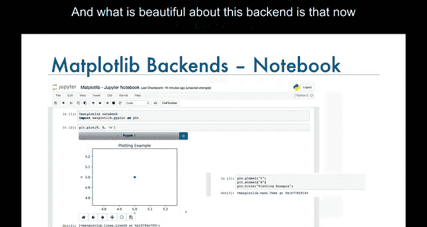

## 🤝 Matplotlib与Pandas集成


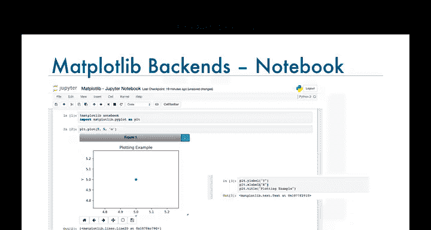

Matplotlib的另一个优点是，Pandas也内置了它的实现。


因此，在Pandas中绘图就像在给定的Pandas Series或DataFrame上调用`plot`函数一样简单。


假设我们有一个数据框，包含从1980年到1996年从印度和中国移民到加拿大的人数。


如果我们想为这些数据生成折线图，只需在这个数据框上调用`plot`函数，并将参数`kind`设置为`line`。


```python
india_china_df.plot(kind='line')
```


这样，你就得到了数据框中数据的折线图。


绘制数据的直方图也没有什么不同。假设我们想为数据框中的“India”列绘制直方图，只需在该列上调用`plot`函数，并将参数`kind`设置为`hist`（表示直方图）。

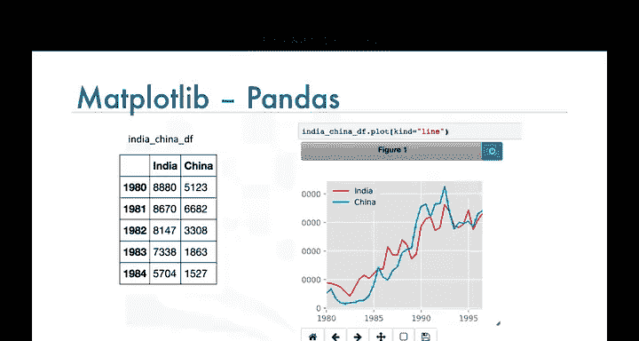

```python
india_china_df['India'].plot(kind='hist')
```

这样，你就得到了从1980年到1996年印度移民到加拿大人数的直方图。


---

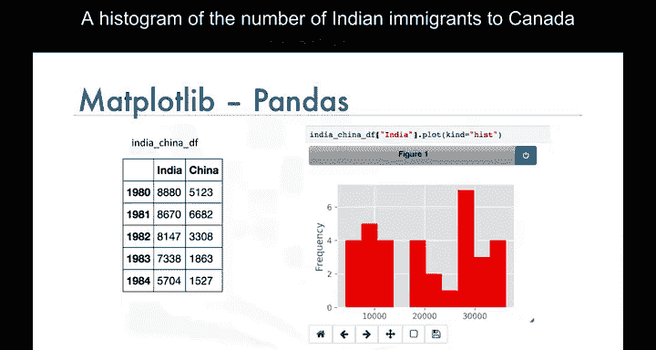

## 📝 总结


本节课我们一起学习了Matplotlib的基础绘图。我们介绍了Matplotlib库及其在Jupyter Notebook中的使用，重点讲解了脚本接口和`notebook`后端的优势。我们还演示了如何与Pandas集成，轻松创建折线图和直方图。掌握这些基础将为你后续学习更复杂的可视化技术打下坚实的基础。