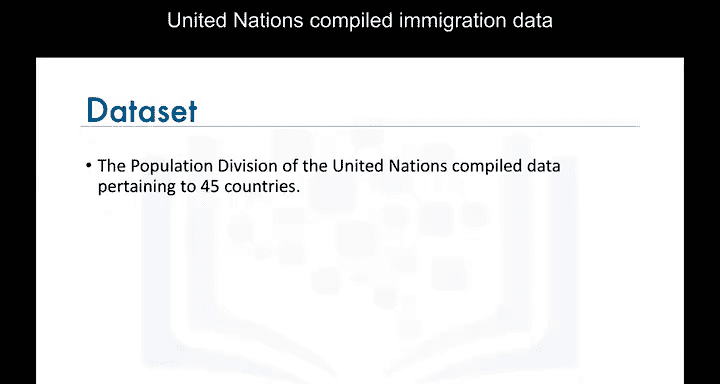
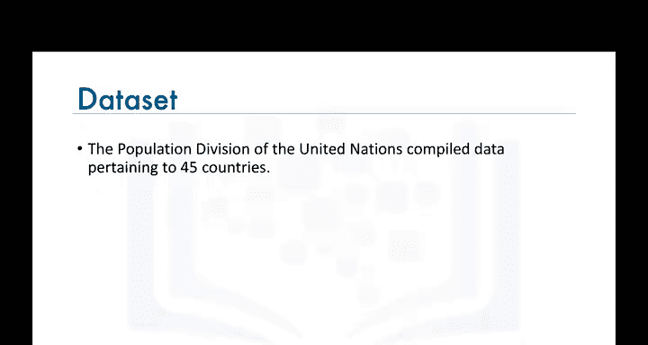
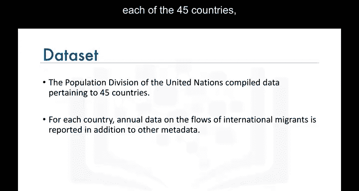
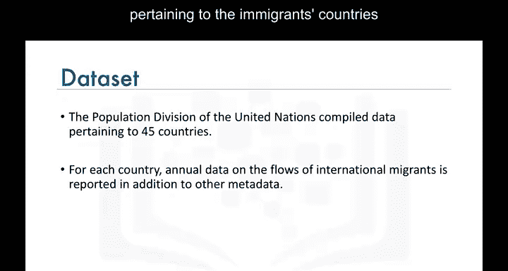
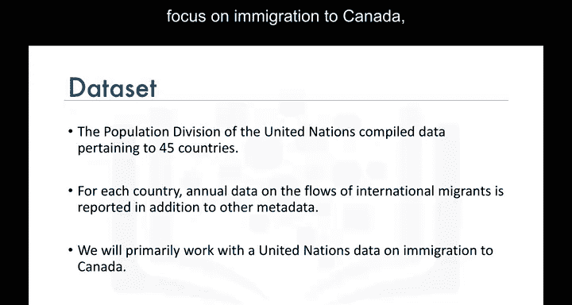
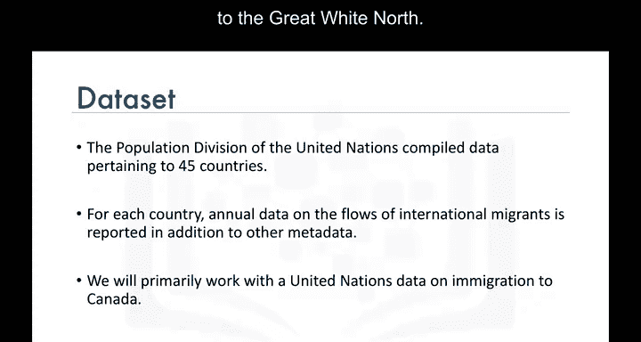
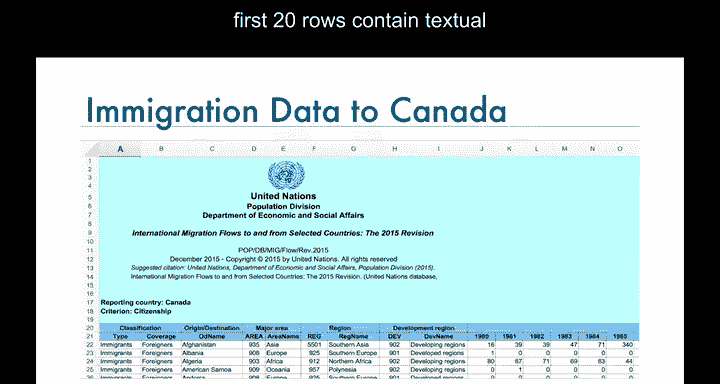
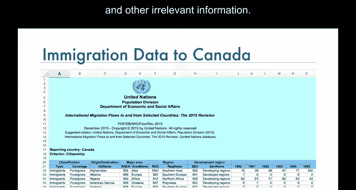
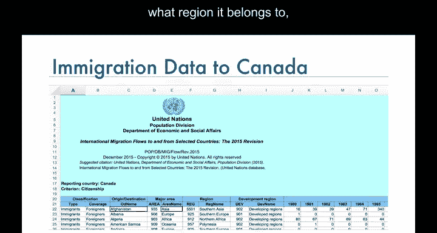
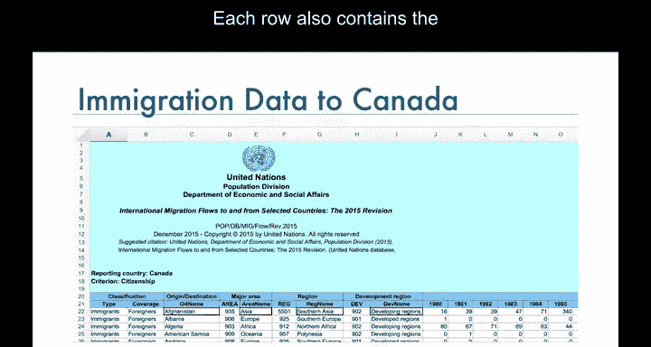

# 004：加拿大移民数据集介绍 📊


在本节课中，我们将学习本课程将使用的核心数据集——加拿大移民数据集。我们将了解数据来源、结构，并学习如何用Pandas库将其导入为DataFrame，为后续的可视化分析做好准备。

## 数据集概述 🌍

上一节我们介绍了数据可视化的重要性，本节中我们来看看我们将要使用的具体数据。





联合国人口司编制了一份涵盖45个国家的移民数据。该数据集包含了从世界各地迁移到这45个国家的移民总数，以及与移民原籍国相关的其他元数据。





在本课程中，我们将重点关注移民到加拿大的数据，并主要使用涉及“大白北”（加拿大）移民的数据集。



## 数据集结构 📁



以下是联合国加拿大移民数据的一个Excel文件快照。可以看到，前20行包含关于联合国部门和其他不相关信息的文本数据。第21行包含各列的标签。

在此之后，每一行代表一个国家，并包含关于该国家的元数据，例如它位于哪个大洲、属于哪个区域，以及该区域是发展中还是发达状态。




每一行还包含了从1980年到2013年每年从该国移民到加拿大的总人数。



## 导入数据到Pandas 🛠️



在本课程中，我们在创建任何可视化图表之前，都将使用Pandas进行数据分析。

因此，为了开始为数据创建不同类型的图表（无论是用于探索性分析还是演示），我们需要将数据导入到Pandas的DataFrame中。




以下是实现此目标所需的步骤：


首先，我们需要导入Pandas库以及XLDR库。XLDR库是提取Excel电子表格文件数据所必需的。

```python
import pandas as pd
import xlrd
```

然后，我们调用Pandas的`read_excel`函数将数据读入一个DataFrame。


```python
df_can = pd.read_excel('canada_immigration_data.xlsx', skiprows=20)
```


请注意，我们通过`skiprows=20`参数跳过了前20行，以便只读取与每个国家对应的数据行。

## 验证数据导入 ✅


如果你想确认已正确地将数据导入Pandas，可以随时使用`head`函数来显示DataFrame的前五行。

因此，如果我们在我们的DataFrame `df_can`上调用这个函数：


```python
df_can.head()
```


以下是输出结果。可以看到，`head`函数的输出看起来是正确的，列具有正确的标签，每一行代表一个国家并包含来自该国的移民总数。

## 总结 📝

本节课中我们一起学习了本课程的核心数据集——加拿大移民数据集。我们了解了它的来源和结构，并掌握了使用Pandas和xlrd库将Excel数据导入为DataFrame的关键步骤。正确导入和查看数据是进行有效数据分析和可视化的第一步。在接下来的课程中，我们将基于这个DataFrame创建各种可视化图表。