# 005：折线图绘制


在本节课中，我们将学习如何创建第一个可视化工具——折线图。折线图是数据科学中最基础的图表类型之一，广泛应用于各个领域。


## 📈 什么是折线图？

折线图由一系列数据点组成，这些点通过直线段连接。它是最基本的图表类型之一，不仅限于数据科学，在许多其他领域也很常见。

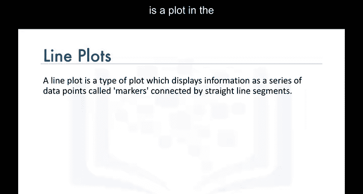

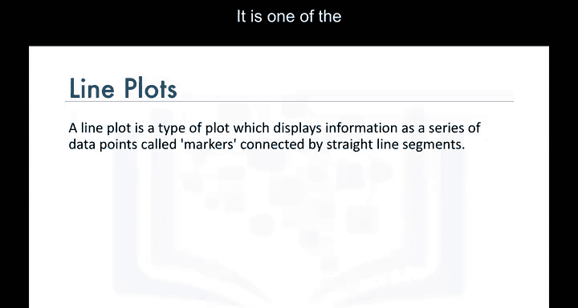

## 🕰️ 何时使用折线图？

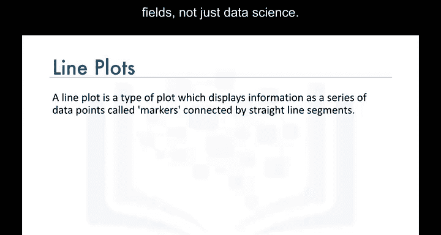

折线图最适合用于展示**连续数据集**在一段时间内的变化趋势。

例如，如果我们想了解海地移民到加拿大的趋势，可以创建一个折线图。该图表将描绘从1980年到2013年海地移民到加拿大的趋势。

基于这个折线图，我们可以研究明显异常或变化的原因。在这个例子中，我们看到2010年从海地到加拿大的移民数量出现了一个高峰。

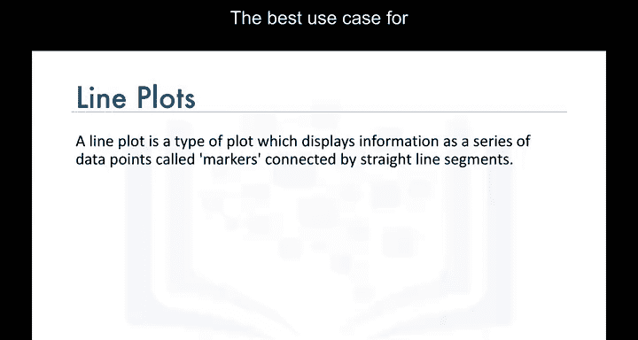

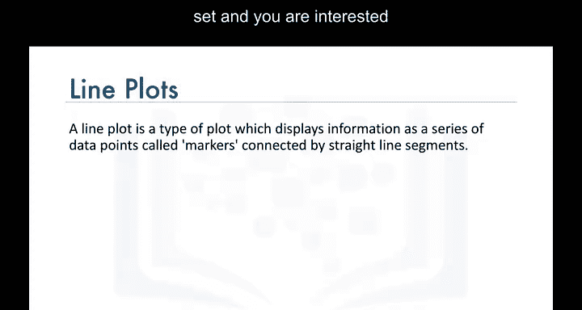

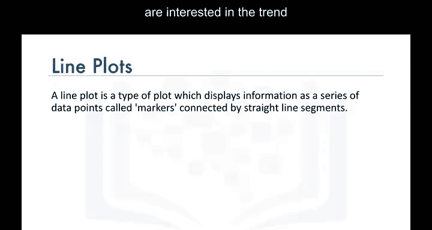

快速的网络搜索显示，2010年海地发生了一场悲惨的地震。因此，移民到加拿大的激增主要是由于那场地震。

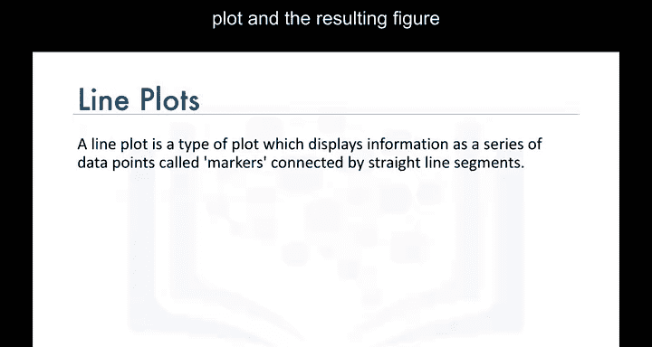

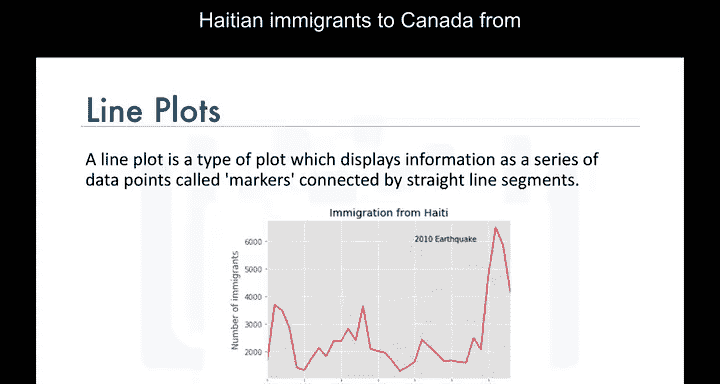

## 🗃️ 数据准备

在介绍生成折线图的代码之前，我们先快速回顾一下数据。


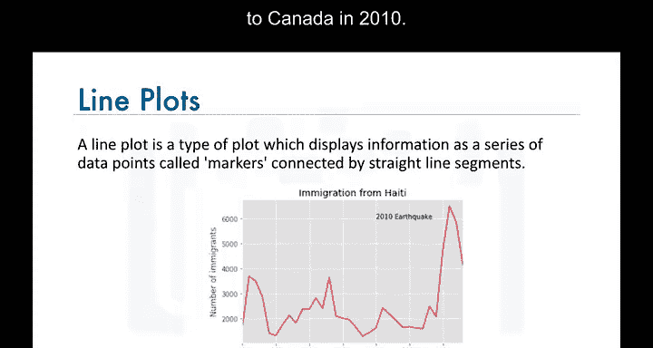

数据集中，每一行代表一个国家，包含该国家的元数据，例如地理位置以及是发展中国家还是发达国家。每一行还包含从1980年到2013年该国每年移民到加拿大的数字。

现在，我们处理数据框，使国家名称成为每一行的索引。这将使筛选特定国家变得更加容易。

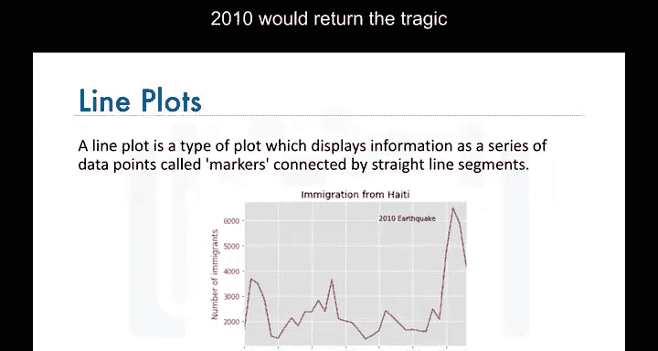

同时，我们添加一个额外的列，代表每个国家从1980年到2013年年度移民的累计总和。例如，阿富汗的总和是58，639，阿尔巴尼亚是15，699，依此类推。

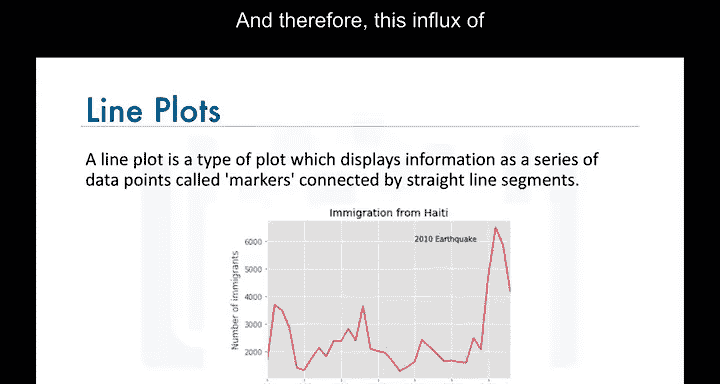

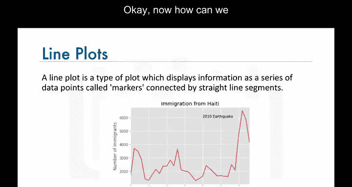

我们将这个数据框命名为 `df_canada`。

## 🖥️ 生成折线图

现在我们知道了数据是如何存储在 `df_canada` 数据框中的，接下来生成与海地移民对应的折线图。

以下是生成折线图的步骤：

首先，导入必要的库。

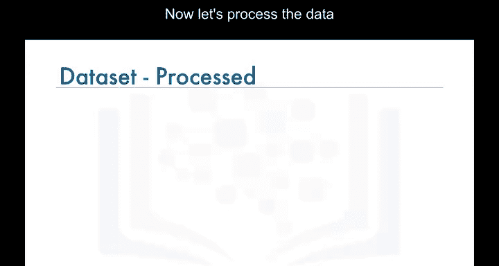

```python
import matplotlib as mpl
import matplotlib.pyplot as plt
```

然后，在海地对应的行上调用 `plot` 函数，并设置 `kind='line'` 来生成折线图。

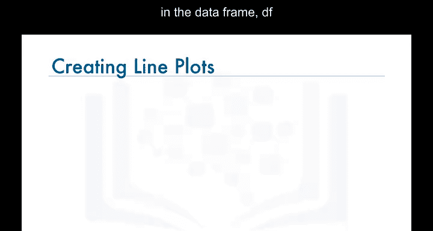

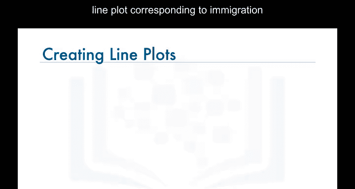

```python
years = list(map(str, range(1980, 2014)))
df_canada.loc['Haiti', years].plot(kind='line')
```


请注意，我们使用了 `years` 列表（包含从1980年到2013年的字符串格式年份）来排除我们添加的“总移民”列。

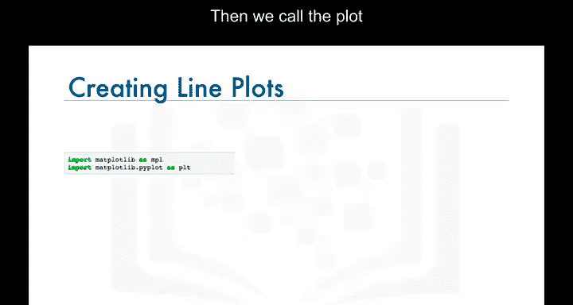

接着，为图表添加标题和坐标轴标签，以完善图形。

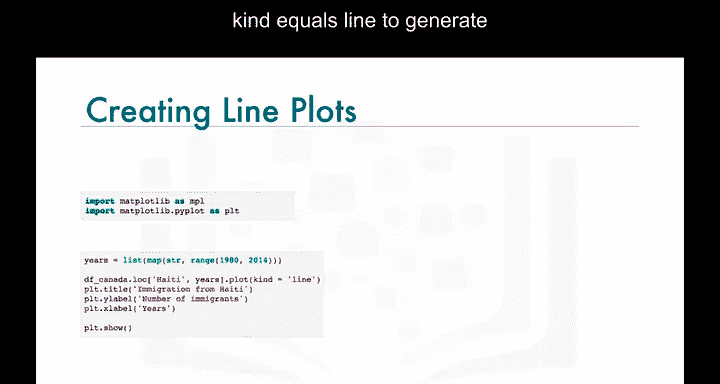

```python
plt.title('Immigration from Haiti to Canada (1980-2013)')
plt.ylabel('Number of immigrants')
plt.xlabel('Years')
```


最后，调用 `show` 函数来显示图形。

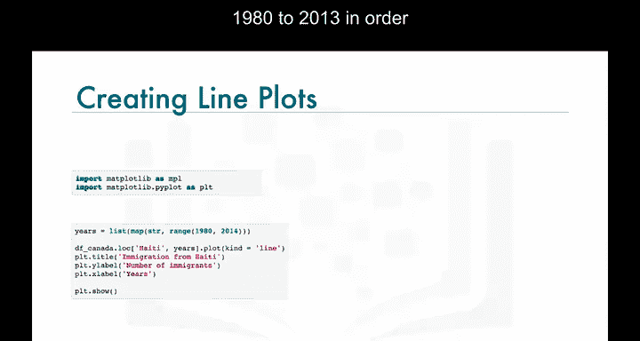


```python
plt.show()
```

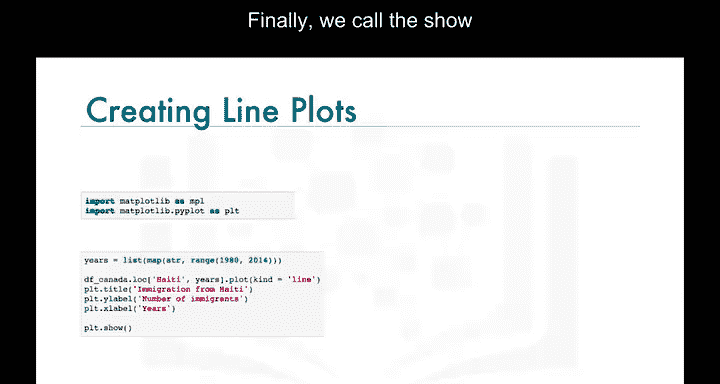

请注意，这是使用魔术函数 `%matplotlib inline` 生成折线图的代码，以便在Jupyter笔记本中内联显示图表。

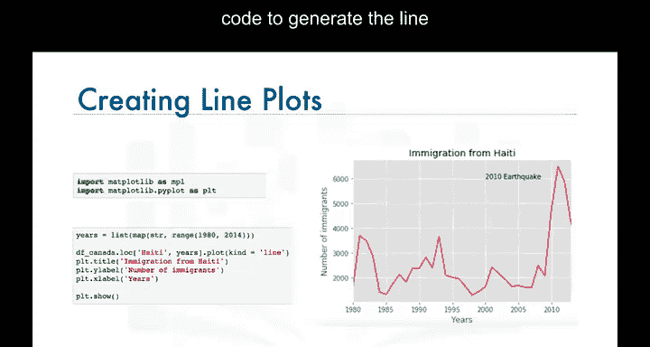

这样，我们就得到了一个描绘1980年至2013年海地移民到加拿大情况的折线图。

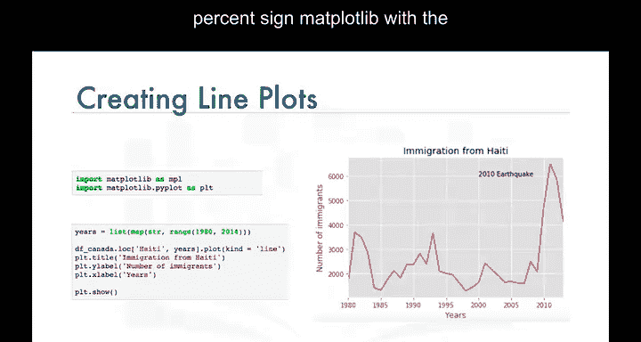

## 🧪 实验环节

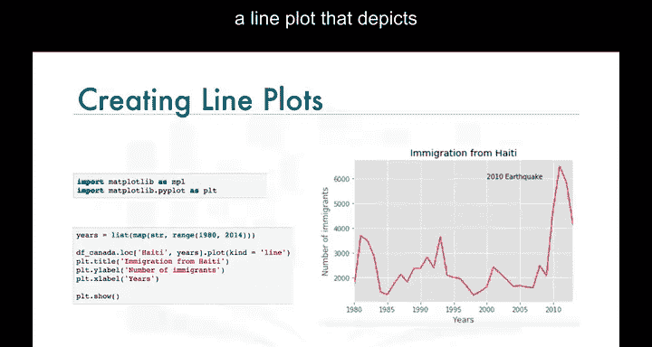

在实验环节中，我们将更详细地探索折线图，请务必完成本模块的实验部分。

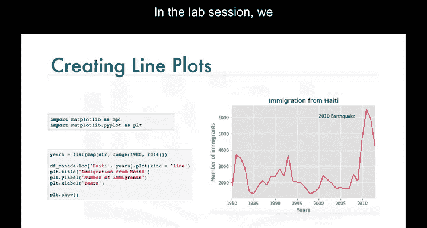

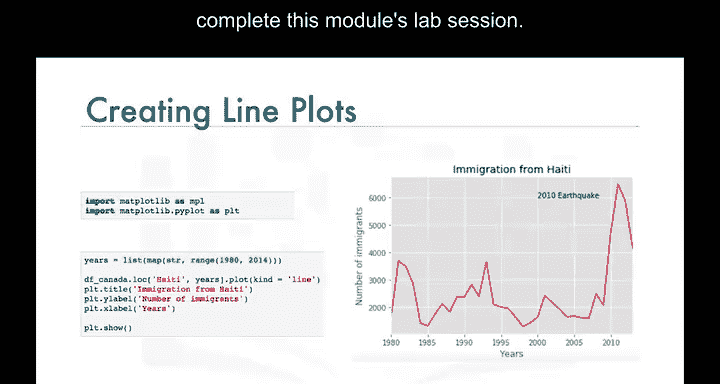

## 📝 总结

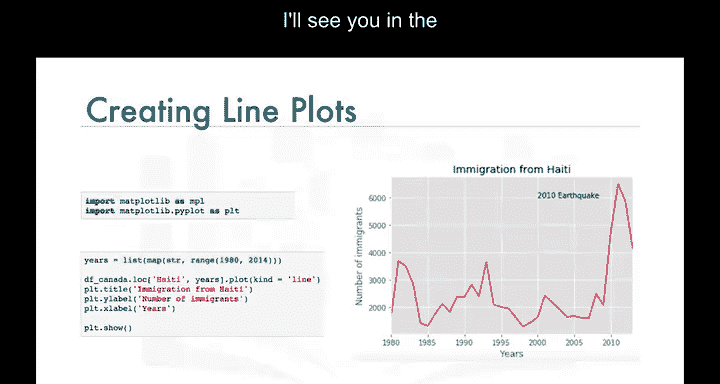

本节课我们一起学习了折线图。我们了解了折线图的基本概念、适用场景，并通过一个具体案例——海地移民到加拿大的趋势——演示了如何使用Python的Matplotlib库来创建和定制折线图。记住，折线图是展示时间序列数据趋势的强大工具。