# 006：面积图绘制


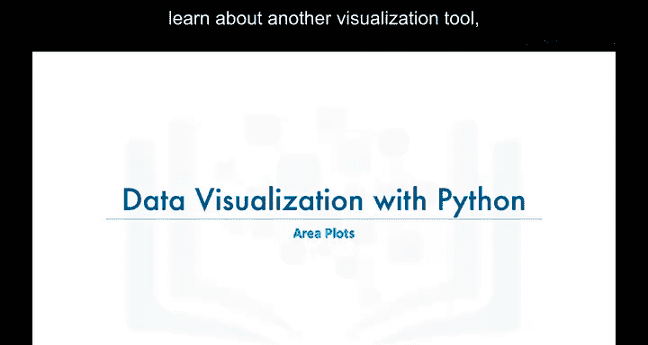

在本节课中，我们将学习另一种数据可视化工具——面积图。面积图实际上是之前学过的折线图的扩展，常用于比较两个或多个数量随时间变化的累积趋势。


## 什么是面积图？


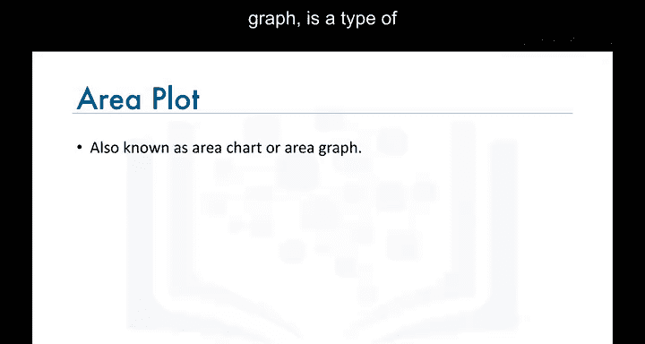

面积图，也称为面积图表，是一种使用数字或百分比随时间变化来描绘累积总量的图表类型。它基于折线图，通常用于比较两个或多个数量。

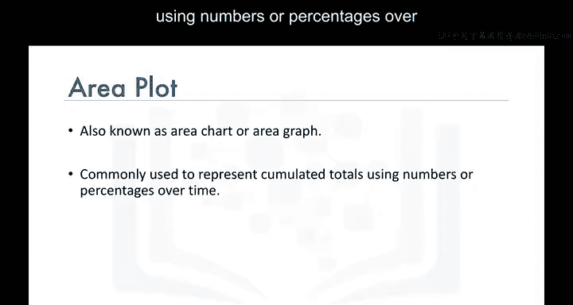

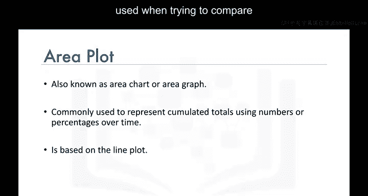

## 数据集回顾

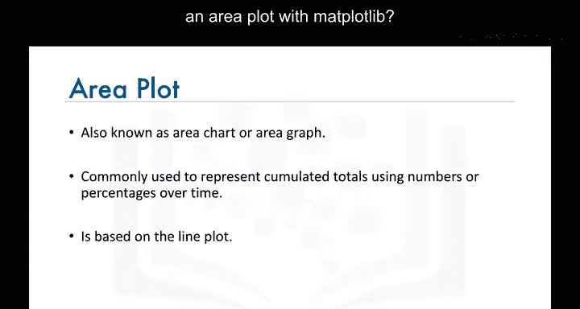

在编写代码生成面积图之前，我们先快速回顾一下数据集。数据集中的每一行代表一个国家，包含该国的元数据，如地理位置、发展状态等。每一行还包含从1980年到2013年该国每年移民到加拿大的人数。

为了让数据更易于处理，我们将国家名称设置为每行的索引，并添加一个新列，表示从1980年到2013年每个国家的年度移民累积总和。我们将这个数据框命名为 `df_canada`。


## 生成面积图的步骤

现在我们已经了解了数据在数据框 `df_canada` 中的存储方式，接下来尝试为移民到加拿大人数最多的国家生成面积图。

### 1. 找出移民人数最多的国家


我们可以通过按1980年至2013年累积移民总数降序排序数据框来找出这些国家。以下是排序的代码：


```python
df_canada.sort_values(by='Total', ascending=False)
```

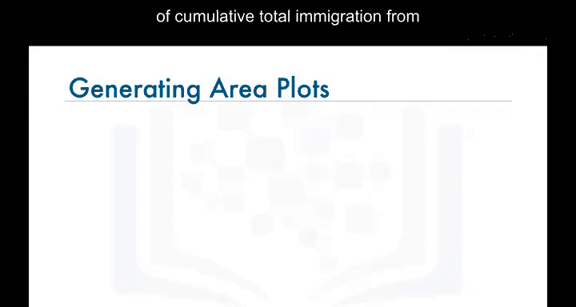

排序结果显示，印度、中国、英国、菲律宾和巴基斯坦是移民到加拿大人数最多的五个国家。

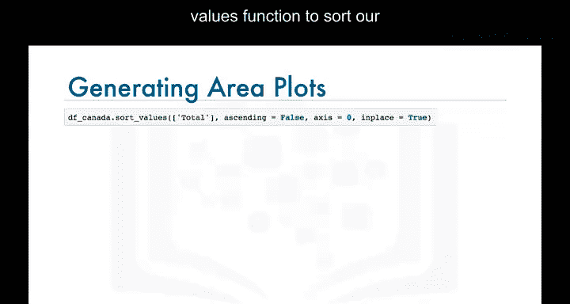

### 2. 准备数据框

为了生成这些国家的面积图，我们需要创建一个仅包含这五个国家的新数据框，并排除“Total”列。更重要的是，我们需要将年份绘制在横轴上，将年度移民人数绘制在纵轴上。

由于Matplotlib默认将数据框的索引绘制在横轴上，而当前数据框的索引是国家名称，因此我们需要对数据框进行转置。以下是准备数据框的步骤：

```python
# 创建包含前五个国家的新数据框
df_top_five = df_canada.head(5)

# 选择1980年至2013年的列，排除Total列
df_top_five = df_top_five.loc[:, '1980':'2013']

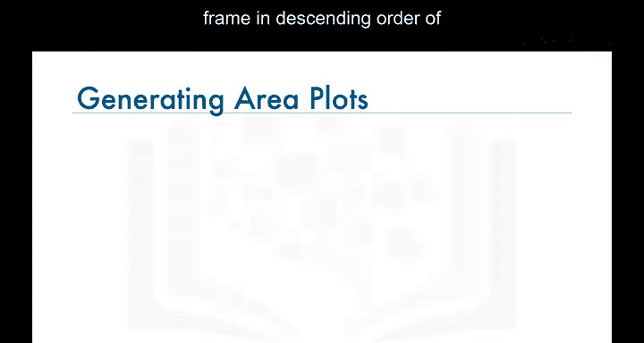


# 转置数据框
df_top_five = df_top_five.transpose()
```

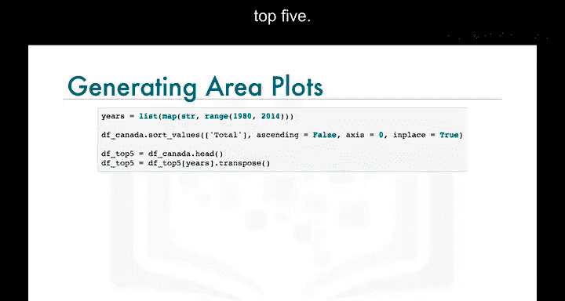


转置后的数据框包含五列，每列代表一个前五名的国家，年份作为索引。

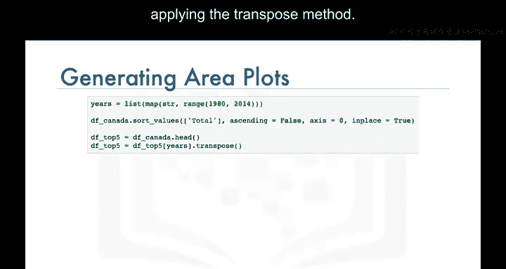

### 3. 生成面积图

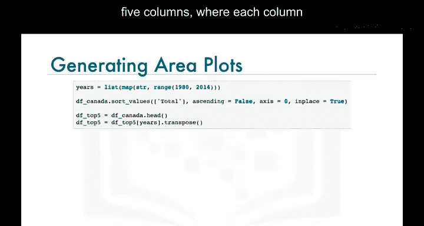

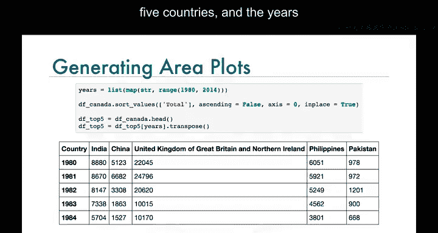

现在我们可以调用数据框 `df_top_five` 的 `plot` 函数来生成面积图。以下是生成面积图的代码：

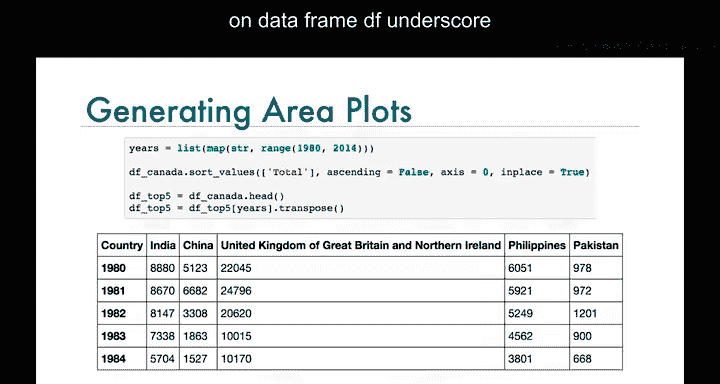

```python
import matplotlib.pyplot as plt

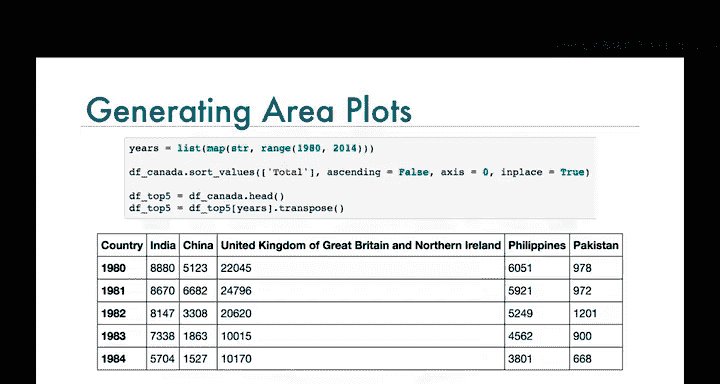


# 生成面积图
df_top_five.plot(kind='area')


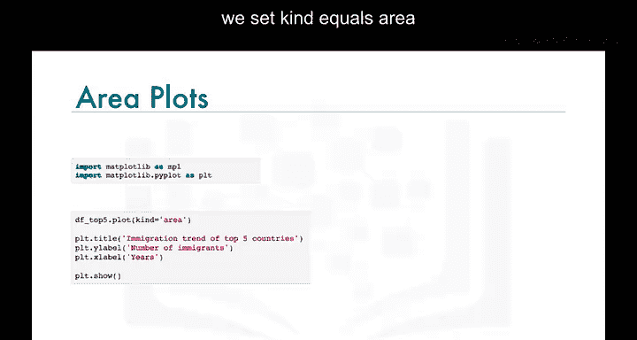

# 添加标题和轴标签
plt.title('Immigration Trend of Top 5 Countries to Canada (1980-2013)')
plt.xlabel('Year')
plt.ylabel('Number of Immigrants')

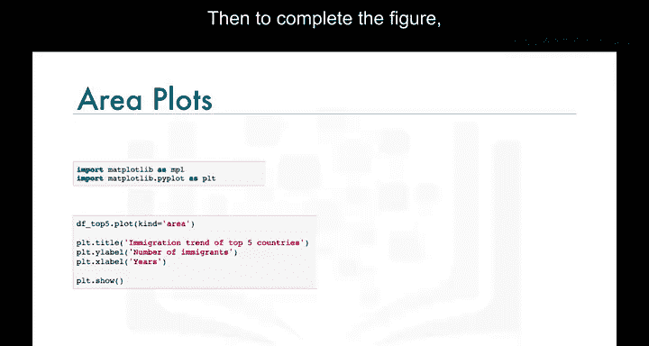

# 显示图表
plt.show()
```


注意，这里我们使用内联后端生成面积图。生成的面积图描绘了从1980年到2013年移民到加拿大人数最多的五个国家的移民趋势。


## 总结

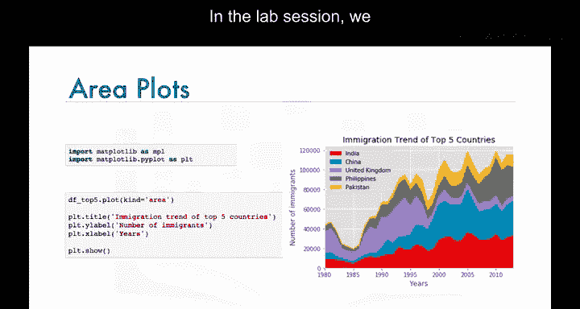

在本节课中，我们一起学习了面积图的基本概念和生成方法。面积图是折线图的扩展，适用于比较多个数量的累积趋势。通过排序数据框、选择特定列、转置数据框并使用Matplotlib的 `plot` 函数，我们可以轻松生成面积图。在实验环节中，我们将进一步探索面积图的细节，请务必完成本模块的实验部分。

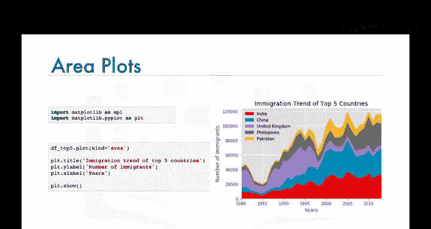


下节课再见！