# 007：直方图绘制


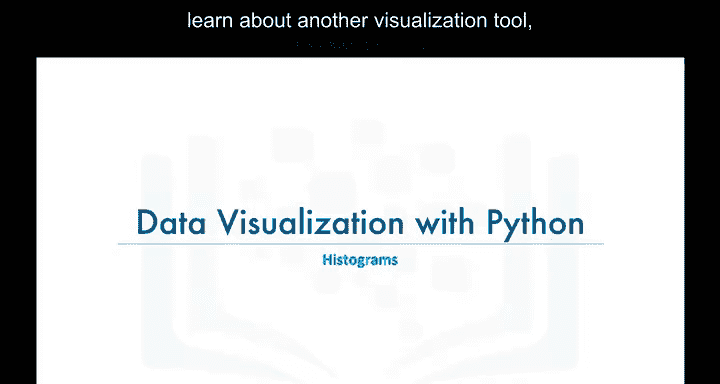

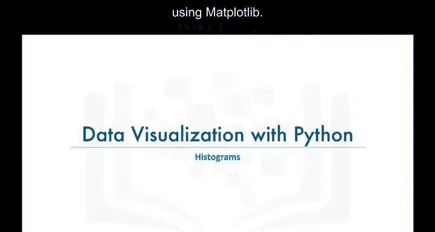

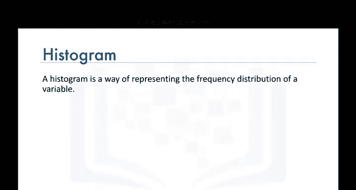

在本节课中，我们将学习另一种数据可视化工具——直方图。我们将了解直方图的定义、工作原理，并学习如何使用Matplotlib库来创建直方图。

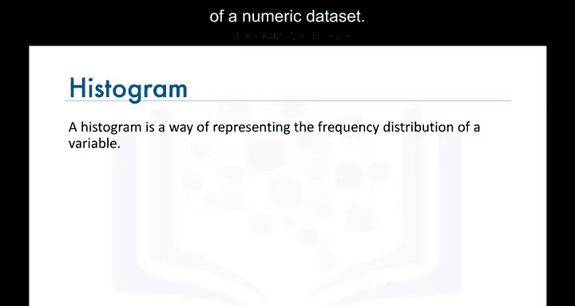


## 📈 什么是直方图？

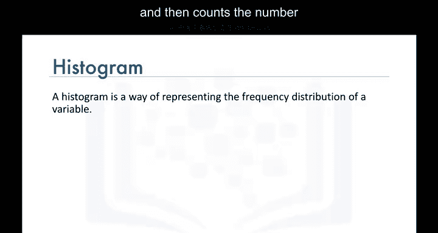

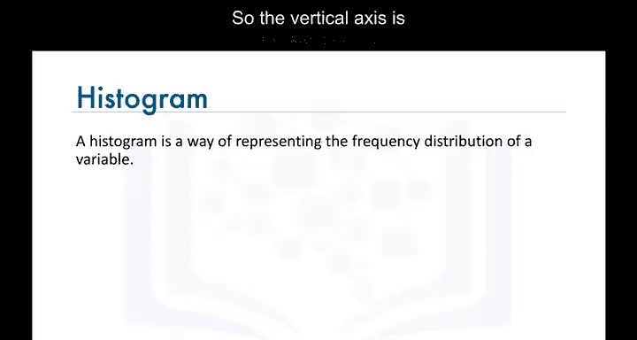

直方图是一种用于表示数值数据集频率分布的图表。它的工作原理是将数值数据的范围划分为若干个区间（称为“箱”），将数据集中的每个数据点分配到一个箱中，然后计算每个箱中数据点的数量。

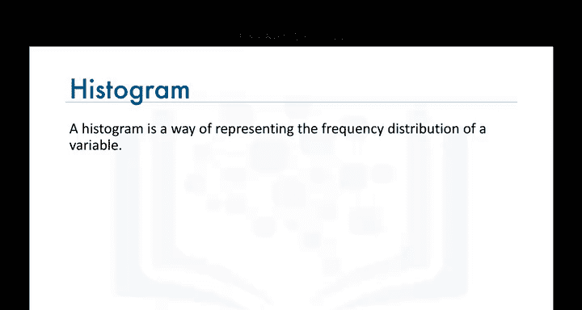

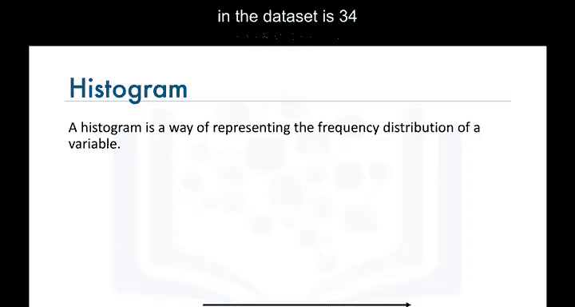

**公式**：`频率 = 每个箱中的数据点数量`

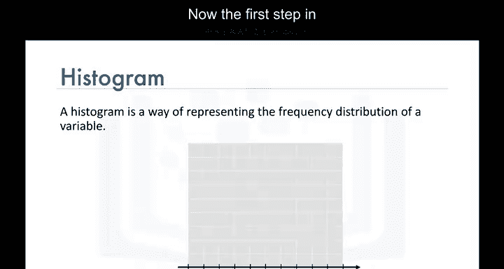

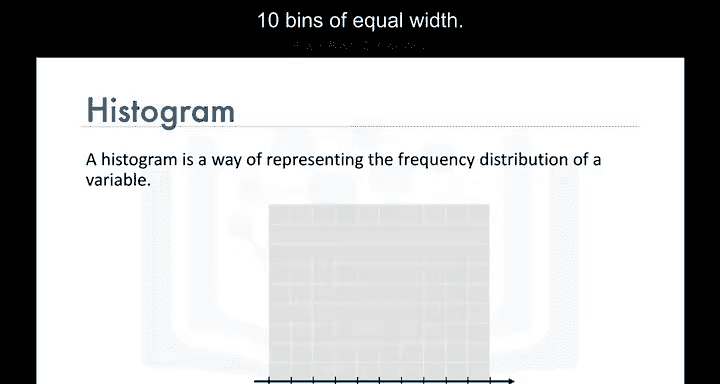

例如，假设数据集中数值的范围是0到34,129。创建直方图的第一步是将水平轴划分为10个等宽的箱。然后，我们通过计算有多少数据点的值落在第一个箱、第二个箱、第三个箱等范围内来构建直方图。

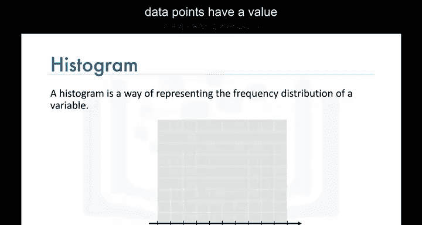

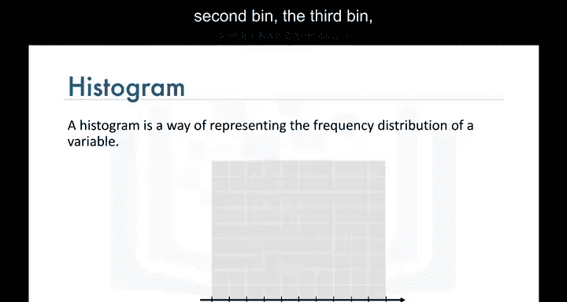

## 🛠️ 使用Matplotlib创建直方图

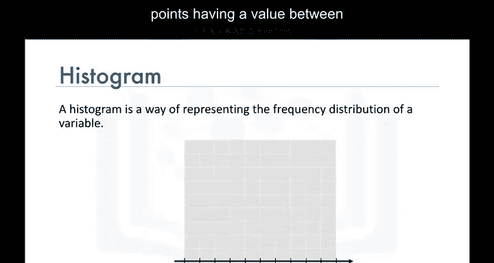

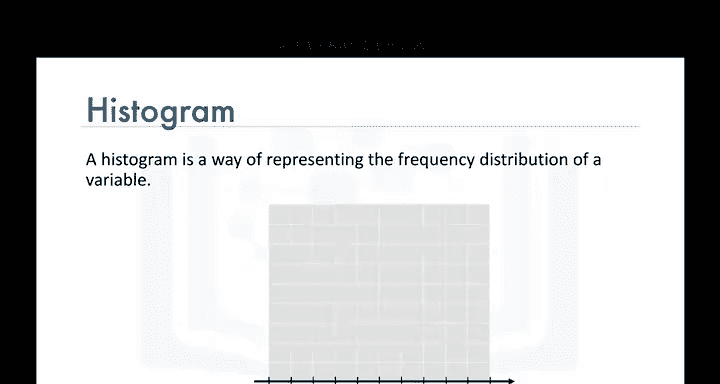

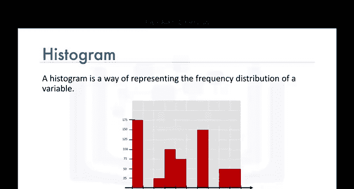

上一节我们介绍了直方图的基本概念，本节中我们来看看如何使用Matplotlib库来创建直方图。


首先，我们需要导入必要的库并准备数据集。数据集中的每一行代表一个国家，包含该国的元数据以及从1980年到2013年每年移民到加拿大的数量。我们将国家名称设置为每行的索引，并添加一个表示从1980年到2013年累计移民数量的列。

以下是创建直方图的步骤：

1. 导入Matplotlib库及其脚本接口。
2. 调用绘图函数，指定要绘制的数据列（例如2013年的移民数据），并设置图表类型为直方图。
3. 为图表添加标题和坐标轴标签。
4. 显示图表。

**代码示例**：
```python
import matplotlib.pyplot as plt


# 假设df_canada是包含2013年移民数据的数据框
df_canada['2013'].plot(kind='hist')
plt.title('2013年移民到加拿大的分布')
plt.xlabel('移民数量')
plt.ylabel('频率')
plt.show()
```


## 🔧 优化直方图显示


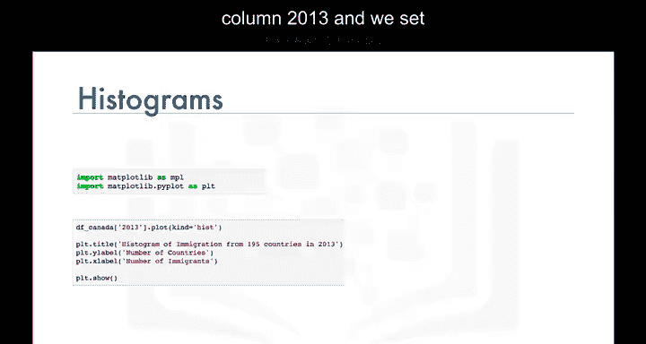

然而，使用上述方法创建的直方图可能会遇到箱边界与水平轴刻度不对齐的问题，这会影响图表的可读性。为了解决这个问题，我们可以使用NumPy库的`histogram`函数来更精确地控制箱的划分。

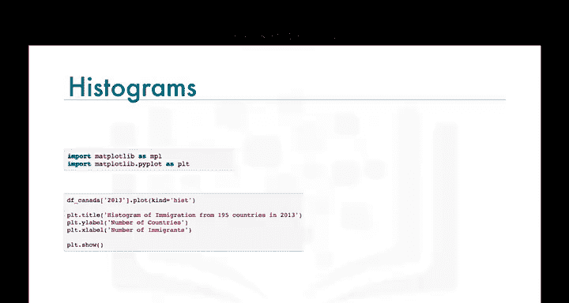

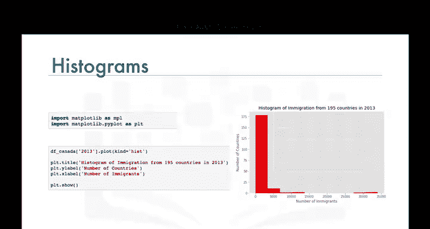

以下是优化直方图的步骤：

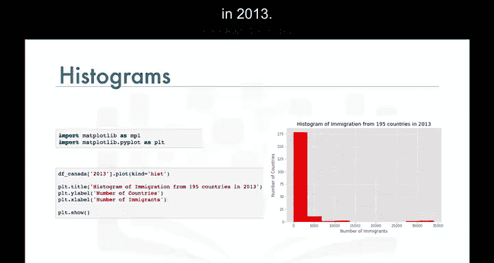

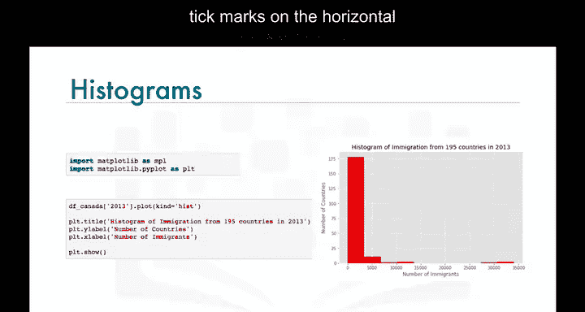

1. 导入Matplotlib和NumPy库。
2. 使用NumPy的`histogram`函数计算数据的频率和箱边界。
3. 将这些箱边界作为参数传递给绘图函数，生成对齐的直方图。

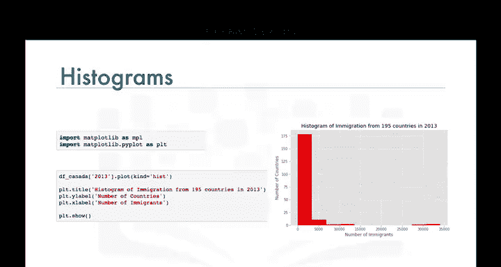


**代码示例**：
```python
import matplotlib.pyplot as plt
import numpy as np


# 计算频率和箱边界
count, bin_edges = np.histogram(df_canada['2013'])


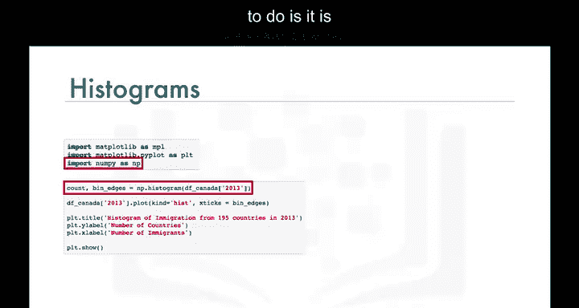


# 绘制直方图
df_canada['2013'].plot(kind='hist', xticks=bin_edges)
plt.title('2013年移民到加拿大的分布（优化后）')
plt.xlabel('移民数量')
plt.ylabel('频率')
plt.show()
```

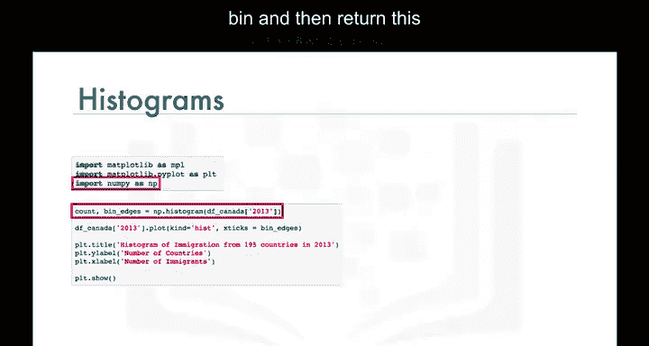

通过这种方式，我们可以生成一个箱边界与水平轴刻度对齐的直方图，使其更加清晰易读。

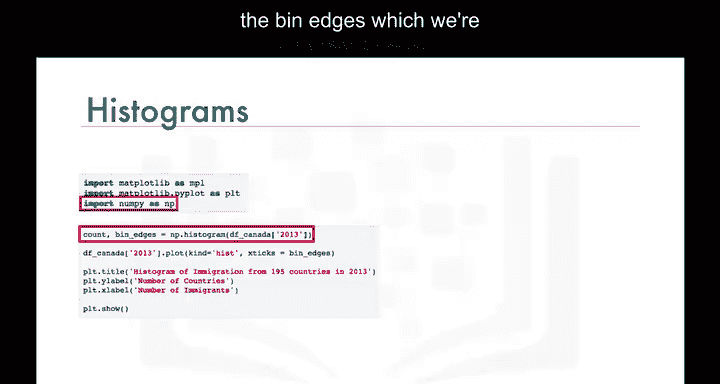

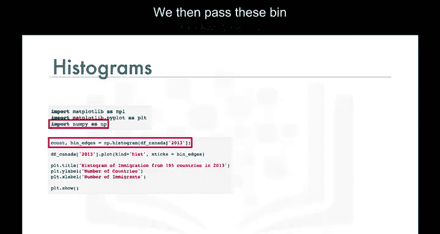

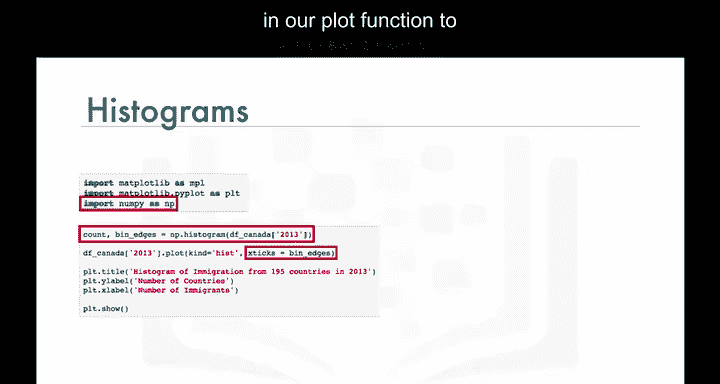

## 📚 总结

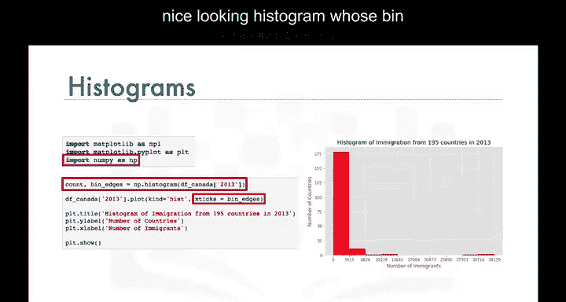

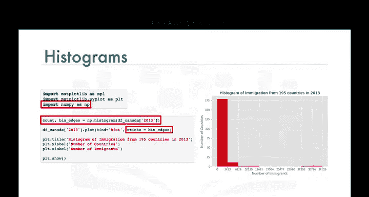

本节课中我们一起学习了直方图的定义、工作原理以及如何使用Matplotlib和NumPy库来创建和优化直方图。直方图是分析数值数据分布的重要工具，通过合理划分箱和优化显示，我们可以更有效地展示数据的频率分布。

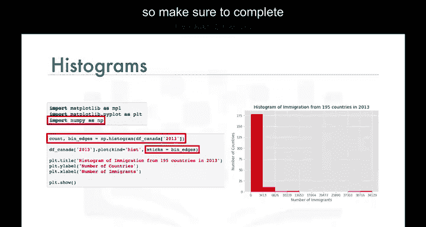

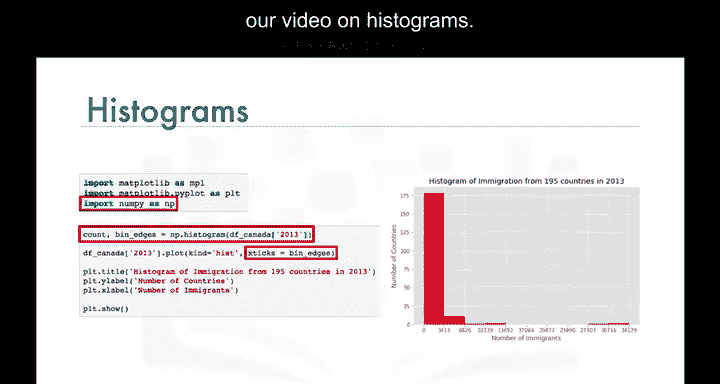

在实验环节中，我们将进一步探索直方图的更多细节，请务必完成本模块的实验部分。希望本节课的内容能帮助你更好地理解和应用直方图。我们下节课再见！