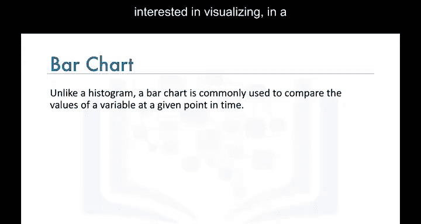
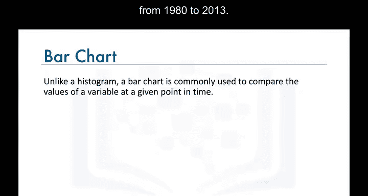
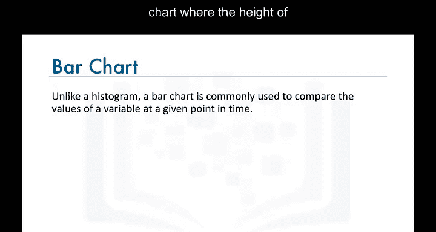
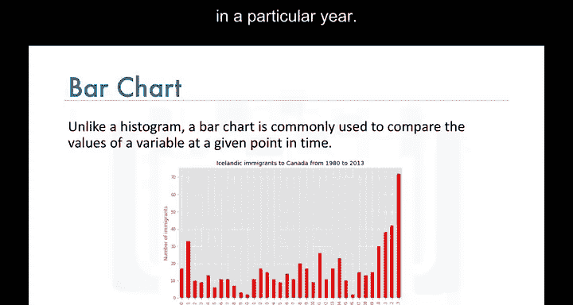
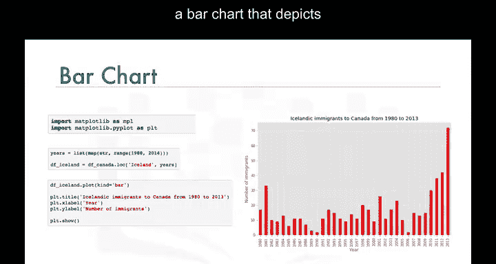

# 008：条形图绘制教程


在本节课中，我们将学习一种额外的可视化工具——条形图，并了解如何使用Matplotlib库创建条形图。


---


## 📈 条形图简介


上一节我们介绍了数据可视化的基本概念，本节中我们来看看条形图。

条形图是一种非常流行的可视化工具。与直方图不同，条形图（也称为柱状图）是一种图表类型，其中每个条形的长度与其所代表项目的值成比例。它通常用于比较在特定时间点上某个变量的值。

例如，假设我们想以离散的方式可视化从1980年到2013年从冰岛到加拿大的移民情况。


一种方法是构建一个条形图，其中条形的高度代表特定年份从冰岛到加拿大的总移民人数。

---





## 🗃️ 数据准备

在介绍如何使用Matplotlib绘制条形图之前，我们先快速回顾一下我们的数据集。



数据集中的每一行代表一个国家，并包含有关该国家的元数据，例如其地理位置以及它是发展中国家还是发达国家。每一行还包含从1980年到2013年每年从该国到加拿大的移民数字。



现在，让我们处理数据框，使国家名称成为每一行的索引，这将使检索特定国家的数据行变得更加容易。此外，我们添加一个额外的列，代表从1980年到2013年每个国家年度移民的累计总和。

例如，对于阿富汗，总数是58，639；对于阿尔巴尼亚，总数是15，699，依此类推。我们将这个数据框命名为`df_canada`。

现在我们已经了解了数据是如何存储在`df_canada`数据框中的，接下来看看如何使用Matplotlib生成条形图，以可视化从1980年到2013年从冰岛到加拿大的移民情况。

---

## 🖥️ 使用Matplotlib绘制条形图

以下是使用Matplotlib绘制条形图的步骤。

首先，我们导入Matplotlib及其脚本接口。

```python
import matplotlib.pyplot as plt
```

然后，我们使用年份变量创建一个新的数据框，我们将其命名为`df_iceland`，其中包含与从冰岛到加拿大的年度移民相关的数据，并排除“总计”列。

```python
years = list(range(1980, 2014))
df_iceland = df_canada.loc['Iceland', years]
```


接着，我们在`df_iceland`上调用绘图函数，并设置`kind='bar'`以生成条形图。


```python
df_iceland.plot(kind='bar')
```

为了完善图形，我们为其添加标题并标注坐标轴。

```python
plt.title('Immigration from Iceland to Canada (1980-2013)')
plt.xlabel('Year')
plt.ylabel('Number of Immigrants')
```


最后，我们调用`show`函数来显示图形。


```python
plt.show()
```

这样，我们就得到了一个描绘从1980年到2013年从冰岛到加拿大移民情况的条形图。

---


## 🔍 解读条形图



通过检查条形图，我们注意到自2010年以来，从冰岛到加拿大的移民呈上升趋势。

我相信好奇的你已经想知道这种上升趋势背后的原因了。在实验环节中，我们揭示了原因，并学习了如何创建带有水平条形的条形图，因此请务必完成本模块的实验环节。

---

## 📝 总结

本节课中我们一起学习了条形图的基本概念、数据准备步骤以及如何使用Matplotlib库绘制条形图。条形图是用于比较类别数据的强大工具，通过本课的学习，你应该能够创建并解读基本的条形图。

我们下节课再见。