# 009：饼图绘制


在本节课中，我们将学习另一种数据可视化工具——饼图，并掌握如何使用Matplotlib库来创建它。

饼图是一种圆形统计图表，通过分割成若干扇形来展示数值比例。例如，2015年加拿大联邦选举的饼图显示，自由党（红色部分）赢得了超过50%的众议院席位，因此红色占据了圆形的一半以上。

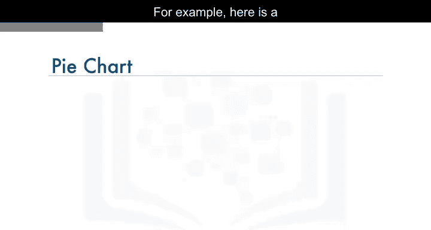

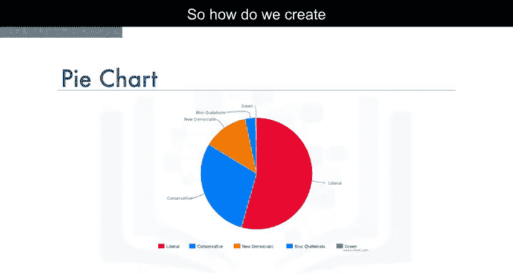

## 数据集回顾

在开始编写代码之前，我们先快速回顾一下数据集。数据集中的每一行代表一个国家，包含该国的元数据（如地理位置、发展状况）以及从1980年到2013年每年移民到加拿大的数量。

为了让数据检索更便捷，我们将国家名称设置为每行的索引，并新增一列，用于记录每个国家从1980年到2013年的累计移民总数。例如，阿富汗的累计移民总数为58,639，阿尔巴尼亚为15,699。我们将这个处理后的数据框命名为`df_canada`。

## 按大洲分组数据

假设我们希望按大洲可视化移民到加拿大的分布情况。第一步是使用`Continent`列将数据按大洲分组。我们使用pandas的`groupby`函数对`df_canada`进行分组，并对属于同一大洲的国家的移民数量进行求和。

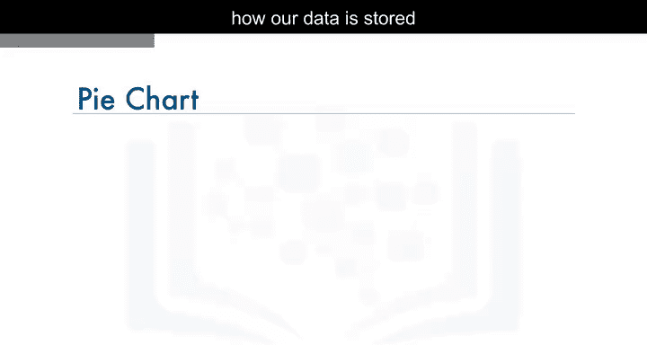


以下是分组后的数据框，我们将其命名为`df_continents`。该数据框包含6行（每个大洲一行）和35列（代表1980年至2013年的年份，以及每个大洲的累计移民总数）。

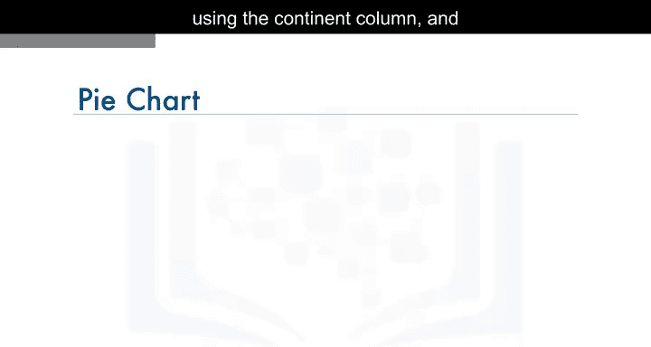

## 创建饼图

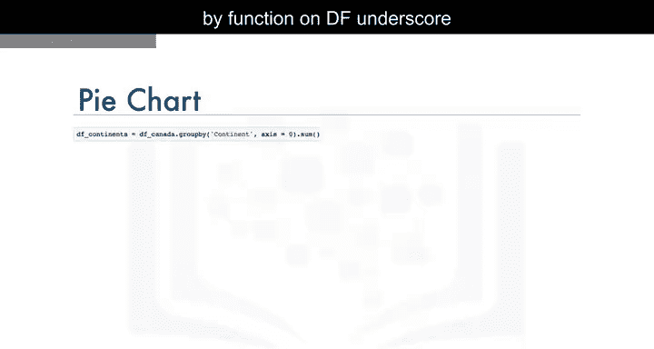

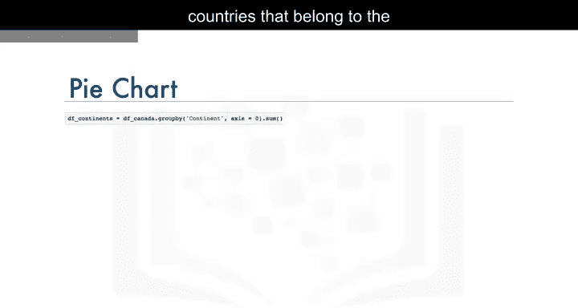

现在，我们开始创建饼图。首先，导入必要的库：

```python
import matplotlib as mpl
import matplotlib.pyplot as plt
```

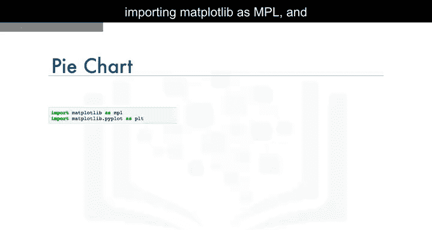

接着，调用`df_continents`数据框中`Total`列的`plot`函数，并设置`kind='pie'`以生成饼图：

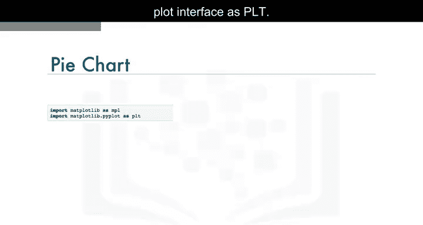

```python
df_continents['Total'].plot(kind='pie')
```

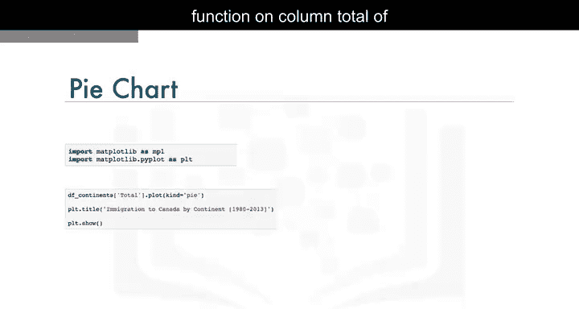

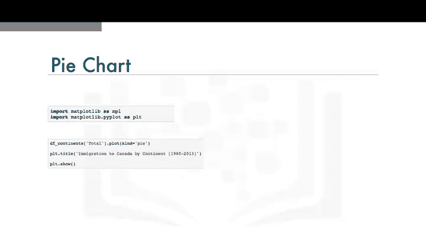

然后，为图表添加标题，并调用`show`函数显示图表：

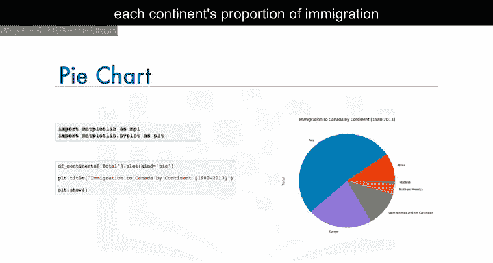

```python
plt.title('Immigration to Canada by Continent (1980-2013)')
plt.show()
```

至此，我们成功创建了一个饼图，展示了1980年至2013年各洲移民到加拿大的比例。

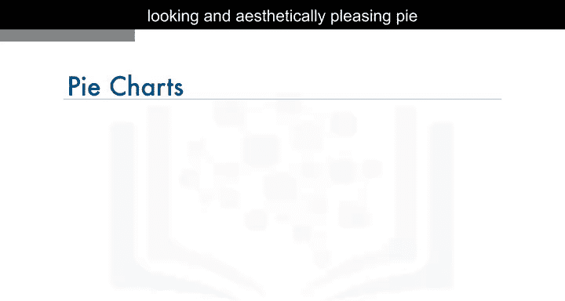

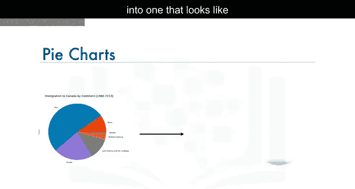

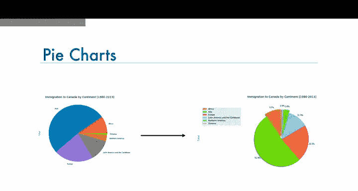

## 饼图的局限性

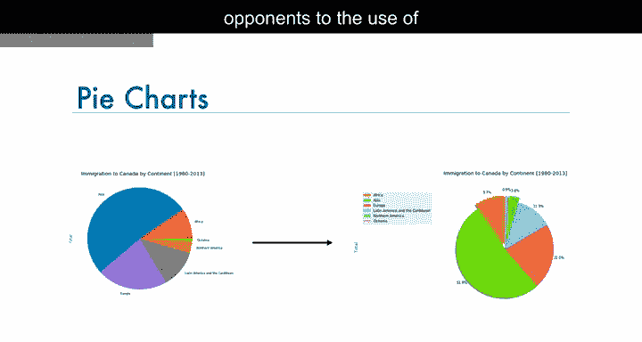

需要指出的是，饼图在某些情况下存在争议。许多反对者认为饼图难以准确、一致地展示数据。相比之下，条形图在呈现数据一致性和传达信息方面更为有效。

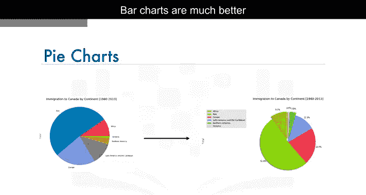

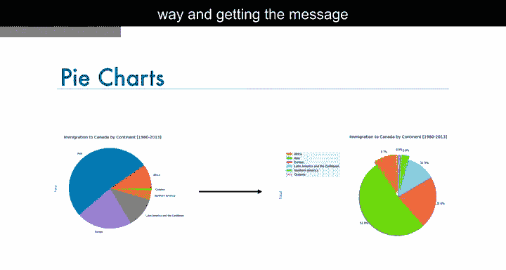

如果你对反对饼图的论点感兴趣，可以参考视频下方链接中的文章，该文章详细讨论了饼图的缺陷。

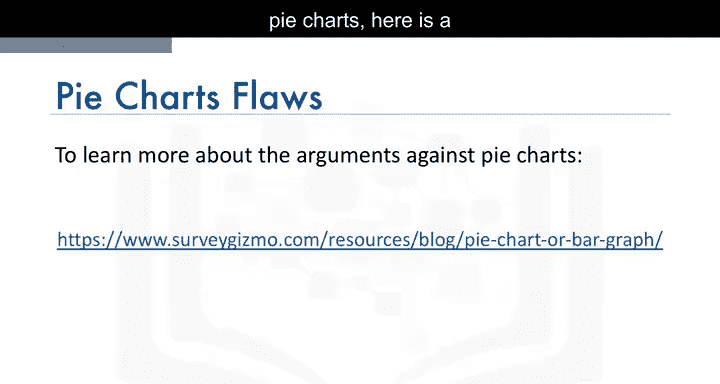

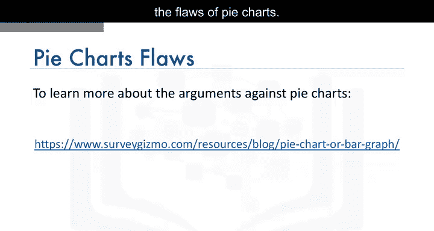

## 总结

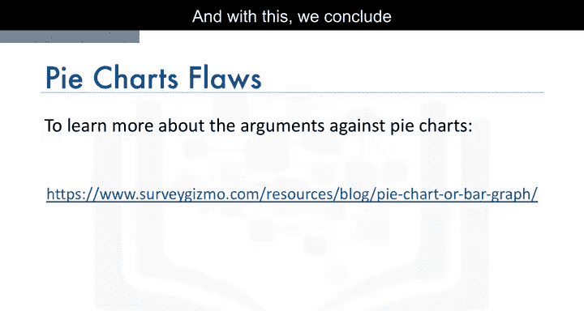

本节课中，我们一起学习了饼图的基本概念、如何按大洲分组数据，以及使用Matplotlib创建饼图的步骤。我们还简要探讨了饼图的局限性。在实验环节中，你将有机会将基础的饼图优化为更专业、美观的版本。请务必完成本模块的实验部分，以巩固所学知识。