# 010：箱线图绘制


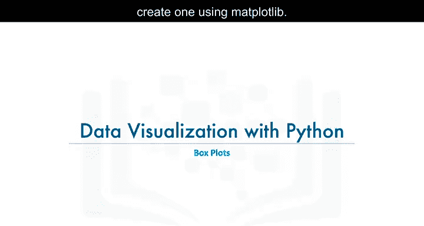

在本节课中，我们将学习另一种数据可视化工具——箱线图，并了解如何使用Matplotlib库来创建箱线图。

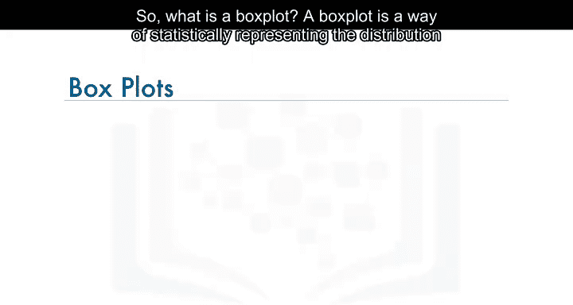

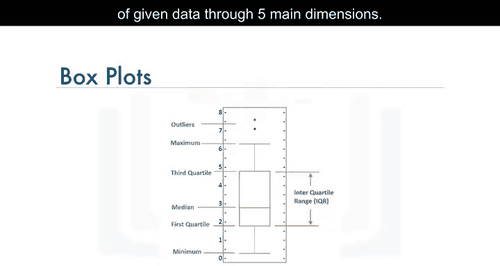

箱线图是一种通过五个主要维度来统计表示数据分布的方法。

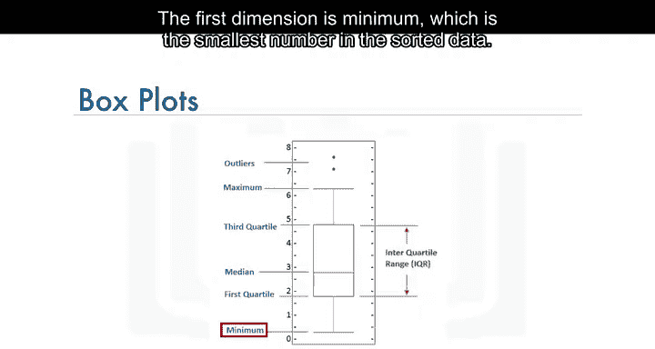

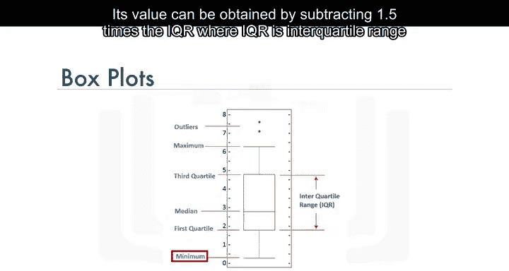

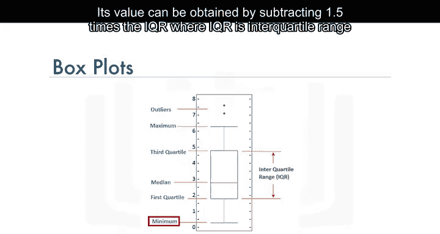

## 📦 什么是箱线图？

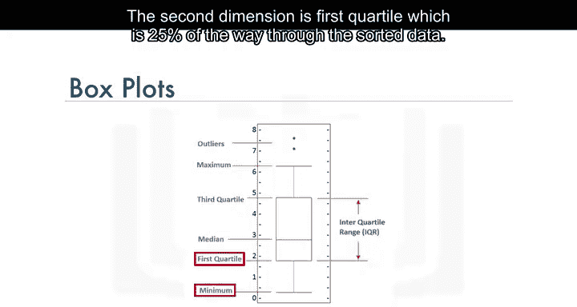

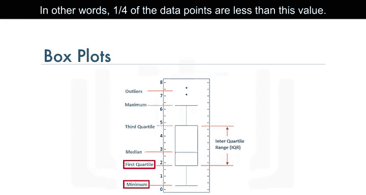

箱线图通过五个关键维度来展示数据的统计分布。这五个维度分别是：最小值、第一四分位数、中位数、第三四分位数和最大值。此外，箱线图还会将超出上下极值的异常值显示为单独的点。

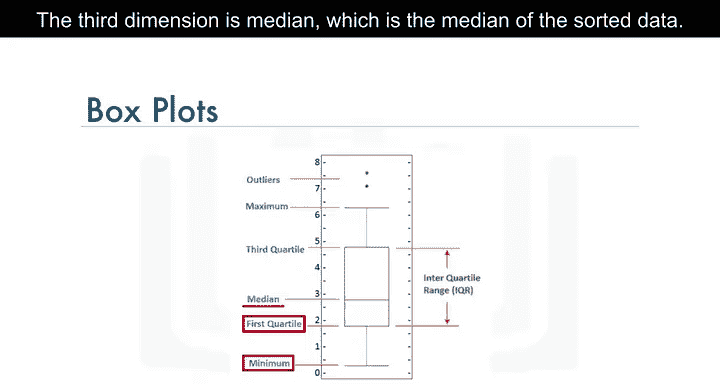

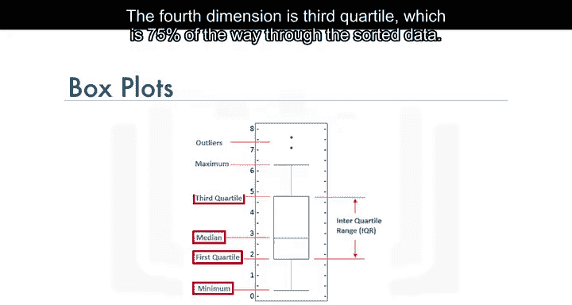

上一节我们介绍了箱线图的基本概念，本节中我们来看看这五个维度的具体定义。

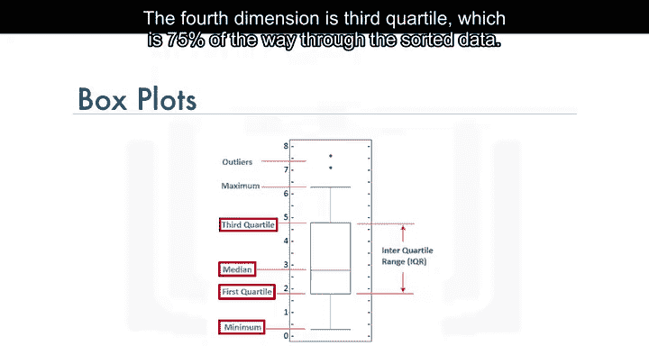

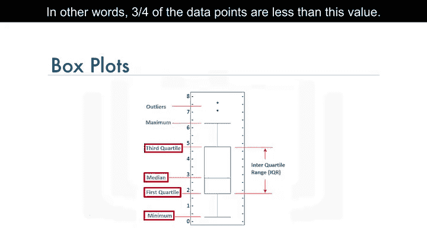

以下是箱线图的五个核心维度：

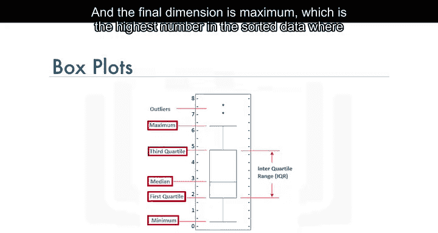

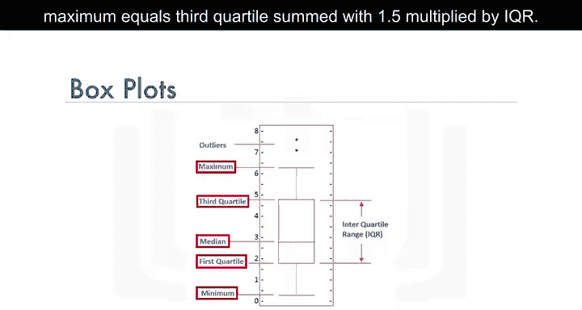

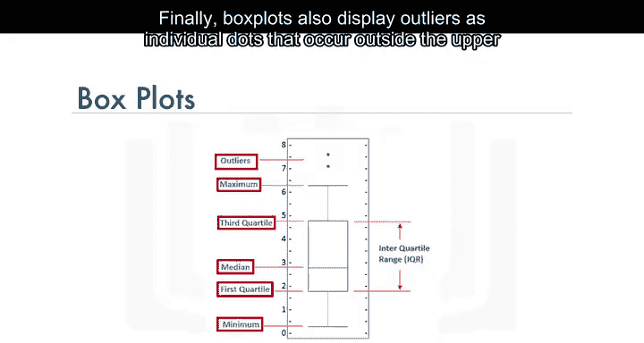

1.  **最小值**：这是排序后数据中的最小数值。其值可以通过公式 `最小值 = 第一四分位数 - 1.5 * IQR` 计算得出，其中IQR是四分位距。
2.  **第一四分位数**：这是数据排序后位于25%位置的值。换句话说，有25%的数据点小于这个值。
3.  **中位数**：这是排序后数据的中间值。
4.  **第三四分位数**：这是数据排序后位于75%位置的值。换句话说，有75%的数据点小于这个值。
5.  **最大值**：这是排序后数据中的最大数值。其值可以通过公式 `最大值 = 第三四分位数 + 1.5 * IQR` 计算得出。

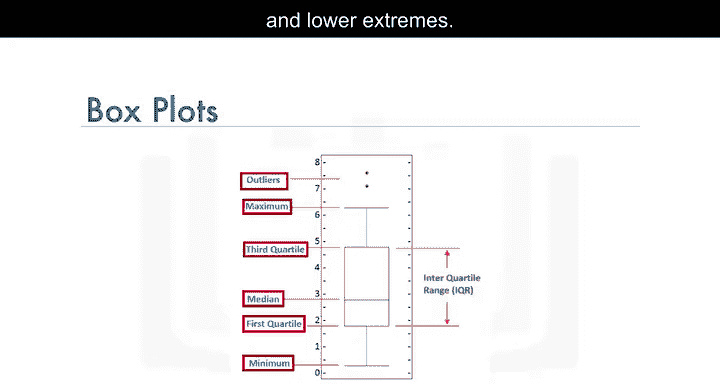

## 🛠️ 使用Matplotlib创建箱线图

现在，让我们看看如何使用Matplotlib来创建一个箱线图。在开始编写代码之前，我们先快速回顾一下我们将要使用的数据集。

我们的数据集每一行代表一个国家，包含了该国的地理元数据（如地理位置、属于发展中国家还是发达国家）以及从1980年到2013年每年移民到加拿大的人数。

为了方便操作，我们将对数据框进行处理，使国家名称成为每行的索引。这样，检索特定国家的数据会更容易。同时，我们添加一个名为“Total”的新列，用于表示每个国家从1980年到2013年移民人数的累计总和。我们将这个处理后的数据框命名为 `df_canada`。


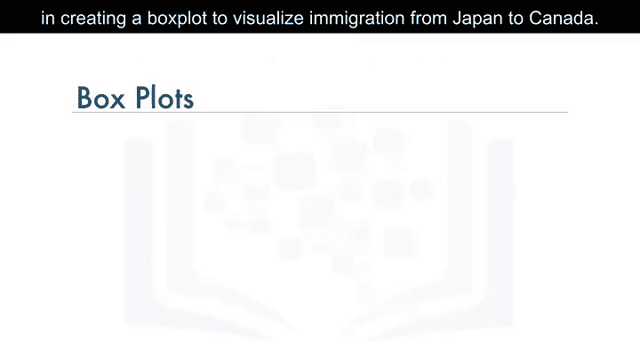

假设我们想要创建一个箱线图来可视化日本到加拿大的移民情况。


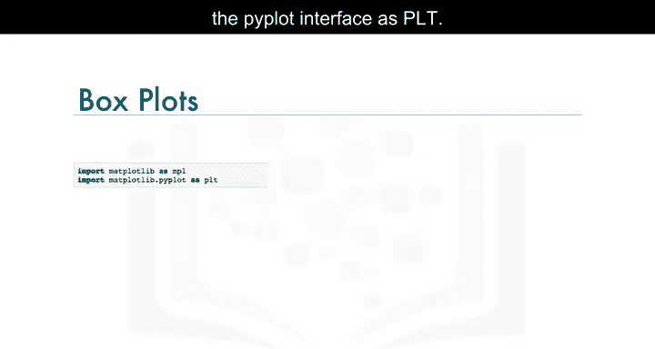

以下是创建箱线图的步骤：


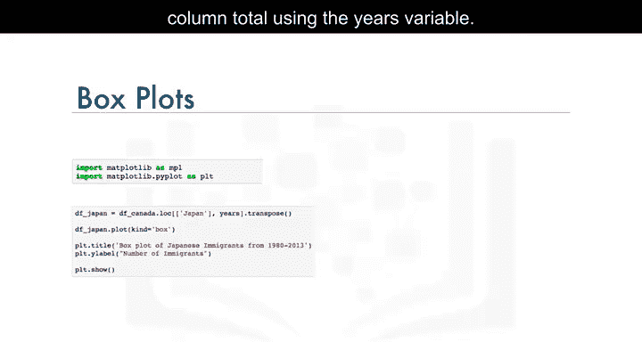

1.  首先，导入必要的库：Matplotlib。
    ```python
    import matplotlib as mpl
    import matplotlib.pyplot as plt
    ```
2.  从主数据框 `df_canada` 中提取日本的数据，并排除“Total”列。
    ```python
    years = list(map(str, range(1980, 2014)))
    df_japan = df_canada.loc[['Japan'], years]
    ```
3.  将得到的数据框进行转置，使其格式符合创建箱线图的要求。
    ```python
    df_japan = df_japan.T
    ```
4.  在 `df_japan` 数据框上调用 `plot` 函数，并设置 `kind='box'` 来生成箱线图。
    ```python
    df_japan.plot(kind='box', figsize=(8, 6))
    ```
5.  为图形添加标题和纵轴标签，使其更完整。
    ```python
    plt.title('Box plot of Japanese Immigrants from 1980 - 2013')
    plt.ylabel('Number of Immigrants')
    ```
6.  最后，调用 `show` 函数来显示图形。
    ```python
    plt.show()
    ```

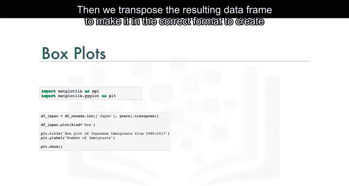

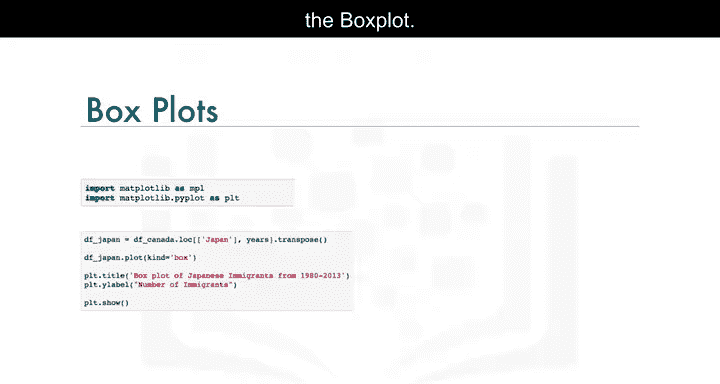

完成以上步骤后，你就得到了一个展示1980年至2013年日本移民到加拿大数据分布的箱线图。


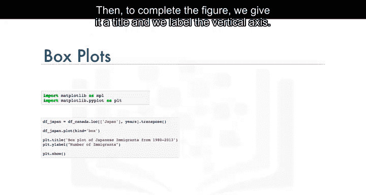


## 🧪 后续练习

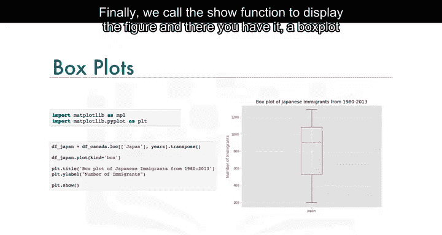

在实验环节中，我们将更详细地探索箱线图，学习如何创建多个箱线图以及水平箱线图。请务必完成本模块的实验部分。

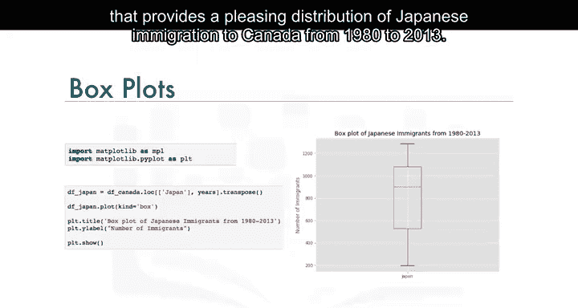

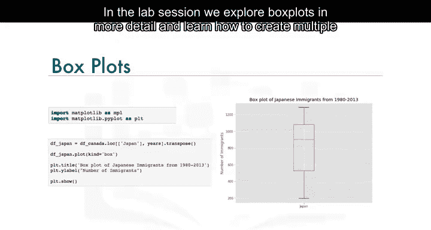

## 📝 总结

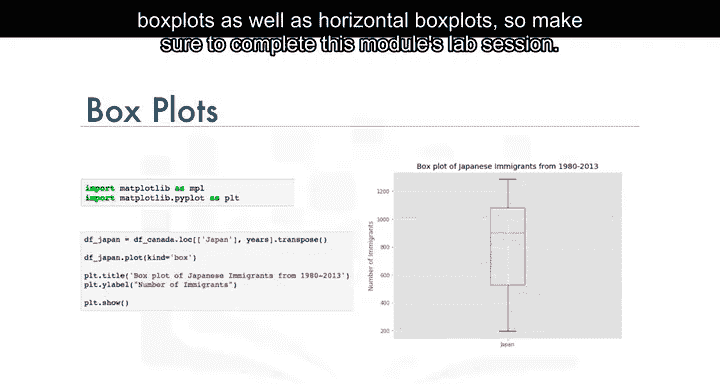

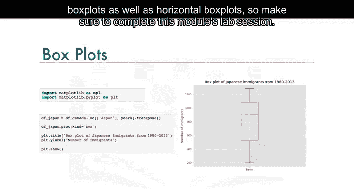

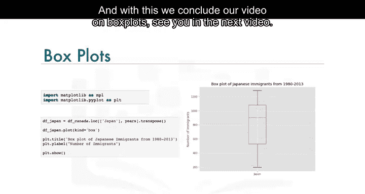

本节课中我们一起学习了箱线图。我们了解了箱线图如何通过最小值、第一四分位数、中位数、第三四分位数和最大值这五个维度来展示数据的统计分布，并掌握了使用Matplotlib库从数据集中提取特定国家数据并绘制箱线图的具体步骤。