# 011：散点图绘制教程


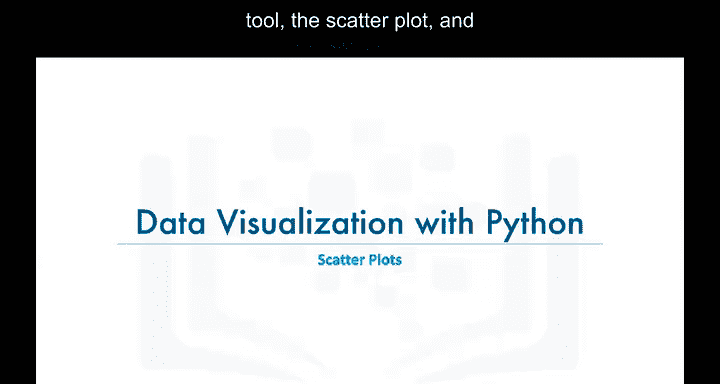

在本节课中，我们将学习一种额外的数据可视化工具——散点图，并了解如何使用Matplotlib库来创建它。


## 什么是散点图？ 🤔


散点图是一种图表类型，用于展示两个变量之间的数值关系。

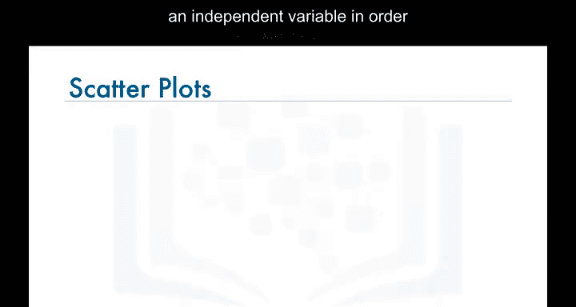


通常，散点图将一个因变量与一个自变量进行对比，以确定这两个变量之间是否存在相关性。

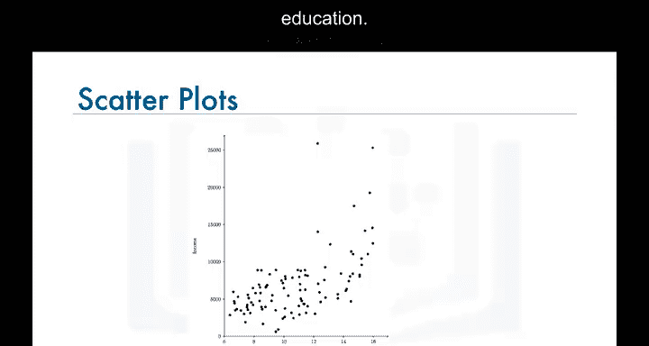

例如，下图展示了一个收入与受教育年限的散点图。

通过观察图表数据，可以得出结论：受教育年限更长的个体，其收入可能高于受教育年限较短的个体。

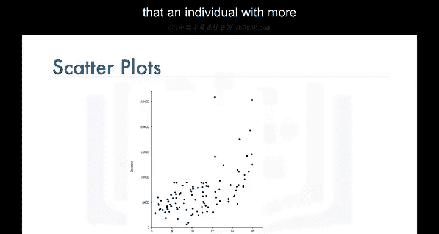

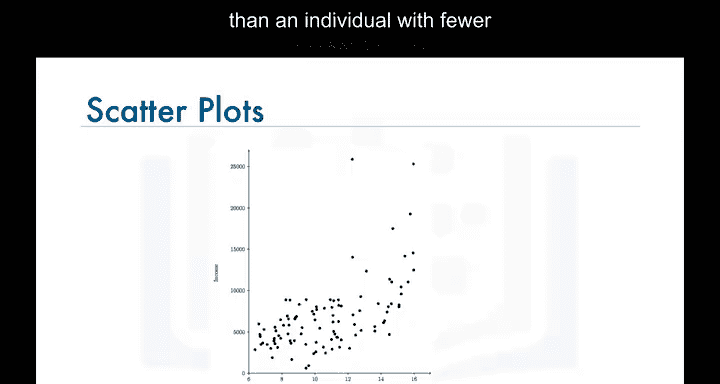

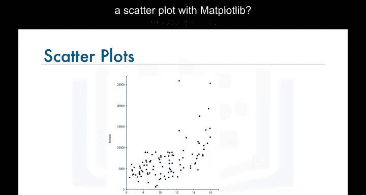

## 如何用Matplotlib创建散点图？ 🛠️

上一节我们介绍了散点图的基本概念，本节中我们来看看如何使用代码创建散点图。在编写代码之前，我们先快速回顾一下数据。

我们的数据集中，每一行代表一个国家，并包含该国的元数据，例如地理位置以及属于发展中国家还是发达国家。每一行还包含了从1980年到2013年该国每年移民到加拿大的数量。

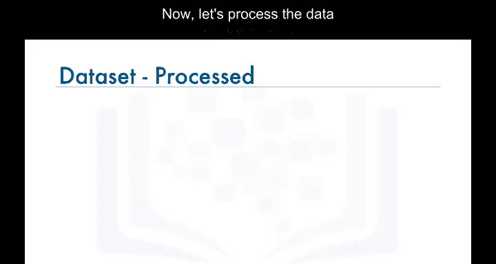

现在，我们对数据框进行处理，使国家名称成为每一行的索引。这将使检索特定国家的数据变得更加容易。同时，我们添加一个新列，表示从1980年到2013年每个国家移民数量的累计总和。例如，阿富汗的总数是58,639，阿尔巴尼亚是15,699，依此类推。我们将这个数据框命名为`df_canada`。

了解了数据在`df_canada`数据框中的存储方式后，假设我们想要绘制一个散点图，展示从1980年到2013年每年移民到加拿大的总人数。

为了实现这个目标，我们首先需要创建一个新的数据框，显示每一年以及当年来自全球所有国家的移民总人数，如下图所示。

我们将这个新数据框命名为`df_total`。


在实验环节，我们将一起学习如何从`df_canada`创建`df_total`数据框，请务必完成本模块的实验部分。


## 绘制散点图的步骤 📈


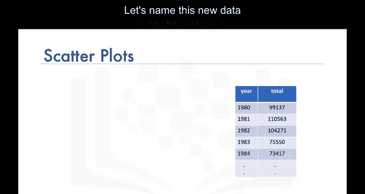

接下来，我们按照常规步骤进行。首先导入Matplotlib库及其脚本层Pyplot接口。

```python
import matplotlib as mpl
import matplotlib.pyplot as plt
```

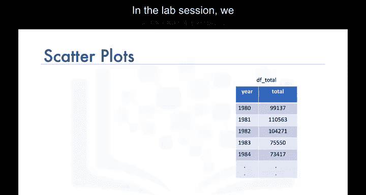


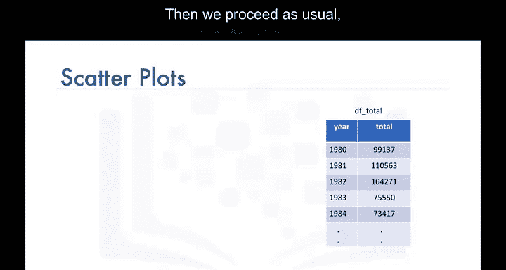

然后，我们在`df_total`数据框上调用`plot`函数，并设置`kind='scatter'`来生成散点图。


```python
df_total.plot(kind='scatter', x='year', y='total')
```

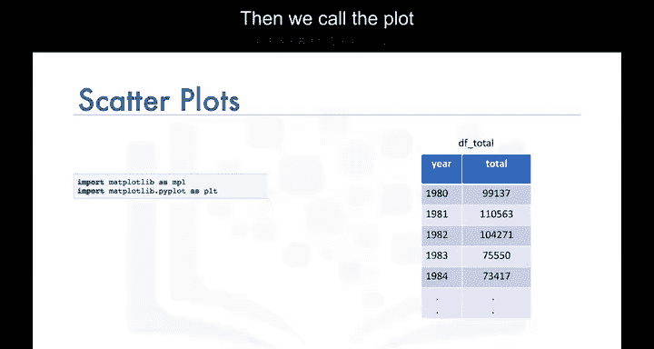


与其他数据可视化工具不同，仅传递`kind`参数不足以生成散点图。我们还需要将要在水平轴上绘制的变量作为`x`参数传递，将要在垂直轴上绘制的变量作为`y`参数传递。

在本例中，我们将`year`列作为`x`参数，将`total`列作为`y`参数。


为了完善图表，我们为其添加标题并标注坐标轴。

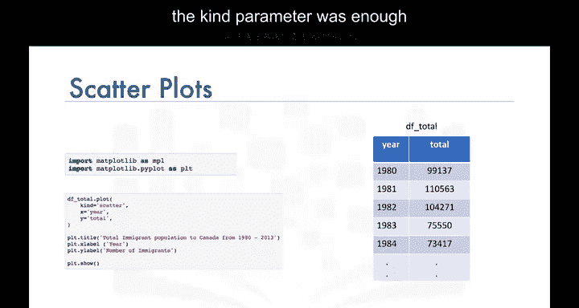


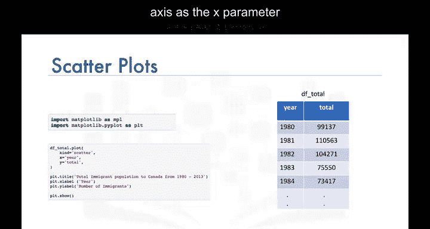


```python
plt.title('Total Immigration to Canada (1980-2013)')
plt.xlabel('Year')
plt.ylabel('Number of Immigrants')
```


最后，我们调用`show`函数来显示图表。

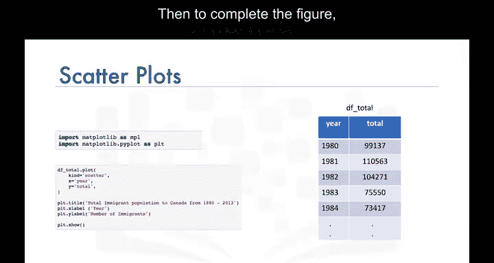

```python
plt.show()
```


这样，我们就得到了一个散点图，展示了从1980年到2013年全球各国移民到加拿大的总人数。

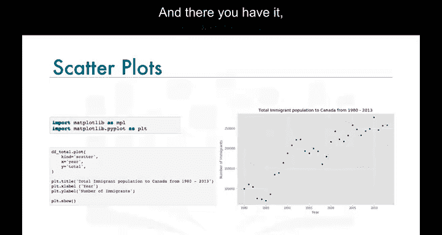

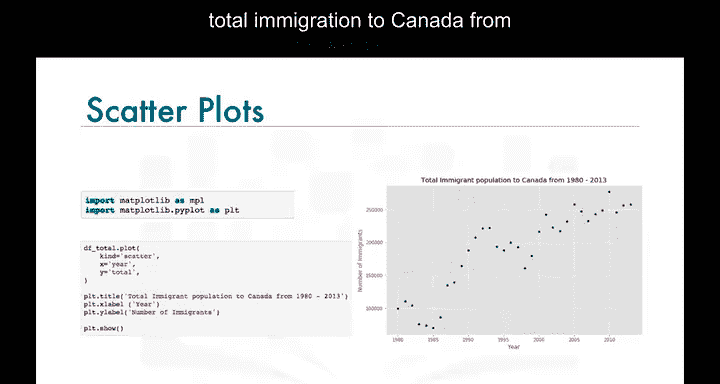

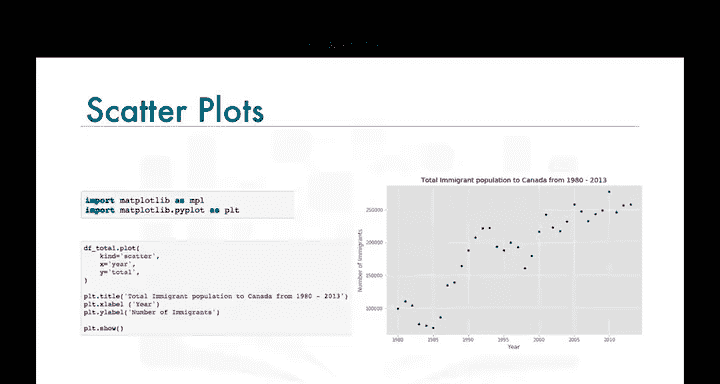

## 解读散点图 📊


散点图清晰地描绘了移民数量随时间推移的整体上升趋势。

在实验环节，我们将更详细地探索散点图，并学习一种非常有趣的散点图变体——气泡图，以及如何使用Matplotlib创建它。请务必完成本模块的实验部分。

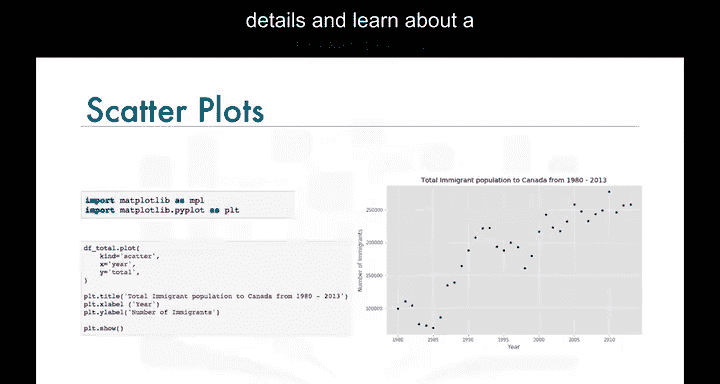

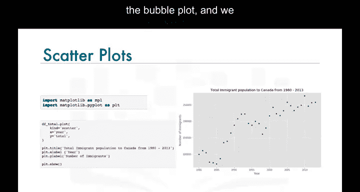


## 总结 🎯


本节课中我们一起学习了散点图的概念及其在数据可视化中的应用。我们了解了如何使用Matplotlib库创建散点图，包括数据准备、图表绘制和结果解读。散点图是分析两个变量之间关系的强大工具，能够直观地展示数据趋势和相关性。