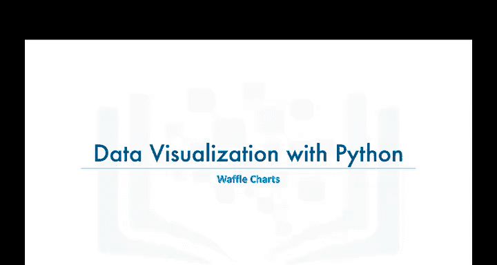
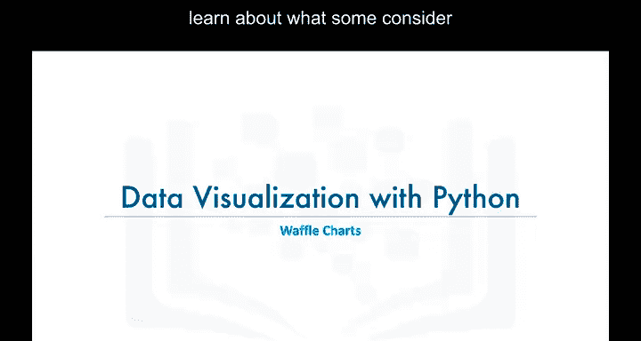
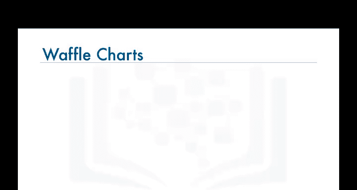
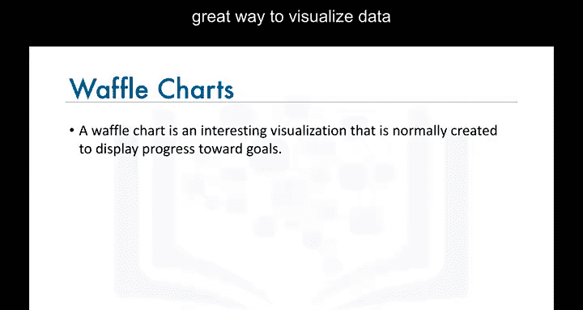
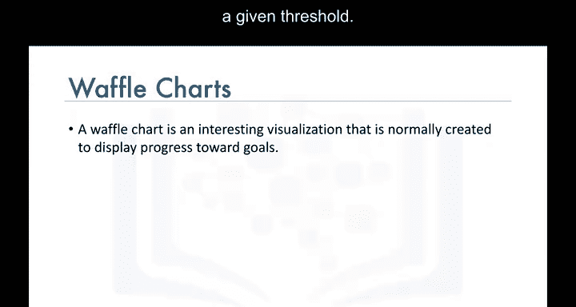
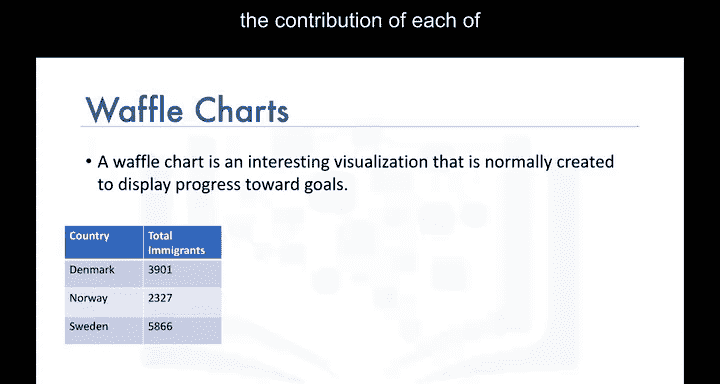
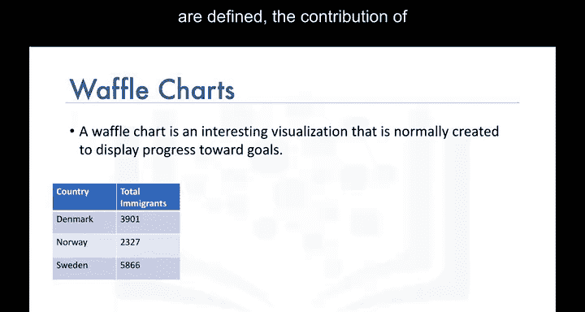
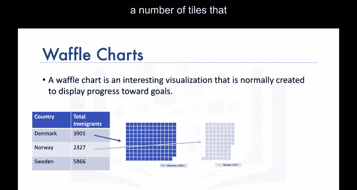

# 012：华夫饼图绘制 🧇

在本节课中，我们将学习一种被视为高级可视化工具的方法——华夫饼图。我们将了解它的定义、用途，并简要介绍其实现原理。

## 什么是华夫饼图？🧇

华夫饼图是一种将数据与整体关系可视化，或突出显示相对于给定阈值的进展情况的优秀方法。

## 华夫饼图的应用示例 📈

例如，假设从斯堪的纳维亚地区到加拿大的移民仅由来自丹麦、挪威和瑞典的移民构成。我们想要可视化每个国家对斯堪的纳维亚地区移民总量的贡献比例。

## 华夫饼图的绘制原理 ⚙️

上一节我们了解了华夫饼图的应用场景，本节中我们来看看它的核心绘制原理。

其主要思想是：对于一个定义了目标高度和宽度的华夫饼图，每个国家的贡献值会被转换为一定数量的方块（tiles），这个数量与该国家对总量的贡献成正比。

**公式表示**：`某国家的方块数 ≈ (该国贡献值 / 总贡献值) * (图表总方块数)`

贡献越大，方块数量就越多。当所有方块组合在一起时，其外观类似于华夫饼，因此得名“华夫饼图”。

## 实现说明与课程总结 📝

遗憾的是，Matplotlib库没有内置创建华夫饼图的函数。因此，在实验环节中，我将引导你完成创建自定义Python函数来绘制华夫饼图的过程。完成本模块的实验课程非常重要。

本节课中我们一起学习了华夫饼图的基本概念、用途及其核心绘制原理。我们了解到它是一种通过方块比例来展示部分与整体关系的有效可视化工具。