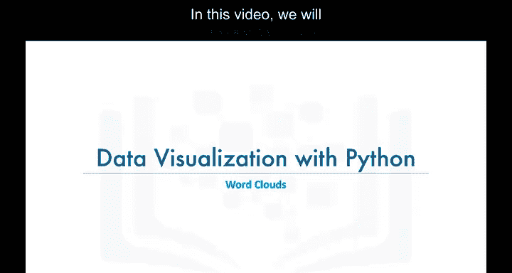
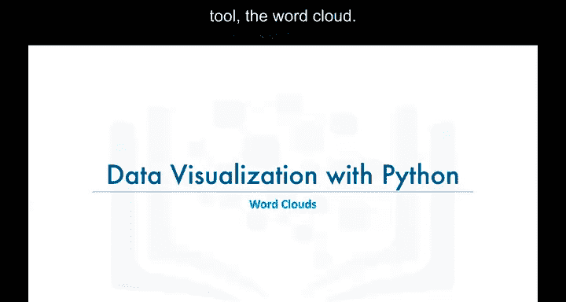
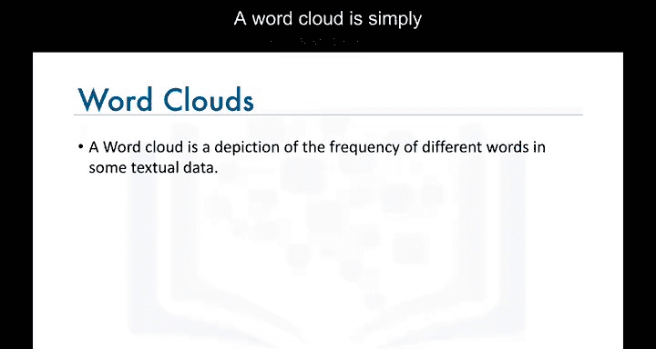
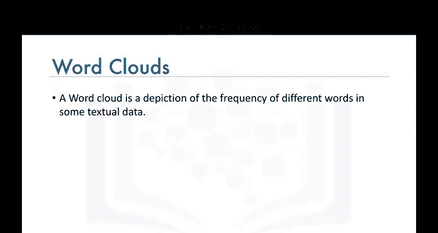
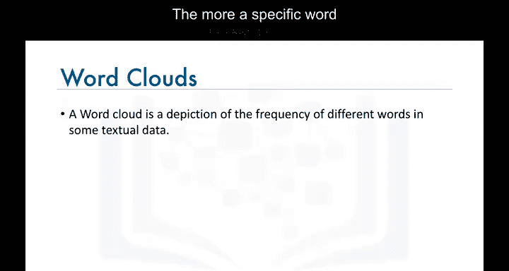
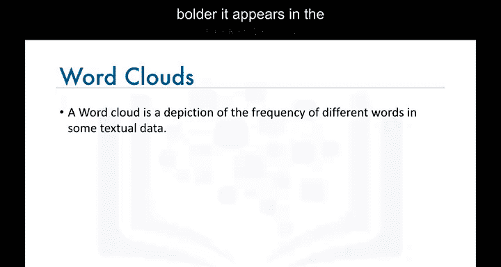
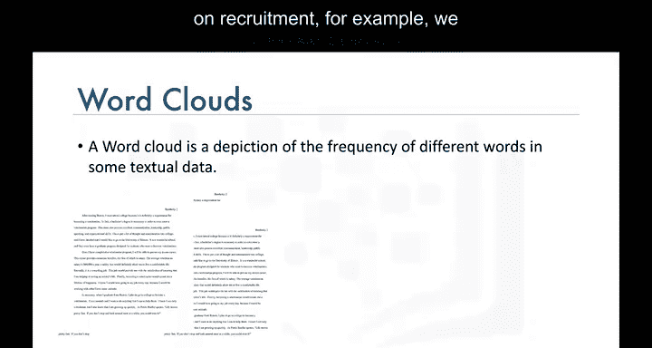

# 013：词云生成 ☁️📊

在本节课中，我们将学习另一种高级可视化工具——词云。词云能够直观地展示文本数据中不同词汇的重要性，帮助我们快速洞察文本的核心主题。

## 什么是词云？ 🤔

词云是一种对文本中不同词汇重要性进行视觉化描绘的工具。

词云的工作原理非常简单：在文本数据源中，某个特定词汇出现的频率越高，它在词云中显示得就越大、越醒目。

## 词云的作用与示例 📈

假设我们有一些关于招聘的文本数据，可以生成如下所示的词云。

这个词云告诉我们，“招聘”、“人才”、“候选人”等词汇在这些文本文档中非常突出。

如果我们对这些文档的内容一无所知，词云可以非常有效地帮助我们为未知的文本数据分配一个主题。

## 如何在Python中生成词云？ 🛠️

不幸的是，与华夫饼图一样，Matplotlib库没有内置生成词云的功能。

然而，幸运的是，由Andrea Muer创建的一个用于生成词云的Python库是公开可用的。在接下来的实验环节中，我们将学习如何使用Muer的词云生成器，并创建叠加在不同背景图像上的有趣词云。

请务必完成本模块的实验部分。

## 总结 📝

本节课我们一起学习了词云的概念、作用及其在Python中的实现方式。词云是一种强大的文本数据可视化工具，能够快速揭示文本中的关键主题和词汇频率。

我们下个视频再见。