# 014：Seaborn与回归图 📈

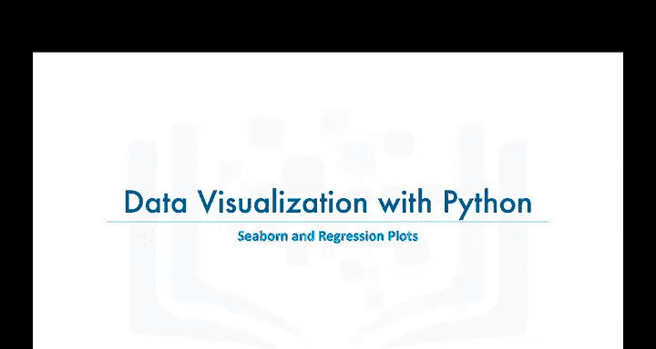

在本节课中，我们将学习Python中的一个新的数据可视化库——Seaborn。我们将了解它的基本概念，并重点学习如何使用Seaborn高效地创建带有回归线的统计图形。

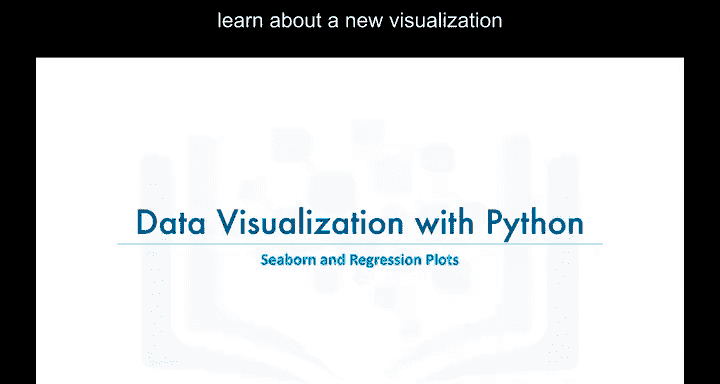

## 什么是Seaborn？🤔

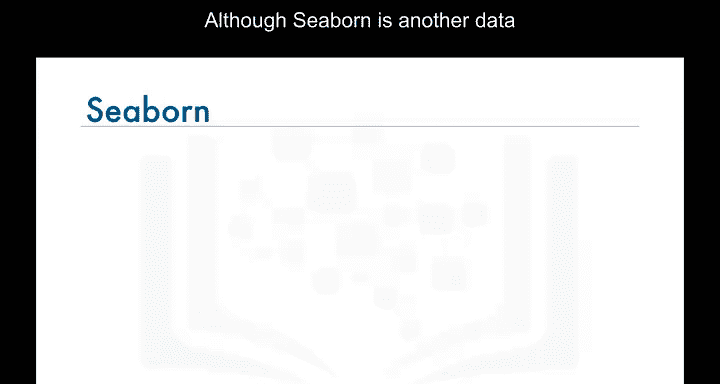

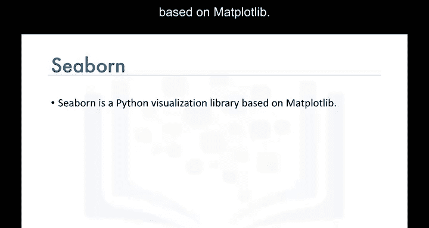

上一节我们介绍了课程目标，本节中我们来看看Seaborn是什么。

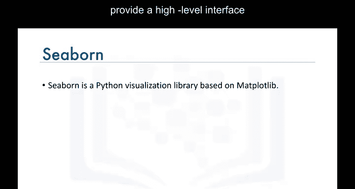

Seaborn是另一个Python数据可视化库，但它实际上是基于Matplotlib构建的。

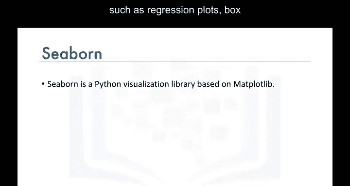

它主要被设计用来提供一个高级接口，用于绘制美观的统计图形，例如回归图、箱线图等。

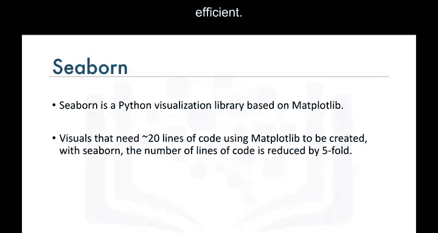

Seaborn使得创建图表非常高效。使用Seaborn，你可以用比Matplotlib少五倍的代码量生成图表。

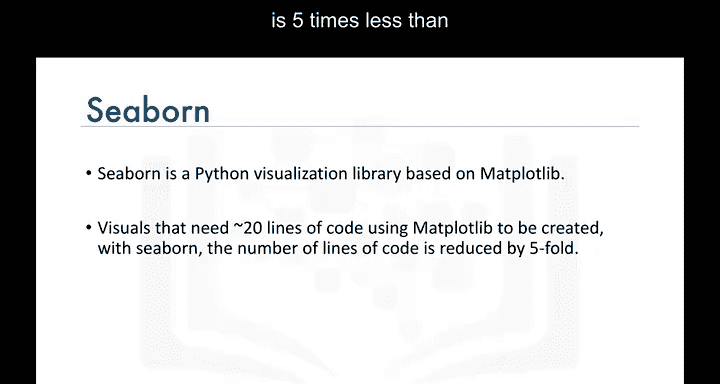

## 使用Seaborn创建回归图 📉

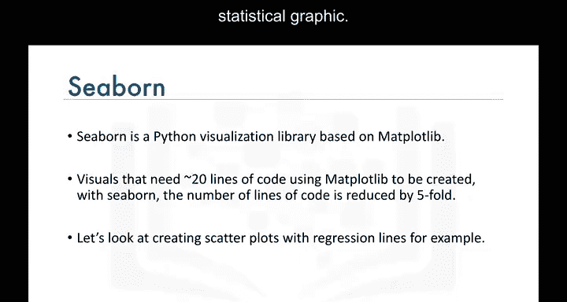

了解了Seaborn的基本概念后，本节我们来看看如何使用它创建一个具体的统计图形——回归图。


假设我们有一个名为`df_tot`的数据框，它包含了从1980年到2013年加拿大移民的总数数据。


数据框的一列是年份，另一列是对应的移民总数。

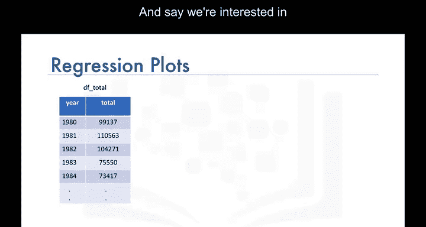

我们想要创建一个散点图，并附上回归线，以突出显示数据中的任何趋势。

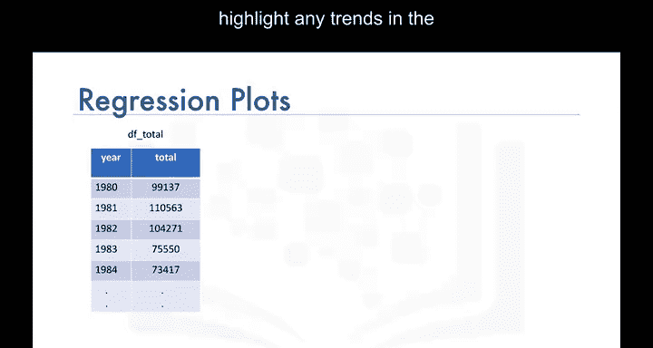

使用Seaborn，你只需一行代码就可以完成所有这些操作。

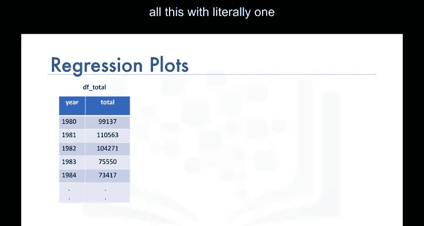

以下是实现步骤：


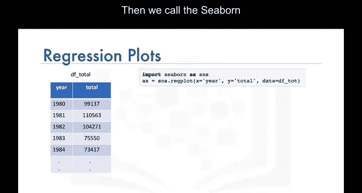

首先，我们导入Seaborn库，通常将其别名为`sns`：
```python
import seaborn as sns
```

然后，我们调用Seaborn的`regplot`函数：
```python
sns.regplot(x='year', y='total', data=df_tot)
```

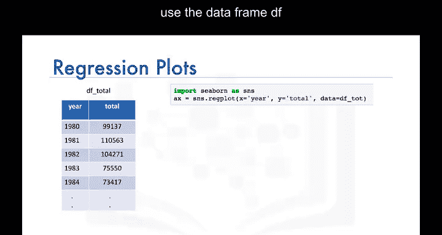

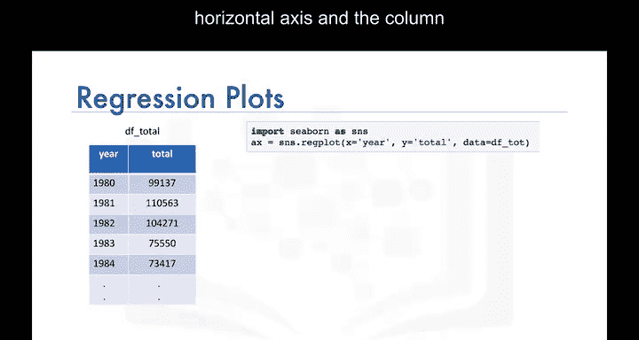

我们基本上告诉函数：使用数据框`df_tot`，在横轴上绘制“year”列，在纵轴上绘制“total”列。

这一行代码的输出结果是一个散点图，图中包含一条回归线。不仅如此，它还自动包含了95%的置信区间。

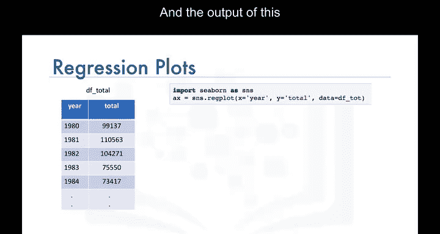

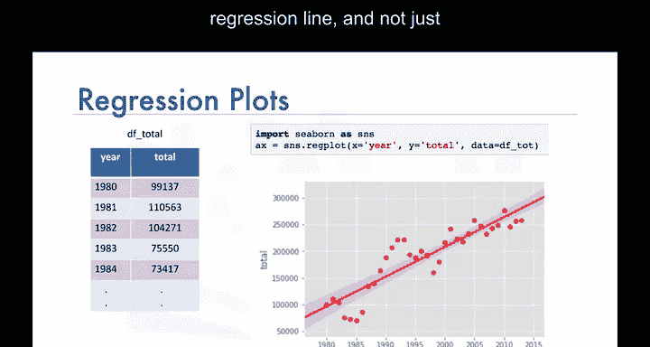

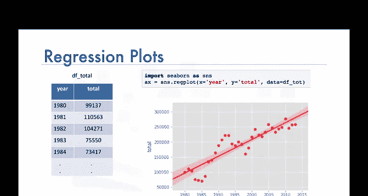

## 自定义回归图 🎨

上一节我们看到了创建回归图是多么简单，本节中我们来看看如何对其进行个性化定制。

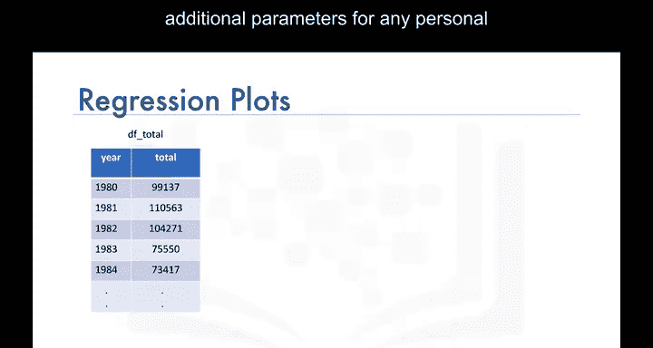

Seaborn的`regplot`函数也接受额外的参数，用于进行任何个性化定制。

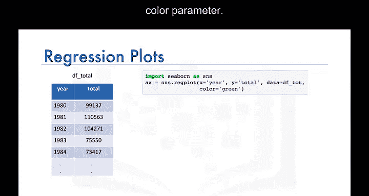

例如，你可以使用`color`参数来改变颜色。让我们将颜色改为绿色：
```python
sns.regplot(x='year', y='total', data=df_tot, color='green')
```

此外，你还可以使用`marker`参数来改变标记点的形状。让我们将标记点的形状从默认的圆形改为加号形状：
```python
sns.regplot(x='year', y='total', data=df_tot, color='green', marker='+')
```

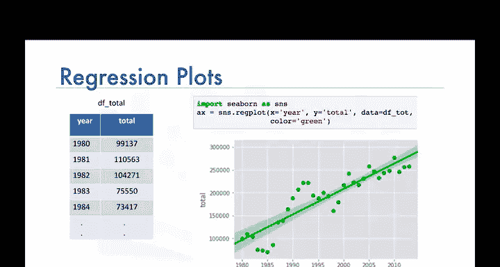

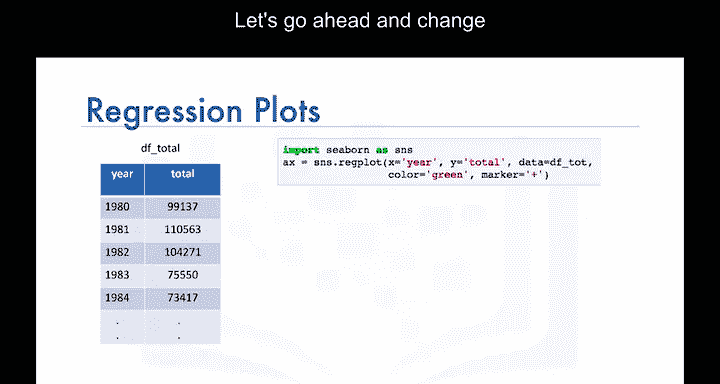

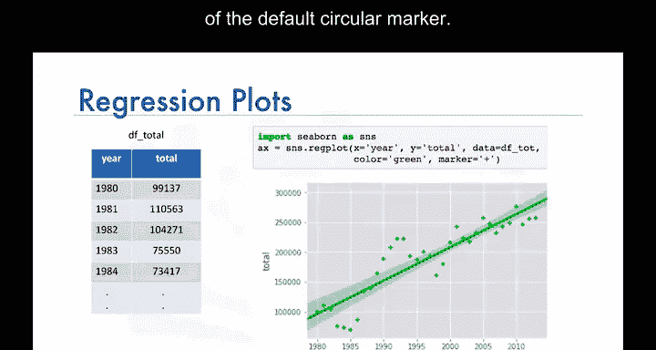

## 总结 📝

本节课中我们一起学习了Seaborn数据可视化库。我们了解到Seaborn是基于Matplotlib构建的高级库，能够用非常简洁的代码创建美观的统计图形。我们重点学习了如何使用`sns.regplot()`函数快速生成带有回归线和置信区间的散点图，并探索了如何通过参数自定义图形的颜色和标记点形状。


在实验环节中，我们将更详细地探索Seaborn的回归图功能，请务必完成本模块的实验部分。

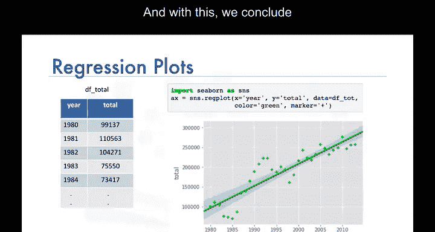

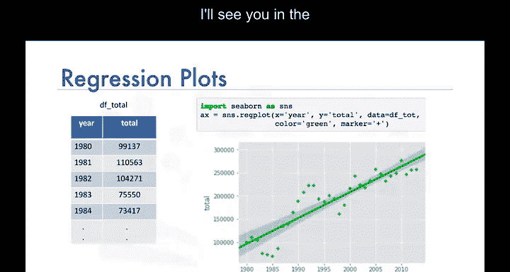

关于Seaborn和回归图的简短介绍到此结束，我们下个视频再见。