# 015：Folium地图库入门

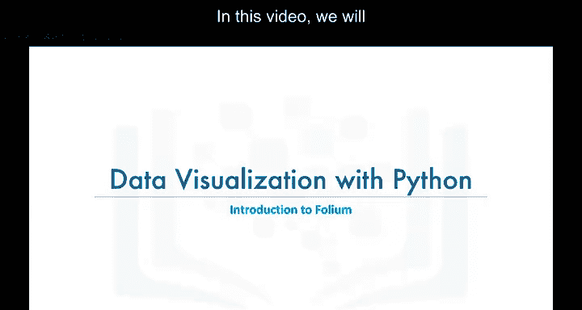

在本节课中，我们将学习一个非常有趣的Python数据可视化库：**Folium**。

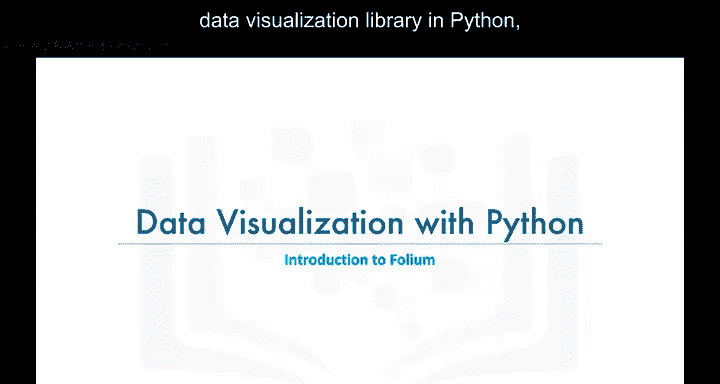

Folium是一个强大的Python数据可视化库，其主要设计目的是帮助人们可视化地理空间数据。

使用Folium，只要你知道某个地点的纬度和经度值，就可以创建世界上任何位置的地图。

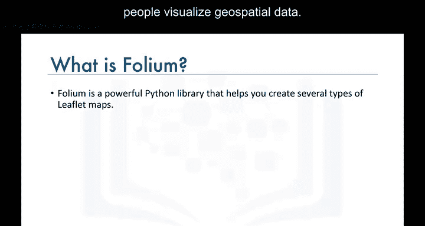

你还可以在地图上叠加标记点，甚至创建标记点簇，以实现酷炫且有趣的可视化效果。

此外，你可以创建不同风格的地图，例如街道地图、地形图等，我们稍后会进行探讨。

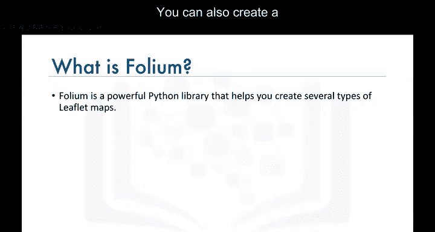

## 创建世界地图 🌍

使用Folium创建世界地图非常简单直接。

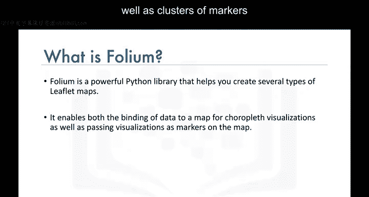

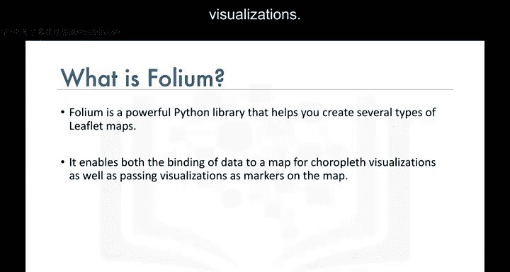

你只需调用 `map` 函数即可。

Folium创建的地图有一个非常有趣的特点：它们是**交互式**的。在地图渲染完成后，你可以进行缩放，这是一个非常有用的功能。

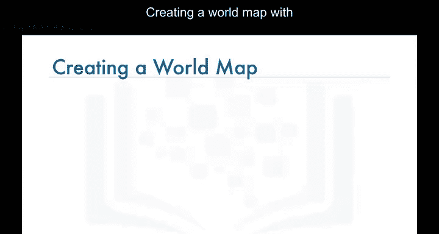

默认的地图样式是OpenStreetMap。当你放大时，它会显示区域的街道视图；当你完全缩小时，它会显示世界各国的边界。

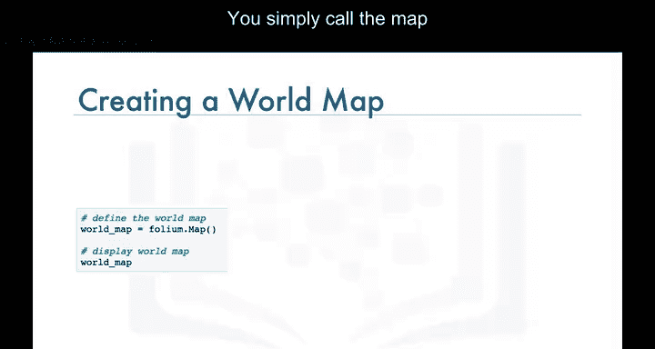

## 创建特定区域的地图 🎯

现在，让我们创建一个以加拿大为中心的世界地图。

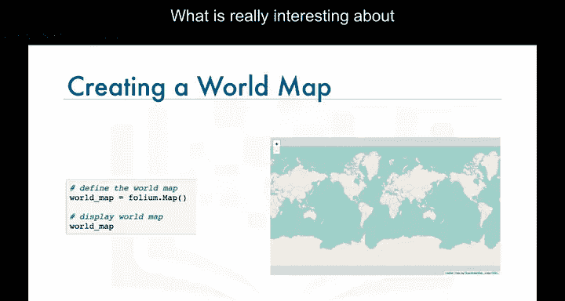

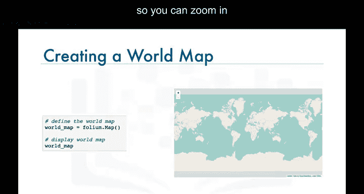

为此，我们使用 `location` 参数传入加拿大的纬度和经度值。

在Folium中，你可以使用 `zoom_start` 参数设置初始缩放级别。

之所以称为“初始”级别，是因为在地图渲染后，你可以通过放大或缩小轻松地改变缩放级别。

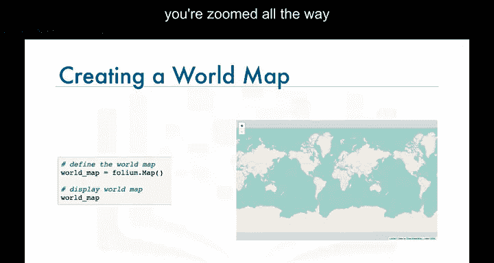

你可以尝试调整这个参数，看看不同值对应的初始缩放级别是什么样子。

现在，让我们将加拿大地图的缩放级别设置为4。

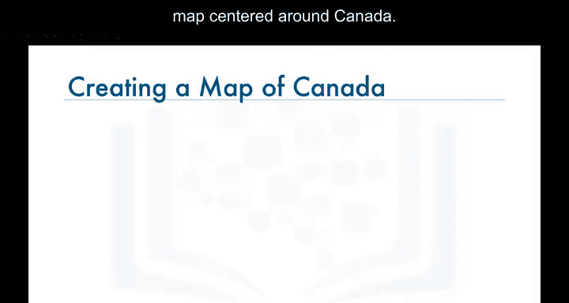

这样，我们就得到了一个以加拿大为中心的世界地图。

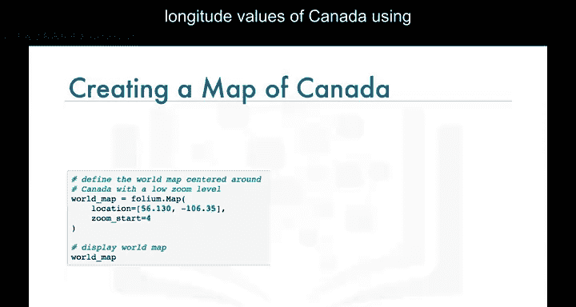

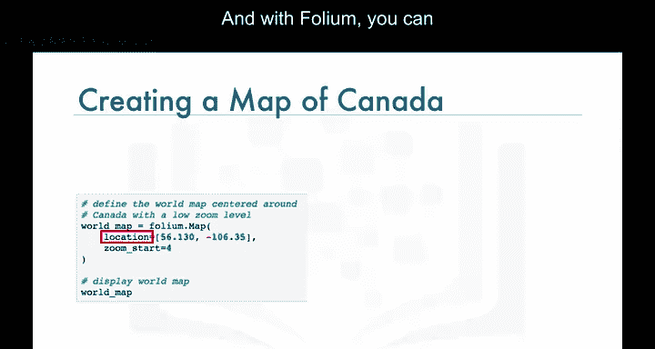

## 探索不同的地图样式 🎨

Folium另一个令人惊叹的功能是，你可以使用 `tiles` 参数创建不同的地图样式。

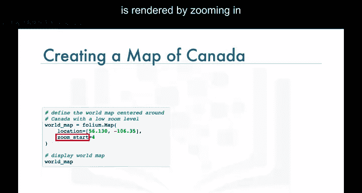

让我们为加拿大创建一个“Stamen Toner”风格的地图。这种样式非常适合可视化和探索河流蜿蜒和海岸带。

另一种样式是“Stamen Terrain”。

让我们为加拿大创建一个“Stamen Terrain”风格的地图。这种样式非常适合可视化山体阴影和自然植被颜色。

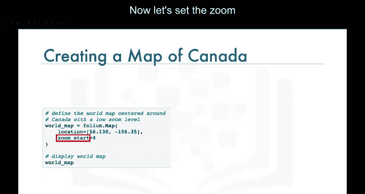

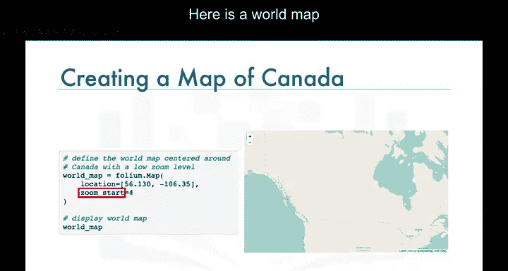

## 总结 📝

本节课中，我们一起学习了Folium地图库的基础知识。

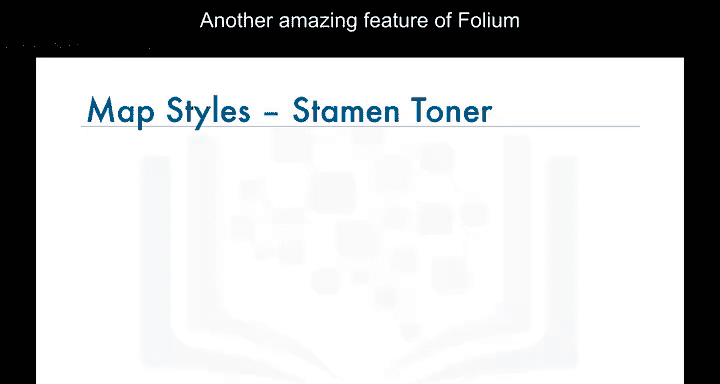

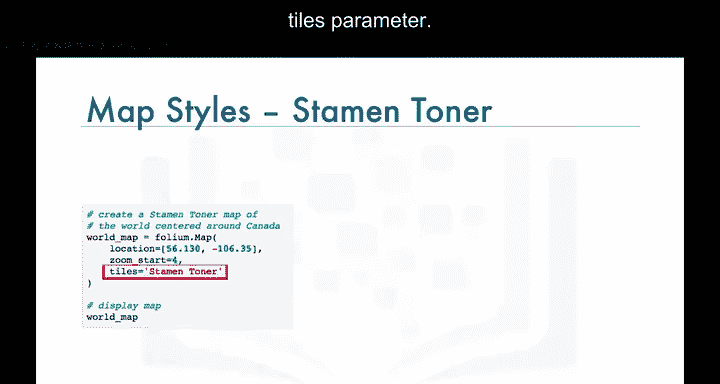

我们了解了Folium是一个用于地理空间数据可视化的强大库。

我们学习了如何创建世界地图，如何通过指定经纬度来聚焦特定区域，以及如何设置初始缩放级别。

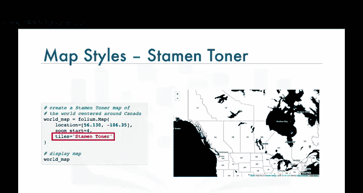

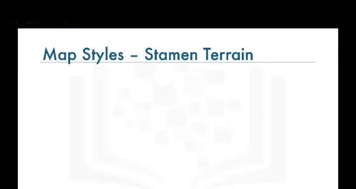

我们还探索了如何通过 `tiles` 参数来改变地图的视觉样式，例如“Stamen Toner”和“Stamen Terrain”。

Folium地图的交互性是其核心优势，允许用户在渲染后自由探索。

通过掌握这些基础，你已经可以开始使用Folium创建自己的交互式地理可视化项目了。