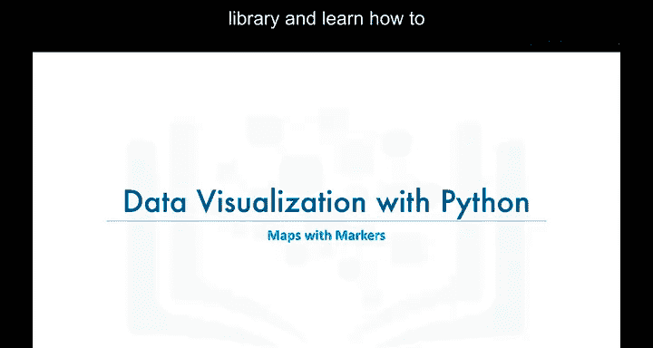
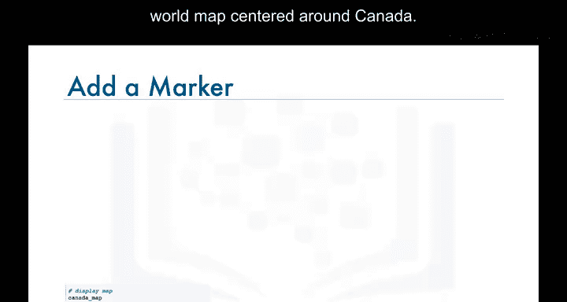
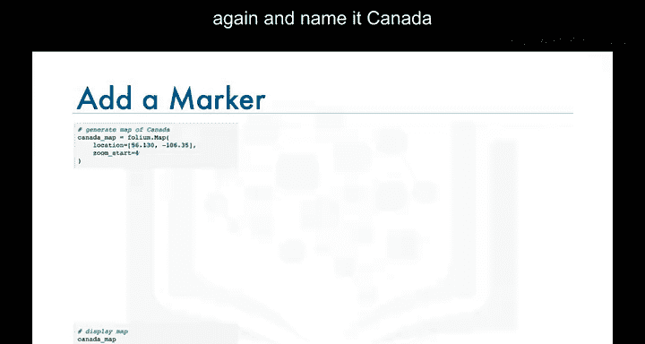
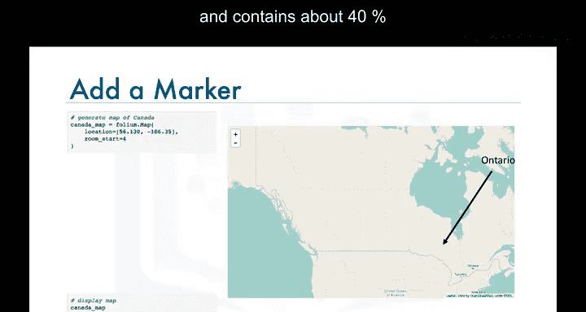
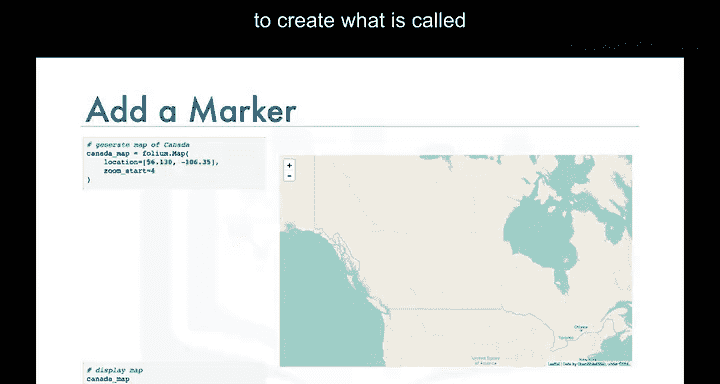
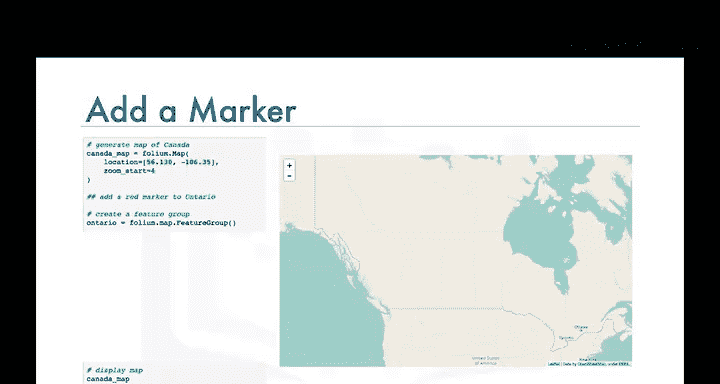
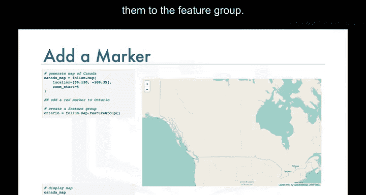

# 016：在地图上添加标记


在本节课中，我们将继续学习使用 Folium 库，并掌握如何在地图上叠加标记点，以创建更具信息量的可视化效果。



---


在上一节视频中，我们学习了如何创建一个以加拿大为中心的世界地图。



因此，让我们再次创建这个地图，这次将其命名为 `canada_map`。



```python
import folium
canada_map = folium.Map(location=[56.130, -106.35], zoom_start=4)
```

安大略省是加拿大的一个省份，拥有加拿大约40%的人口，被认为是加拿大人口最多的省份。




让我们看看如何为安大略省的中心位置添加一个圆形标记。


为此，我们需要创建一个所谓的“要素组”。



让我们继续创建一个名为 `ontario` 的要素组。



```python
ontario = folium.FeatureGroup(name="Ontario")
```

现在，当一个要素组被创建时，它是空的。这意味着下一步是开始创建所谓的“子元素”，并将它们添加到要素组中。




因此，让我们创建一个子元素，其形式为一个位于安大略省中心的红色圆形标记。我们通过传入其纬度和经度值来指定该子元素的位置。

```python
ontario.add_child(
    folium.CircleMarker(
        location=[51.2538, -85.3232],
        radius=50,
        color='red',
        fill=True,
        fill_color='red'
    )
)
```

一旦我们完成了向要素组添加子元素，就将该要素组添加到地图上。

```python
canada_map.add_child(ontario)
canada_map
```

这样，我们就得到了一个叠加在地图上的红色圆形标记，它被添加到了安大略省的中心位置。

现在，如果能给这个标记加上标签，以便让其他人知道它实际代表什么，那就更好了。

为此，我们只需使用 `Marker` 函数，并通过 `popup` 参数传入我们想要添加到此标记的任何文本。

```python
ontario.add_child(
    folium.Marker(
        location=[51.2538, -85.3232],
        popup='Ontario'
    )
)
canada_map.add_child(ontario)
canada_map
```

现在，我们的标记在被点击时会显示“Ontario”。

在实验环节，我们将研究一个真实世界的例子，探索旧金山的犯罪率。我们将创建一张旧金山的地图，并在地图上叠加成千上万个这样的标记。不仅如此，我还会向你展示如何创建标记簇，以使你的地图看起来不那么拥挤。本模块的实验环节非常有趣，请务必完成它。

---

通过以上内容，我们结束了关于使用 Folium 在地图上添加标记的视频讲解。我们下个视频再见。