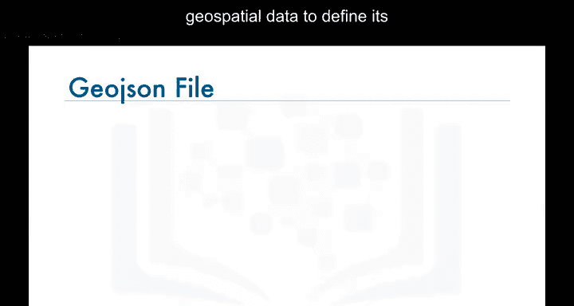
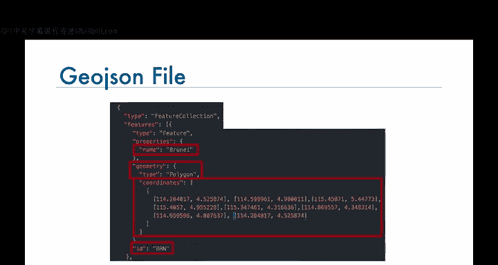
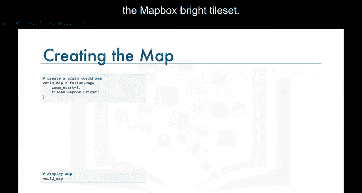

# 017：区域统计地图 🌍

在本节课中，我们将学习如何创建一种特殊的地图类型——区域统计地图（Choropleth Map）。

## 什么是区域统计地图？ 🤔

上一节我们介绍了基础地图的创建，本节中我们来看看区域统计地图。

区域统计地图是一种专题地图，其中区域根据所展示的统计变量（如人口密度或人均收入）的测量值按比例进行着色或填充图案。测量值越高，颜色越深。

例如，左侧的地图是一张展示每千名新生儿中婴儿死亡率的世界区域统计地图。颜色越深，婴儿死亡率越高。根据地图，非洲国家的婴儿死亡率非常高，其中一些国家报告的比率超过每千名新生儿160例。同样，右侧的地图是一张展示美国各州每平方英里人口的区域统计地图。颜色越深，人口越密集。根据地图，美国东部各州的人口往往比西部各州更密集，加利福尼亚州是一个例外。

## 创建区域统计地图的前提 📁

为了创建感兴趣区域的区域统计地图，Folium库需要一个包含该区域地理空间数据的GeoJSON文件。对于世界区域统计地图，我们需要一个列出每个国家及其定义边界所需地理空间数据的GeoJSON文件。

以下是GeoJSON文件为每个国家包含信息的示例（以文莱为例）：
*   **国家名称**
*   **国家ID**
*   **几何形状**
*   **定义国家边界的坐标**



## 实践：创建世界移民区域统计地图 🛠️



现在，让我们看看如何创建一张像这样的、展示移民到加拿大的情况的世界区域统计地图。

在讲解实现代码之前，我们先快速回顾一下我们的数据集。数据集中的每一行代表一个国家，并包含该国家的元数据，如其地理位置以及是发展中国家还是发达国家。每一行还包含从1980年到2013年每年从该国移民到加拿大的数字。

以下是数据处理步骤：
我们添加一个额外的列，代表从1980年到2013年每年从每个国家移民到加拿大的累计总和。例如，阿富汗的总数是58，639，阿尔巴尼亚是15，699，依此类推。我们将这个数据框命名为 `df_canada`。

现在我们已经知道数据是如何存储在 `df_canada` 数据框中的，接下来看看如何生成展示移民到加拿大的世界区域统计地图。

我们现在应该是使用Folium创建世界地图的专家了，所以让我们直接创建一个世界地图，但这次使用Mapbox Bright图块集。

结果是一张显示每个国家名称的漂亮世界地图。

要将此地图转换为区域统计地图，我们首先定义一个指向GeoJSON文件的变量，然后将 `choropleth` 函数应用到我们的世界地图上。我们告诉它使用 `df_canada` 数据框中的“国家”和“总计”列，并使用国家名称在GeoJSON文件中查找每个国家的地理空间信息。



核心代码如下：
```python
# 假设 world_map 是已创建的基础世界地图对象，geo_json_file 是GeoJSON文件路径
world_map.choropleth(
    geo_data=geo_json_file,
    data=df_canada,
    columns=['Country', 'Total'],
    key_on='feature.properties.name'
)
```

这样，我们就得到了一张展示全球不同国家移民到加拿大的强度的区域统计地图。

在实验环节，我们将更详细地探索区域统计地图，请务必完成本模块的实验部分。

## 总结 📝

本节课中我们一起学习了区域统计地图的概念。我们了解到它是一种通过颜色深浅表示数据值大小的专题地图。我们掌握了创建区域统计地图的关键前提——GeoJSON文件，并实践了使用Folium库将基础世界地图转换为展示具体数据（如移民数据）的区域统计地图的完整流程。