# 019：Plotly可视化入门

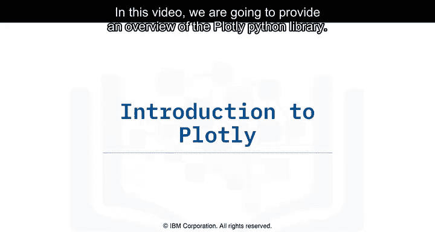

在本节课中，我们将要学习Plotly Python库的基础知识。Plotly是一个功能强大的交互式绘图库，支持多种图表类型，适用于数据科学和可视化任务。

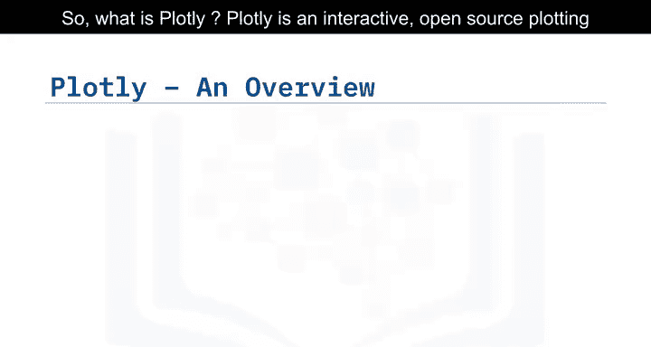

## 🎯 什么是Plotly？

Plotly是一个交互式的开源绘图库，支持超过40种独特的图表类型。它提供Python、R和JavaScript版本。

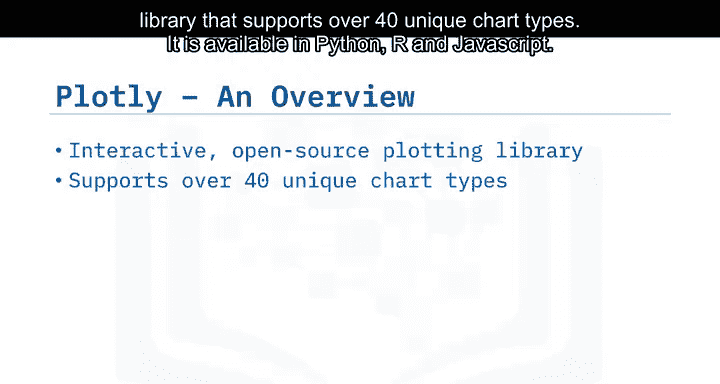

Plotly Python库构建于Plotly JavaScript库之上，包含统计、金融、地图、科学和三维数据等多种图表类型。使用Plotly Python创建的基于Web的可视化图表可以在Jupyter Notebook中显示，保存为独立的HTML文件，或作为使用Dash构建的纯Python Web应用程序的一部分。

本节课的重点将放在Plotly的两个子模块上：`plotly.graph_objects`和`plotly.express`。

## 🔧 Plotly Graph Objects 模块

上一节我们介绍了Plotly的基本概念，本节中我们来看看`plotly.graph_objects`模块。这是用于处理图形、轨迹和布局的低级接口。

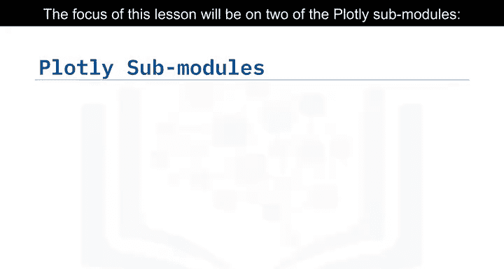

`plotly.graph_objects`模块提供了一个自动生成的类层次结构，称为图形对象，用于表示具有顶层类`plotly.graph_objects.Figure`的图形。

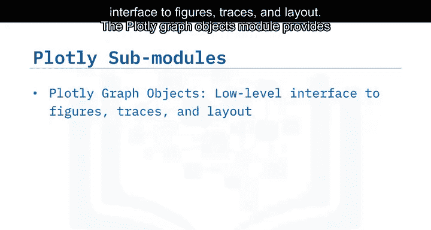

以下是使用`plotly.graph_objects`创建简单折线图的步骤：

首先，导入所需的包。这里我们将`plotly.graph_objects`导入为`go`。

```python
import plotly.graph_objects as go
import numpy as np
```

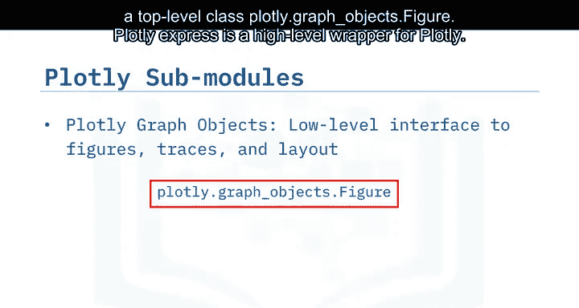

然后，使用NumPy生成样本数据。

```python
x = np.arange(10)
y = np.random.randn(10)
```

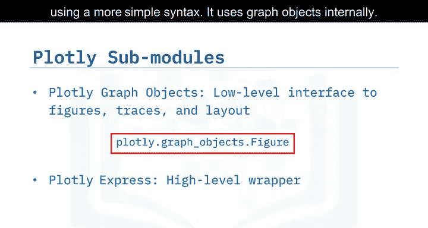

`plotly.graph_objects`包含一个图形对象，它具有字典结构。由于我们在上一张幻灯片中将`plotly.graph_objects`导入为`go`，因此`go`就是图形对象。

通过更新`go.Figure`关键字的值来绘制图表。我们将通过添加散点类型的轨迹来创建图形。

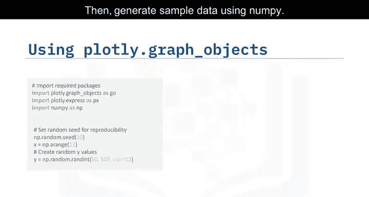

```python
fig = go.Figure(data=go.Scatter(x=x, y=y, mode='lines'))
```

接下来，使用`update_layout`方法更新图形的布局。这里我们更新X轴、Y轴和图表标题。

```python
fig.update_layout(title='简单折线图示例',
                  xaxis_title='X轴',
                  yaxis_title='Y轴')
fig.show()
```

## 🚀 Plotly Express 模块

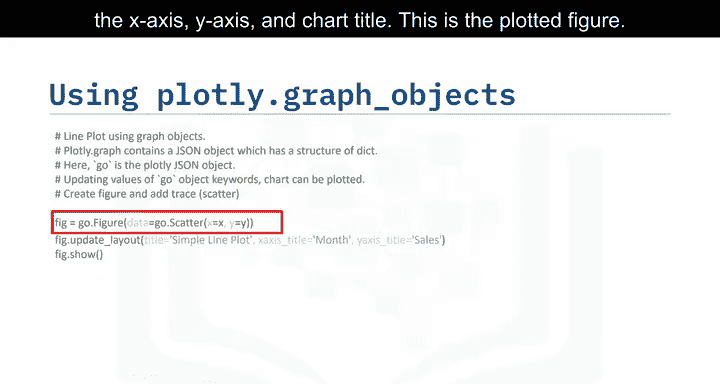

上一节我们使用`graph_objects`创建了图表，本节中我们来看看更高级的`plotly.express`模块。`plotly.express`是Plotly的高级封装，是使用更简单语法创建Plotly提供的大多数常见图形的推荐起点，它在内部使用图形对象。

以下是使用`plotly.express`创建相同折线图的方法：

使用Plotly Express，整个折线图可以通过单个命令创建。可视化自动具有交互性。Plotly Express使可视化易于创建和修改。

```python
import plotly.express as px
import numpy as np

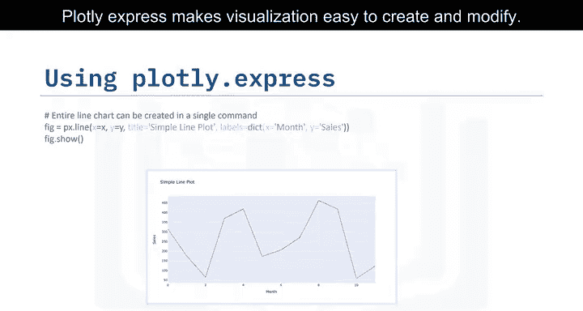

x = np.arange(10)
y = np.random.randn(10)

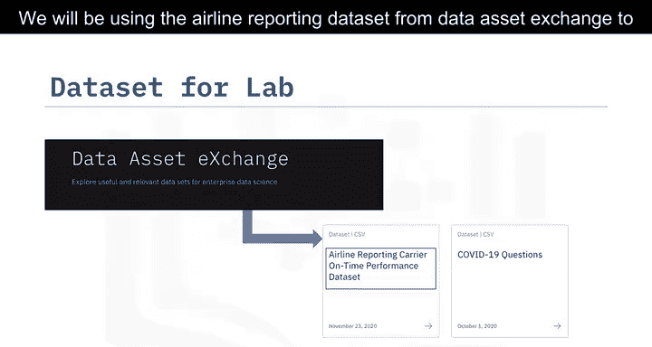

fig = px.line(x=x, y=y, title='使用Plotly Express创建的折线图')
fig.update_layout(xaxis_title='X轴', yaxis_title='Y轴')
fig.show()
```

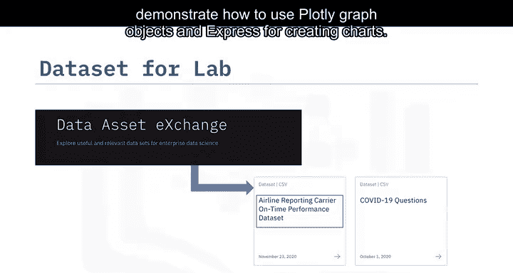

现在是时候动手实践Plotly库了。接下来将是一个实验环节。

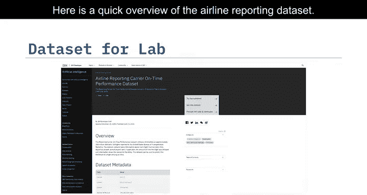

## 🧪 实验环节：使用航空报告数据

我们将使用Data Asset Exchange的航空报告数据库来演示如何使用Plotly图形对象和Express创建图表。

以下是航空报告数据集的简要概述：

报告承运人准点性能数据集包含大约2亿个美国国内航班的信息，这些信息报告给美国运输统计局。数据包含每个航班的基本信息，例如日期、时间、出发机场、到达机场，以及如果适用的话，航班延误的时间和延误原因的信息。

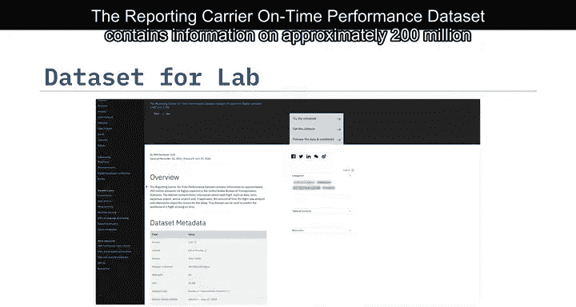

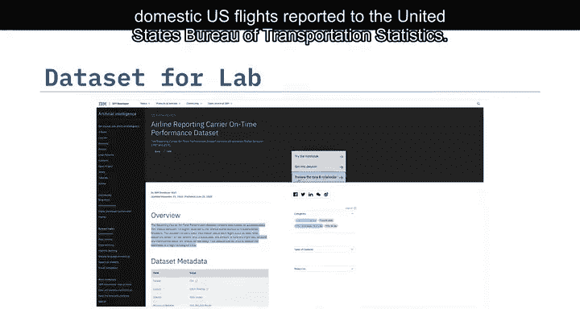

现在让我们开始实验。

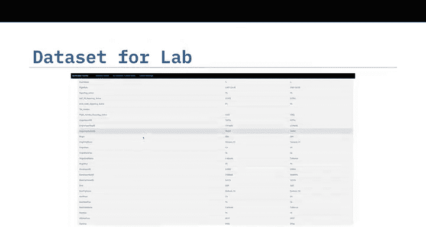

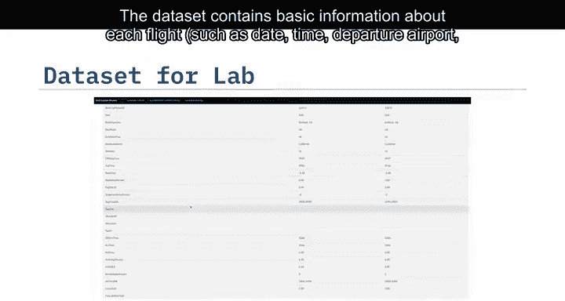

---

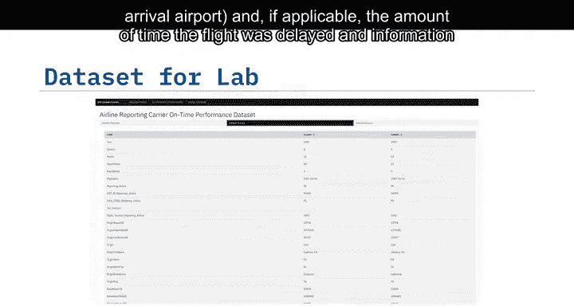

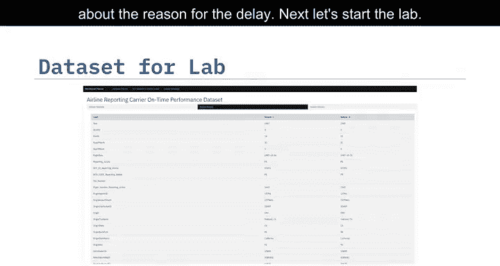

本节课中我们一起学习了Plotly Python库的基础知识，包括`plotly.graph_objects`和`plotly.express`两个核心模块的使用方法。我们了解了如何创建简单的折线图，并介绍了即将在实验环节中使用的航空数据集。Plotly的强大功能和易用性使其成为数据可视化的优秀工具。