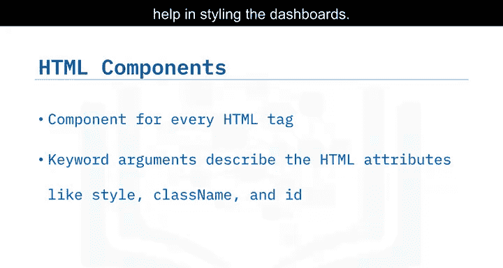
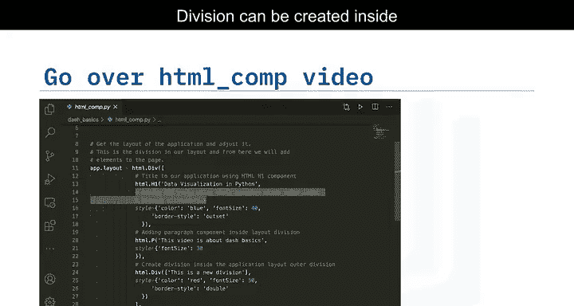
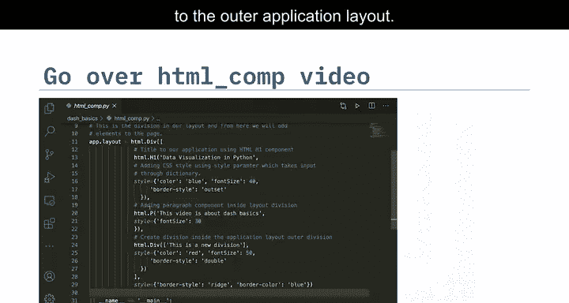
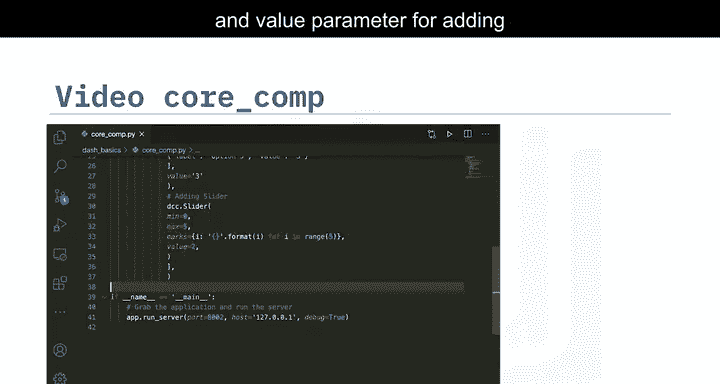

# 020：Dash框架导论 🚀

在本节课中，我们将学习Dash库的概述。Dash是一个开源的Python用户界面库，用于创建响应式的、基于Web的应用程序。它企业级就绪，是Plotly开源工具中的一等成员。Dash应用程序是运行Flask并通过HTTP请求通信JSON数据包的Web服务器。Dash的前端使用React.js渲染组件。使用Dash构建图形用户界面非常容易，因为它抽象了构建应用程序所需的所有技术。Dash是声明式和响应式的。Dash输出可以在Web浏览器中渲染，并可以部署到服务器。Dash使用一个简单的响应式装饰器将代码绑定到UI。这本质上是移动端和跨平台就绪的。

## Dash库概述 📊

上一节我们介绍了Dash的基本概念，本节中我们来看看Dash的核心组成部分。

Dash应用程序由两个主要部分组成：布局和交互性。布局决定了应用程序的外观，包括使用哪些图表以及将它们放置在何处。交互性则允许用户与应用程序进行动态交互。

## Dash的组件构成 🧩

Dash的核心功能通过其组件库实现。主要有两类组件：核心组件和HTML组件。

以下是导入这些组件的标准方式：

```python
import dash_core_components as dcc
import dash_html_components as html
```

### HTML组件

`dash_html_components`库为每一个HTML标签提供了一个组件。你可以使用这个库，通过Python数据结构来组合你的布局。该库为所有HTML标签提供了对应的类。关键字参数描述了HTML属性，如`style`、`className`和`id`。虽然不需要HTML或CSS知识，但它们有助于美化仪表板。

让我们看一个如何使用HTML组件的例子。




我们首先创建一个Dash应用程序。然后，在应用程序布局中创建分区（division），并向其中添加组件。在最外层的分区中，我们首先使用HTML标题组件`H1`为应用程序提供一个名称。`style`参数用于更改标题的字体颜色、大小和边框。接下来，我们将使用HTML段落组件`P`向页面添加段落内容。分区可以嵌套在外部分区内部创建。



在这里，我们为新创建的分区提供内容，并使用`style`参数对其进行样式设置。为了将所有内容整合到应用程序布局中，需要创建一个HTML分区并添加组件。多个分区可以被添加到外部应用程序布局中。


### 核心组件

`dash_core_components`描述了更高级别的交互式组件，这些组件通过React.js库使用JavaScript、HTML和CSS生成。核心组件的一些例子包括创建滑块、输入区域、复选框和日期选择器。你可以使用幻灯片末尾提供的参考链接探索其他组件。



现在，让我们看看如何向应用程序添加滑块和下拉菜单。


对于下拉菜单，我们使用`dcc.Dropdown`组件。我们将在`options`参数下创建一个字典列表作为下拉列表。`label`将保存下拉菜单显示的标签名称，`value`将保存标签的值。我们还可以使用`value`参数提供默认的下拉显示标签。

对于滑块，我们使用`dcc.Slider`组件，并向滑块提供最小值和最大值。`marks`参数用于添加滑块标记，`value`参数用于添加默认值。



## 总结 ✨


本节课中，我们一起学习了Dash框架的基础知识。我们了解了Dash是一个用于构建交互式Web应用的Python库，它由布局（HTML组件）和交互性（核心组件）两部分构成。通过导入`dash_html_components`和`dash_core_components`，我们可以使用Python代码轻松地创建用户界面元素，如标题、段落、下拉菜单和滑块，而无需深入掌握前端技术。Dash的声明式和响应式特性使得构建数据可视化仪表板变得简单高效。