# 021：使用回调函数构建交互式仪表盘

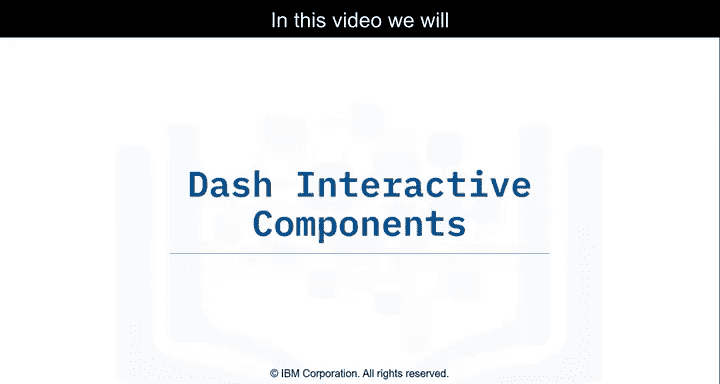

在本节课中，我们将学习如何使用Dash框架中的**回调函数**，将核心组件与HTML组件连接起来，从而创建交互式数据可视化仪表盘。回调函数是Dash实现交互性的核心机制。

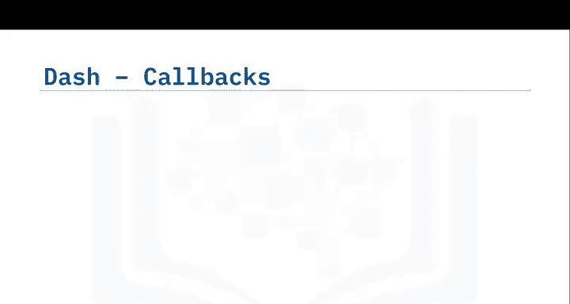

## 🔗 回调函数简介

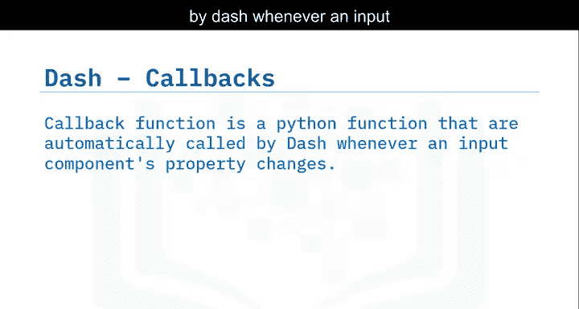

上一节我们介绍了Dash应用的基本布局。本节中我们来看看如何让组件之间“对话”，即响应用户交互。

**回调函数**是一个Python函数，当输入组件的属性发生变化时，Dash会自动调用它。该函数使用 `@app.callback` 装饰器进行装饰。

`@app.callback` 装饰器告诉Dash：每当输入组件的值发生变化时，就调用被装饰器包裹的回调函数，并随之更新应用布局中输出组件的属性。

## 🧱 回调函数的基本结构

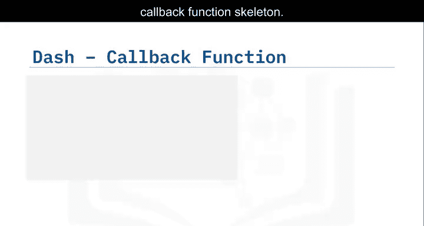

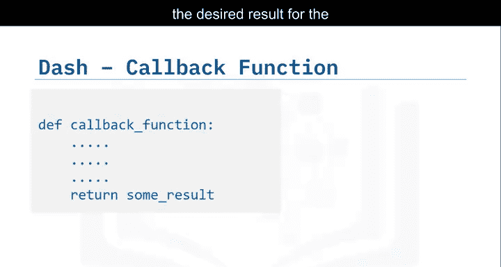

以下是构建回调函数的基本步骤：

首先，创建一个函数，该函数执行操作以返回输出组件所需的理想结果。

```python
def update_output(input_value):
    # 执行一些操作
    result = perform_operation(input_value)
    return result
```

然后，使用 `@app.callback` 装饰器装饰这个回调函数。该装饰器接收两个主要参数：
*   **Output**：将回调函数返回的结果设置给指定ID的组件。
*   **Input**：将提供给回调函数的输入设置为指定ID的组件。

通过这两个参数，我们将输入和输出连接到所需的组件属性。

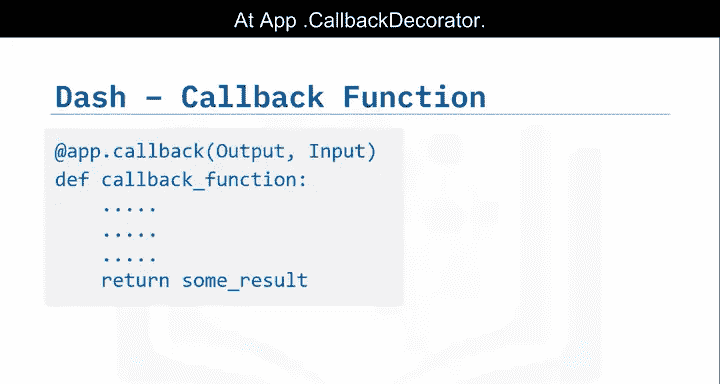

## 📈 实践案例：单输入回调

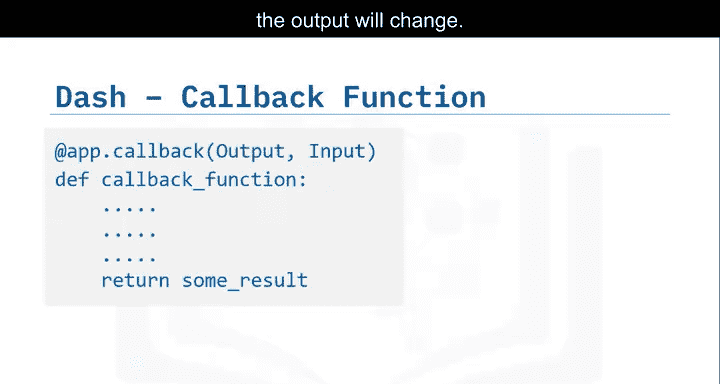

我们将通过一个使用航空公司数据的例子来具体实践。这个用例的目标是：根据用户输入的年份，提取该年份航班数量排名前10的航空公司。输出图表会随着输入年份的变化而更新。

### 步骤一：导入包与加载数据

首先，导入所需的包。除了之前用到的，这里新增了从 `dash.dependencies` 导入 `Input` 和 `Output`，它们将用于回调函数。

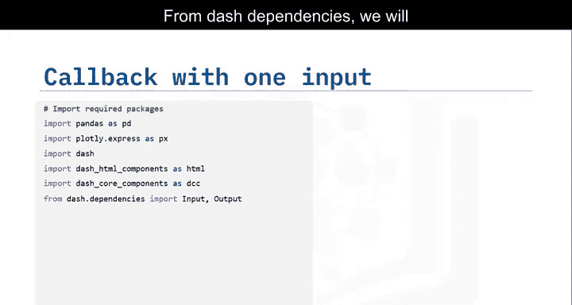

```python
import pandas as pd
import dash
import dash_core_components as dcc
import dash_html_components as html
from dash.dependencies import Input, Output

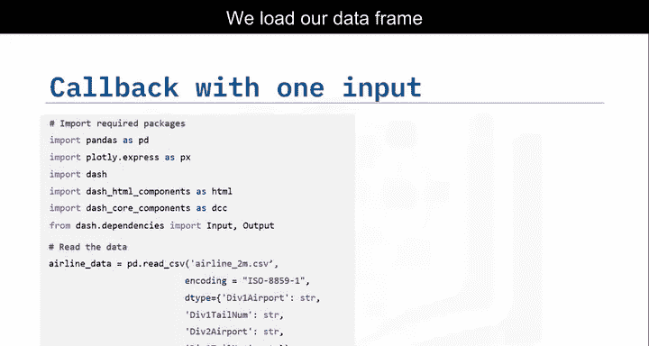

# 将航空公司数据读入Pandas DataFrame
df = pd.read_csv(‘airline_data.csv‘)
```

我们在应用启动时加载数据框，它可以在回调函数内部被读取。

### 步骤二：设计应用布局

我们开始设计Dash应用的布局，添加必要的组件。

```python
app = dash.Dash(__name__)

app.layout = html.Div([
    html.H1(‘航空公司航班数量分析‘, style={‘textAlign‘: ‘center‘}),
    html.Div([
        “输入年份: ”,
        dcc.Input(id=‘input-year‘, value=2010, type=‘number‘)
    ]),
    html.Br(),
    html.Br(),
    dcc.Graph(id=‘bar-plot‘)
])
```

在Dash中，应用的输入和输出就是特定组件的属性。在本例中：
*   我们的**输入**是ID为 `‘input-year‘` 的组件的 `value` 属性（默认值为2010）。我们将在回调函数中更新这个值。
*   我们的**输出**是ID为 `‘bar-plot‘` 的 `dcc.Graph` 组件的 `figure` 属性。

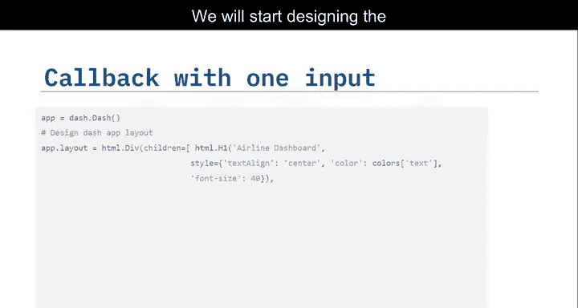

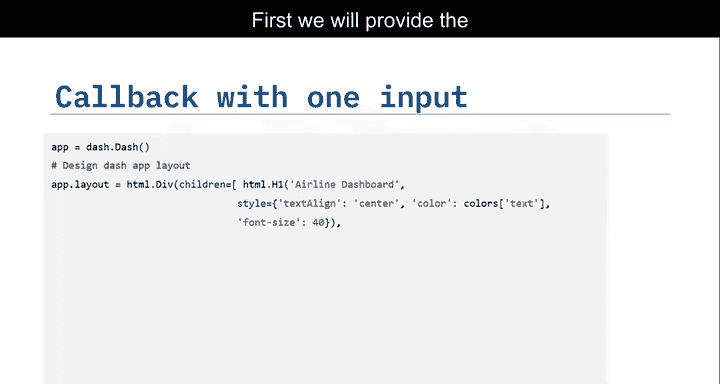

### 步骤三：定义回调函数

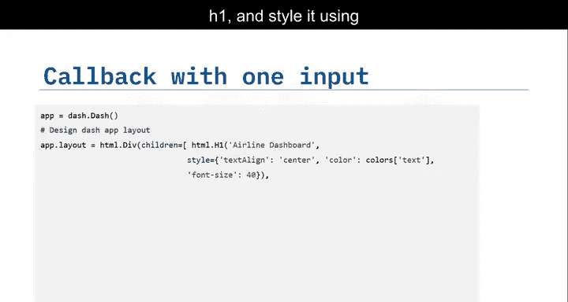

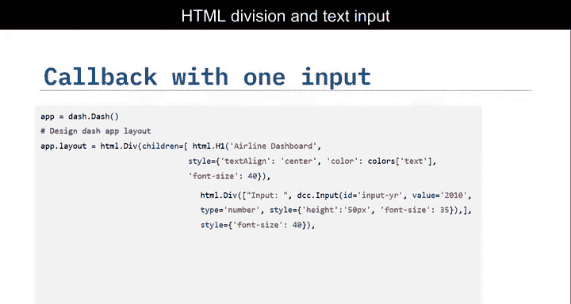

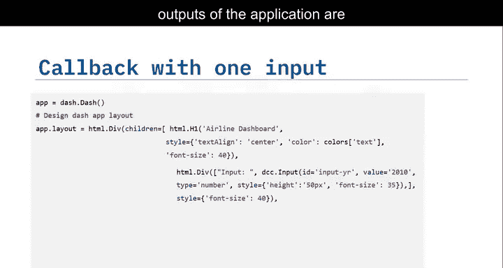

现在，我们添加回调装饰器并定义函数。


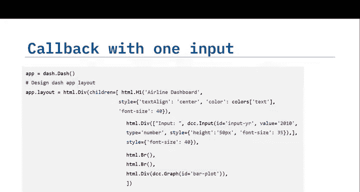

```python
@app.callback(
    Output(component_id=‘bar-plot‘, component_property=‘figure‘),
    Input(component_id=‘input-year‘, component_property=‘value‘)
)
def get_graph(entered_year):
    # 1. 使用输入的年份筛选数据
    df_year = df[df[‘Year‘] == int(entered_year)]
    
    # 2. 按航空公司分组并计算航班数，取前10名
    df_carrier = df_year.groupby(‘Carrier‘)[‘Flights‘].sum().nlargest(10).reset_index()
    
    # 3. 创建条形图
    fig = {
        ‘data‘: [
            {‘x‘: df_carrier[‘Carrier‘], ‘y‘: df_carrier[‘Flights‘], ‘type‘: ‘bar‘, ‘name‘: ‘Flights‘}
        ],
        ‘layout‘: {
            ‘title‘: f‘{entered_year}年航班数量最多的航空公司‘
        }
    }
    return fig
```

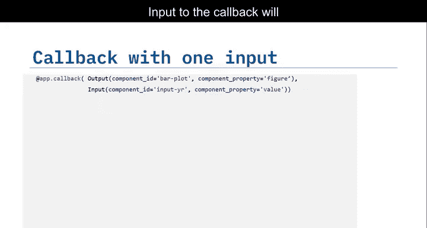

`component_id` 和 `component_property` 关键字是可选的，这里为了清晰而包含。回调函数 `get_graph` 接收输入的年份作为参数，使用该年份从数据中提取所需信息，最后创建并返回更新后的图表。

### 步骤四：运行应用

```python
if __name__ == ‘__main__‘:
    app.run_server(debug=True)
```

这是代码的输出效果。初始输入年份是2010。请注意，当我们更新年份时，图表会相应更新为该年份的数据。

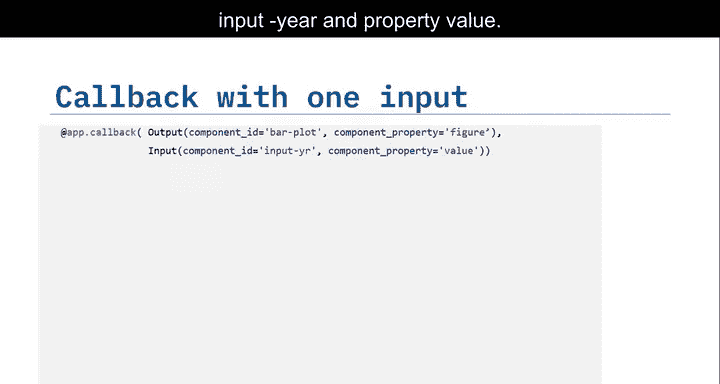

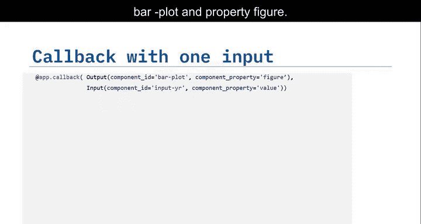

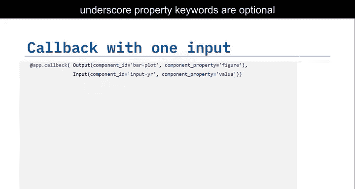

## 🎛️ 实践案例：多输入回调

第二个例子是带有两个输入的回调。它与单输入回调类似，只有几处变化。

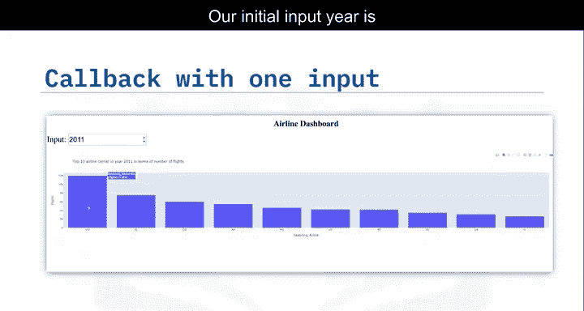

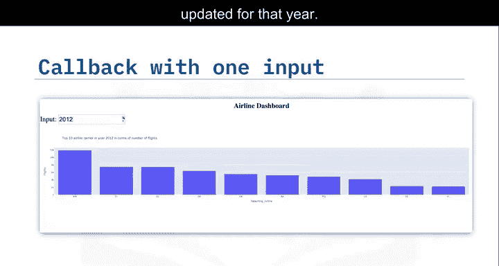

### 更新布局

我们在布局中再添加一个文本输入框。

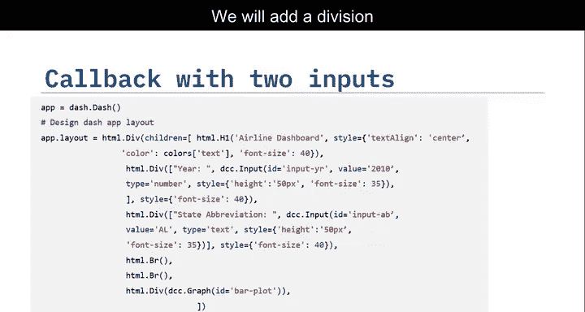

```python
app.layout = html.Div([
    html.H1(‘特定州航空公司分析‘, style={‘textAlign‘: ‘center‘}),
    html.Div([
        “输入年份: ”,
        dcc.Input(id=‘input-year‘, value=2010, type=‘number‘),
        “ 输入州代码 (如 AL): ”,
        dcc.Input(id=‘input-state‘, value=‘AL‘, type=‘text‘)
    ]),
    html.Br(),
    html.Br(),
    dcc.Graph(id=‘bar-plot‘)
])
```

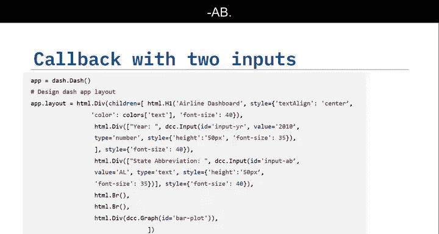

### 更新回调装饰器和函数

现在，我们将新的输入组件ID `‘input-state‘` 添加到装饰器的输入列表中。

```python
@app.callback(
    Output(component_id=‘bar-plot‘, component_property=‘figure‘),
    [Input(component_id=‘input-year‘, component_property=‘value‘),
     Input(component_id=‘input-state‘, component_property=‘value‘)]
)
def get_graph(entered_year, entered_state):
    # 1. 使用输入的年份和州筛选数据
    df_filtered = df[(df[‘Year‘] == int(entered_year)) & (df[‘DestState‘] == entered_state)]
    
    # 2. 按航空公司分组并计算航班数，取前10名
    df_carrier = df_filtered.groupby(‘Carrier‘)[‘Flights‘].sum().nlargest(10).reset_index()
    
    # 3. 创建条形图
    fig = {
        ‘data‘: [
            {‘x‘: df_carrier[‘Carrier‘], ‘y‘: df_carrier[‘Flights‘], ‘type‘: ‘bar‘}
        ],
        ‘layout‘: {
            ‘title‘: f‘{entered_year}年目的地为{entered_state}的航班数量最多的航空公司‘
        }
    }
    return fig
```

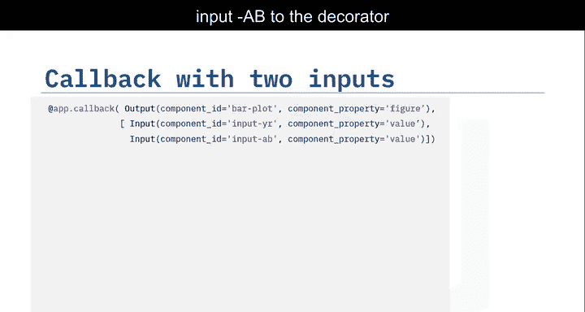

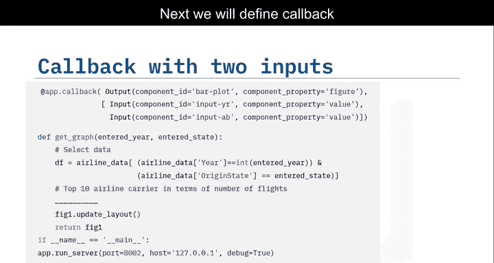

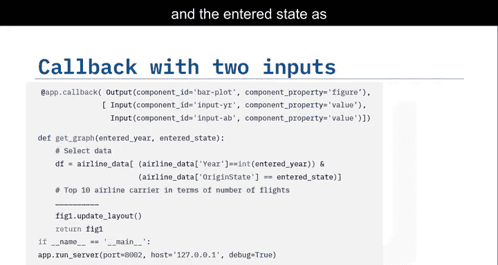

回调函数 `get_graph` 现在接收输入的年份和州作为参数。执行计算以提取信息，并用新图表更新应用布局。

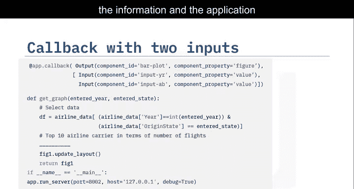

这是代码的输出效果。初始输入年份是2010，州是AL（阿拉巴马州）。当我同时更新年份和州时，可以观察到图表会同步更新。

## 📝 总结

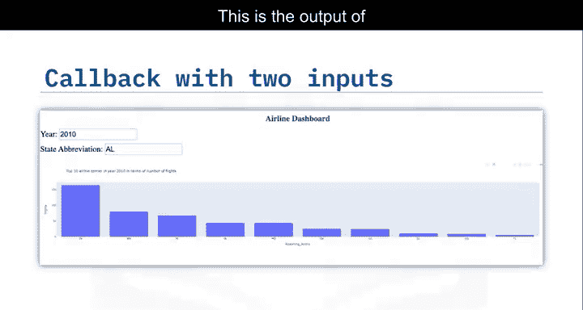

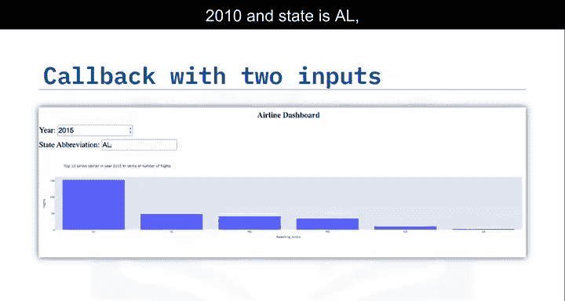

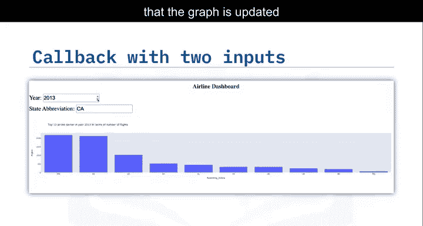

本节课中我们一起学习了Dash中回调函数的核心概念与应用。我们了解到：
1.  回调函数通过 `@app.callback` 装饰器定义，连接输入和输出组件。
2.  **Input** 和 **Output** 对象用于指定哪个组件的哪个属性作为输入和输出。
3.  我们实践了**单输入**和**多输入**两种回调模式，实现了根据用户交互动态更新可视化图表的功能。
4.  回调函数是构建交互式Dash仪表盘的基础，它使得数据可视化从静态展示变为动态探索。

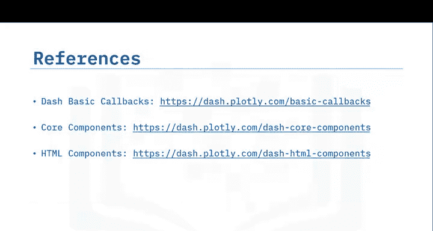

现在，你可以开始动手实验，创建属于自己的交互式数据仪表盘了。