# 001：Python机器学习基础介绍 🎯

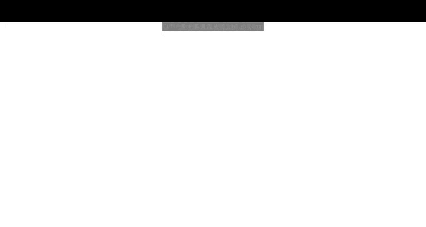

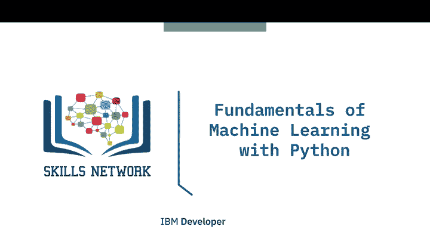

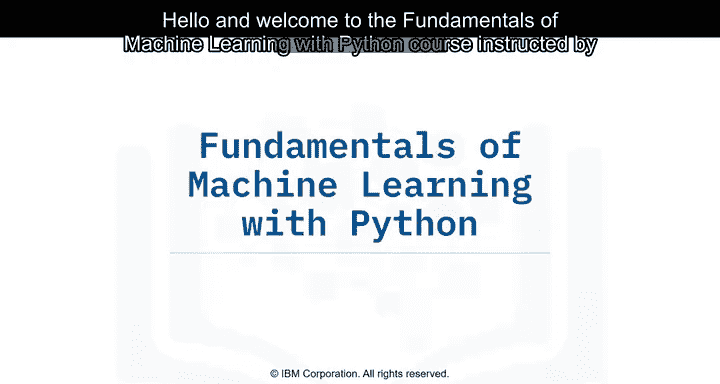

在本课程中，我们将学习机器学习的基础知识，并了解如何应用多种机器学习算法。

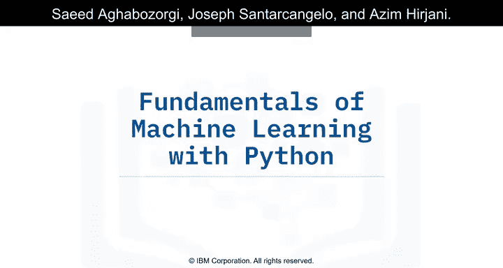

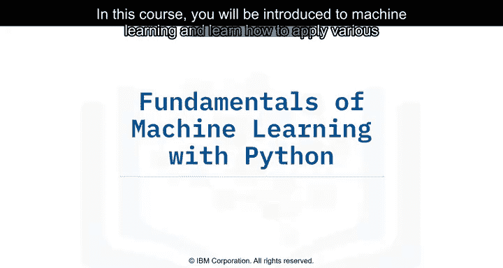

## 课程概述 📋

机器学习广泛应用于众多领域和行业。例如，在自动驾驶汽车行业中，机器学习用于分类驾驶过程中可能遇到的物体，如行人、交通标志和其他车辆。许多云服务提供商，如IBM和亚马逊，也利用机器学习来保护其服务，检测和防止分布式拒绝服务攻击或可疑恶意行为。此外，机器学习还能帮助分析股票数据趋势，辅助交易决策，并协助通过X光扫描识别患者体内的潜在肿瘤。

## 讲师介绍 👨‍🏫

本课程由三位讲师共同指导：

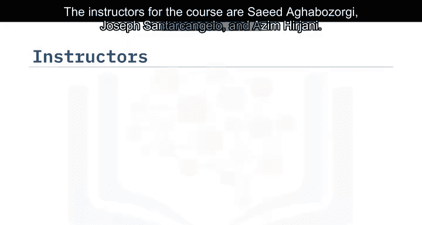

*   **Saeed Aghabozorgi博士**：谷歌高级AIML客户工程师，拥有为IBM和亚马逊云服务开发企业级解决方案的经验，致力于帮助客户将数据转化为可操作的知识。他同时也是人工智能和机器学习领域的研究者。
*   **Joseph Santarcangelo博士**：拥有电气工程博士学位，研究方向集中于利用机器学习、信号处理和计算机视觉来评估视频对人类认知的影响。博士毕业后一直任职于IBM。
*   **Azim Hirjani**：IBM数据科学实习生，负责为多门IBM数据科学课程创建内容。他目前正在多伦多大学攻读计算机科学学士学位。

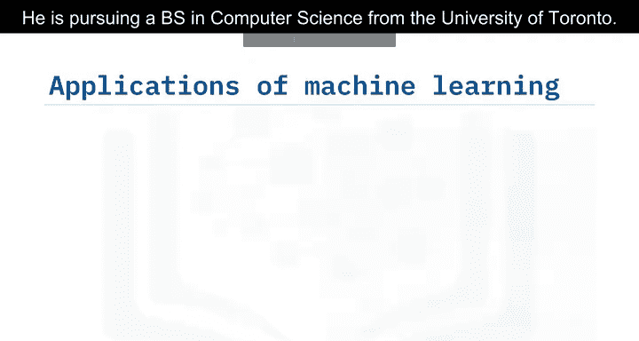

## 课程结构 📚

本课程包含四个模块，每个模块都结合了视频讲解和实践练习，以巩固所学知识。

以下是课程模块的详细内容：

1.  **模块一：介绍与回归**
    *   在本模块中，我们将初步接触机器学习，并重点学习回归算法。

2.  **模块二：分类**
    *   上一模块我们介绍了回归，本节中我们来看看机器学习中的另一大类任务：分类。本模块将涵盖多种分类算法。

3.  **模块三：聚类**
    *   在学习了监督学习（回归与分类）之后，本模块我们将探索无监督学习的一个重要分支：聚类。

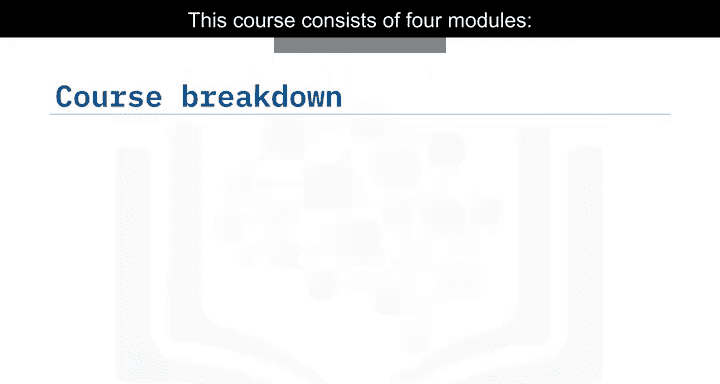

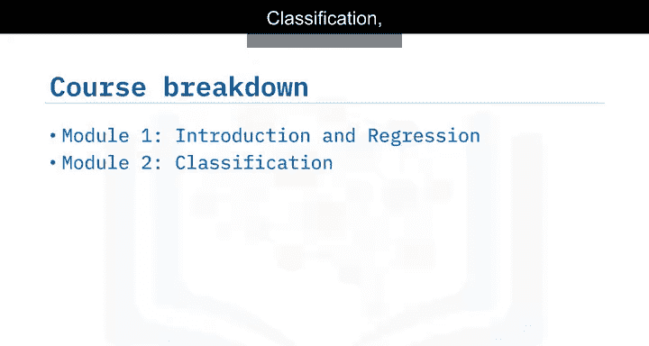

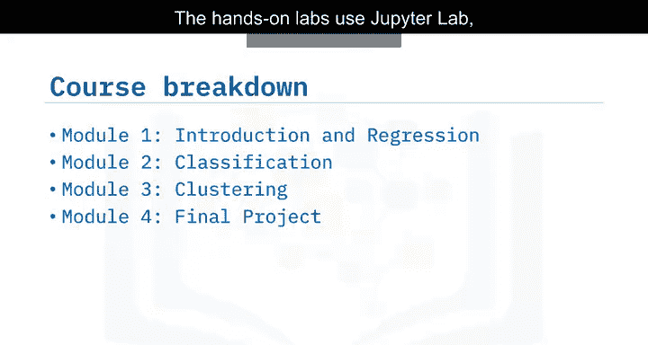

4.  **模块四：最终项目**
    *   在掌握了核心算法后，本模块将通过一个综合项目来应用所学知识，预测澳大利亚是否会下雨。

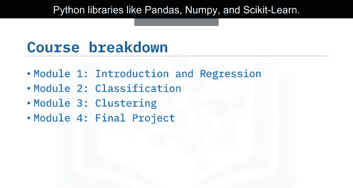

所有实践练习将在 **Skills Network Labs** 提供的 **Jupyter Lab** 环境中进行，主要使用 **Python** 编程语言及相关的数据科学库，例如 `pandas`、`numpy` 和 `scikit-learn`。

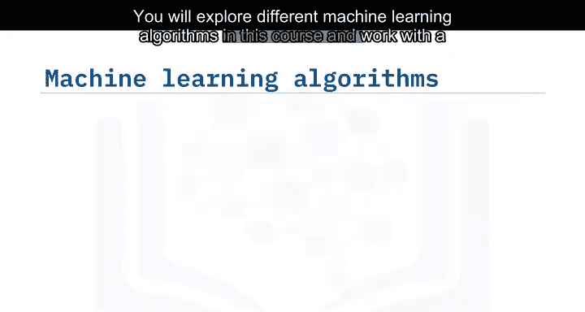

## 实践案例与数据集 🔬

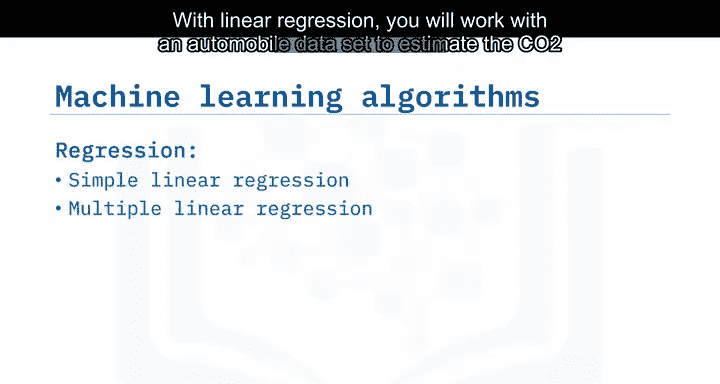

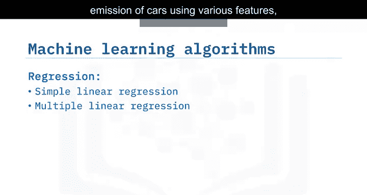

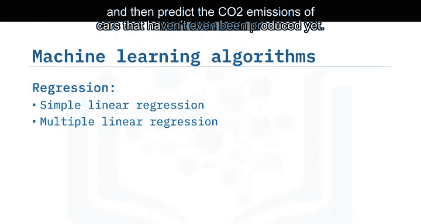

在本课程中，我们将探索不同的机器学习算法，并使用多种数据集来帮助理解和应用机器学习。

以下是本课程将涉及的主要实践案例：

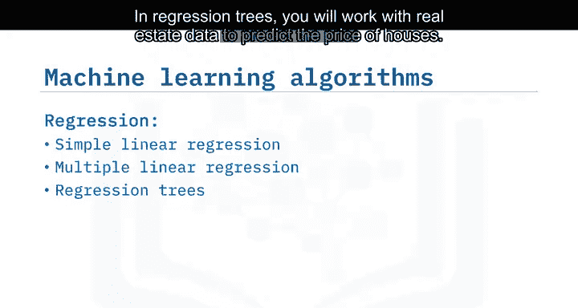

*   **线性回归**：使用汽车数据集，根据车辆特征（如发动机大小、气缸数）估计其二氧化碳排放量，公式可表示为 `CO2 = β0 + β1 * Feature1 + ... + βn * FeatureN`。目标是预测尚未生产的汽车的排放量。
*   **回归树**：使用房地产数据预测房屋价格。
*   **逻辑回归**：使用电信公司的客户数据，预测客户是否会流失（客户忠诚度）。
*   **K最近邻算法**：使用电信客户数据对客户进行分类。
*   **支持向量机**：对人类细胞样本进行分类，判断其为良性还是恶性。
*   **多类别预测**：使用经典的鸢尾花数据集，对不同类型的鸢尾花进行分类。
*   **决策树**：构建一个模型，根据患者特征决定应使用哪种药物。
*   **K均值聚类**：学习将客户数据集分割成具有相似特征的群体。

## 学习目标 🎓

完成本课程后，你将能够：

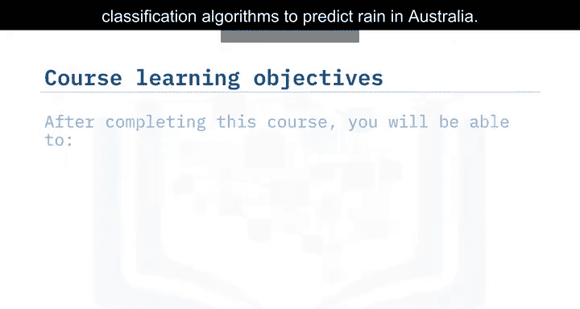

*   解释、比较和对比各种机器学习的主题与概念，例如**监督学习**、**无监督学习**、**分类**、**回归**和**聚类**。
*   描述各种机器学习算法的工作原理。
*   最终，学会使用Python及相关库（如`scikit-learn`）来应用这些机器学习算法。

## 总结

本节课中，我们一起学习了《Python机器学习基础》课程的概览。我们了解了机器学习的广泛应用、认识了课程讲师、明确了由四个模块（介绍与回归、分类、聚类、最终项目）组成的课程结构，并预览了将使用不同数据集进行实践的各种算法案例。最后，我们明确了完成本课程后能够达到的学习目标，为后续深入学习打下了基础。