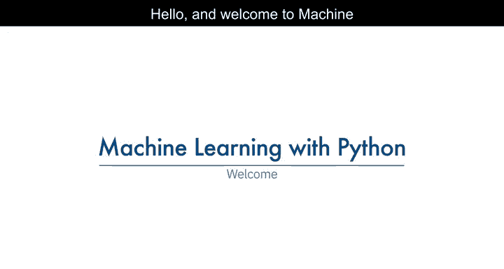
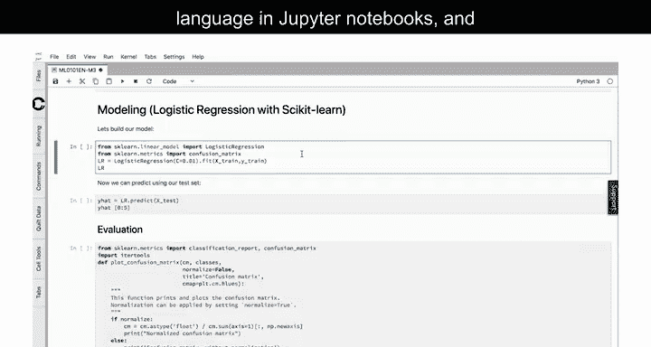
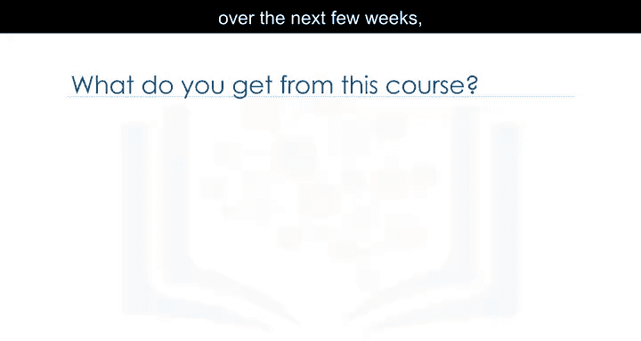
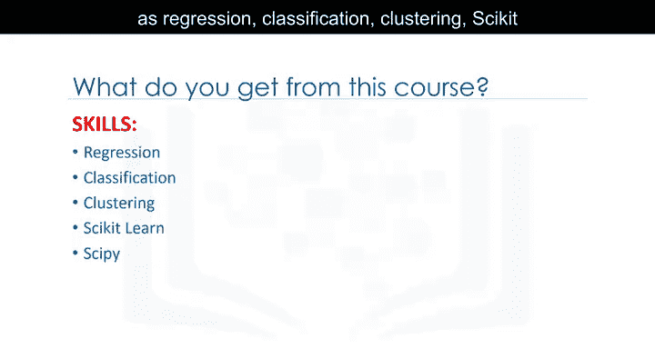
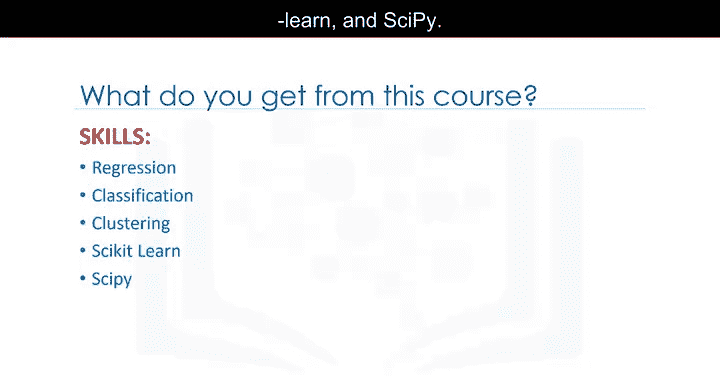
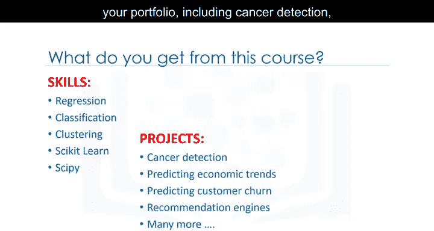
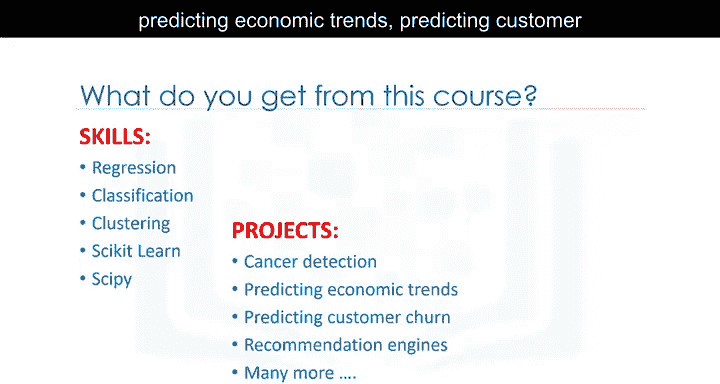

# 002：1_导论 🎯

在本节课中，我们将要学习机器学习在多个关键领域和行业中的应用，并了解如何使用Python及其流行库来构建机器学习模型。课程将涵盖从基础概念到实际应用的全面内容，帮助初学者掌握机器学习的核心技能。

---

机器学习在医疗健康领域扮演着关键角色。数据科学家利用机器学习预测被认为有患癌风险的人类细胞是良性还是恶性。因此，机器学习在决定个人健康与福祉方面具有重要作用。

上一节我们介绍了机器学习在医疗领域的应用，本节中我们来看看决策树的价值。构建一个基于历史数据的良好决策树，能帮助医生为每位患者开具合适的药物。

以下是决策树在医疗中的具体应用方式：
*   分析患者历史数据。
*   根据特征（如症状、检测结果）构建树状决策模型。
*   输出针对性的治疗或用药建议。

---

银行家利用机器学习来决定是否批准贷款申请。此外，机器学习还用于银行客户细分，这对于处理海量且多样的数据通常并不容易。

以下是机器学习在金融领域的两个主要应用：
1.  **信用风险评估**：使用客户数据（如收入、信用历史）构建模型，预测贷款违约风险。
2.  **客户细分**：通过聚类算法（如K-Means），将客户划分为不同群体，以便提供个性化服务。

---

YouTube、亚马逊或Netflix等网站利用机器学习向客户推荐各种产品或服务，例如他们可能感兴趣的电影或值得购买的书籍。机器学习的功能非常强大。

以下是推荐系统的基本原理：
*   系统分析用户的历史行为数据（如观看记录、购买历史）。
*   使用协同过滤或内容过滤等算法。
*   预测并推荐用户可能感兴趣的新项目。

---

我们将学习如何使用流行的Python库来构建模型。例如，给定一个汽车数据集，我们可以使用Scikit-learn库，根据发动机尺寸或气缸数来估算汽车的二氧化碳排放量。

我们甚至可以预测尚未生产的汽车的二氧化碳排放量。此外，我们将看到电信行业如何预测客户流失。

本课程内置实验环境，您可以运行和练习所有这些示例的代码。无需在计算机上安装任何软件或在云端进行任何操作。您只需点击一个按钮，即可在浏览器中启动实验环境。示例代码已使用Python语言在Jupyter Notebook中编写，您可以运行它以查看结果，或修改它以更好地理解算法。

---

那么，学习本课程能达到什么目标？在接下来的几周里，每周只需投入几个小时，您就能获得可以添加到简历中的新技能，例如回归、分类、聚类、Scikit-learn和SciPy。

您还将获得可以添加到作品集中的新项目，包括癌症检测、预测经济趋势、预测客户流失、推荐引擎等等。

---

您还将获得机器学习证书，以证明您的能力，并可以在任何您喜欢的地方在线或离线分享它，例如LinkedIn个人资料和社交媒体。

---

本节课中我们一起学习了机器学习在医疗、金融、娱乐等领域的广泛应用，并了解了本课程将如何通过Python和Scikit-learn等工具，带领我们从理论到实践，掌握回归、分类、聚类等核心技能，最终完成实际项目并获得认证。现在，让我们开始学习吧。