# 003：机器学习导论 🧠

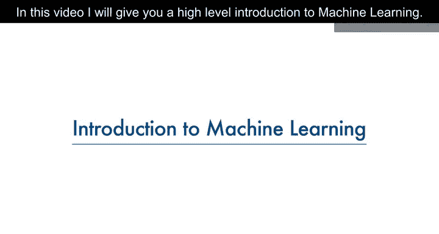

在本节课中，我们将要学习机器学习的基本概念、定义、应用领域以及它与人工智能、深度学习的关系。我们将通过一个医学诊断的实例来理解机器学习如何工作，并介绍几种常见的机器学习技术。

---

## 概述

机器学习是计算机科学的一个分支，它使计算机能够在没有明确编程的情况下进行学习。本节课将通过一个具体的例子——使用细胞特征预测肿瘤是良性还是恶性——来阐述机器学习的基本流程和核心思想。

上一节我们介绍了课程的整体安排，本节中我们来看看机器学习的核心定义和工作原理。

## 什么是机器学习？🤔

这是一张从患者体内提取的人类细胞样本图像。该细胞具有多种特征，例如：
*   其**团块厚度**为 6。
*   其**细胞大小均匀性**为 1。
*   其**边缘粘附度**为 1。

此时我们可以提出一个关键问题：这是一个**良性**细胞还是**恶性**细胞？与良性肿瘤不同，恶性肿瘤可能会侵入周围组织或扩散到全身，早期诊断可能是患者生存的关键。

人们可能轻易地认为，只有拥有多年经验的医生才能诊断该肿瘤并判断患者是否患有癌症。然而，假设我们获得了一个数据集，其中包含数千个被认为有患癌风险的患者细胞样本的特征。

对原始数据的分析表明，许多特征在良性和恶性样本之间存在显著差异。我们可以利用这些细胞特征值，对其他患者的新样本进行早期预测，判断其是良性还是恶性。

这个过程需要：清洗数据、选择合适的算法来构建预测模型、训练模型以理解数据中良性和恶性细胞的模式。模型经过迭代数据训练后，就可以用于以相当高的准确度预测新的或未知的细胞。**这就是机器学习**。它展示了机器学习模型如何执行医生的任务，或至少帮助医生加快诊断过程。

现在，让我们给出机器学习的正式定义：

> **机器学习是计算机科学的一个子领域，它使计算机能够在没有明确编程的情况下进行学习。**

## “没有明确编程”的含义 🧩

为了解释“没有明确编程”的含义，我们假设有一个包含猫和狗等动物图像的数据集，并且我们希望开发一个能够识别和区分它们的软件或应用程序。

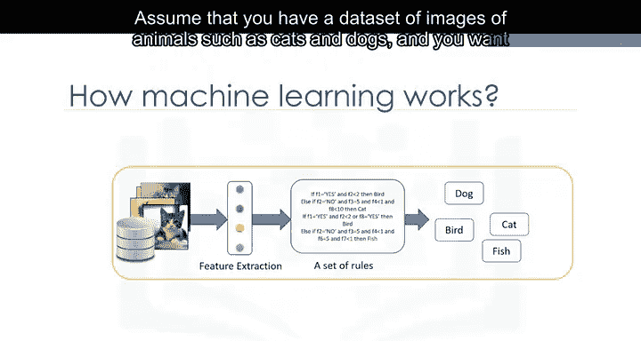
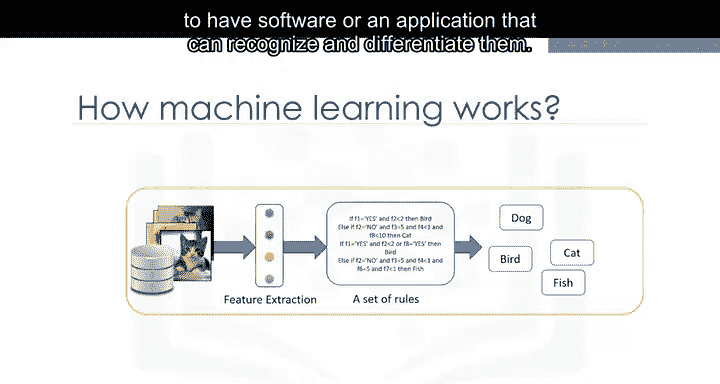

首先，我们需要将图像解释为一组**特征集**。例如：
*   图像是否显示动物的眼睛？如果有，大小是多少？
*   它有耳朵吗？
*   有尾巴吗？
*   有多少条腿？
*   有翅膀吗？

在机器学习出现之前，每张图像都会被转换成一个特征向量。传统上，我们必须编写一些规则或方法，以使计算机变得智能并检测动物。

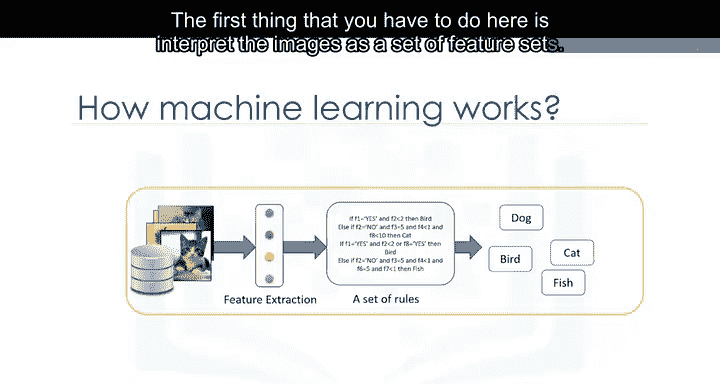

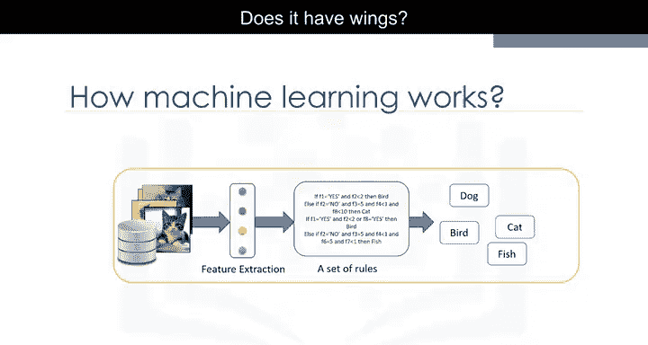
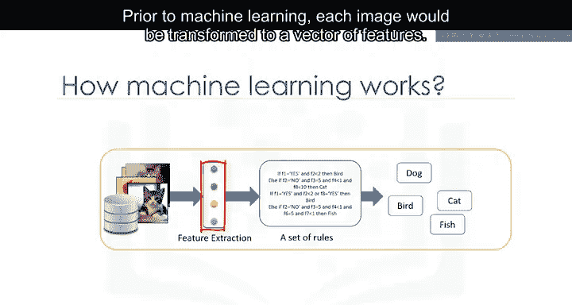
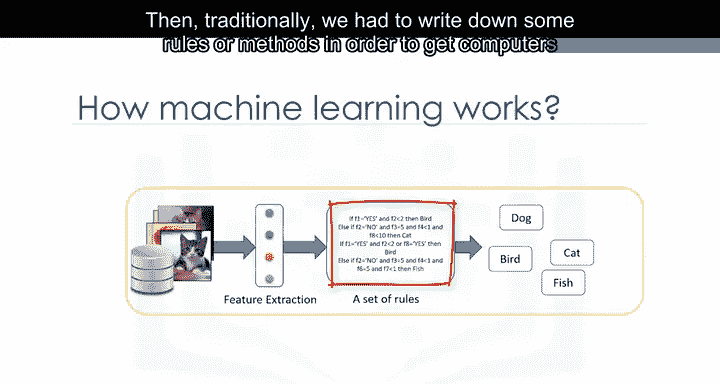

但这种方法失败了。原因在于它需要大量规则，高度依赖当前数据集，并且泛化能力不足，无法检测样本外的情况。

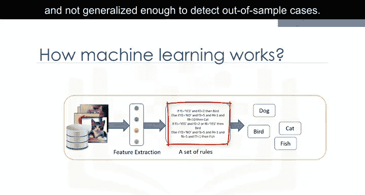

这时，机器学习登场了。

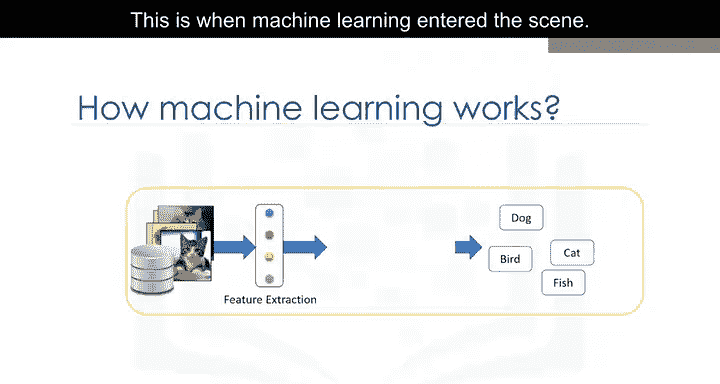

使用机器学习，我们可以构建一个模型。该模型会查看所有特征集及其对应的动物类型，并学习每种动物的模式。

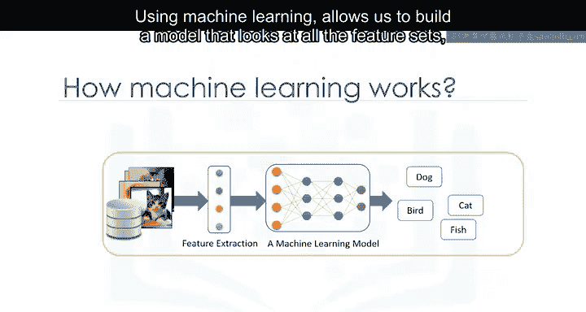
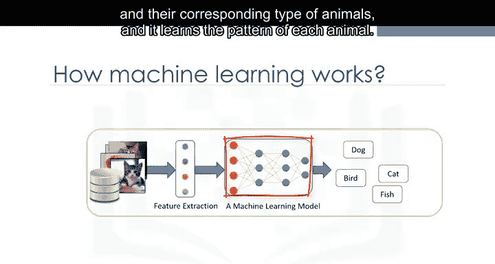

这是一个由机器学习算法构建的模型。它能够进行检测，而无需被明确编程来实现此功能。本质上，机器学习遵循的是一个四岁儿童学习、理解和区分动物时所使用的相同过程。

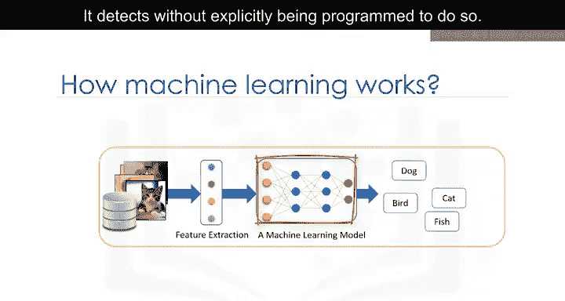
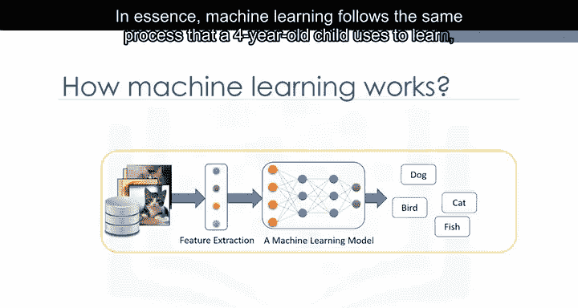
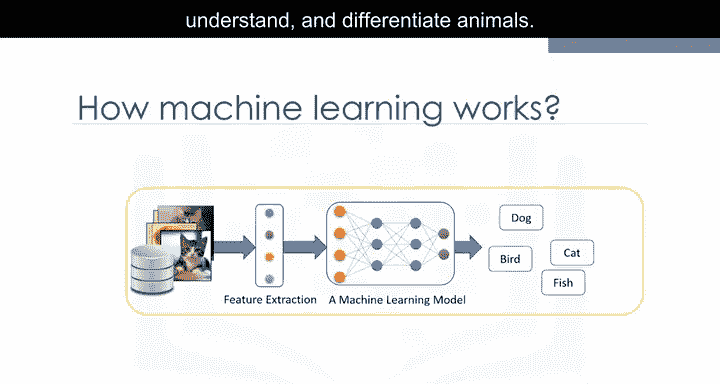

因此，受人类学习过程启发的机器学习算法，能够从数据中迭代学习，并让计算机发现隐藏的洞察。

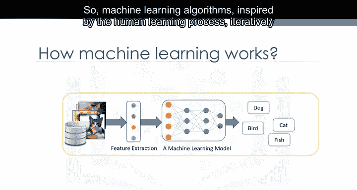
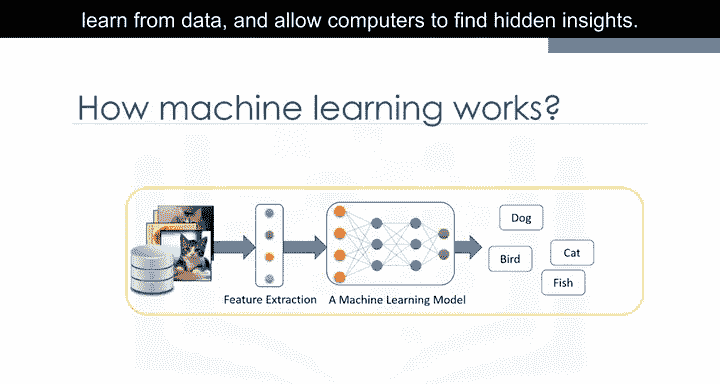

这些模型在多种任务中帮助我们，例如**物体识别**、**摘要总结**、**推荐系统**等。

## 机器学习的应用实例 🌍

机器学习以非常有影响力的方式影响着社会。以下是一些现实生活中的例子：

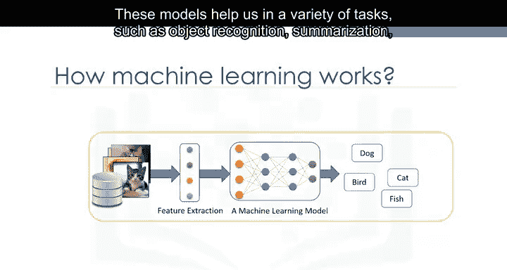

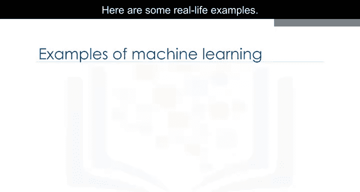

**首先，Netflix 和亚马逊如何向用户推荐视频、电影和电视节目？**
它们使用机器学习来生成你可能喜欢的建议。

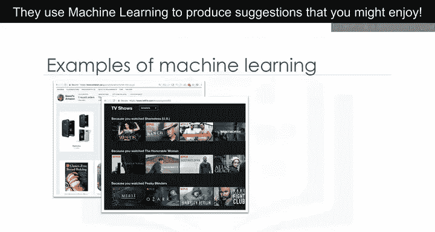

这类似于你的朋友根据他们对你喜好的了解，向你推荐电视节目。

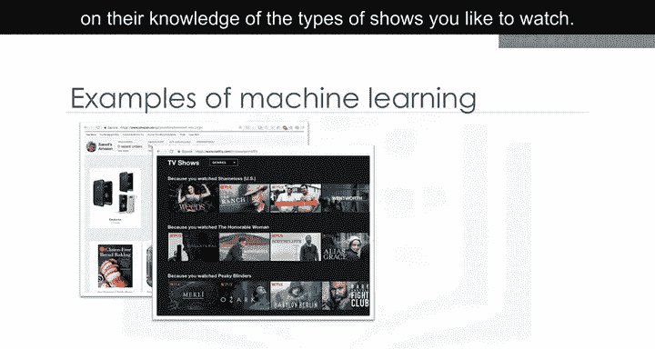

**银行在审批贷款申请时如何做决定？**
它们使用机器学习来预测每位申请人的违约概率，然后根据该概率批准或拒绝贷款申请。

**电信公司**利用客户的人口统计数据对其进行细分，或预测他们下个月是否会取消订阅。

在我们的日常生活中，每天都能看到许多其他机器学习应用，例如**聊天机器人**、**手机人脸识别登录**，甚至**电脑游戏**中的面部识别。

## 常见的机器学习技术 📊

这些应用各自使用不同的机器学习技术和算法。让我们快速了解几种更流行的技术。

以下是几种主要的机器学习技术类型：

**1. 回归**
*   **用途**：用于预测连续值。
*   **示例**：根据房屋特征预测其价格，或估算汽车发动机的二氧化碳排放量。
*   **核心概念**：`预测值 = f(特征1， 特征2， ...)`

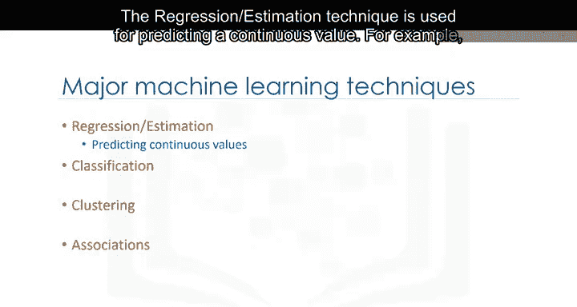

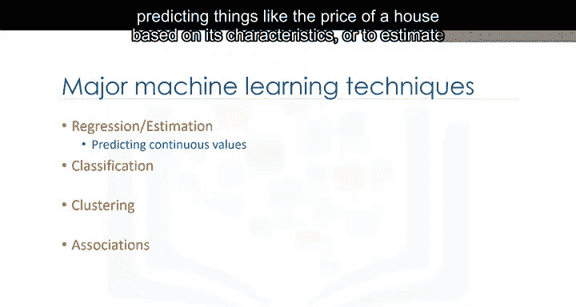

**2. 分类**
*   **用途**：用于预测样本的类别或分类。
*   **示例**：判断细胞是良性还是恶性，或预测客户是否会流失。
*   **核心概念**：`类别 = argmax( P(类别 | 特征) )`

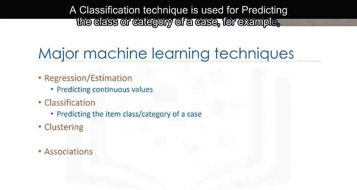

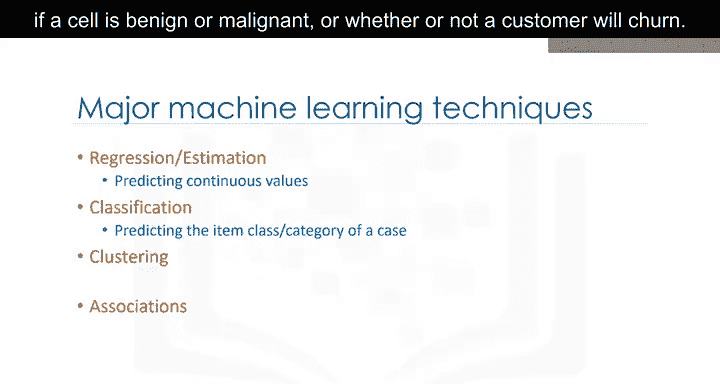

**3. 聚类**
*   **用途**：将相似的样本分组。
*   **示例**：寻找相似的患者，或在银行领域用于客户细分。

**4. 关联规则**
*   **用途**：发现经常共同出现的物品或事件。
*   **示例**：特定顾客通常一起购买的杂货商品。

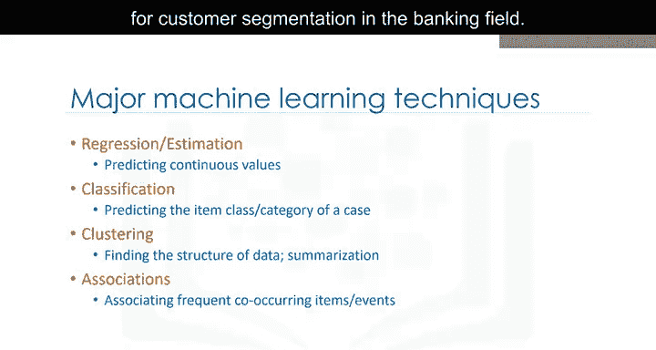

**5. 异常检测**
*   **用途**：发现异常和不寻常的案例。
*   **示例**：用于信用卡欺诈检测。

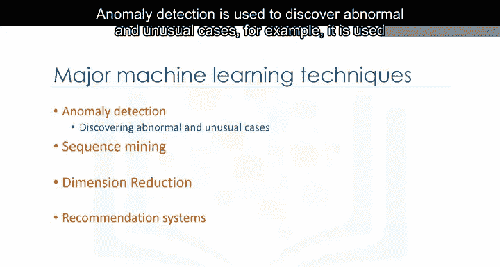

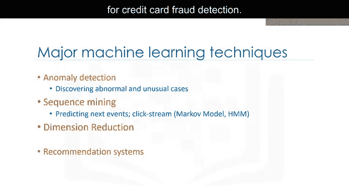

**6. 序列挖掘**
*   **用途**：预测下一个事件。
*   **示例**：网站上的点击流预测。

**7. 降维**
*   **用途**：减少数据的大小。

**8. 推荐系统**
*   **用途**：将人们的偏好与具有相似品味的人关联起来，并向他们推荐新物品，例如书籍或电影。

我们将在后续视频中详细介绍其中一些技术。

## 人工智能、机器学习与深度学习 🤖

说到这里，我相信这个问题已经出现在你的脑海中：我们经常听到的这些流行词——**人工智能**、**机器学习**和**深度学习**——之间有什么区别？

让我解释一下它们之间的不同。简而言之：

*   **人工智能** 试图使计算机智能化，以模仿人类的认知功能。因此，人工智能是一个范围广泛的通用领域，包括计算机视觉、语言处理、创造力和摘要总结。
*   **机器学习** 是人工智能的一个分支，涵盖了人工智能的统计部分。它通过让计算机查看成百上千个示例、从中学习，然后利用这些经验在新情况下解决相同的问题。
*   **深度学习** 是机器学习中一个非常特殊的领域，计算机实际上可以自主学习并做出智能决策。与大多数机器学习算法相比，深度学习涉及更深层次的自动化。

## 总结与展望 🚀

现在我们已经完成了对机器学习的介绍，后续视频将重点回顾两个主要部分：

1.  你将学习机器学习的目的及其在现实世界中的应用场景。
2.  你将获得对机器学习主题的总体概述，例如**监督学习与无监督学习**、**模型评估**以及各种**机器学习算法**。

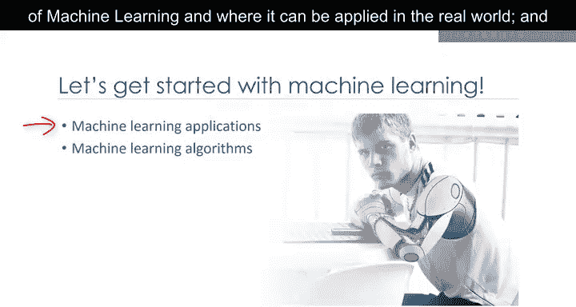

现在你已经对这段学习旅程的内容有了初步了解，让我们继续探索机器学习的奥秘。

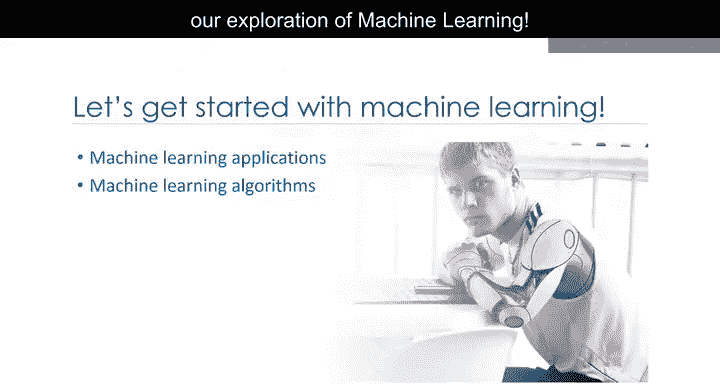

本节课中，我们一起学习了机器学习的核心定义，理解了它如何通过从数据中学习模式来解决问题，而无需明确编程。我们探讨了机器学习在医疗诊断、推荐系统等领域的应用，并简要介绍了回归、分类、聚类等主要技术。最后，我们厘清了人工智能、机器学习和深度学习三者之间的关系。