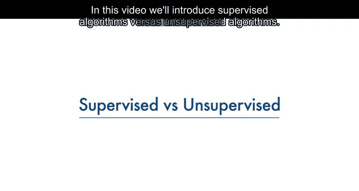
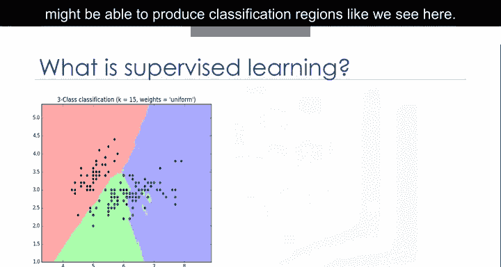
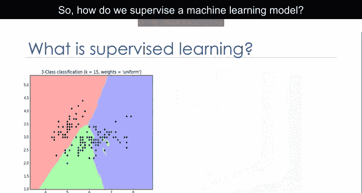
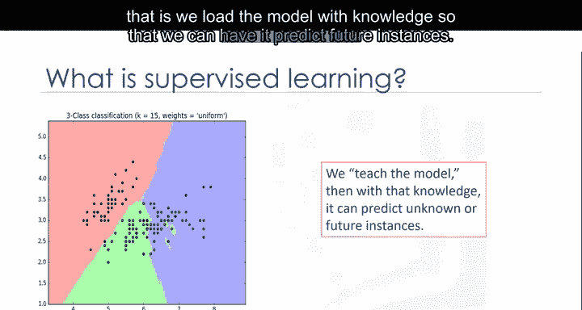
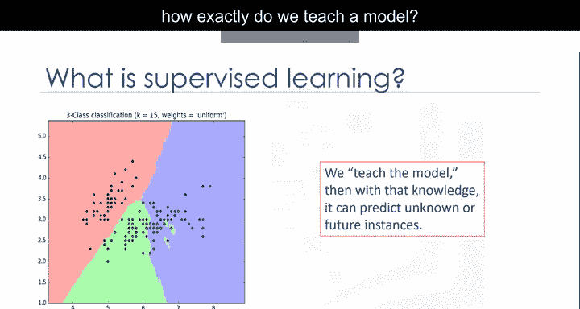
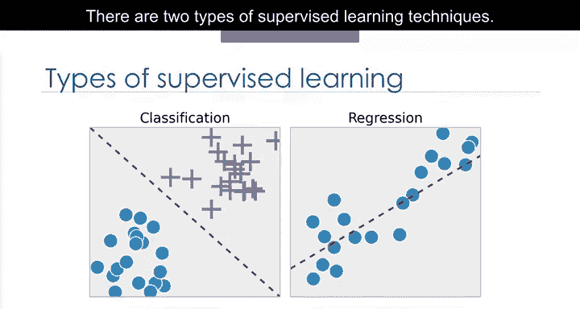

# 005：监督式与非监督式学习 🧠

在本节课中，我们将学习机器学习中两个核心范式：监督式学习与非监督式学习。我们将了解它们的基本概念、区别以及各自的应用场景。

---

## 概述：什么是监督式学习？ 👀

理解监督式学习概念的一个简单方法是直接观察构成它的词语。

“监督”意味着观察并指导一项任务、项目或活动的执行。

显然，我们并非要监督一个人。相反，我们将监督一个机器学习模型，该模型可能能够生成我们在此处看到的分类区域。

那么，我们如何监督一个机器学习模型呢？

我们通过**教导模型**来实现这一点，即我们为模型加载知识，以便让它预测未来的实例。但这引出了下一个问题：我们究竟如何教导一个模型？

---

## 教导模型：使用标记数据集 📊

我们通过使用来自**标记数据集**的一些数据来训练模型，从而教导它。需要注意的是，数据是**标记过的**。

一个标记数据集看起来是什么样子？它可能类似于这样。这个例子取自癌症数据集。如你所见，我们有一些患者的历史数据，并且我们已经知道每一行的类别。

让我们先介绍这个表格的一些组成部分。出现在这里的名称，如“肿块厚度”、“细胞大小均匀性”、“细胞形状均匀性”、“边缘粘附”等，被称为**属性**。列被称为**特征**，其中包含数据。如果你绘制这些数据并查看图表上的单个数据点，它将拥有所有这些属性。这构成了图表上的一行，也称为一个**观测值**。

直接查看数据的值，可以有两种类型。第一种是**数值型**。在处理机器学习时，最常用的数据是数值型的。第二种是**分类型**。也就是说，它是非数值型的，因为它包含字符而非数字。在本例中，它是分类的，因为该数据集是为分类而构建的。

---

## 监督式学习的两大技术 🎯

监督式学习技术有两种类型：分类和回归。

**分类**是预测一个离散的类别标签或分类的过程。

**回归**是预测一个连续值的过程，与分类中预测分类值相反。

请看这个数据集。它与不同汽车的二氧化碳排放量有关。它包括各种汽车型号的发动机尺寸、气缸数、油耗和二氧化碳排放量。给定这个数据集，你可以使用回归，通过其他字段（如发动机尺寸或气缸数）来预测一辆新车的二氧化碳排放量。

---

## 过渡到非监督式学习 🔄

既然我们知道了监督式学习的含义，你认为非监督式学习是什么意思？是的，非监督式学习正如其名。我们**不监督**模型，而是让模型自行工作，以发现人眼可能无法看到的信息。

这意味着非监督式算法在数据集上进行训练，并对**未标记的数据**得出结论。

一般来说，非监督式学习比监督式学习拥有更复杂的算法，因为我们对数据或预期结果知之甚少。

---

## 非监督式学习的主要技术 🧩

以下是几种最广泛使用的非监督式机器学习技术：

*   **降维**：降维和/或特征选择在其中扮演重要角色，通过减少冗余特征使分类更容易。
*   **市场篮子分析**：这是一种建模技术，基于这样的理论：如果你购买某一组商品，你更有可能购买另一组商品。
*   **密度估计**：这是一个非常简单的概念，主要用于探索数据以发现其中的某些结构。
*   **聚类**：聚类被认为是最流行的非监督式机器学习技术之一，用于以某种方式对相似的数据点或对象进行分组。

聚类分析在不同领域有许多应用，无论是银行希望根据某些特征细分其客户，还是帮助个人组织并分组他或她最喜欢的音乐类型。

一般来说，聚类主要用于发现结构、总结和异常检测。

---

## 总结与对比 📝

本节课中我们一起学习了监督式学习与非监督式学习的核心内容。

总而言之，监督式学习和非监督式学习之间最大的区别在于：**监督式学习处理标记数据，而非监督式学习处理未标记数据**。

在监督式学习中，我们有用于分类和回归的机器学习算法。在非监督式学习中，我们有诸如聚类等方法。

与监督式学习相比，非监督式学习的模型更少，可用于确保模型结果准确的评估方法也更少。因此，非监督式学习创造了一个可控性较低的环境，因为机器在为我们创造结果。