# 008：回归模型评估 📊

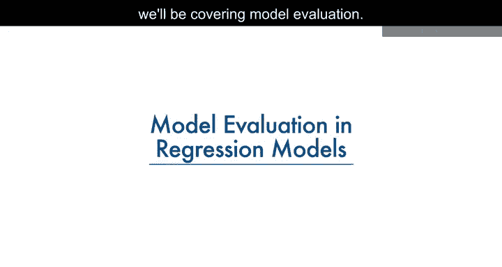

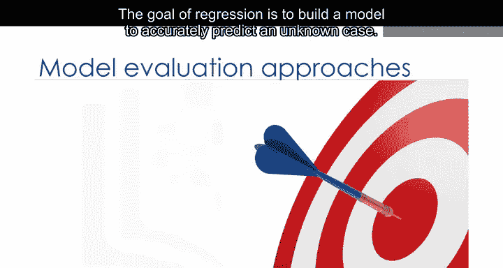

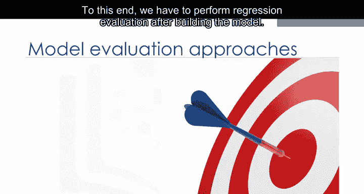

在本节课中，我们将学习如何评估回归模型的性能。回归的目标是构建一个能够准确预测未知案例的模型。为此，在构建模型后，我们必须进行回归评估。

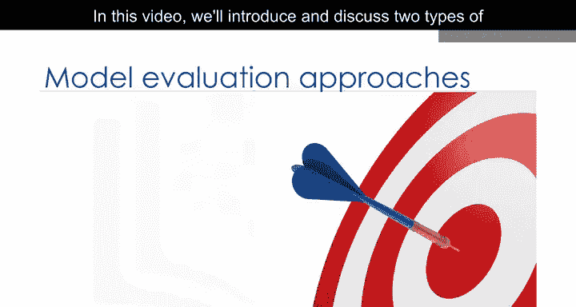

我们将介绍并讨论两种可用于实现此目标的评估方法：**在同一数据集上训练和测试** 以及 **训练测试分割**。我们将探讨每种方法的含义、优缺点，并介绍一些用于衡量回归模型准确性的指标。

---

## 在同一数据集上训练和测试 📈

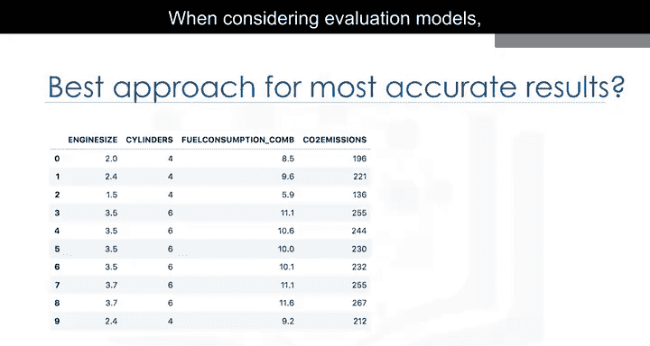

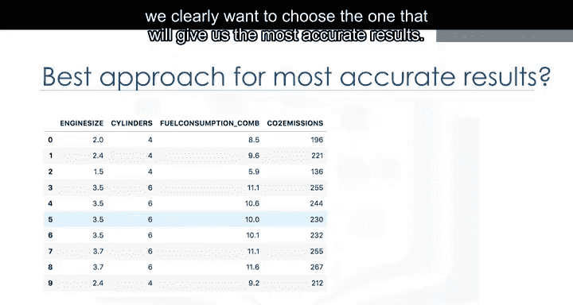

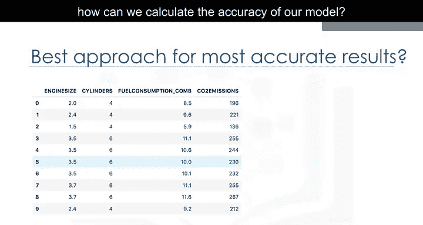

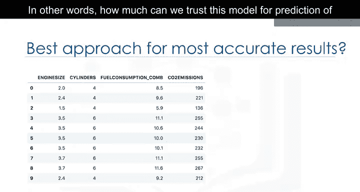

上一节我们介绍了模型评估的目标，本节中我们来看看第一种评估方法。

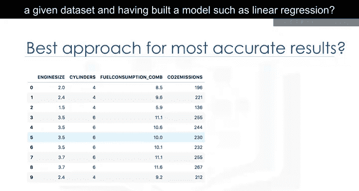

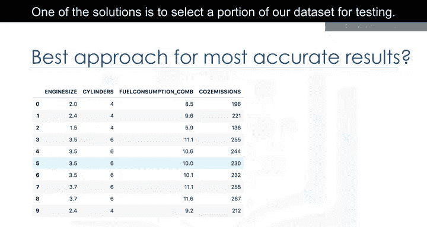

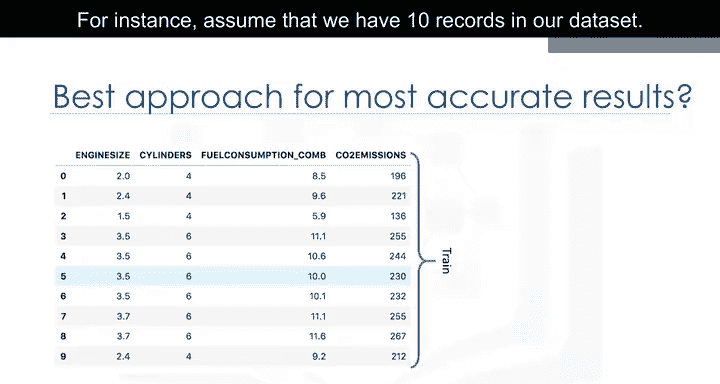

当考虑评估模型时，我们显然希望选择能提供最准确结果的方法。那么问题来了：如何计算模型的准确性？换句话说，在使用给定数据集并构建了线性回归等模型后，我们能在多大程度上信任该模型对未知样本的预测？

解决方案之一是选择数据集的一部分用于测试。

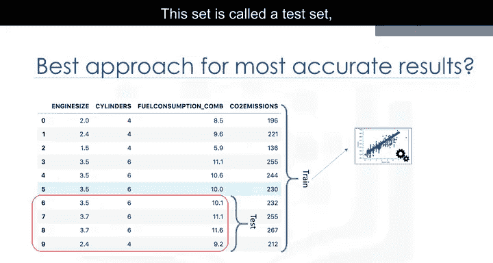

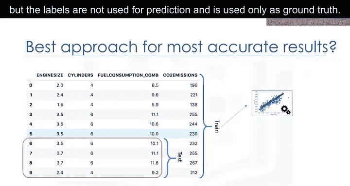

例如，假设我们的数据集中有10条记录。我们使用整个数据集进行训练，并利用这个训练集构建模型。现在，我们选择数据集的一小部分，例如第6到第9行，但不包含标签。这个集合称为测试集，它实际上有标签，但这些标签不用于预测，仅作为真实值使用。这些标签被称为测试集的**实际值**。

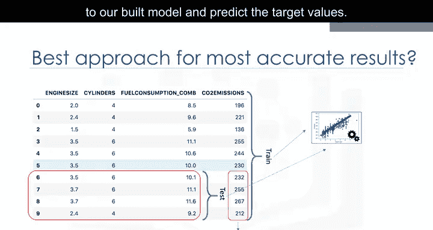

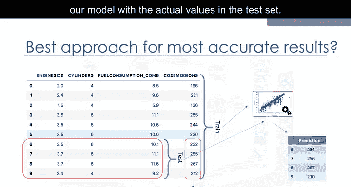

接着，我们将测试部分的特征集输入到我们构建的模型中，并预测目标值。最后，我们将模型的预测值与测试集中的实际值进行比较。这反映了模型的实际准确程度。报告模型准确性的指标有多种，但大多数都基于预测值与实际值的相似性来工作。

让我们看看计算回归模型准确性最简单的指标之一。如前所述，我们只需比较实际值 **Y** 与预测值 **Ŷ**（在测试集上）。模型的误差计算为所有行的预测值与实际值之间的平均差。我们可以将此误差写成一个公式。

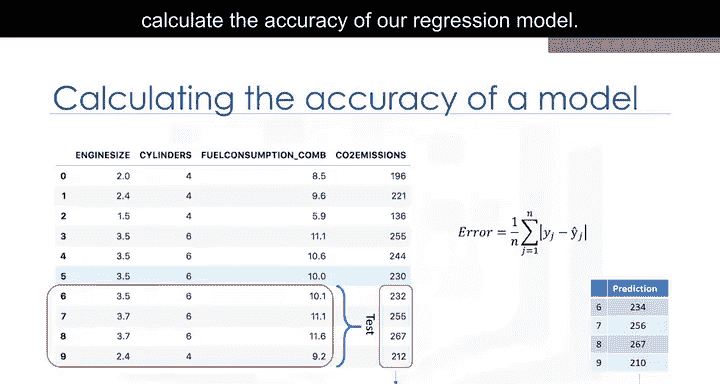

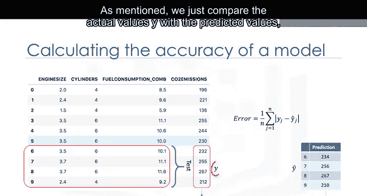

以下是这种方法的要点：
*   **方法**：使用整个数据集训练模型，然后使用同一数据集的一部分进行测试。
*   **特点**：这种方法很可能具有较高的**训练精度**，但较低的**样本外精度**，因为模型从训练中已经了解了所有测试数据点。

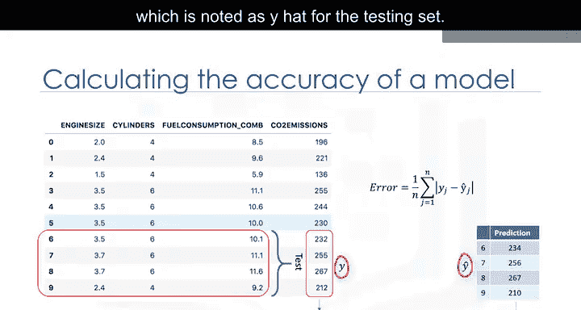

---

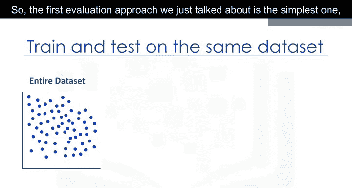

## 理解训练精度与样本外精度 🎯

我们提到，在同一数据集上进行训练和测试会产生较高的训练精度，但训练精度究竟是什么？

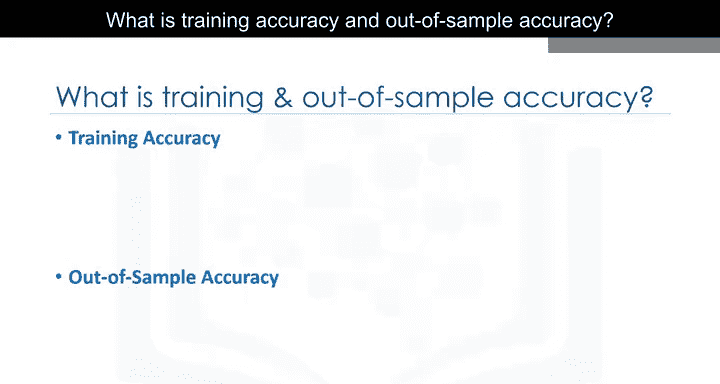

**训练精度**是模型使用测试数据集时做出的正确预测的百分比。然而，高训练精度不一定是一件好事。例如，高训练精度可能导致**过拟合**。这意味着模型对数据集的训练过度，可能捕捉到噪声并产生一个非泛化的模型。

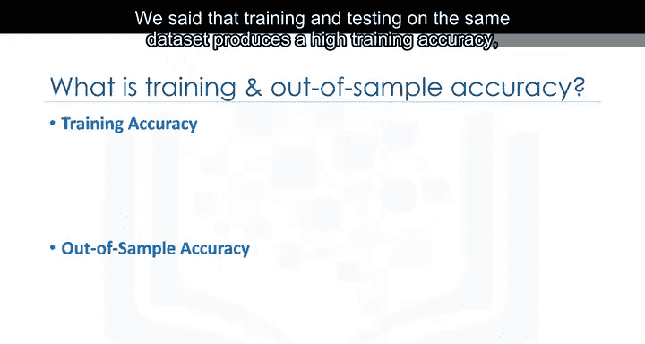

**样本外精度**是模型在未训练过的数据上做出正确预测的百分比。在同一数据集上进行训练和测试很可能会因为过拟合的可能性而导致较低的样本外精度。

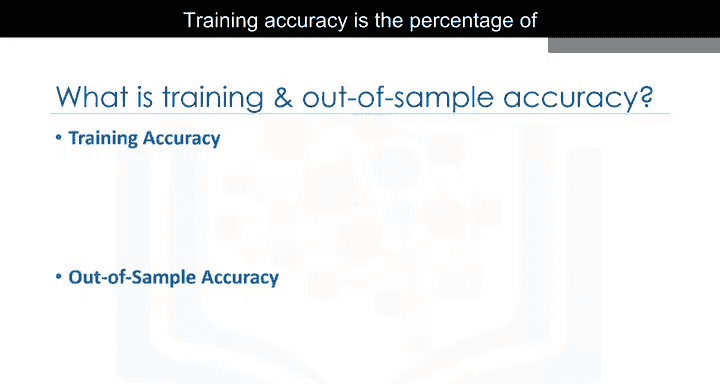

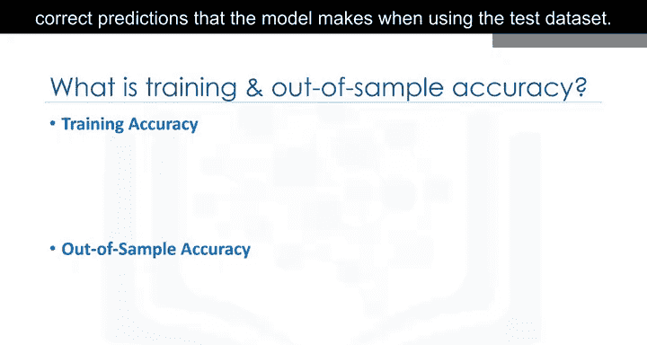

我们的模型拥有高的样本外精度非常重要，因为模型的目标准确预测未知数据。那么，如何提高样本外精度呢？一种方法是使用另一种称为**训练测试分割**的评估方法。

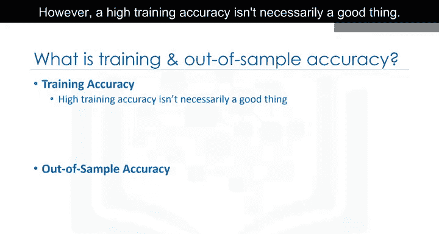

---

## 训练测试分割 🔀

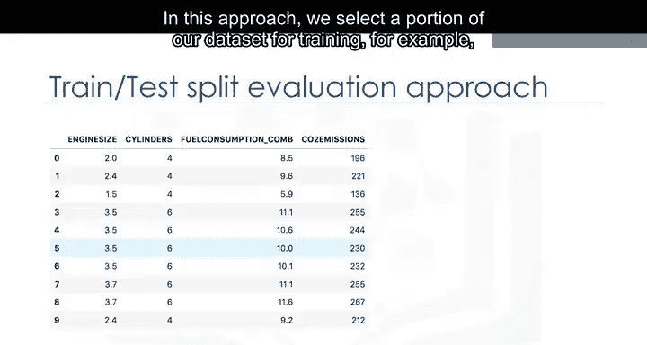

上一节我们了解了第一种评估方法的局限性，本节中我们来看看更优的解决方案。

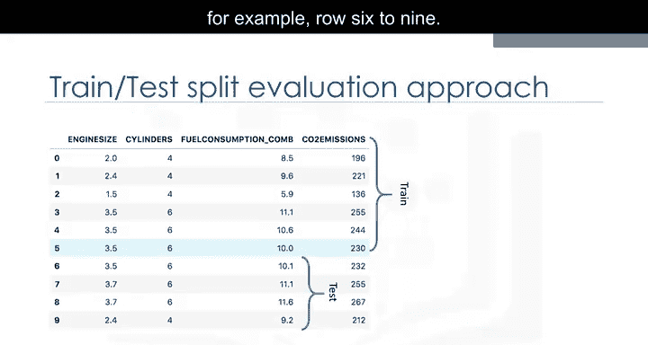

在这种方法中，我们选择数据集的一部分用于训练（例如第0到5行），其余部分用于测试（例如第6到9行）。模型在训练集上构建。然后，测试特征集被输入模型进行预测。最后，将测试集的预测值与测试集的实际值进行比较。

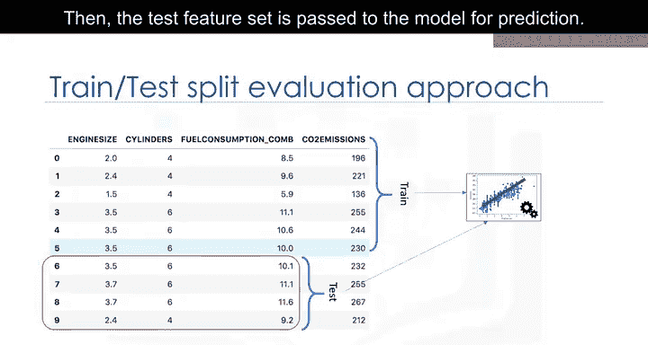

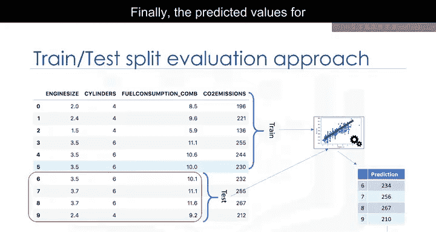

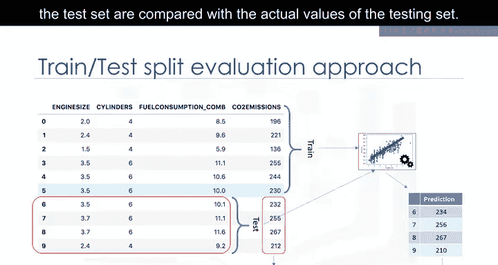

以下是这种方法的要点：
*   **方法**：将数据集分割成互斥的训练集和测试集，用训练集训练，用测试集测试。
*   **优点**：由于测试数据集不是用于训练数据的数据集的一部分，因此能更准确地评估样本外精度。这对于现实世界的问题更为真实。
*   **注意**：请确保之后使用测试集重新训练你的模型，因为你不想丢失潜在的有价值数据。

训练测试分割的问题是，它高度依赖于用于训练和测试的数据集。这种变化使得训练测试分割比在同一数据集上训练和测试具有更好的样本外预测能力，但由于这种依赖性，它仍然存在一些问题。

另一种称为 **K折交叉验证** 的评估模型解决了大部分这些问题。

---

## K折交叉验证简介 🔄

如何解决因依赖性导致的高方差问题？答案是：取平均值。

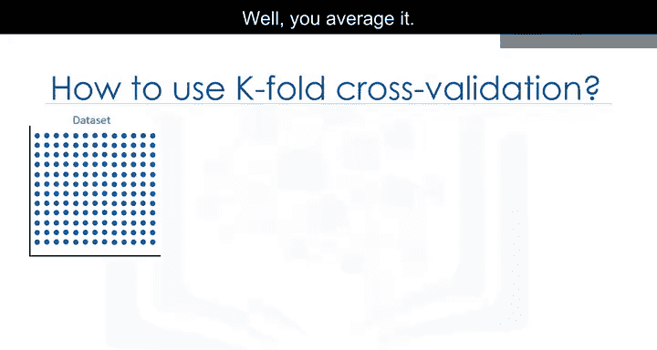

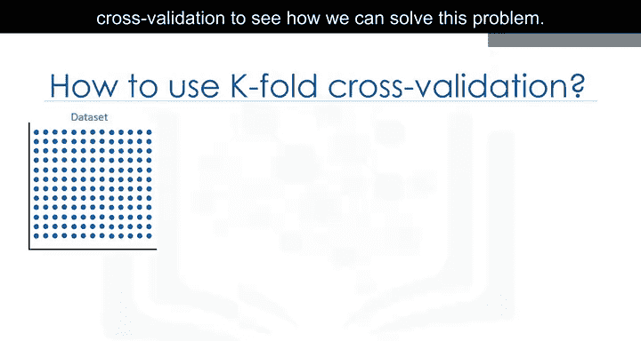

让我解释一下K折交叉验证的基本概念，看看我们如何解决这个问题。整个数据集由左上角图像中的点表示。如果我们设置K=4折，那么我们将数据集分割如图所示。

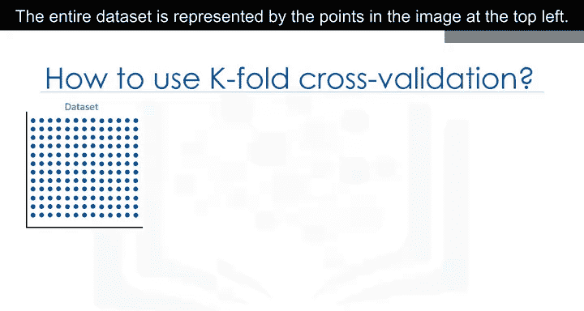

以下是K折交叉验证的基本步骤：
*   **第一折**：使用前25%的数据集进行测试，其余用于训练。使用训练集构建模型，并使用测试集进行评估。
*   **第二折**：使用第二个25%的数据集进行测试，其余用于训练模型。再次计算模型的准确性。
*   **后续折**：继续此过程，直到所有折都完成。
*   **汇总**：最后，对所有四次评估的结果取平均值。即，计算每一折的准确性，然后求平均。请注意，每一折都是独立的，任何一折中的训练数据都不会在另一折中使用。

K折交叉验证以其最简单的形式，使用相同的数据集执行多次不同的训练测试分割，然后对结果进行平均，以产生更一致的样本外精度。我们想向您展示一种解决了先前方法中描述的一些问题的评估模型，然而，深入探讨K折交叉验证模型超出了本课程的范围。

---

## 总结 📝

本节课中我们一起学习了回归模型评估的两种主要方法：在同一数据集上训练和测试、训练测试分割，并简要了解了K折交叉验证的概念。我们明确了训练精度与样本外精度的区别，认识到高的样本外精度对于模型的实用价值至关重要。通过合理的评估方法，我们可以更好地了解模型的泛化能力，从而构建出更可靠的预测模型。