# 009：回归模型评价指标

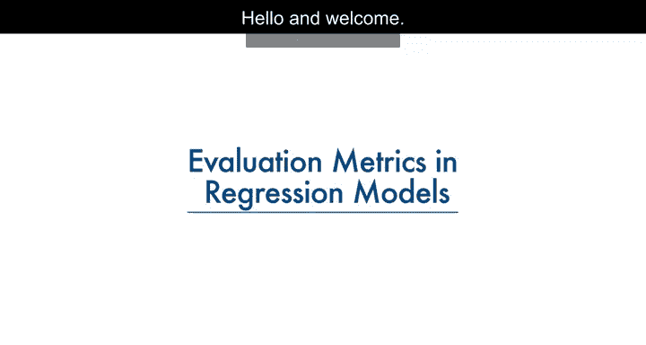

在本节课中，我们将要学习如何评估回归模型的性能。我们将介绍几种核心的评价指标，理解它们的含义、计算方式以及适用场景。

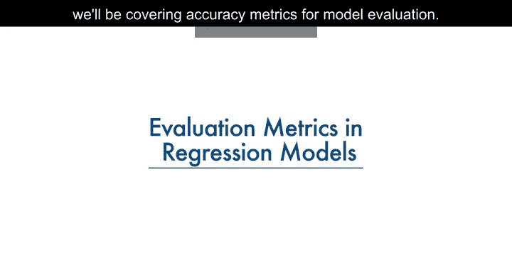

评价指标用于解释模型的性能。对于回归模型，我们将讨论几种常用的评价指标。

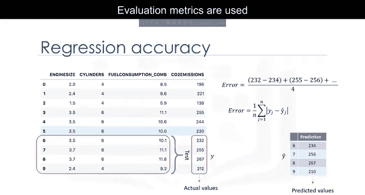

## 什么是模型误差？🤔

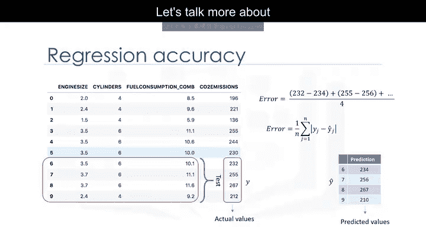

上一节我们介绍了评价指标的重要性，本节中我们来看看模型误差的具体定义。

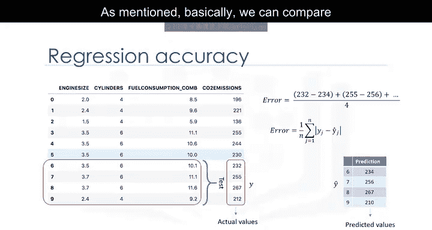

在回归的语境下，模型的误差是指数据点与算法生成的趋势线之间的差值。

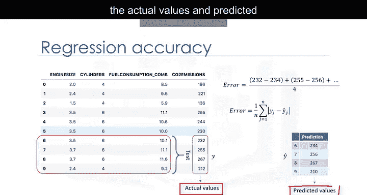

由于存在多个数据点，可以通过多种方式来确定误差。

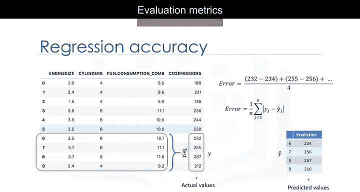

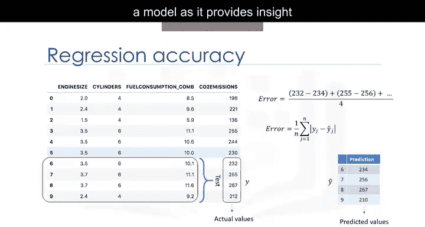

## 核心评价指标详解📈

以下是几种关键的回归模型评价指标。

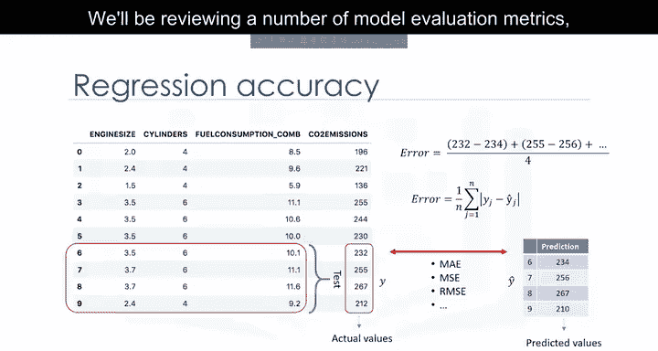

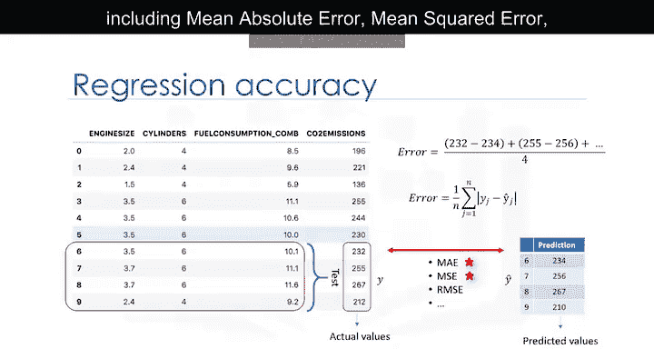

### 平均绝对误差

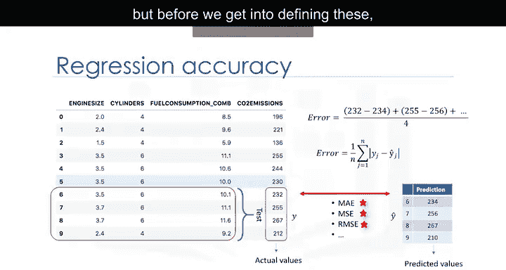

平均绝对误差是误差绝对值的平均值。这是最容易理解的指标，因为它就是平均误差。

其公式为：
**MAE = (1/n) * Σ |y_i - ŷ_i|**

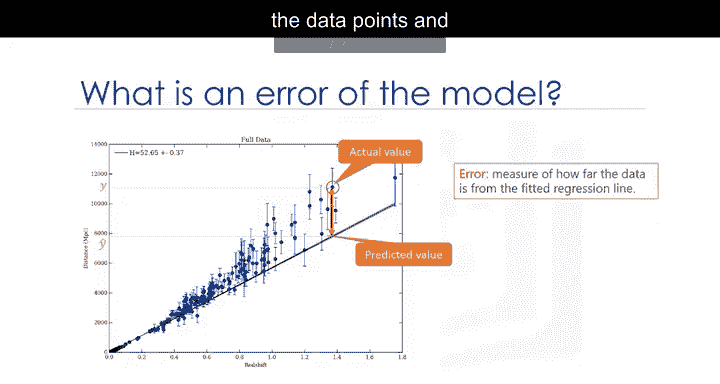

### 均方误差

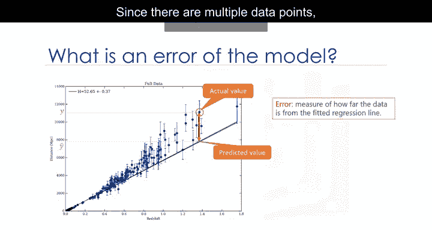

均方误差是误差平方的平均值。它比平均绝对误差更常用，因为它更侧重于较大的误差。

这是由于平方项会以指数方式放大较大误差相对于较小误差的影响。

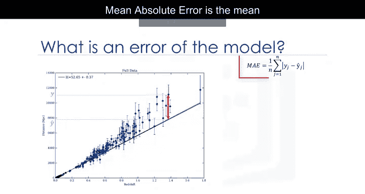

其公式为：
**MSE = (1/n) * Σ (y_i - ŷ_i)^2**

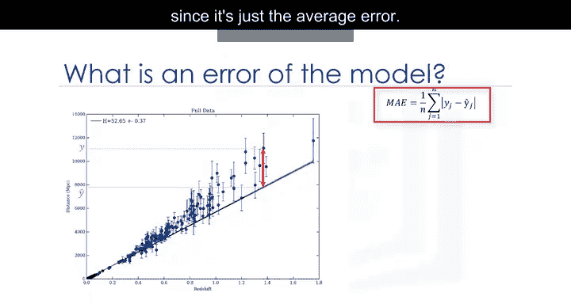

### 均方根误差

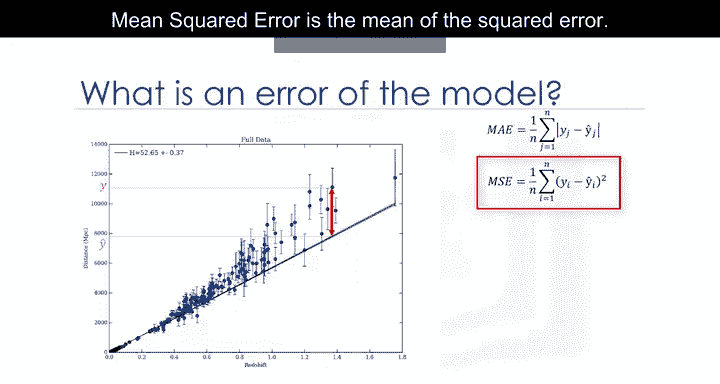

均方根误差是均方误差的平方根。

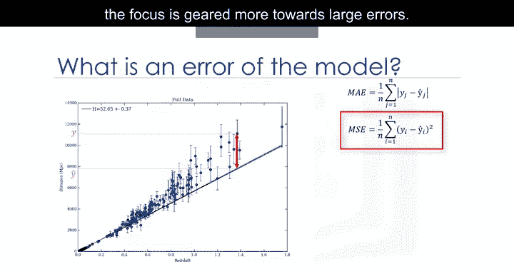

这是最流行的评价指标之一，因为均方根误差的解释单位与响应向量或Y值的单位相同，使得其信息易于关联。

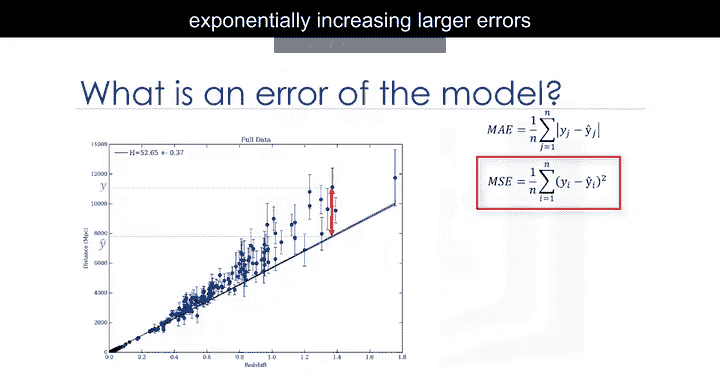

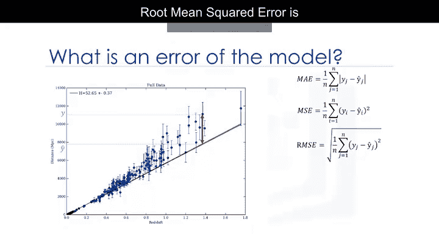

其公式为：
**RMSE = √MSE**

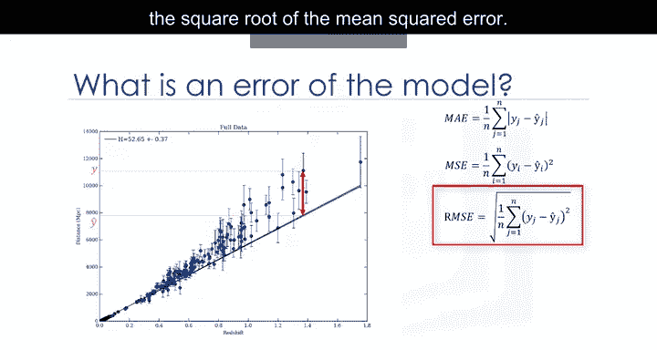

### 相对绝对误差

相对绝对误差，也称为残差平方和，其中`ȳ`是y的平均值。它通过除以简单预测器的总绝对误差来对总绝对误差进行归一化。

其公式为：
**RAE = Σ |y_i - ŷ_i| / Σ |y_i - ȳ|**

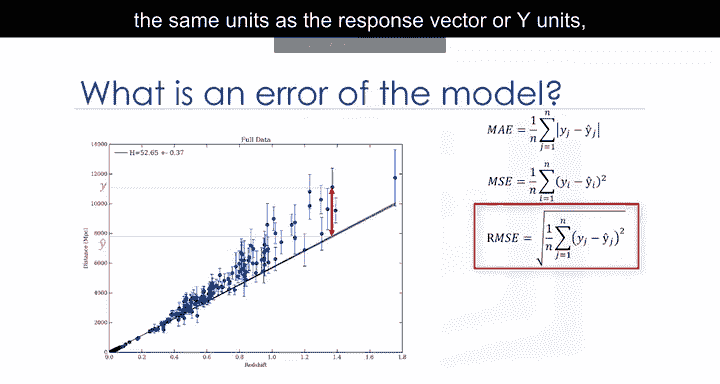

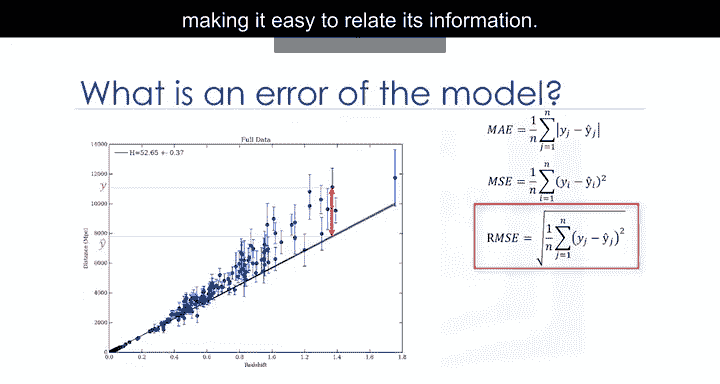

### 相对平方误差

相对平方误差与相对绝对误差非常相似，但被数据科学界广泛采用，因为它用于计算R平方。

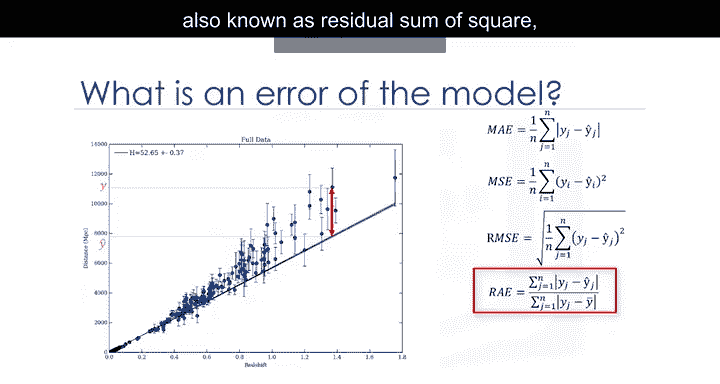

其公式为：
**RSE = Σ (y_i - ŷ_i)^2 / Σ (y_i - ȳ)^2**

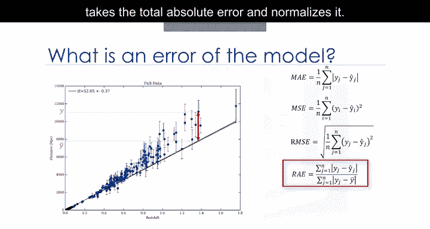

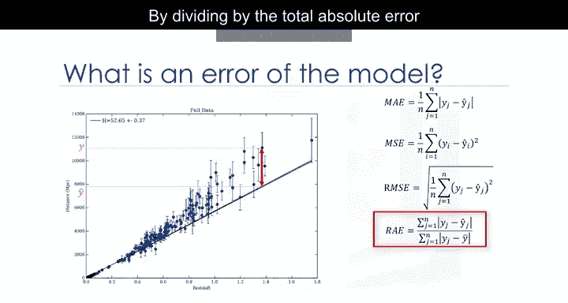

### R平方

R平方本身并非误差，而是衡量模型准确性的流行指标。

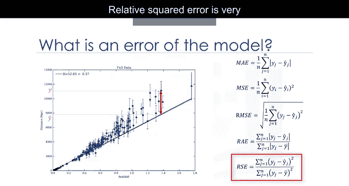

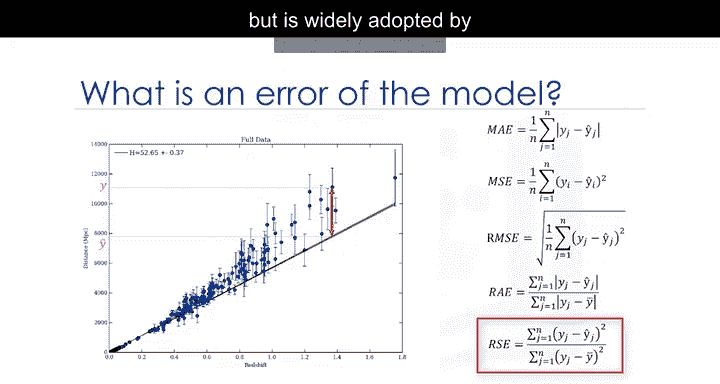

它表示数据值距离拟合回归线的接近程度。

R平方值越高，模型对数据的拟合程度越好。

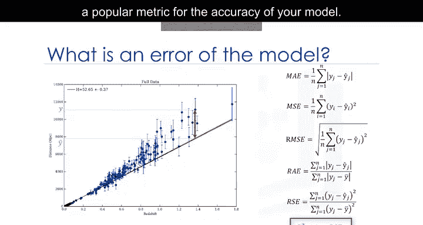

其公式为：
**R² = 1 - RSE**

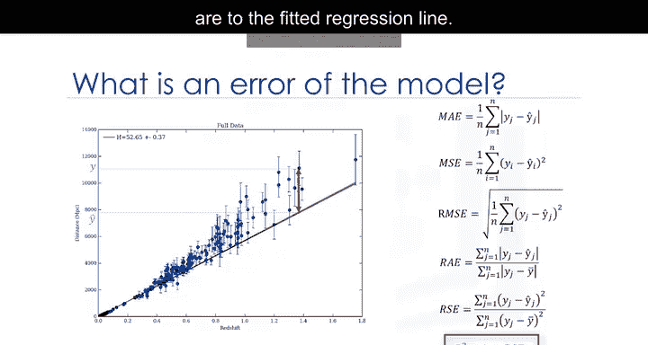

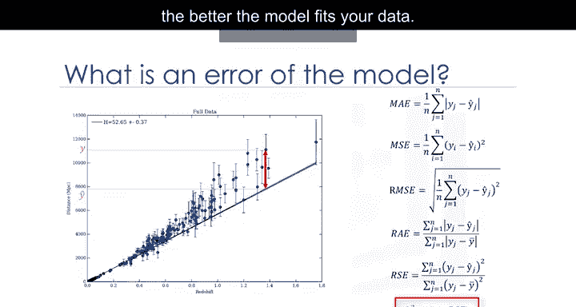

## 如何选择评价指标？🎯

以上每种指标都可用于量化你的预测效果。

指标的选择完全取决于模型类型、数据类型和知识领域。遗憾的是，更深入的探讨超出了本课程的范围。

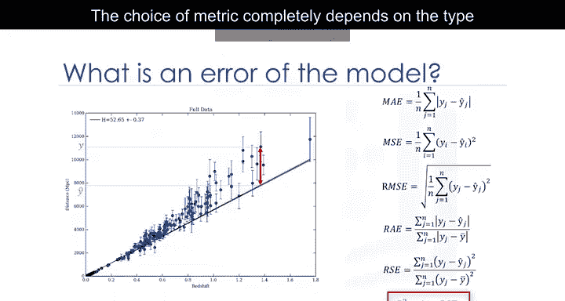

## 总结📝

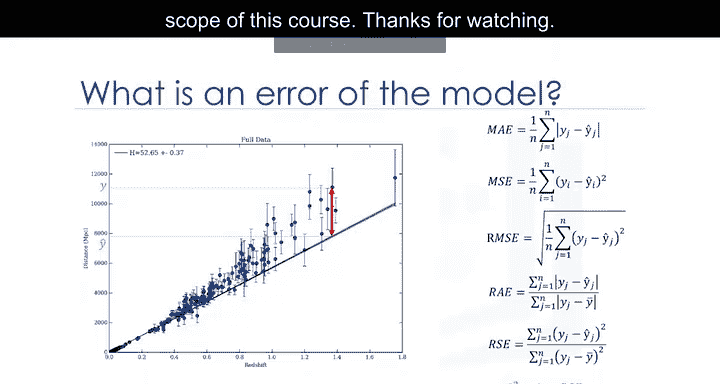

本节课中我们一起学习了回归模型的评价指标。我们定义了模型误差，并详细介绍了平均绝对误差、均方误差、均方根误差、相对绝对误差、相对平方误差以及R平方等核心指标。理解这些指标将帮助你有效地评估和比较不同回归模型的性能。