# 010：多元线性回归 📈

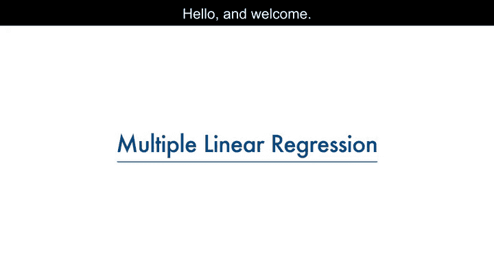

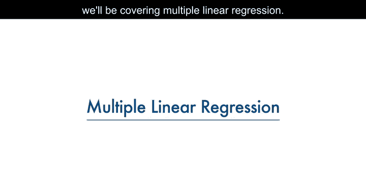

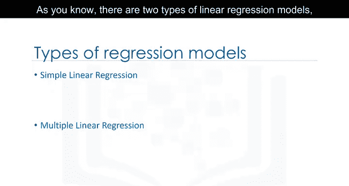

在本节课中，我们将要学习多元线性回归。这是一种使用多个自变量来预测一个连续因变量的统计方法。我们将探讨其基本概念、应用场景、模型构建方式以及如何找到最优参数。

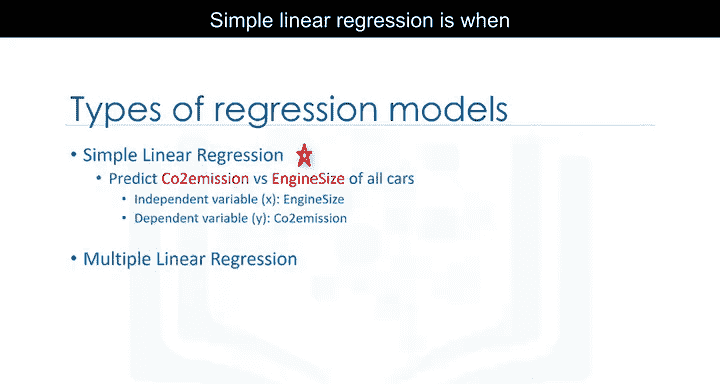

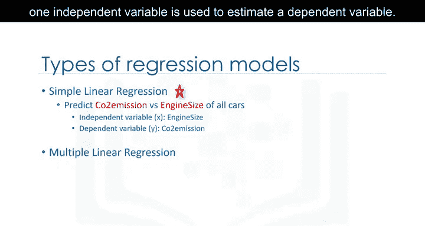

---

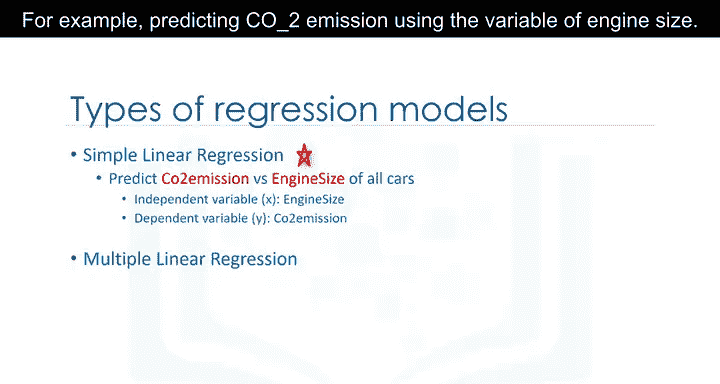

## 线性回归的类型 📊

上一节我们介绍了线性回归的基本概念，本节中我们来看看它的具体类型。

线性回归模型主要分为两种：简单线性回归和多元线性回归。

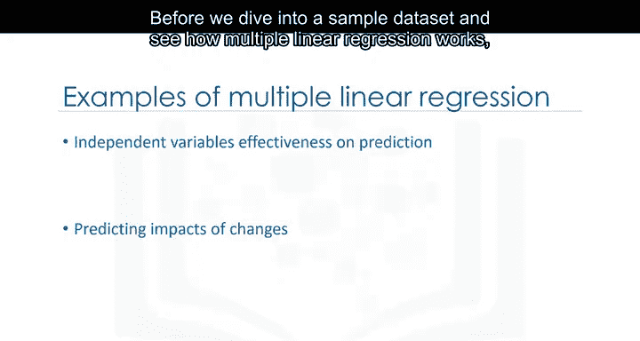

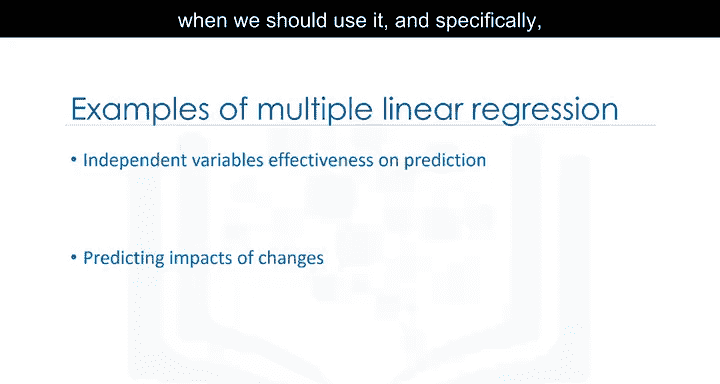

*   **简单线性回归**：使用一个自变量来估计一个因变量。例如，使用发动机大小来预测二氧化碳排放量。
*   **多元线性回归**：使用多个自变量来预测一个因变量。例如，同时使用发动机大小和气缸数量来预测二氧化碳排放量。

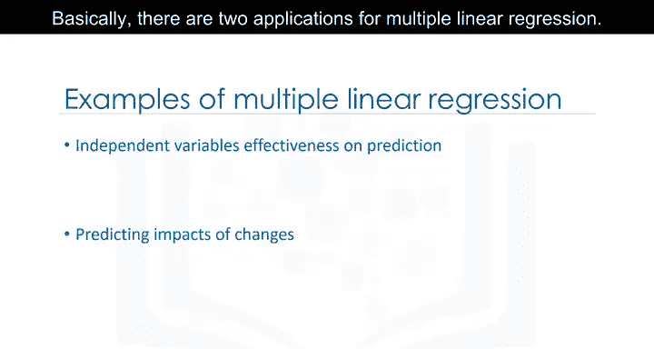

本视频的重点是多元线性回归。多元线性回归是简单线性回归的扩展。

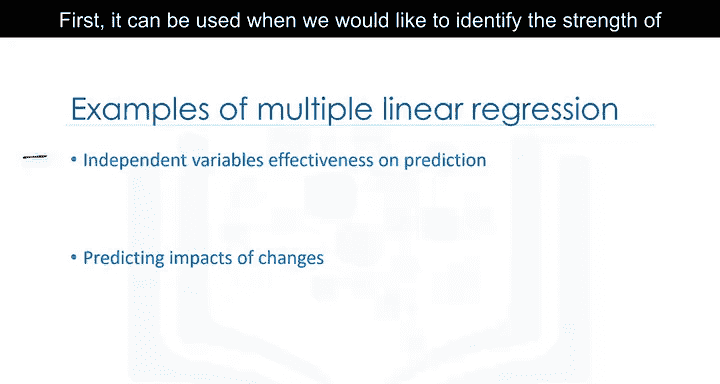

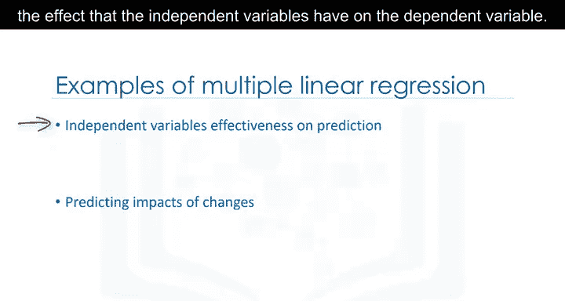

---

## 多元线性回归的应用 🎯

在深入探讨具体数据集和多元线性回归的工作原理之前，我们先了解它能解决什么问题以及何时使用它。

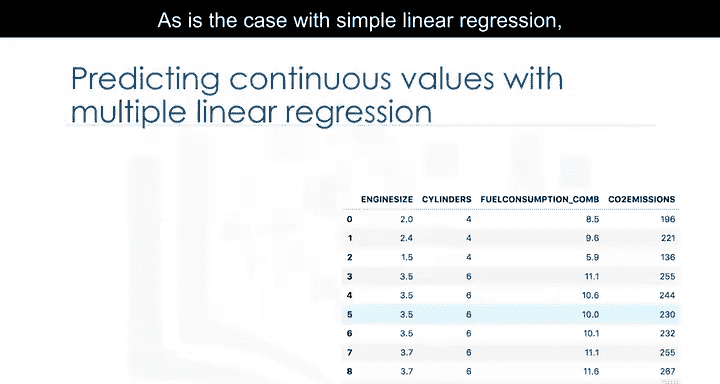

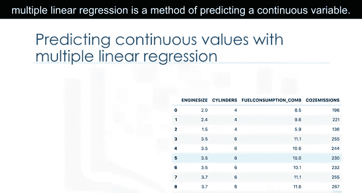

多元线性回归主要有两个应用方向：

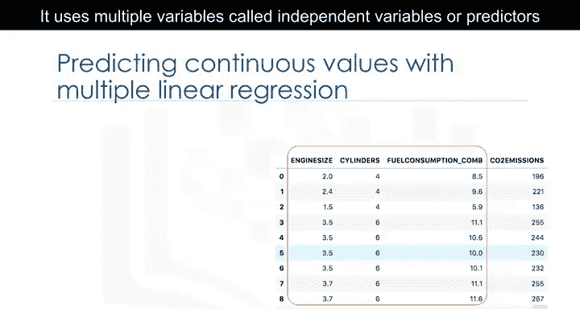

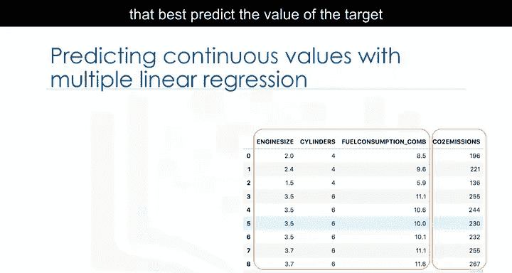

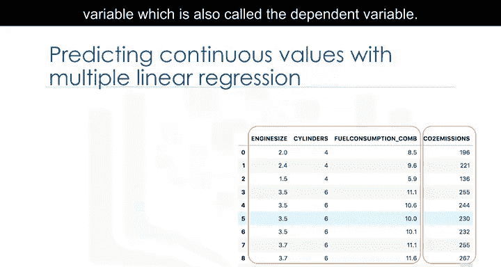

以下是多元线性回归的两个主要应用：

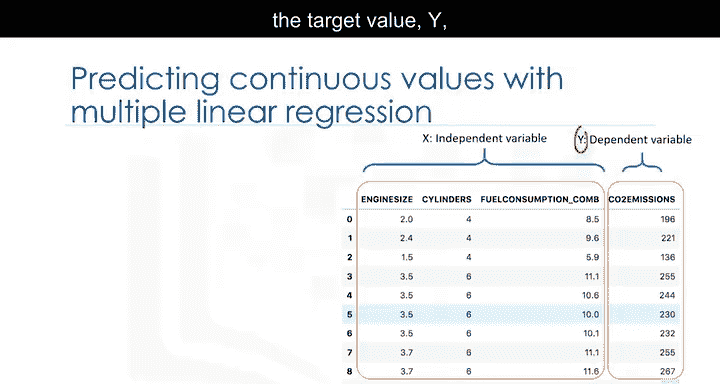

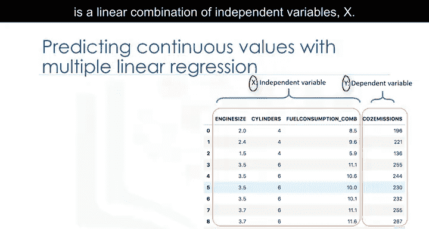

1.  **识别影响强度**：用于识别自变量对因变量的影响强度。例如，复习时间、考试焦虑、出勤率和性别是否对学生的考试成绩有影响？
2.  **预测变化影响**：用于预测变化的影响，即理解当改变自变量时，因变量如何变化。例如，在评估个人健康数据时，多元线性回归可以告诉你，在保持其他因素不变的情况下，患者的体重指数每增加或减少一个单位，其血压会上升或下降多少。

与简单线性回归一样，多元线性回归是一种预测连续变量的方法。它使用多个被称为**自变量**或**预测变量**的变量，来最佳地预测**目标变量**（也称为**因变量**）的值。

---

## 多元线性回归模型 🧮

现在，我们来具体看看多元线性回归的数学模型。

在多元线性回归中，目标值 **Y** 是自变量 **X** 的线性组合。

例如，你可以根据汽车的发动机大小、气缸数量和油耗等自变量来预测其二氧化碳排放量。

多元线性回归模型的一般形式如下：

**公式：** `ŷ = θ₀ + θ₁x₁ + θ₂x₂ + ... + θₙxₙ`

其中：
*   `ŷ` 是预测值。
*   `θ₀` 是截距（或偏置参数）。
*   `θ₁, θ₂, ..., θₙ` 是各自变量 `x₁, x₂, ..., xₙ` 的系数。
*   `x₁, x₂, ..., xₙ` 是特征值（自变量）。

这个方程也可以用向量形式表示：

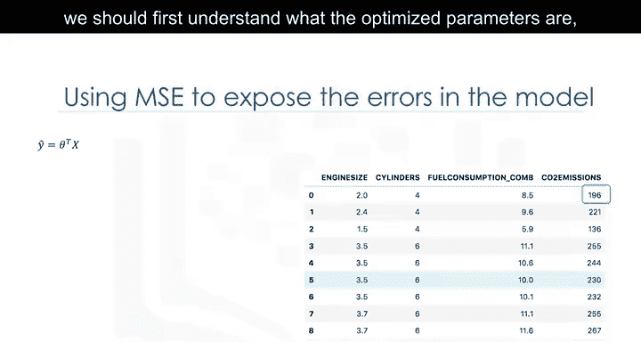

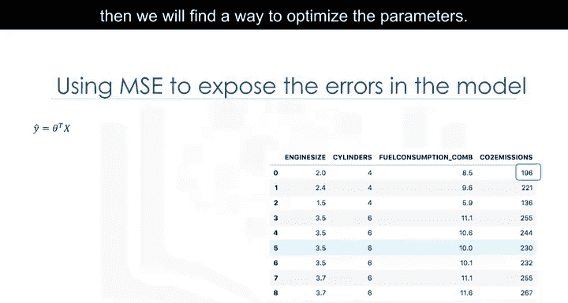

**公式：** `ŷ = θᵀX`

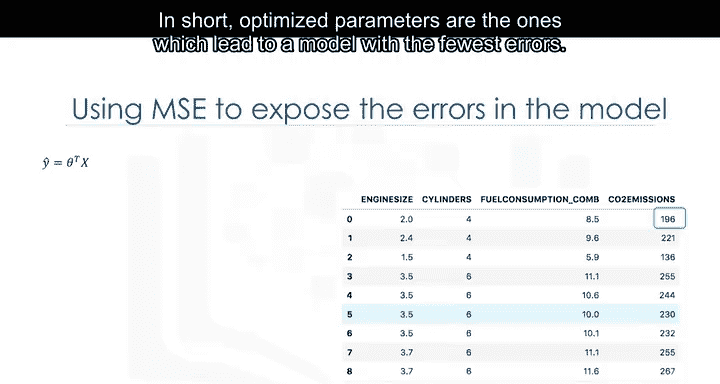

其中：
*   `θ` 是一个 `(n+1) x 1` 的参数向量 `[θ₀, θ₁, ..., θₙ]ᵀ`。
*   `X` 是一个 `(n+1) x 1` 的特征向量 `[1, x₁, x₂, ..., xₙ]ᵀ`。第一个元素设为1，是为了将 `θ₀` 转化为截距项。

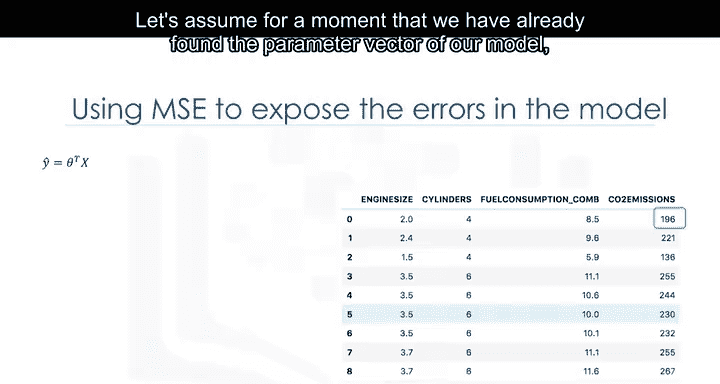

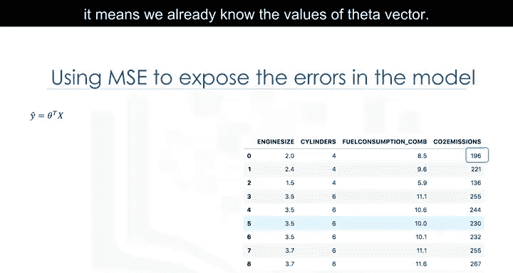

`θ` 也称为回归方程的**参数向量**或**权重向量**。`X` 是特征集。

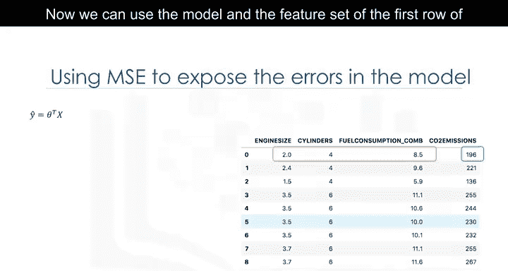

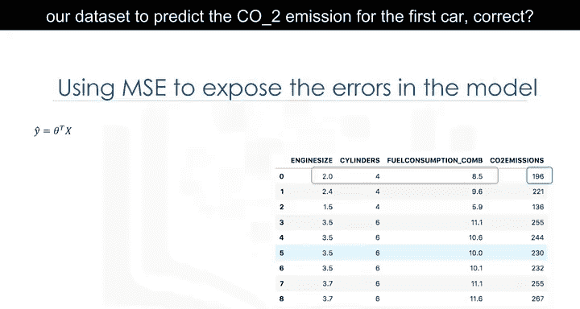

在一维空间（一个自变量）中，`θᵀX` 表示一条直线（简单线性回归）。在更高维度（多个自变量）中，它表示一个**平面**或**超平面**（多元线性回归）。我们的目标就是为数据找到最佳拟合的超平面。

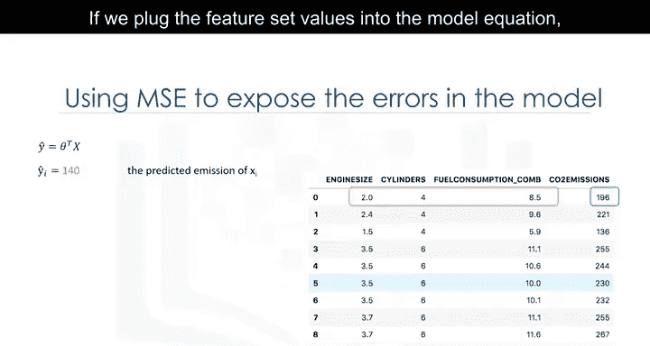

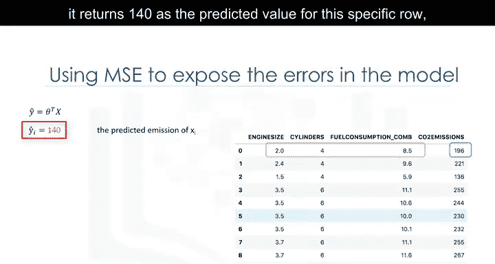

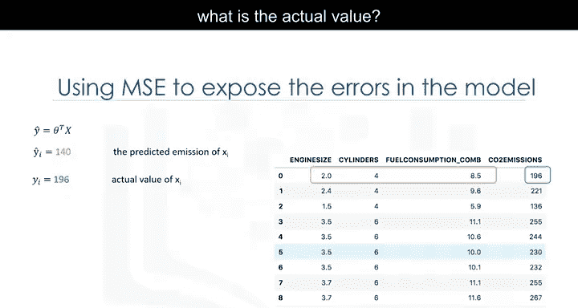

---

## 如何找到最优参数？ 🔍

为了用模型进行准确预测，我们需要找到最优的参数向量 `θ`。那么，什么是最优参数，又如何找到它们呢？

简而言之，**最优参数**是能使模型预测误差最小的参数。

假设我们已经知道了参数向量 `θ` 的值。我们可以用模型和数据集第一行的特征来预测第一辆车的二氧化碳排放量 `ŷ`。例如，预测值 `ŷ` 是140。

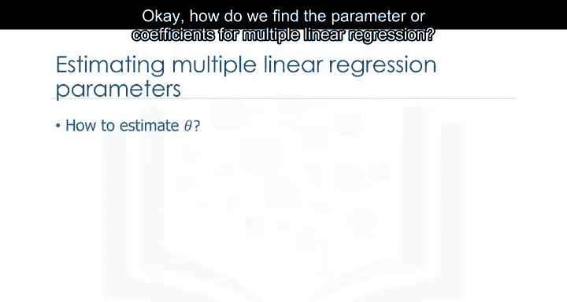

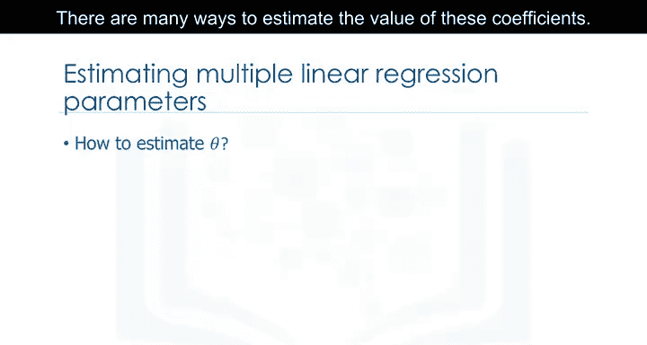

而实际值 `y` 是196。预测值与实际值的差异就是误差：`196 - 140 = 56`。这个误差是单个数据点到拟合回归模型的距离。

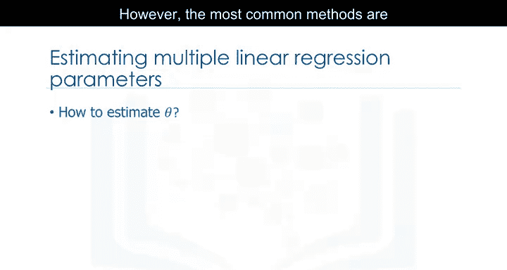

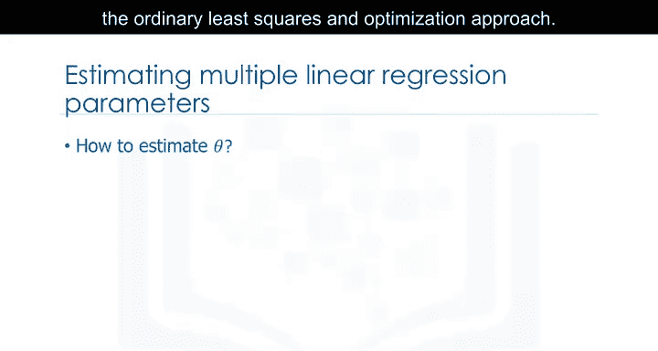

所有残差误差的平均值可以衡量模型代表数据集的优劣，这被称为**均方误差**。

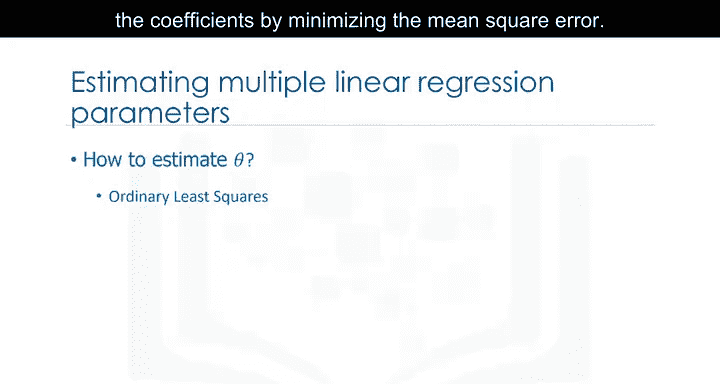

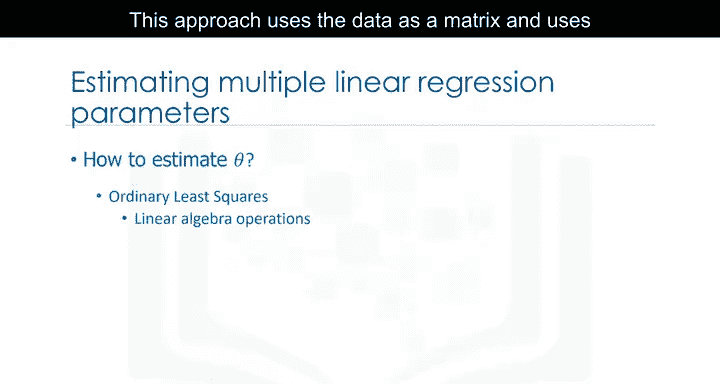

**公式：** `MSE = (1/n) * Σ(yᵢ - ŷᵢ)²`

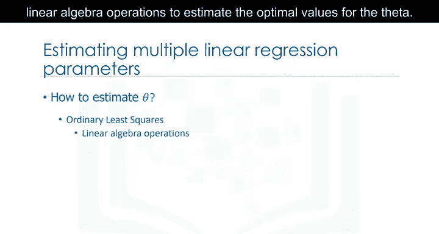

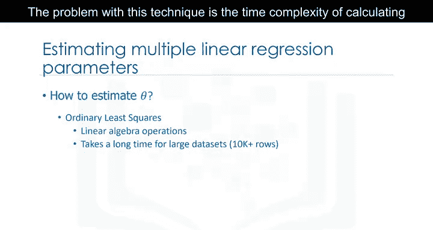

多元线性回归的目标就是最小化这个MSE方程。为了最小化MSE，我们需要找到最佳的参数 `θ`。

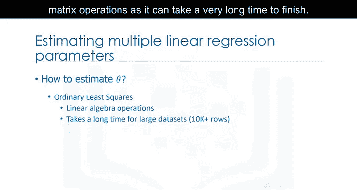

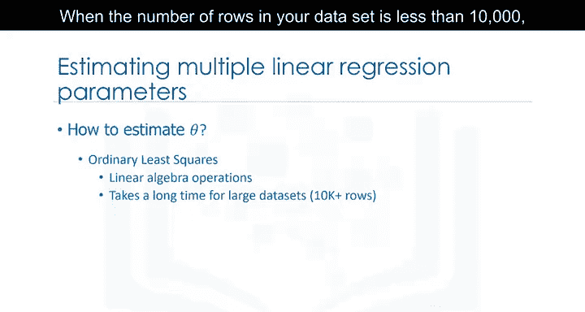

---

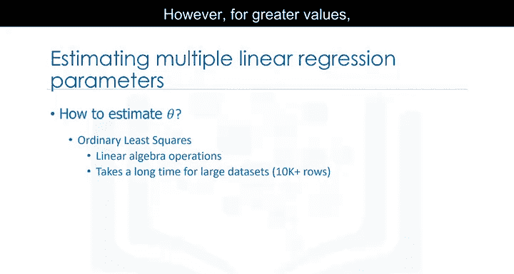

## 参数估计方法 ⚙️

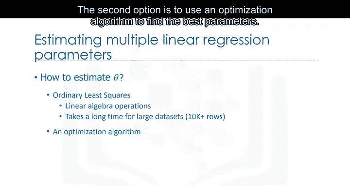

我们如何找到多元线性回归的参数或系数呢？

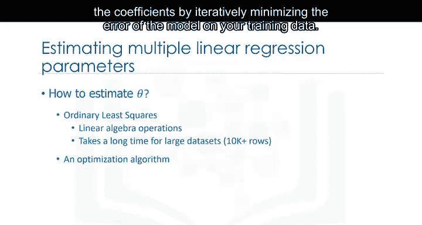

主要有两种常见的方法来估计这些系数的值：

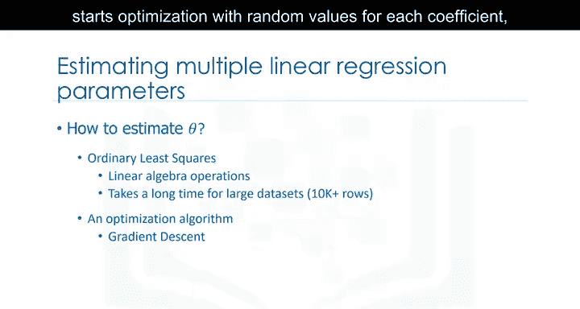

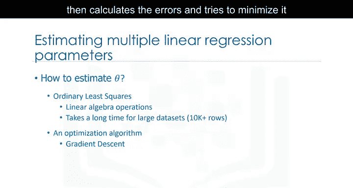

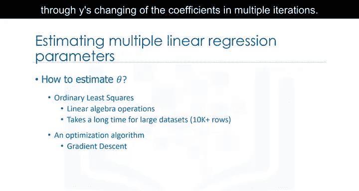

以下是两种主要的参数估计方法：

1.  **普通最小二乘法**：通过最小化均方误差来估计系数值。这种方法将数据视为矩阵，并使用线性代数运算来估计 `θ` 的最优值。当数据集行数少于10,000时可以考虑此方法，但对于更大的数据集，计算矩阵运算的时间复杂度可能很高。
2.  **优化算法**：使用优化算法来寻找最佳参数。即通过迭代最小化模型在训练数据上的误差来优化系数值。例如，**梯度下降法**从每个系数的随机值开始优化，然后计算误差，并通过多次迭代明智地改变系数来最小化误差。梯度下降法适用于大型数据集。

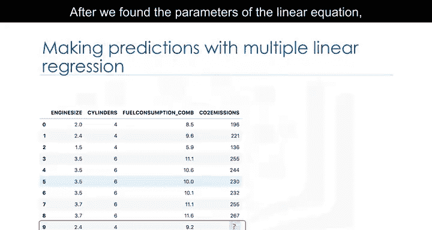

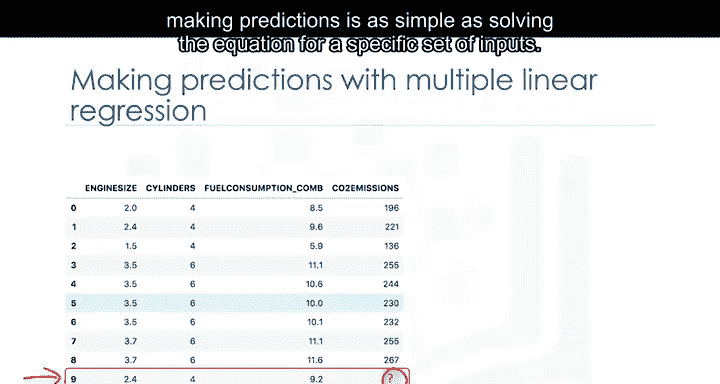

当然，还有其他估计多元线性回归参数的方法，可以自行探索。

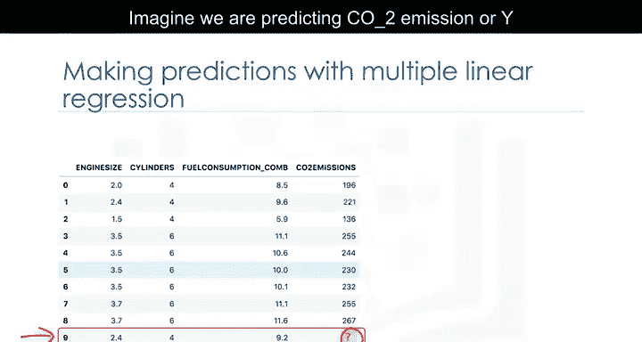

---

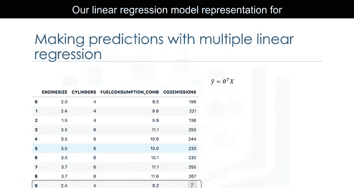

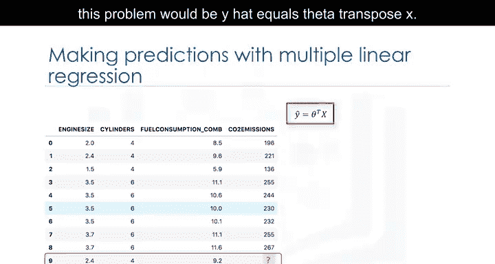

## 进行预测 📈

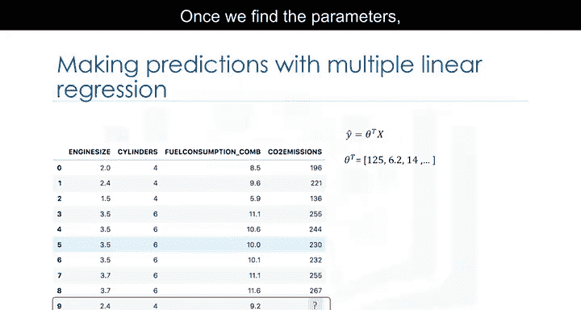


找到线性方程的参数后，进行预测就变得非常简单，只需为特定的输入集求解方程即可。


想象一下，我们要根据其他变量预测数据集中第9条记录的汽车的二氧化碳排放量 `Y`。


我们的线性回归模型表示为：`ŷ = θᵀX`。


一旦找到参数，就可以将它们代入线性模型方程。例如，假设我们找到的参数是：`θ₀ = 125`, `θ₁ = 6.2`, `θ₂ = 14`, 等等。


映射到我们的数据集，线性模型可以重写为：
`CO2排放量 = 125 + 6.2 * 发动机大小 + 14 * 气缸数 + ...`

现在，将第9行数据（例如，发动机大小为2.4，气缸数为4等）代入方程：
`CO2排放量 = 125 + 6.2 * 2.4 + 14 * 4 + ...`


我们可以预测这辆特定汽车的二氧化碳排放量约为214.1。


---


## 注意事项与常见问题 ❓


在使用多元线性回归时，需要注意以下几个关键问题：


以下是关于多元线性回归的几个重要注意事项：


1.  **使用多少个自变量？** 添加过多的自变量而没有理论依据可能导致**过拟合**。过拟合模型过于复杂，无法泛化到新数据上进行预测。因此，建议避免使用过多变量进行预测。
2.  **自变量必须是连续的吗？** 分类自变量可以通过转换为数值变量纳入回归模型。例如，对于一个二元变量（如汽车类型），可以编码为：0代表手动挡，1代表自动挡。
3.  **线性关系假设**：多元线性回归是线性回归的一种，因此因变量与每个自变量之间需要存在线性关系。可以通过散点图等方式检查线性关系。如果关系不是线性的，则可能需要考虑其他回归方法。


---


## 总结 🎓

本节课中我们一起学习了多元线性回归。

我们了解到，多元线性回归使用多个自变量来预测一个连续因变量。其核心模型是 `ŷ = θ₀ + θ₁x₁ + θ₂x₂ + ... + θₙxₙ`，目标是找到最优参数 `θ` 以最小化预测误差（如均方误差）。参数估计可以通过普通最小二乘法或优化算法（如梯度下降）实现。最后，我们讨论了在实际应用中需要注意的问题，如避免过拟合和处理分类变量。

多元线性回归是一个强大的工具，可以帮助我们理解多个因素如何共同影响一个结果，并基于此做出预测。