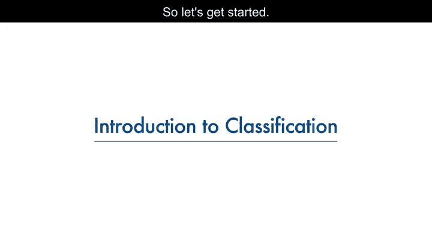
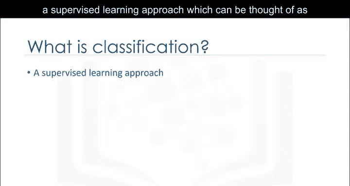
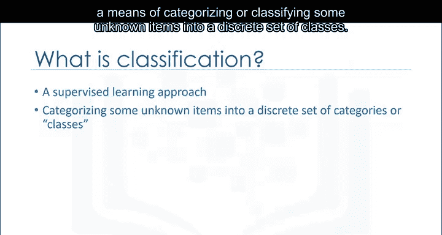
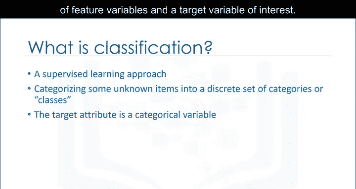
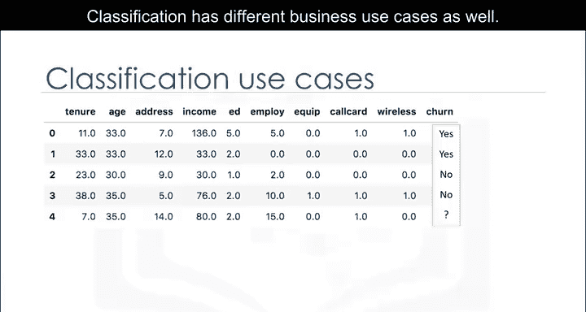
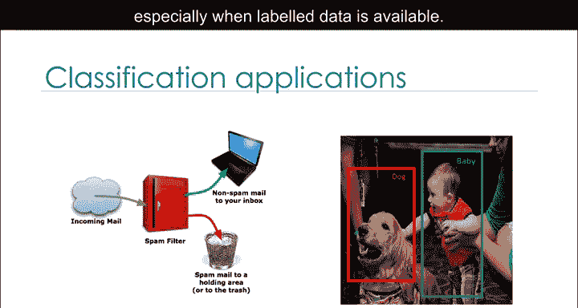

# 011：分类算法导论 🎯

在本节课中，我们将学习机器学习中的分类算法。分类是一种监督学习方法，用于将未知项目归类到离散的类别中。我们将探讨分类的基本概念、工作原理、应用场景以及常见的分类算法类型。

## 什么是分类？ 🤔

在机器学习中，分类是一种监督学习方法。它可以被视为将某些未知项目分类到离散类别集合中的一种手段。分类试图学习一组特征变量与目标变量之间的关系。

分类中的目标属性是一个分类变量，具有离散值。

## 分类器如何工作？ ⚙️

上一节我们介绍了分类的基本概念，本节中我们来看看分类器是如何工作的。

给定一组带有目标标签的训练数据点，分类会为未标记的测试用例确定类别标签。

以下是一个例子来说明这一点。

贷款违约预测是分类的一个很好的例子。假设银行担心贷款可能无法偿还。如果以前的贷款违约数据可以用来预测哪些客户可能在偿还贷款方面存在问题，这些高风险客户的贷款申请可以被拒绝，或者被提供替代产品。

贷款违约预测器的目标是使用现有的贷款违约数据，这些数据是关于客户的信息，如年龄、收入、教育等，来构建一个分类器。将新客户或潜在的未来违约者传递给模型，然后将其标记为违约者或非违约者，例如，零或一。

这就是分类器预测未标记测试用例的方式。请注意，这个具体例子是关于具有两个值的二元分类器。

我们也可以为二元分类和多类分类构建分类器模型。

例如，假设您收集了一组患有相同疾病的患者的数据。在治疗过程中，每位患者对三种药物中的一种有反应。您可以使用这个带有分类算法的标记数据集来构建分类模型。然后，您可以使用它来找出哪种药物可能适合未来患有相同疾病的患者。如您所见，这是一个多类分类的例子。

## 分类的应用场景 📈

分类在不同的业务场景中也有应用。例如，预测客户所属的类别，用于客户流失检测（预测客户是否会转向其他提供商或品牌），或者预测客户是否会对特定的广告活动做出反应。

数据分类在广泛的行业中都有多种应用。本质上，许多问题可以表示为特征变量和目标变量之间的关联，尤其是在有标签数据可用时。这为分类提供了广泛的应用范围。例如，分类可以用于电子邮件过滤、语音识别、手写识别、生物识别、文档分类等等。

## 常见的分类算法类型 🧠

以下是机器学习中分类算法的类型。

它们包括：
*   决策树
*   朴素贝叶斯
*   线性判别分析
*   K最近邻
*   逻辑回归
*   神经网络
*   支持向量机

分类算法有很多类型，在本课程中我们只涵盖其中几种。

## 总结 📝

本节课中我们一起学习了机器学习中的分类算法。我们了解了分类是一种监督学习方法，用于将数据点分配到预定义的类别中。我们探讨了分类器的工作原理，包括如何利用带标签的训练数据来预测新数据的类别。我们还介绍了分类在贷款预测、医疗诊断和客户分析等多个领域的实际应用。最后，我们列举了几种常见的分类算法类型，为后续深入学习这些具体算法奠定了基础。