# 013：分类模型评价指标

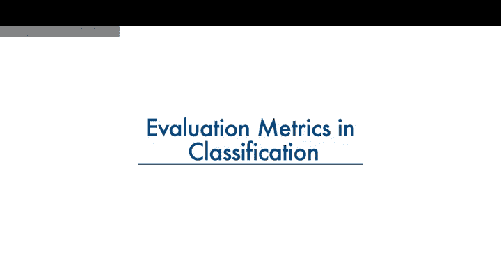

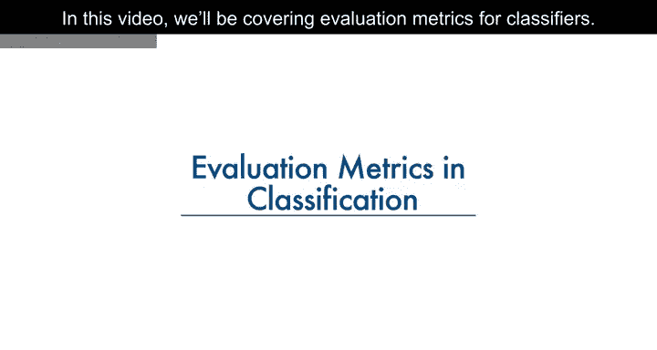

在本节课中，我们将学习如何评估分类模型的性能。我们将介绍几种常用的评价指标，包括Jaccard指数、F1分数和对数损失。这些指标帮助我们理解模型的准确性，并指出可能需要改进的地方。

## 概述

评价指标用于解释模型的性能。假设我们有一个电信公司的客户流失历史数据集。我们训练了一个模型，现在想使用测试集计算其准确性。我们将测试集传递给模型，得到预测标签。接下来，我们需要评估这个模型的准确性。基本上，我们通过比较测试集中的实际值与模型预测的值来计算模型的准确性。评价指标在模型开发中起着关键作用，因为它们提供了可能需要改进的领域的见解。

## Jaccard指数

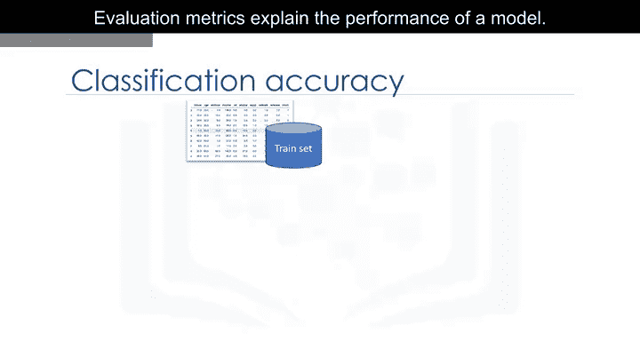

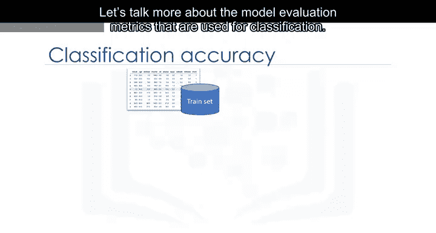

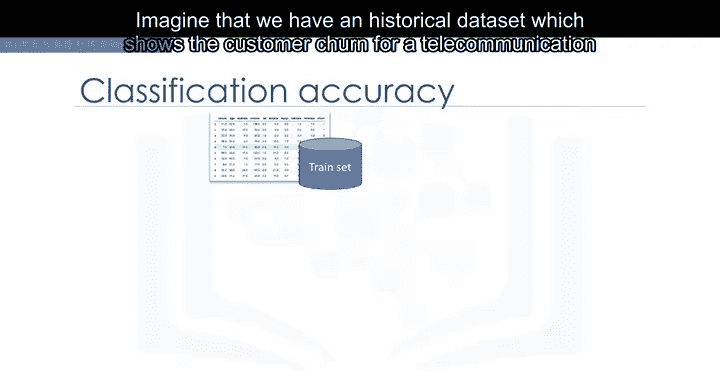

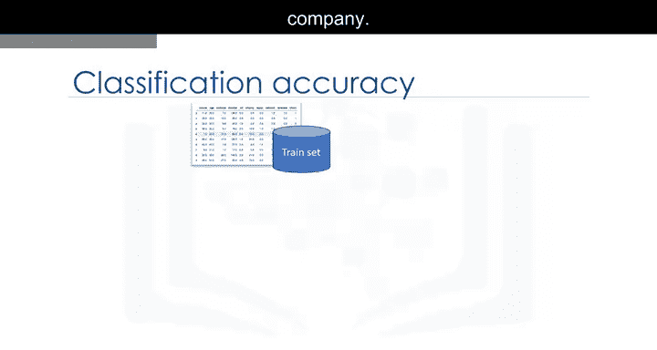

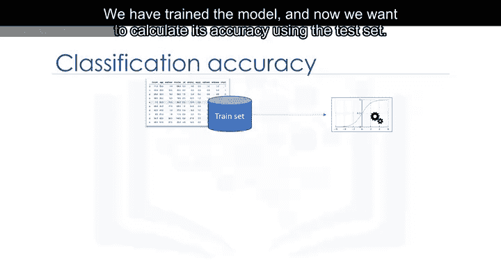

首先，我们来看一种最简单的准确性度量方法：Jaccard指数，也称为Jaccard相似系数。

假设Y表示流失数据集的真实标签，Y_hat表示分类器的预测值。那么，我们可以将Jaccard指数定义为两个标签集合交集的大小除以并集的大小。

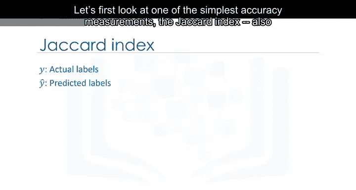

**公式**：
\[
\text{Jaccard} = \frac{|Y \cap \hat{Y}|}{|Y \cup \hat{Y}|}
\]

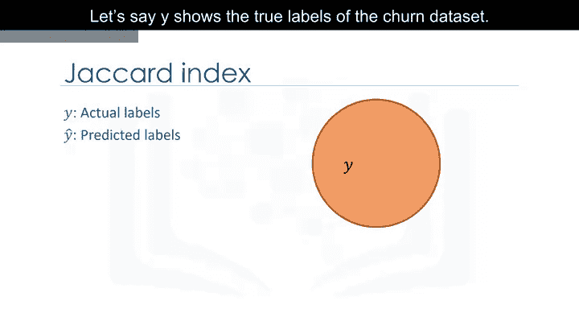

例如，对于一个大小为10的测试集，如果有8个正确预测（即8个交集），那么根据Jaccard指数计算的准确性为0.66。

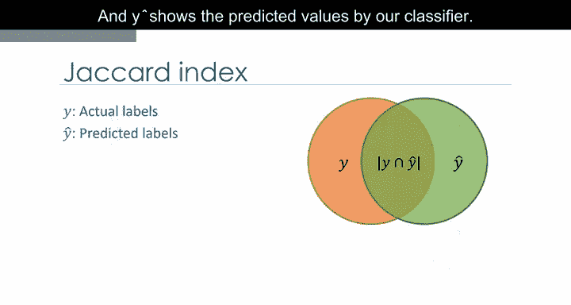

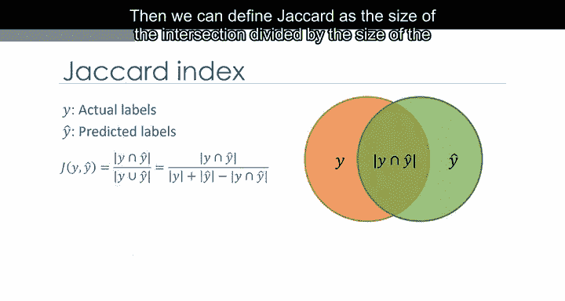

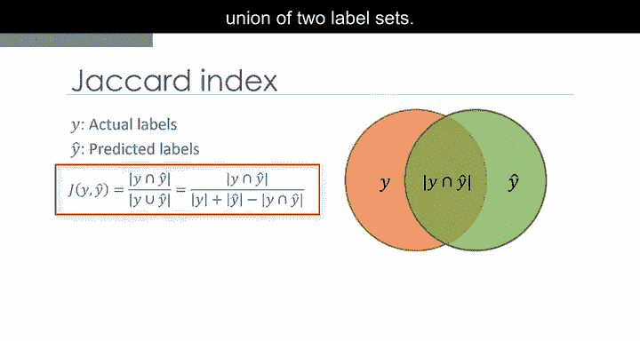

如果样本的预测标签集与真实标签集完全匹配，则子集准确性为1.0；否则为0.0。

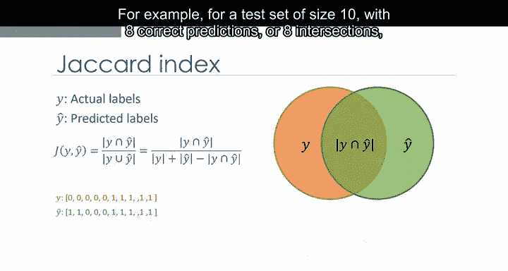

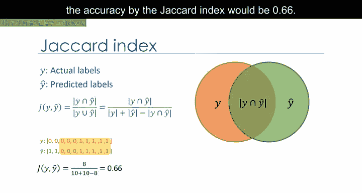

## 混淆矩阵

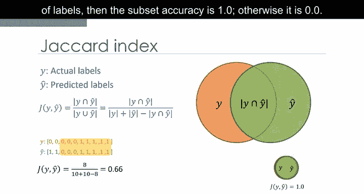

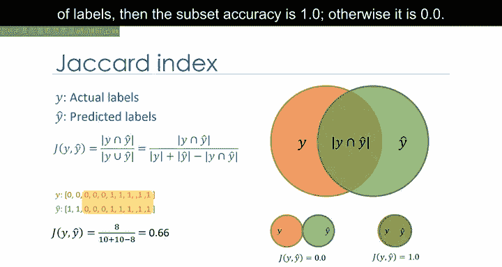

另一种查看分类器准确性的方法是观察混淆矩阵。

例如，假设我们的测试集只有40行。这个矩阵显示了与真实标签相比的正确和错误预测。

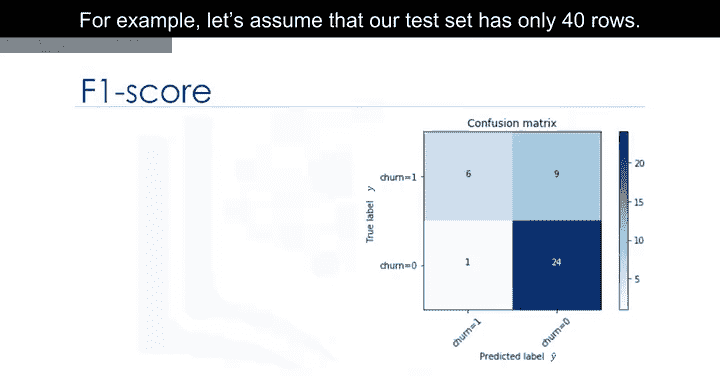

每个混淆矩阵的行显示测试集中的实际真实标签，列显示分类器的预测标签。让我们看第一行。

第一行对应测试集中实际流失值为1的客户。如你所见，在40个客户中，有15个客户的流失值为1。在这15个客户中，分类器正确预测了6个为1，9个为0。

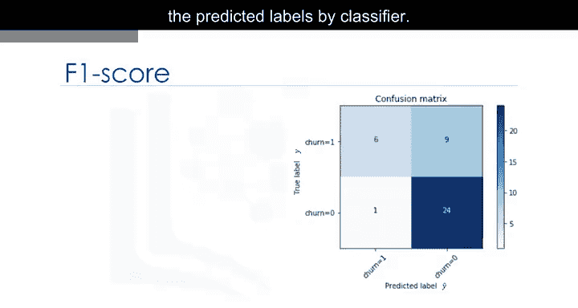

这意味着对于6个客户，测试集中的实际流失值为1，分类器也正确预测为1。然而，对于9个客户，实际标签为1，但分类器预测为0，这并不理想。我们可以将其视为模型在第一行的错误。

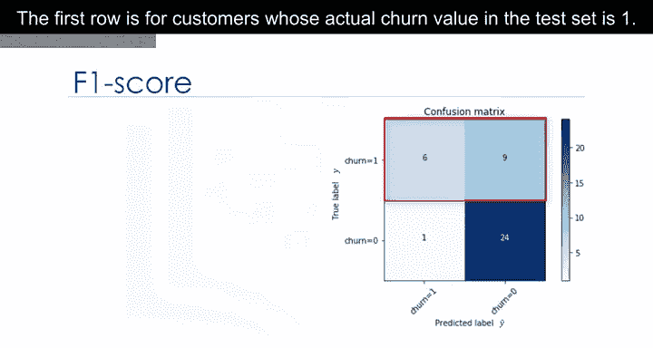

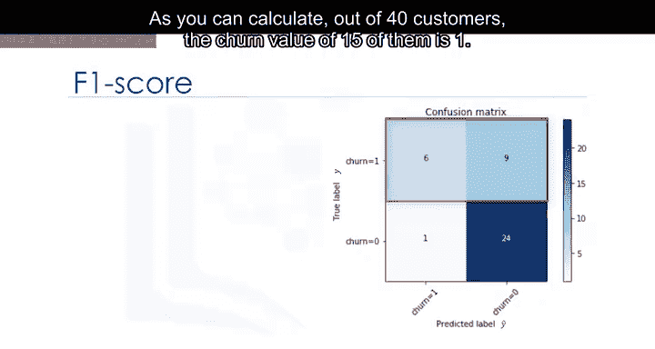

那么流失值为0的客户呢？让我们看第二行。

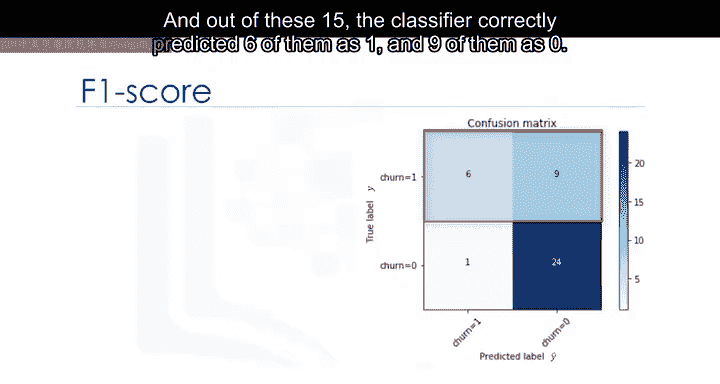

看起来有25个客户的流失值为0。分类器正确预测了24个为0，错误预测了1个为1。因此，在预测流失值为0的客户方面，分类器表现良好。

混淆矩阵的一个优点是它显示了模型正确预测或区分类别的能力。在二元分类器的特定情况下，我们可以将这些数字解释为真正例、假负例、真负例和假正例的计数。

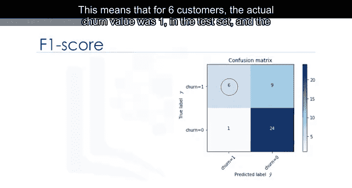

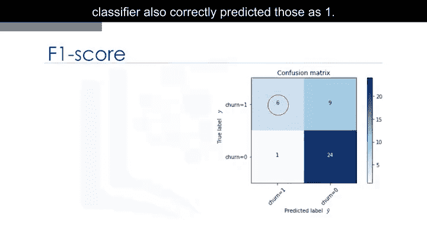

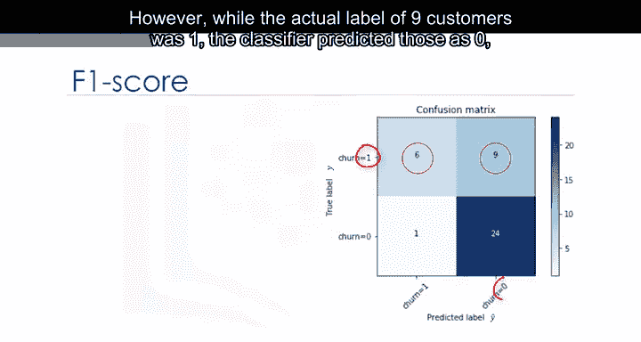

## 精确率与召回率

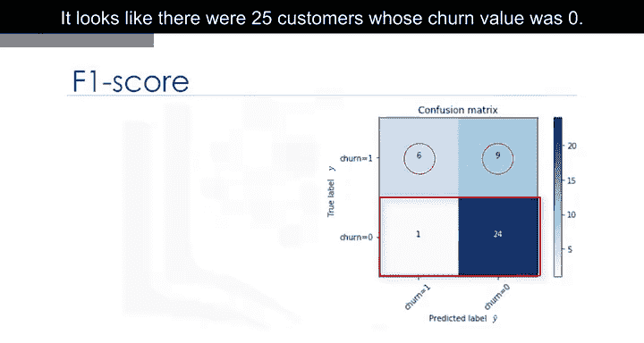

基于每个部分的计数，我们可以计算每个标签的精确率和召回率。

精确率是在预测了类别标签的情况下提供的准确性度量。它定义为真正例除以真正例与假正例之和。

**公式**：
\[
\text{Precision} = \frac{\text{True Positive}}{\text{True Positive} + \text{False Positive}}
\]

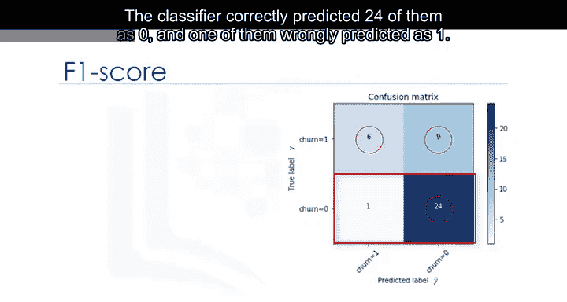

召回率是真正例率。它定义为真正例除以真正例与假负例之和。

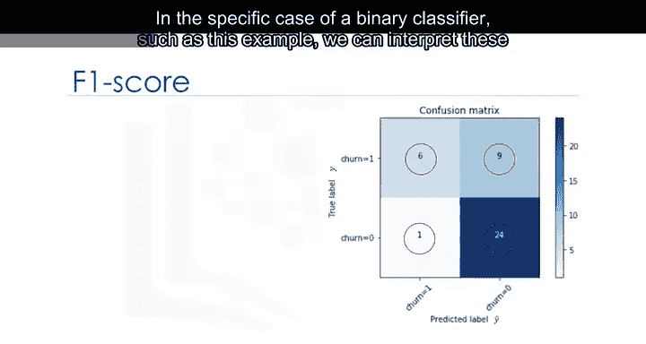

**公式**：
\[
\text{Recall} = \frac{\text{True Positive}}{\text{True Positive} + \text{False Negative}}
\]

因此，我们可以计算每个类别的精确率和召回率。

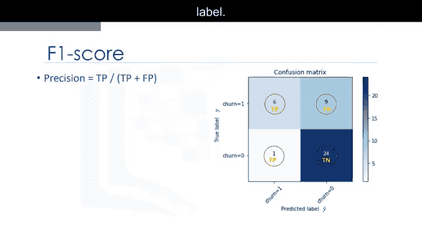

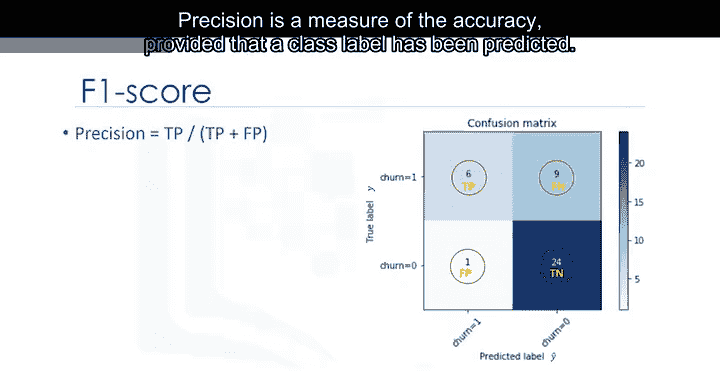

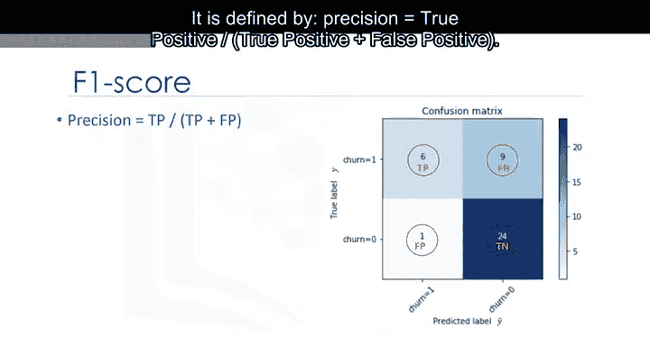

## F1分数

现在我们可以基于每个标签的精确率和召回率计算F1分数。

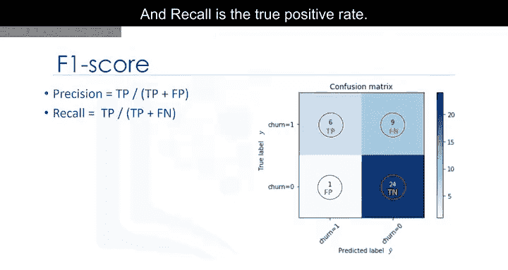

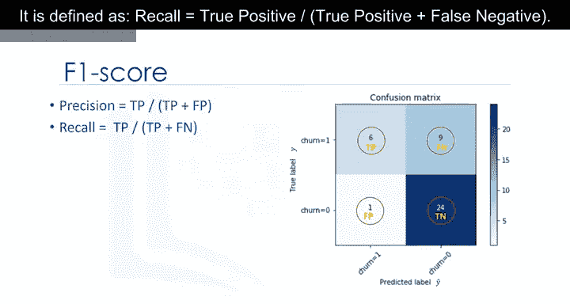

F1分数是精确率和召回率的调和平均数，其中F1分数的最佳值为1，表示完美的精确率和召回率，最差值为0。这是展示分类器在召回率和精确率方面都有良好值的好方法。它使用F1分数方程定义。

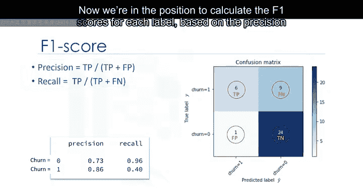

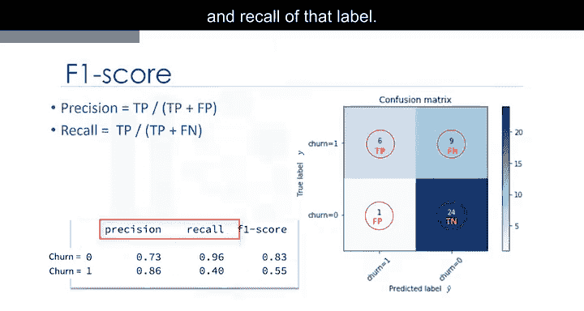

**公式**：
\[
F1 = 2 \times \frac{\text{Precision} \times \text{Recall}}{\text{Precision} + \text{Recall}}
\]

例如，类别0（即流失等于0）的F1分数为0.83，类别1（即流失等于1）的F1分数为0.55。最后，我们可以说这个分类器的平均准确性是两个标签F1分数的平均值，即0.72。

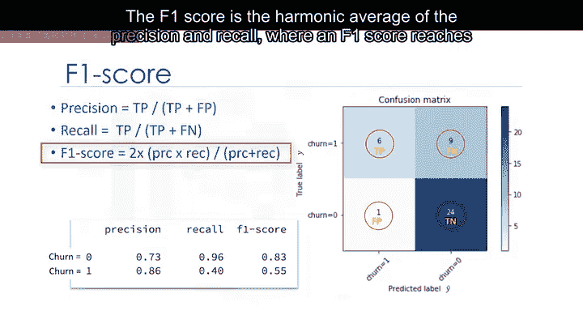

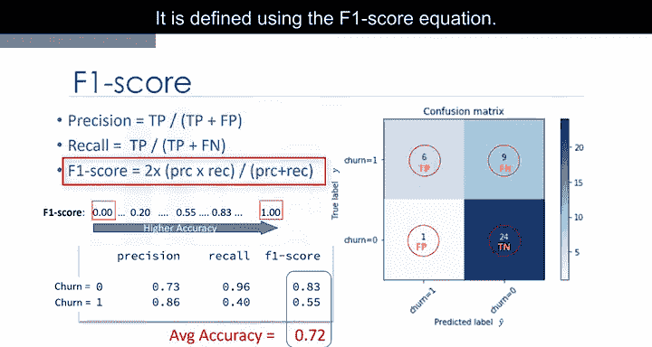

请注意，Jaccard指数和F1分数也可用于多类分类器，但这超出了本课程的范围。

## 对数损失

现在，让我们看看分类器的另一种准确性度量。有时，分类器的输出是类别标签的概率，而不是标签本身。例如，在逻辑回归中，输出可以是客户流失的概率，即“是”或等于1。这个概率值介于0和1之间。

对数损失（Log Loss）衡量分类器的性能，其中预测输出是介于0和1之间的概率值。例如，当实际标签为1时，预测概率为0.13会很差，并导致较高的对数损失。

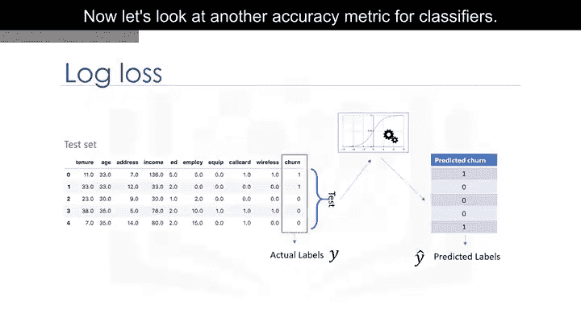

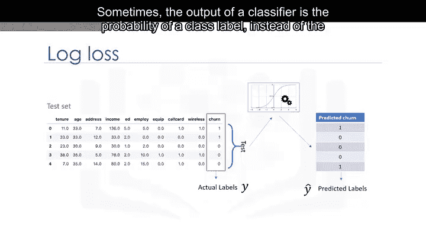

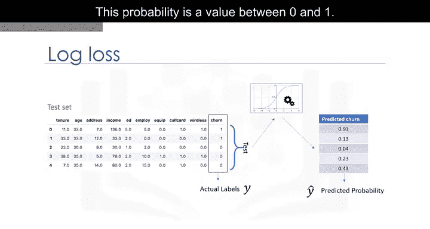

我们可以使用对数损失方程计算每一行的对数损失，该方程衡量每个预测与实际标签的距离。然后，我们计算测试集所有行的平均对数损失。

显然，理想的分类器具有逐渐减小的对数损失值。因此，对数损失较低的分类器具有更好的准确性。

## 总结

在本节课中，我们一起学习了分类模型的评价指标。我们介绍了Jaccard指数、混淆矩阵、精确率、召回率、F1分数和对数损失。这些指标帮助我们全面评估分类器的性能，并指导我们改进模型。理解这些指标对于构建有效的机器学习模型至关重要。