# 014：决策树导论 🌳

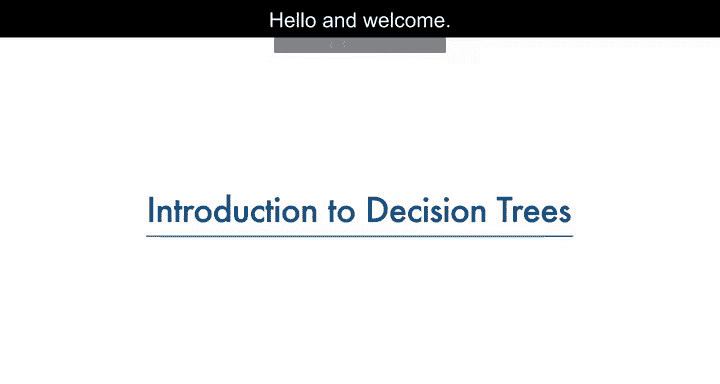

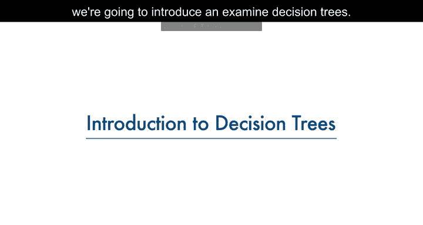

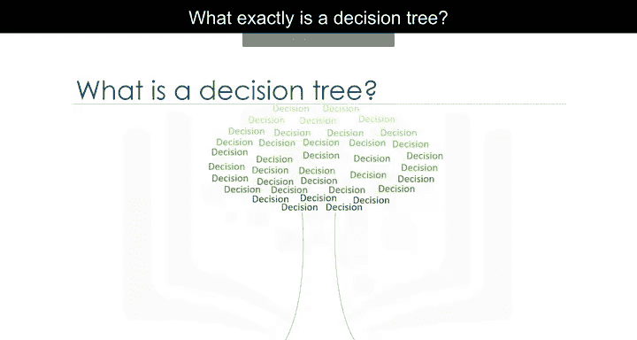

在本节课中，我们将要学习决策树的基本概念。决策树是一种直观且强大的机器学习算法，常用于分类和回归任务。我们将通过一个医疗研究的例子，了解决策树如何构建，以及它如何帮助我们做出决策。

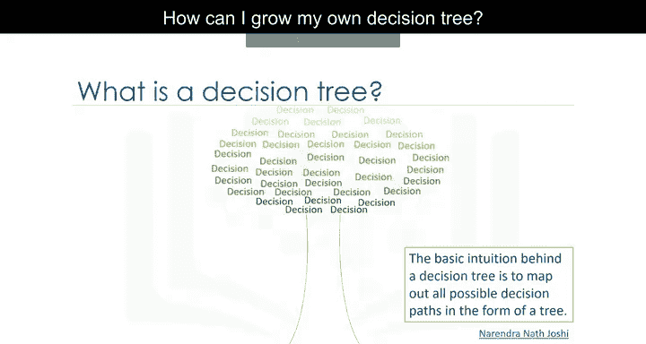

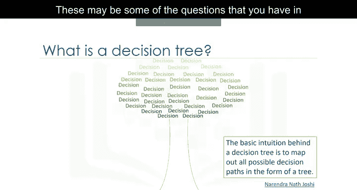

---

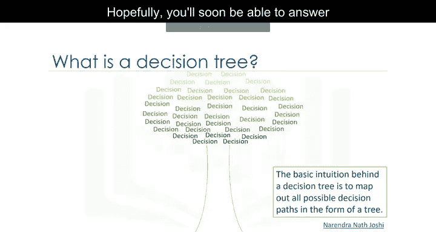

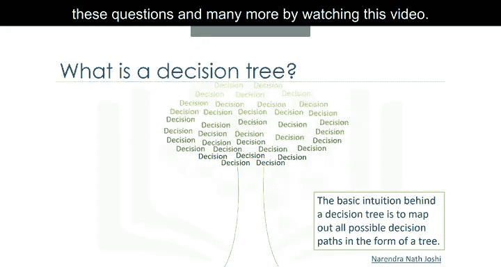

## 什么是决策树？ 🤔

决策树是一种树状结构模型，用于基于数据特征进行分类或预测。它通过一系列的问题（即对特征的测试）来对数据进行分割，最终将数据分配到不同的类别中。

## 决策树的应用场景 🏥

想象你是一名医学研究员，正在为一项研究收集数据。你已经收集了一组患有相同疾病的患者数据。在治疗过程中，每位患者对两种药物（药物A和药物B）中的一种有反应。你的任务是构建一个模型，以确定未来患有相同疾病的患者应使用哪种药物。

该数据集的特征包括患者的年龄、性别、血压和胆固醇水平。目标是每位患者有反应的药物。这是一个二分类问题，你可以使用数据集的训练部分构建决策树，然后用它来预测未知患者的类别，从而决定为新患者开具哪种药物。

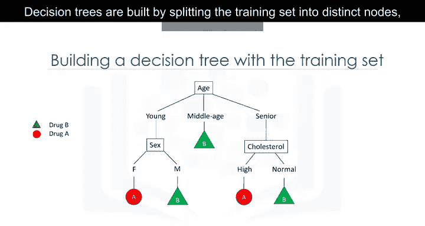

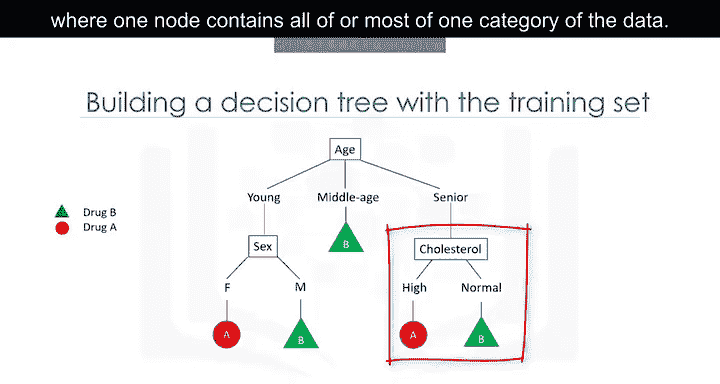

## 决策树的构建过程 🛠️

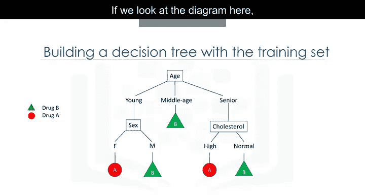

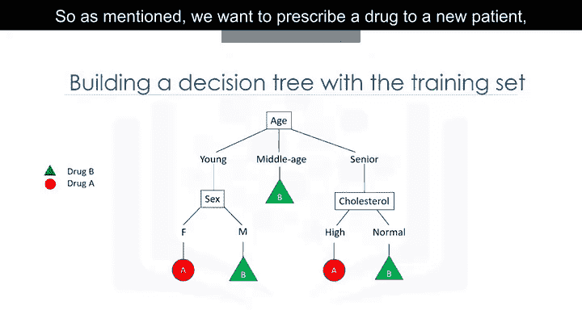

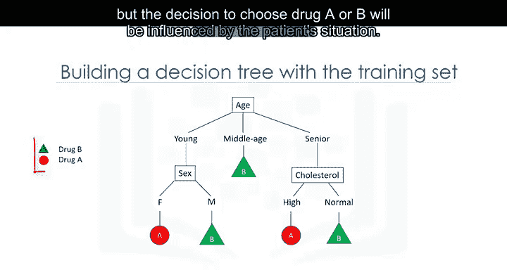

决策树通过将训练集分割成不同的节点来构建，每个节点包含全部或大部分同一类别的数据。

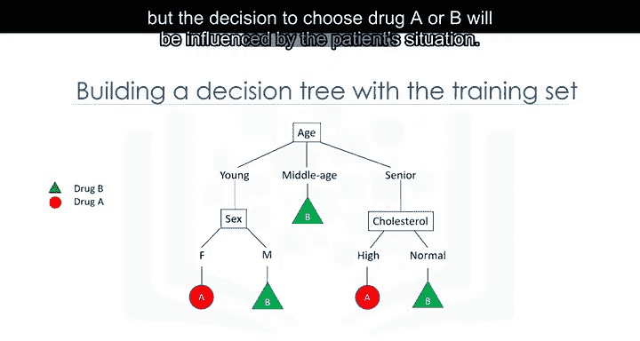

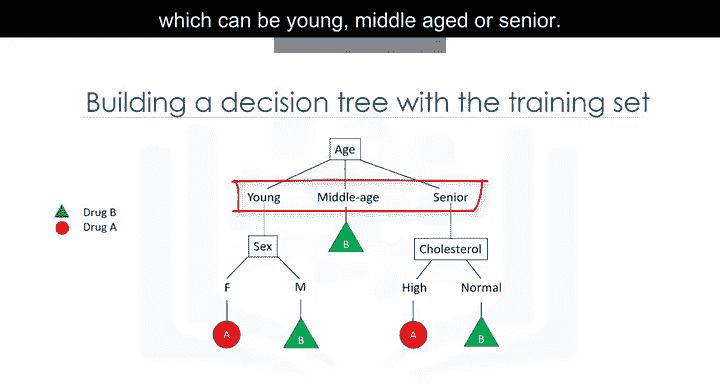

### 构建步骤

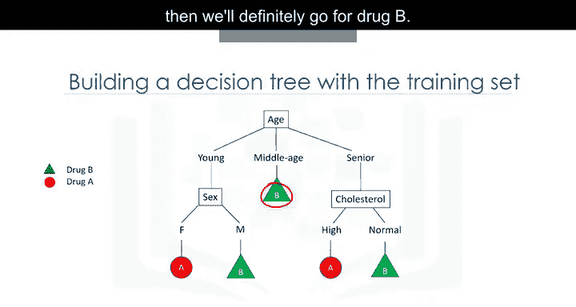

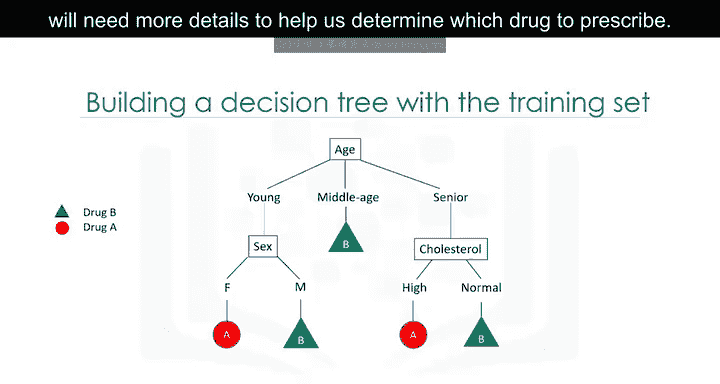

以下是构建决策树的基本步骤：

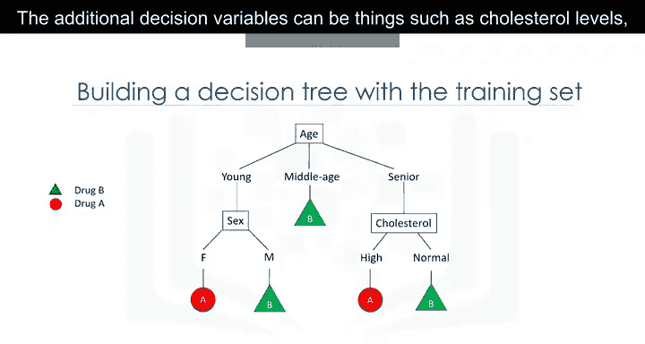

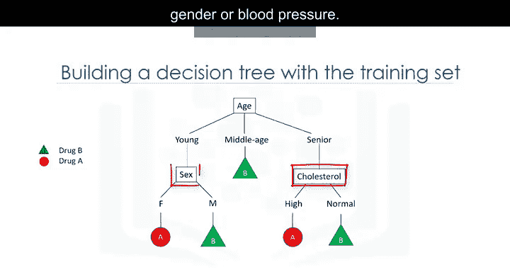

1. **选择属性**：从数据中选择一个属性。
2. **计算属性重要性**：计算该属性在数据分割中的重要性。在下一个视频中，我们将解释如何计算属性的重要性，以判断它是否是一个有效的属性。
3. **分割数据**：根据最佳属性的值分割数据。
4. **递归构建**：进入每个分支，对其余属性重复上述过程。

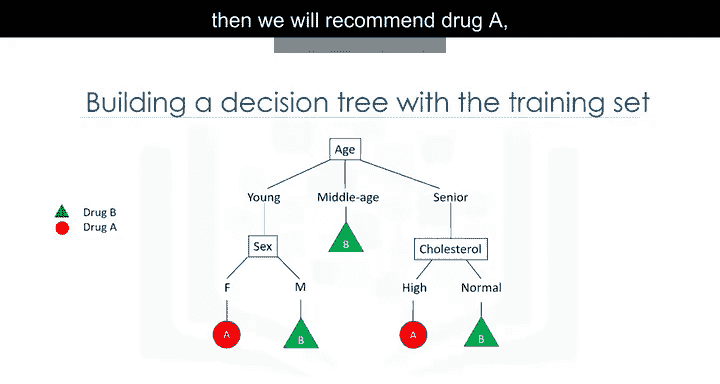

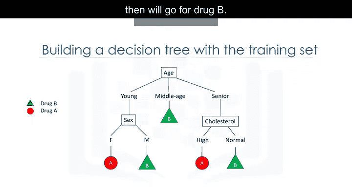

构建完成后，你可以使用这棵树来预测未知案例的类别，或者根据新患者的特征为其推荐合适的药物。

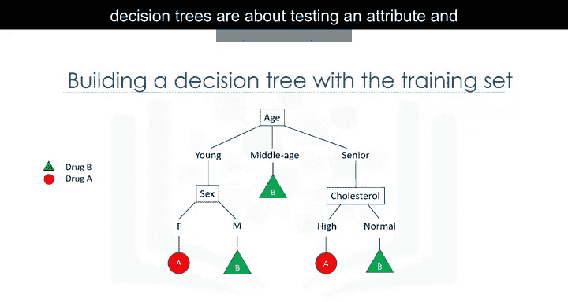

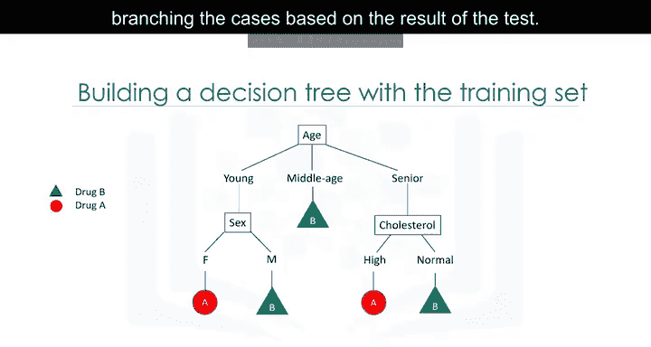

## 决策树的结构解析 🌲

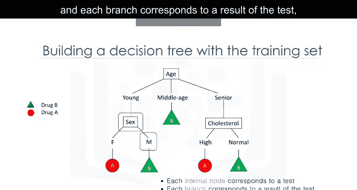

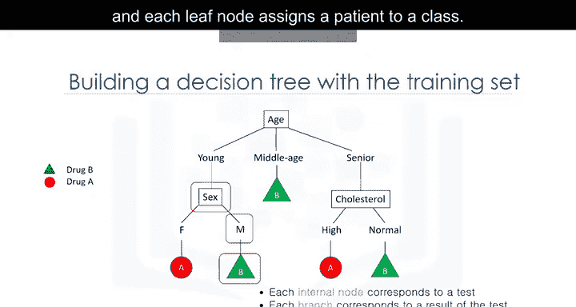

决策树的核心在于测试属性并根据测试结果分支案例。

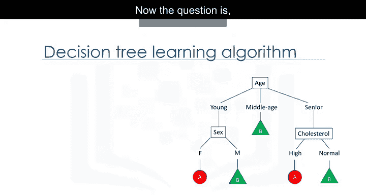

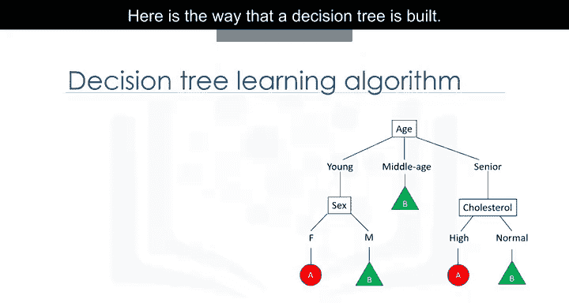

- **内部节点**：对应一个测试。
- **分支**：对应测试的结果。
- **叶节点**：将患者分配到一个类别。

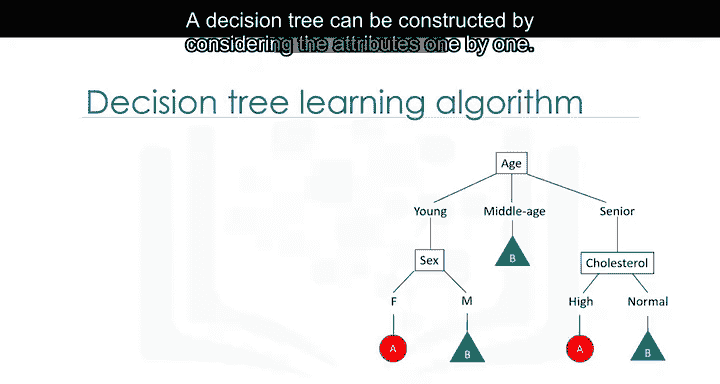

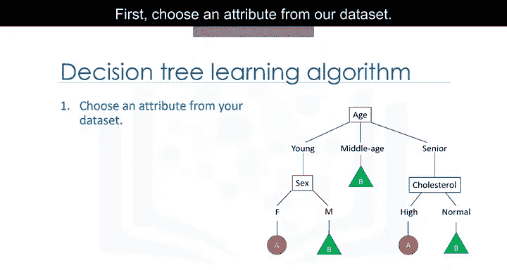

例如，从年龄开始，年龄可以是年轻、中年或老年。如果患者是中年，则直接选择药物B。如果患者是年轻或老年，则需要更多细节（如胆固醇水平、性别或血压）来确定使用哪种药物。

## 总结 📚

本节课我们一起学习了决策树的基本概念和构建过程。决策树通过测试属性并分支案例来对数据进行分类，是一种直观且易于理解的机器学习算法。在接下来的课程中，我们将深入探讨如何计算属性的重要性，以及如何优化决策树的构建。