# 016：逻辑回归入门 📊

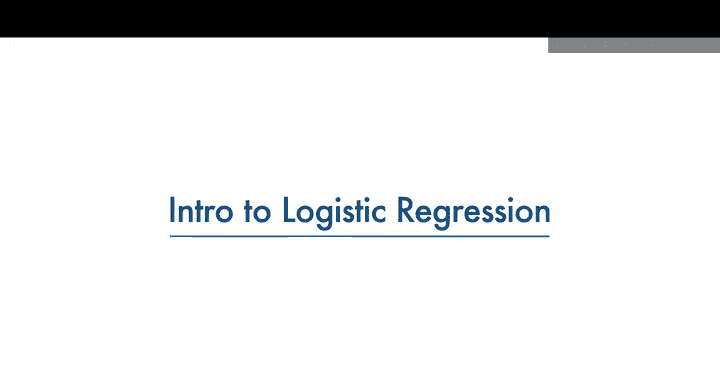

在本节课中，我们将学习一种名为逻辑回归的机器学习方法，该方法用于分类任务。我们将具体探讨以下三个问题：什么是逻辑回归？逻辑回归可以解决哪些类型的问题？在哪些情况下我们应该使用逻辑回归？

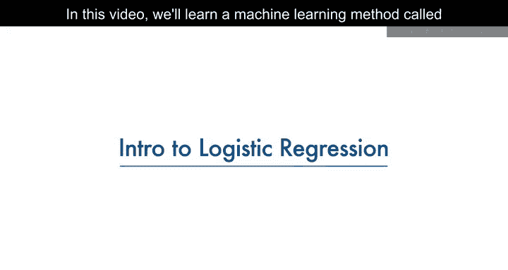

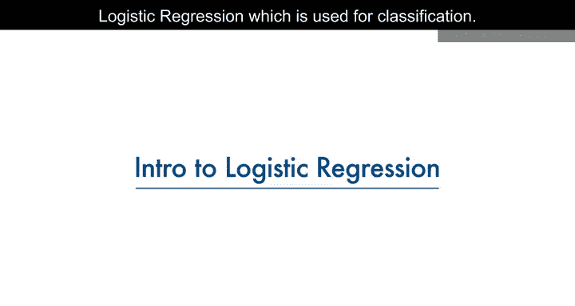

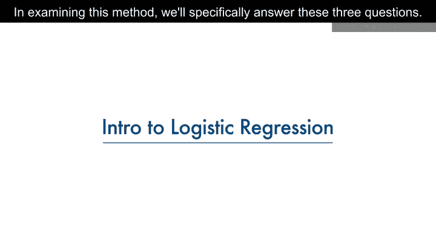

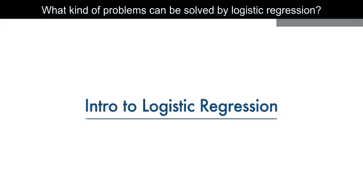

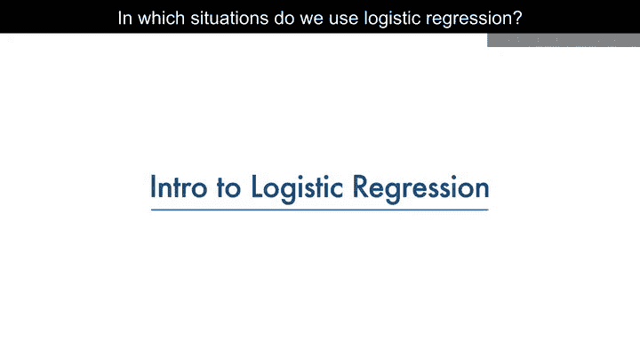

## 什么是逻辑回归？ 🤔

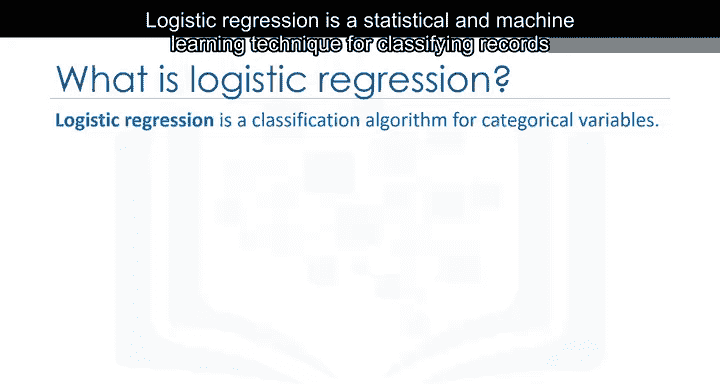

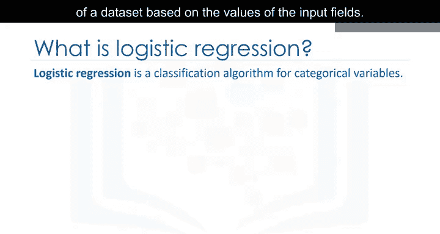

逻辑回归是一种统计和机器学习技术，用于根据输入字段的值对数据集的记录进行分类。

假设我们有一个电信数据集，我们希望通过分析来了解哪些客户可能在下个月流失。这是历史客户数据，其中每一行代表一个客户。想象一下，你是这家公司的分析师，你必须找出谁要离开以及原因。你将使用这些数据基于历史记录构建一个模型，并用它来预测客户群体中未来的流失情况。

数据包括每个客户已注册的服务信息、客户账户信息、客户的人口统计信息（如性别和年龄范围），以及上个月内离开公司的客户。该列称为“流失”。我们可以使用逻辑回归，利用给定的特征构建一个预测客户流失的模型。

在逻辑回归中，我们使用一个或多个自变量（如任期、年龄和收入）来预测一个结果（如流失），我们称之为因变量，代表客户是否会停止使用服务。

逻辑回归类似于线性回归，但试图预测一个分类或离散的目标字段，而不是数值型字段。在线性回归中，我们可能尝试预测一个连续变量，如房屋价格、患者血压或汽车油耗。但在逻辑回归中，我们预测一个二元变量，例如是/否、真/假、成功/不成功、怀孕/未怀孕等，所有这些都可以编码为0或1。

在逻辑回归中，自变量应该是连续的。如果是分类变量，则应进行虚拟或指示编码。这意味着我们必须将它们转换为某种连续值。

请注意，逻辑回归既可用于二元分类，也可用于多类分类，但为了简单起见，在本视频中我们将重点讨论二元分类。

在解释其工作原理之前，让我们先看看逻辑回归的一些应用。

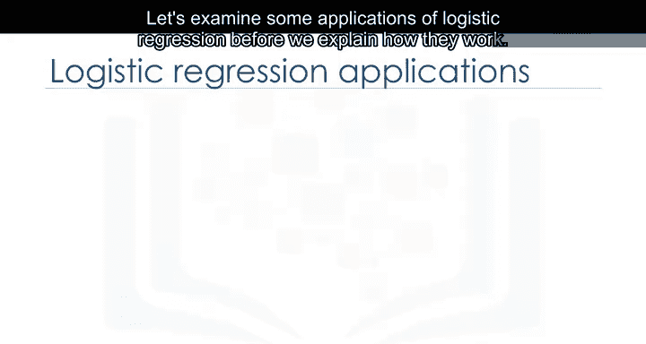

## 逻辑回归的应用场景 🏥📈

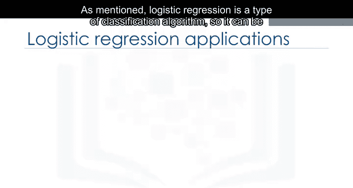

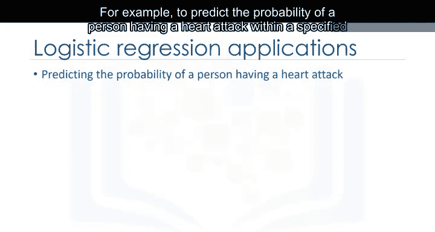

如前所述，逻辑回归是一种分类算法，因此可以用于不同的情况。例如：

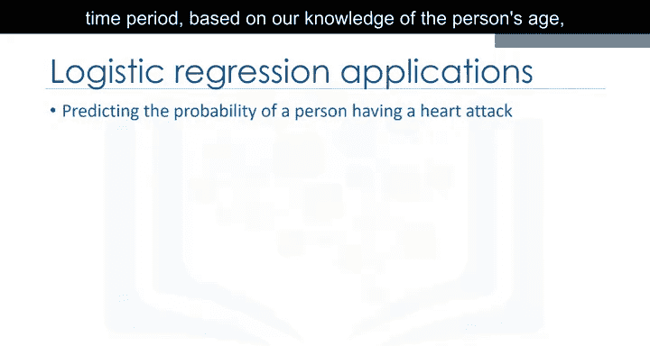

*   根据一个人的年龄、性别和体重指数，预测其在指定时间段内发生心脏病的概率。
*   预测受伤患者的死亡几率。
*   根据观察到的患者特征（如体重、身高、血压和各种血液检查结果等），预测患者是否患有某种疾病（如糖尿病）。

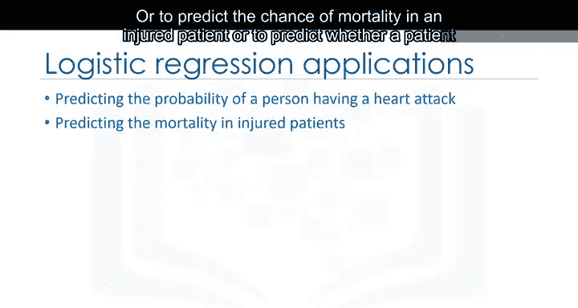

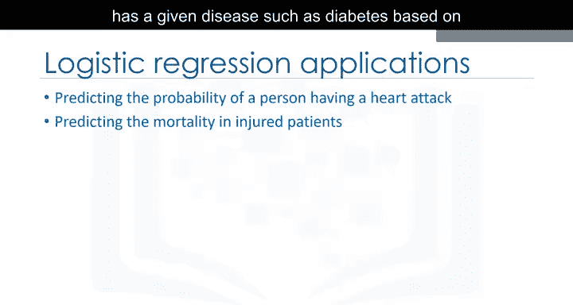

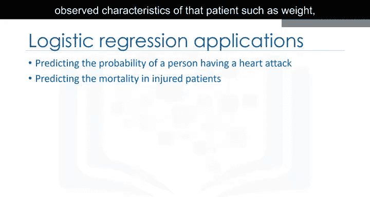

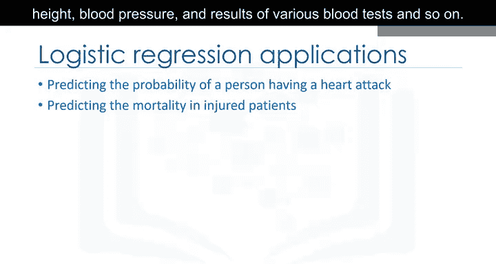

在营销环境中，我们可以用它来预测客户购买产品或停止订阅的可能性，正如我们在流失示例中所做的那样。我们还可以使用逻辑回归来预测给定过程、系统或产品失败的概率。我们甚至可以用它来预测房主拖欠抵押贷款的可能性。

这些都是可以使用逻辑回归解决的问题的好例子。请注意，在所有这些例子中，我们不仅预测每个案例的类别，还衡量案例属于特定类别的概率。

有多种机器学习算法可以对变量进行分类或估计。

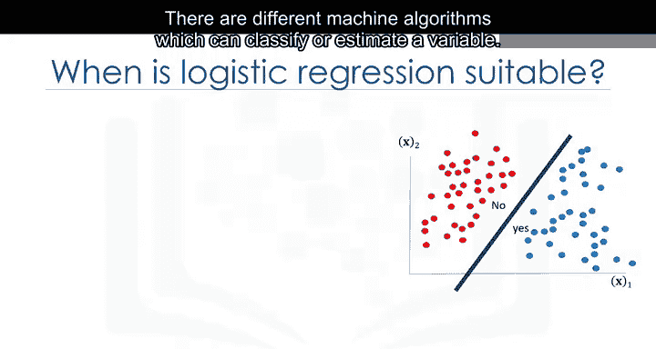

## 何时使用逻辑回归？ ⏰

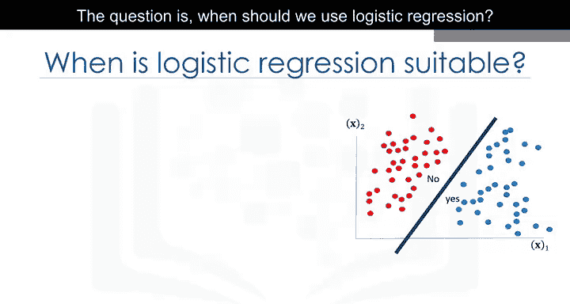

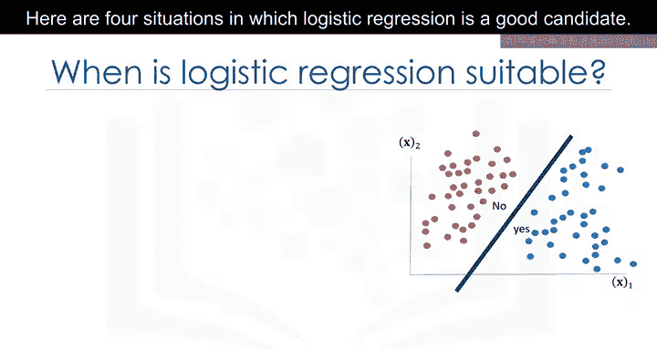

问题是，我们什么时候应该使用逻辑回归？以下是四种适合使用逻辑回归的情况。

以下是四种适合使用逻辑回归的情况：

1.  **目标字段是分类变量（特别是二元变量）**：当数据中的目标字段是分类变量，特别是二元变量时，例如0/1、是/否、流失/未流失、阳性/阴性等。
2.  **需要预测的概率**：如果你需要知道预测的概率，例如，想知道客户购买产品的概率是多少。逻辑回归会为给定的数据样本返回一个介于0和1之间的概率分数。实际上，逻辑回归预测的是该样本的概率，我们根据该概率将案例映射到一个离散的类别。
3.  **数据是线性可分的**：逻辑回归的决策边界是一条线、一个平面或一个超平面。分类器会将决策边界一侧的所有点归为一个类别，另一侧的所有点归为另一个类别。例如，如果我们只有两个特征并且不应用任何多项式处理，我们可以得到一个不等式，如 `θ₀ + θ₁x₁ + θ₂x₂ > 0`，这是一个很容易绘制的半平面。请注意，在使用逻辑回归时，我们也可以通过多项式处理实现复杂的决策边界，但这超出了本课程的范围。当你理解逻辑回归的工作原理后，你会对决策边界有更深入的了解。
4.  **需要理解特征的影响**：你可以根据逻辑回归模型系数或参数的统计显著性来选择最佳特征。也就是说，在找到最优参数后，权重 `θ₁` 接近0的特征 `x` 对预测的影响小于 `θ₁` 绝对值大的特征。实际上，它使我们能够在控制其他自变量的同时，理解一个自变量对因变量的影响。

让我们再看一下我们的数据集。我们将自变量定义为 `x`，因变量定义为 `y`。

## 形式化问题 📝

请注意，为了简单起见，我们可以将目标值或因变量值编码为0或1。逻辑回归的目标是构建一个模型来预测每个样本（在本例中是客户）的类别，以及每个样本属于某个类别的概率。

基于此，让我们开始形式化这个问题。

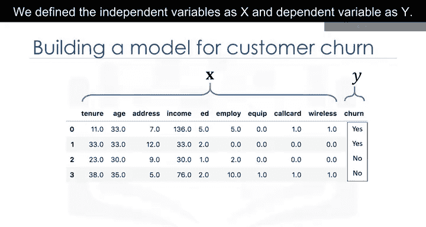

`X` 是我们的数据集，位于 `M x N` 的实数空间中，即具有 `M` 个维度（特征）和 `N` 条记录。`y` 是我们想要预测的类别，可以是0或1。

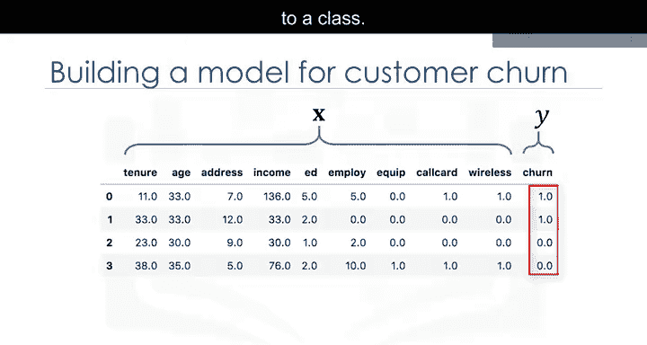

理想情况下，一个称为 `ŷ` 的逻辑回归模型，可以预测给定其特征 `X` 的客户的类别为1。

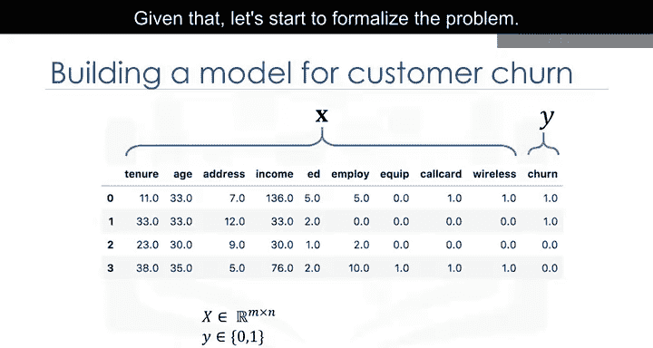

同样可以很容易地证明，客户属于类别0的概率可以计算为 `1` 减去客户类别为1的概率。

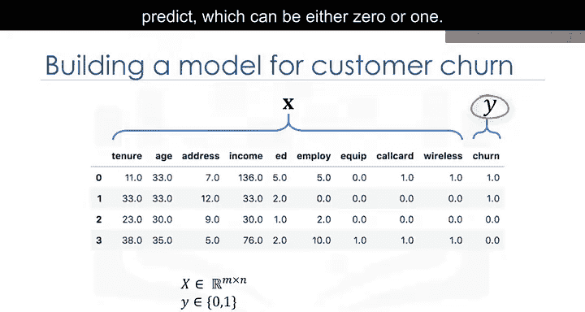

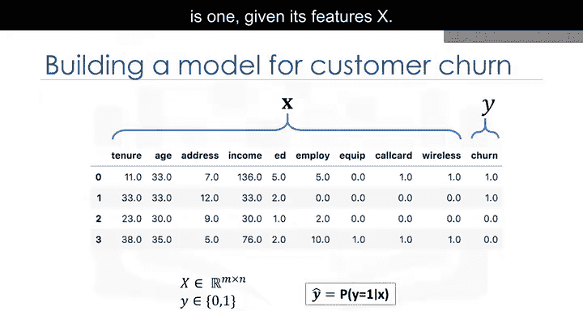

## 总结 📚

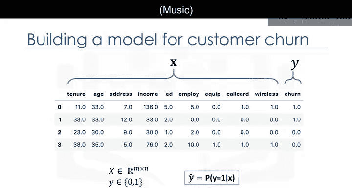

本节课中，我们一起学习了逻辑回归的基础知识。我们了解到逻辑回归是一种用于分类的统计和机器学习方法，特别适用于预测二元结果。我们探讨了它的定义、与线性回归的区别、典型的应用场景（如医疗诊断和客户流失预测），以及适合使用逻辑回归的四种情况（目标变量为二元、需要概率输出、数据线性可分、需要理解特征重要性）。最后，我们形式化了逻辑回归的预测目标，即预测样本属于某一类别的概率。