# 020：聚类分析导论 🎯

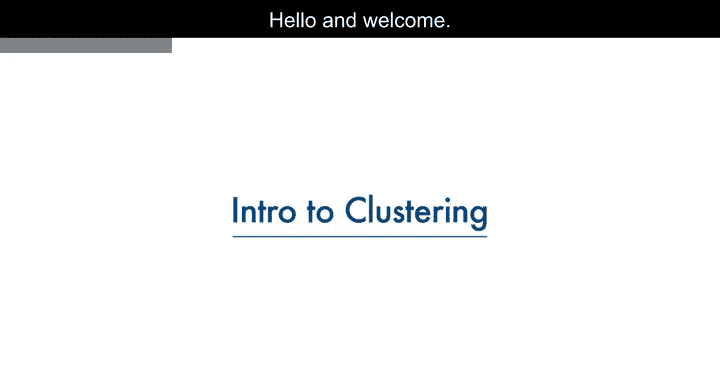

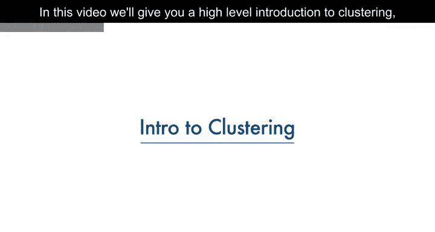

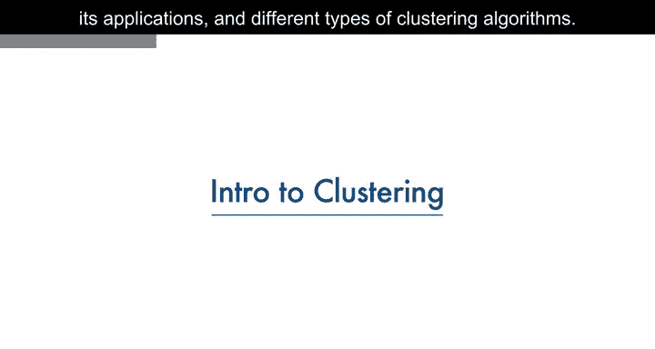

在本节课中，我们将学习聚类分析的基本概念、应用场景以及不同类型的聚类算法。聚类是一种无监督学习方法，旨在发现数据中内在的分组结构。

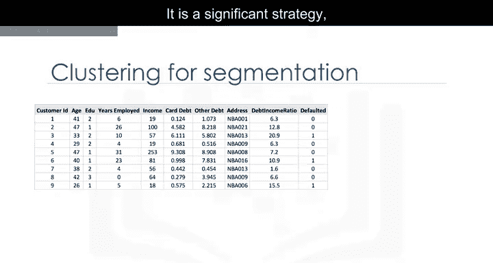

---

## 什么是聚类？🔍

想象你有一个客户数据集，需要基于历史数据进行客户细分。客户细分是根据相似特征将客户群划分为不同组别的实践。这是一种重要策略，因为它允许企业针对特定客户群体，从而更有效地分配营销资源。

例如，一个群体可能包含高利润、低风险的客户，他们更有可能购买产品或订阅服务。了解这些信息有助于企业投入更多时间和精力来留住这些客户。另一个群体可能包含来自非营利组织的客户等。

对于大量多样化数据，通常无法进行通用的细分处理。因此，你需要一种分析方法从大数据集中推导出细分和群体。客户可以根据年龄、性别、兴趣、消费习惯等多个因素进行分组。关键要求是利用现有数据来理解和识别客户之间的相似性。

---

## 聚类与分类的区别 ⚖️

上一节我们介绍了聚类的概念，本节中我们来看看聚类与分类有何不同。

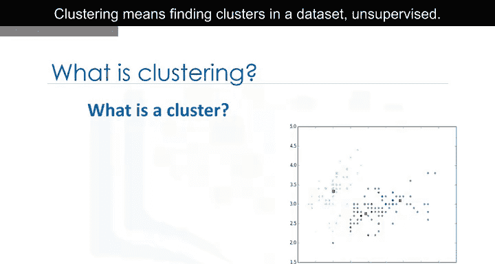

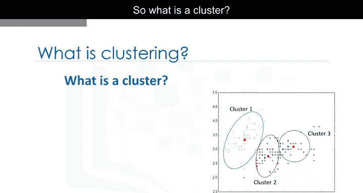

再次审视我们的客户数据集。分类算法预测的是**分类标签**。这意味着将实例分配到预定义的类别中，例如“违约”或“非违约”。举例来说，如果分析师想分析客户数据以了解哪些客户可能违约，她会使用带标签的数据集作为训练数据，并应用决策树、支持向量机或逻辑回归等分类方法来预测新客户或已知客户的违约情况。

一般来说，分类是一种监督学习，其中每个训练数据实例都属于一个特定的类别。

然而，在聚类中，数据是**无标签**的，过程是**无监督**的。例如，我们可以使用K均值等聚类算法，如前所述，根据客户是否共享相似属性（如年龄、教育程度等）将相似客户分组并分配到某个簇中。

---

## 聚类的应用领域 🌐

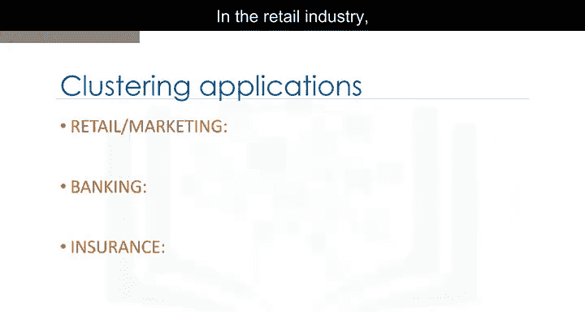

聚类分析在不同领域有许多应用。以下是几个例子：

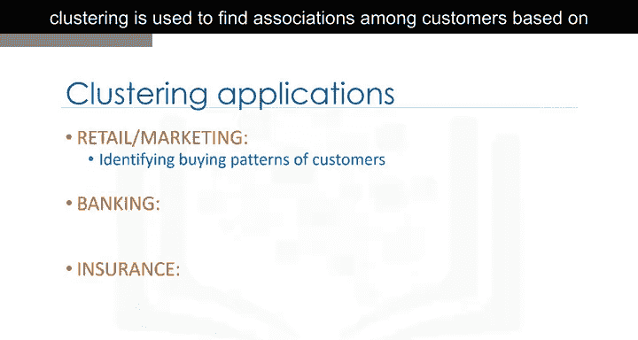

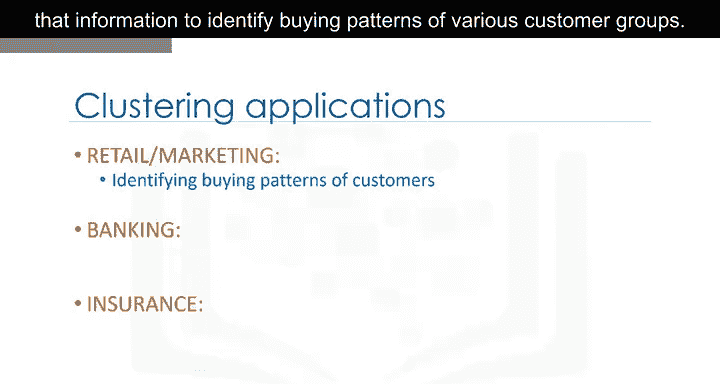

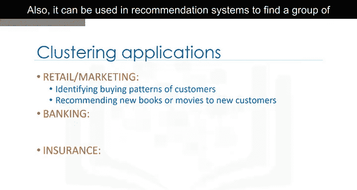

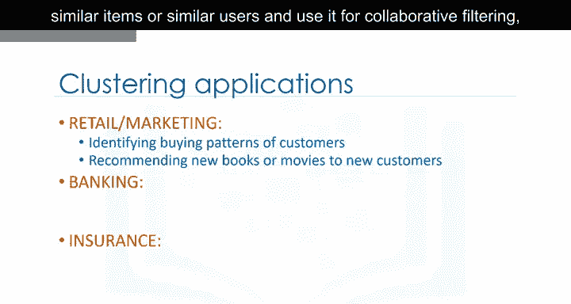

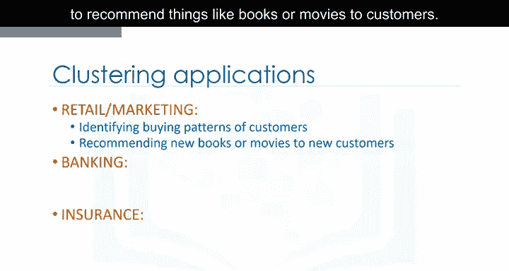

*   **零售业**：用于根据人口统计特征发现客户之间的关联，并利用该信息识别不同客户群体的购买模式。此外，它还可用于推荐系统中，以找到一组相似的项目或相似用户，并利用协同过滤向客户推荐书籍或电影等。
*   **银行业**：分析师寻找正常交易的簇以发现欺诈性信用卡使用的模式；他们也使用聚类来识别客户群体，例如区分忠诚客户与流失客户。
*   **保险业**：用于理赔分析中的欺诈检测，或根据客户细分评估特定客户的保险风险。
*   **出版媒体**：用于根据内容自动对新闻进行分类或标记新闻，然后进行聚类，以便向读者推荐类似的新闻文章。
*   **医学**：可用于根据相似特征描述患者行为，从而为不同疾病确定成功的医疗方案；在生物学中，用于对具有相似表达模式的基因进行分组，或对遗传标记进行聚类以识别家族关系。

如果你留心观察，可以发现聚类的许多其他应用。但总的来说，聚类可用于以下目的之一：

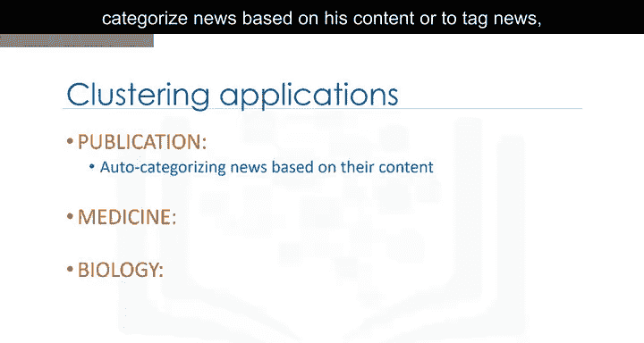

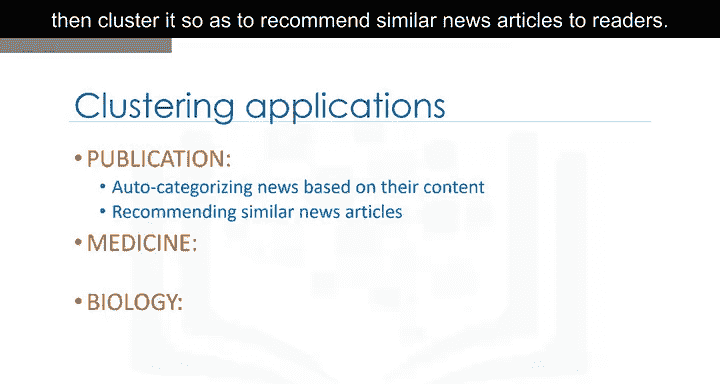

以下是聚类的主要用途：
*   **探索性数据分析**
*   **摘要生成或规模缩减**
*   **异常值检测**（尤其用于欺诈检测或噪声去除）
*   **在数据集中查找重复项**
*   **作为预测、其他数据挖掘任务的预处理步骤**，或作为复杂系统的一部分

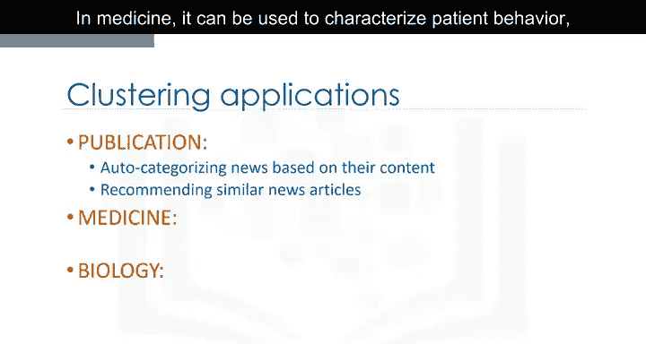

---

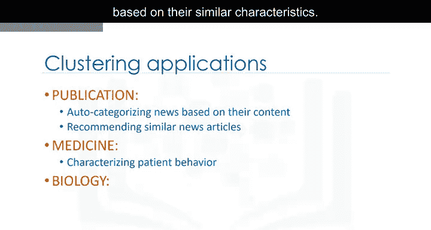

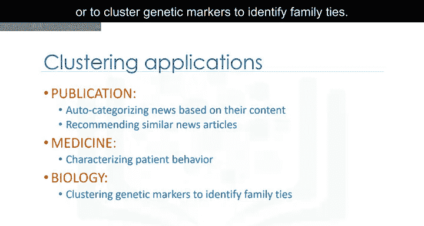

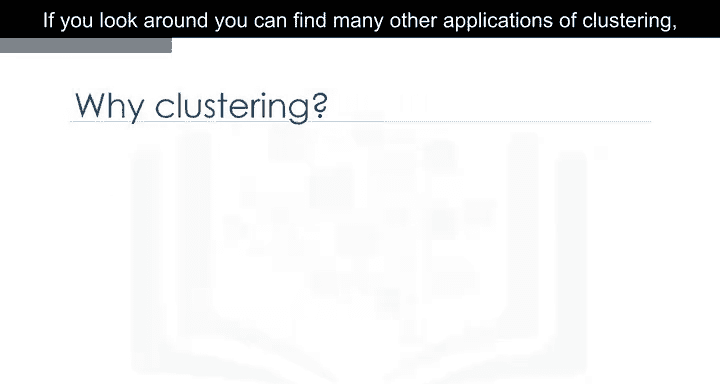

## 聚类算法类型 📊

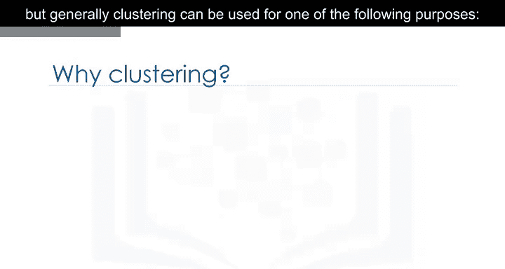

让我们简要了解不同的聚类算法及其特点。

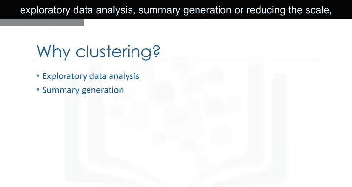

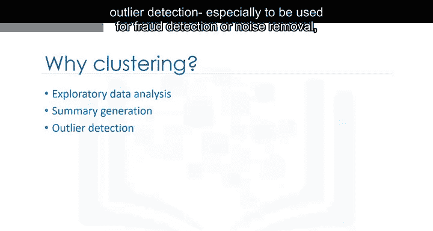

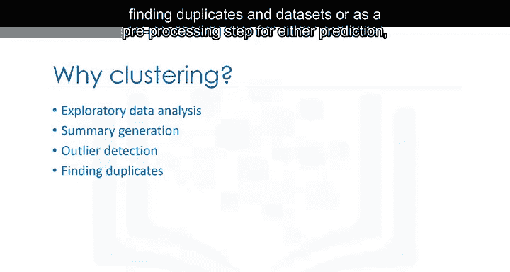

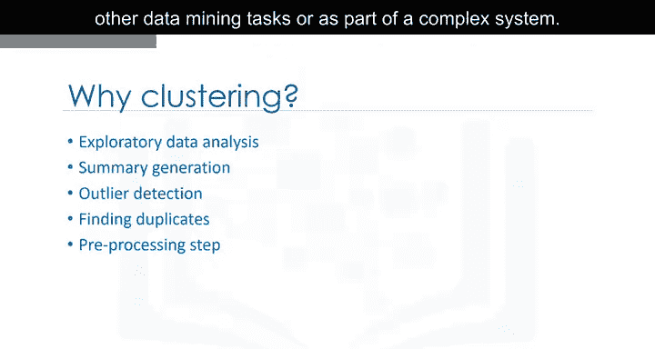

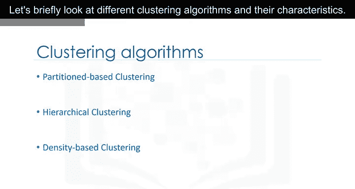

*   **基于划分的聚类**：这类算法产生类似球形的簇，例如**K均值**、K中值或模糊C均值。这些算法相对高效，适用于中型和大型数据库。
*   **层次聚类**：这类算法产生簇的树状结构，例如凝聚型和分裂型算法。这类算法非常直观，通常适用于小型数据集。
*   **基于密度的聚类**：这类算法产生任意形状的簇。在处理空间聚类或数据集中存在噪声时尤其有效，例如**DBSCAN算法**。

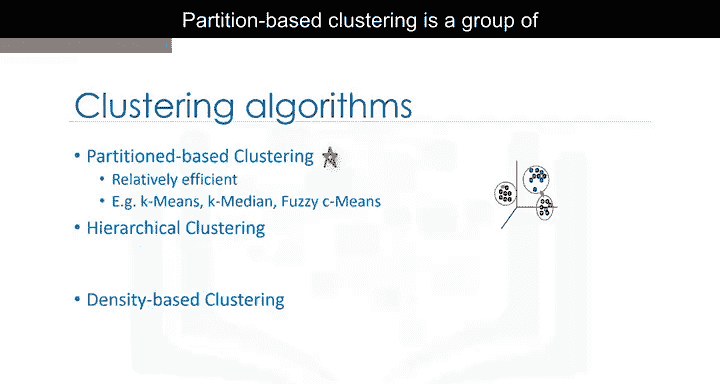

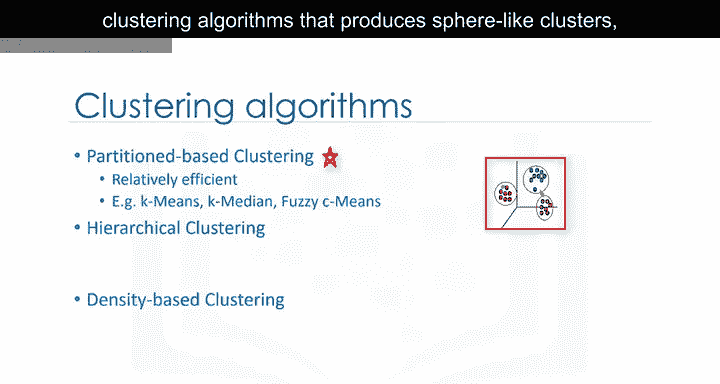

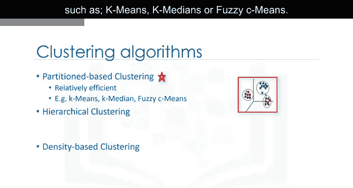

---

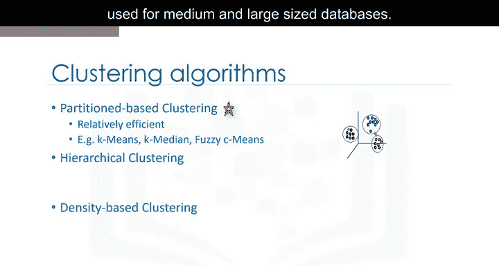

## 总结 📝

本节课中我们一起学习了聚类分析。我们了解到聚类是一种无监督学习方法，用于在数据中发现相似对象组成的群组（簇）。我们探讨了聚类与分类的区别，列举了聚类在零售、金融、医疗等多个领域的广泛应用，并简要介绍了基于划分、层次和基于密度等主要类型的聚类算法及其特点。掌握这些基础知识是后续深入学习具体聚类算法和应用的第一步。