# 021：K均值聚类入门 🎯

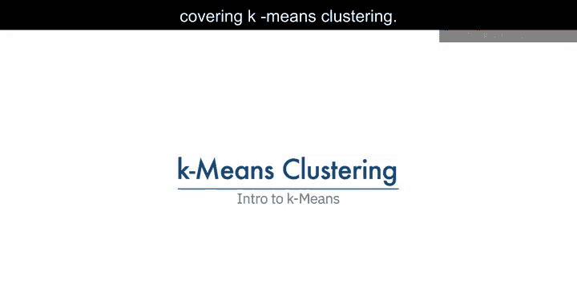

在本节课中，我们将要学习K均值聚类算法。这是一种无监督学习算法，常用于客户细分等场景，能够根据数据点之间的相似性将其分组。

## 概述

想象你有一个客户数据集，需要基于历史数据进行客户细分。客户细分是将客户群划分为具有相似特征的个体组的实践。K均值聚类是可用于此目的的算法之一。它能够基于客户之间的相似性，以无监督的方式对数据进行分组。

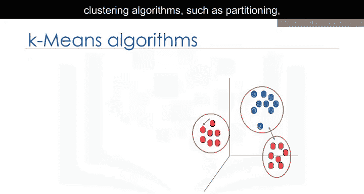

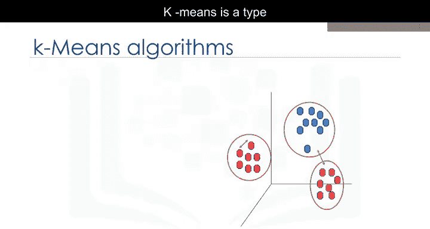

## 什么是K均值聚类？🤔

K均值是一种**划分聚类**算法。这意味着它将数据划分为K个不重叠的子集或簇，且这些簇内部没有结构或标签，因此它是一种无监督算法。

一个簇内的对象非常相似，而不同簇间的对象则非常不同或不相似。使用K均值时，我们需要找到相似的样本，例如相似的客户。

## 如何衡量相似性？📏

K均值的目标是形成这样的簇：相似样本进入同一个簇，不相似样本落入不同簇。为了实现这一点，我们通常使用**不相似性度量**，即样本之间的距离。

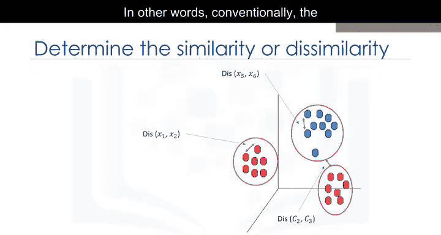

我们可以说，K均值试图**最小化簇内距离**，并**最大化簇间距离**。

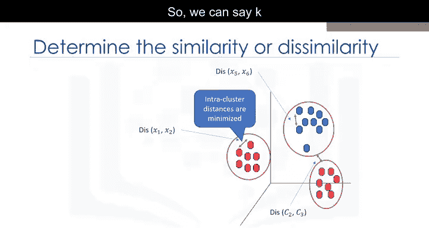

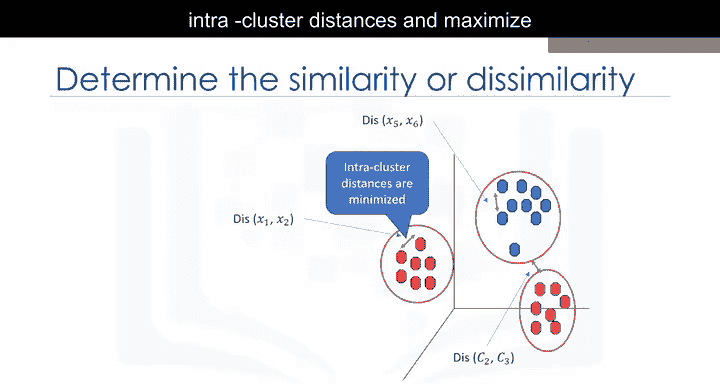

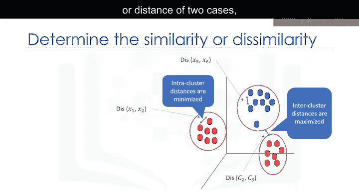

那么，如何计算两个样本（如两个客户）之间的距离呢？

### 距离计算

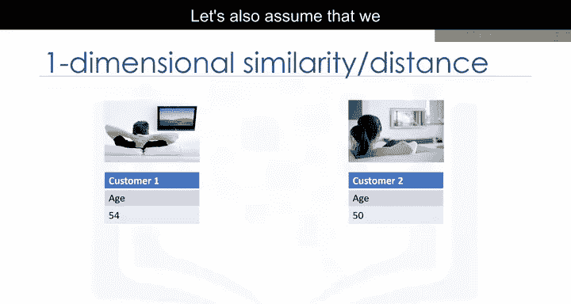

假设我们有两个客户，客户1和客户2。最初，假设每个客户只有一个特征：年龄。我们可以使用**闵可夫斯基距离**的一种特定类型来计算这两个客户之间的距离，即**欧几里得距离**。

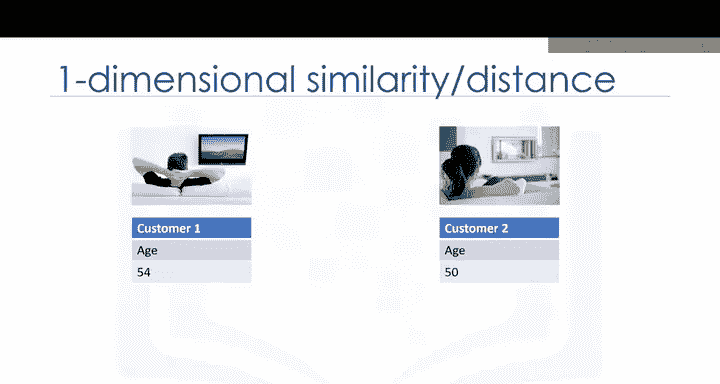

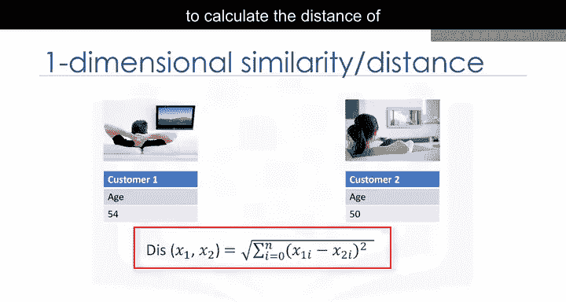

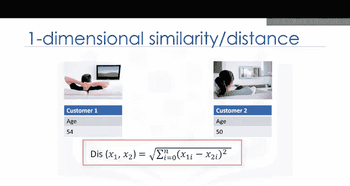

**公式**：
`distance = sqrt((age1 - age2)^2)`

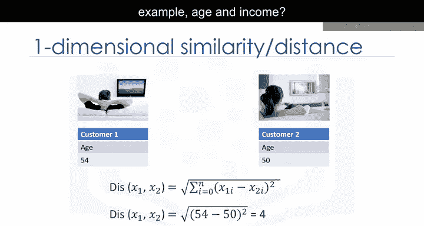

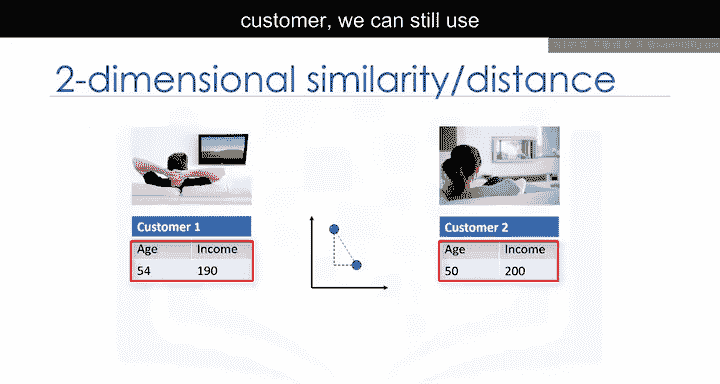

如果特征不止一个呢？例如，每个客户有年龄和收入两个特征。我们仍然可以使用相同的公式，但这次是在二维空间中。

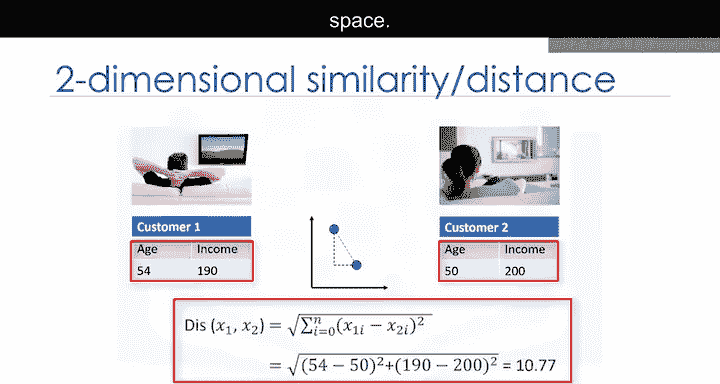

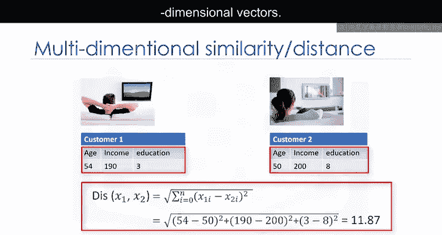

**公式**：
`distance = sqrt((age1 - age2)^2 + (income1 - income2)^2)`

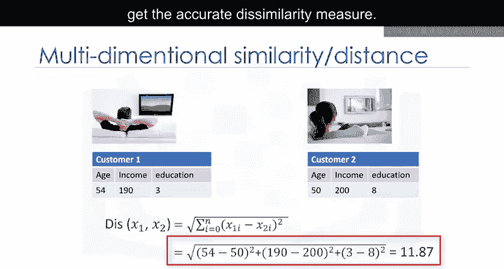

对于多维向量，我们也可以使用相同的距离公式。当然，为了获得准确的不相似性度量，我们必须对特征集进行**归一化**。

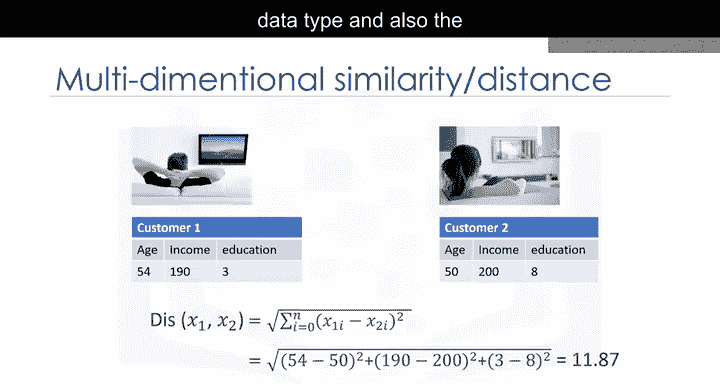

除了欧几里得距离，还有其他不相似性度量，如余弦相似度、平均距离等。距离度量的选择高度依赖于数据类型和进行聚类的领域。相似性度量在很大程度上控制着簇的形成方式，因此建议理解数据集的领域知识和特征的数据类型，然后选择有意义的距离度量。

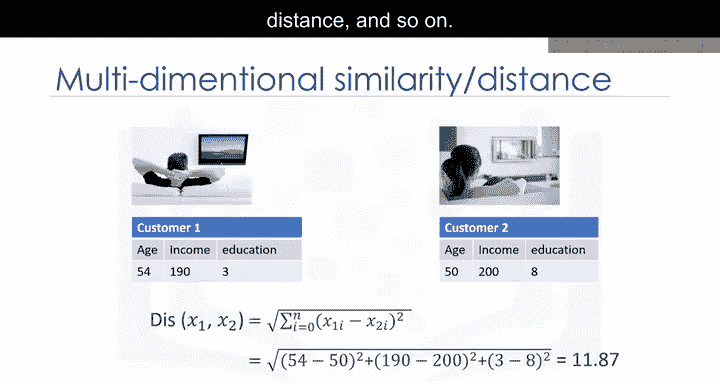

## K均值聚类的工作原理 🔄

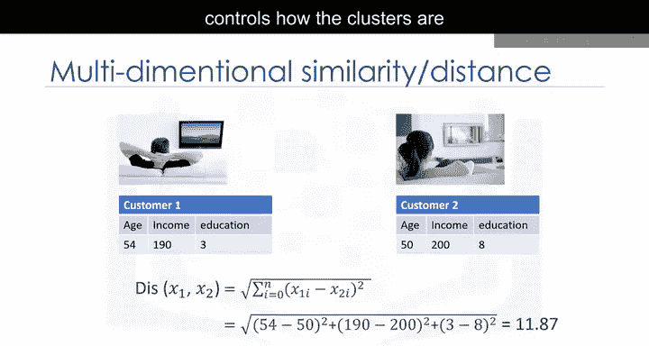

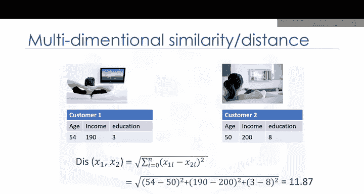

为了简单起见，假设我们的数据集只有两个特征：客户的年龄和收入。这是一个二维空间，我们可以用散点图展示客户的分布，Y轴表示年龄，X轴表示收入。

我们尝试基于这两个维度将客户数据聚类成不同的组或簇。

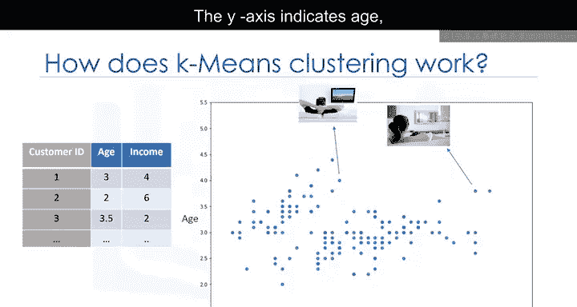

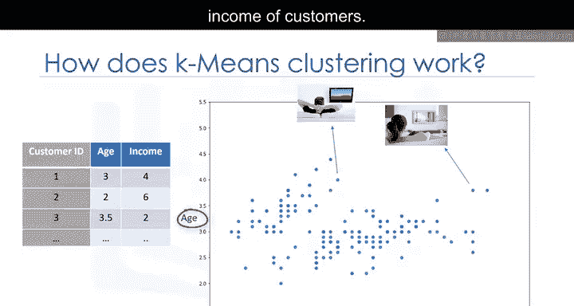

### 第一步：确定簇的数量（K值）

K均值算法的核心概念是它为每个簇随机选取一个中心点。这意味着我们必须初始化K，K代表簇的数量。

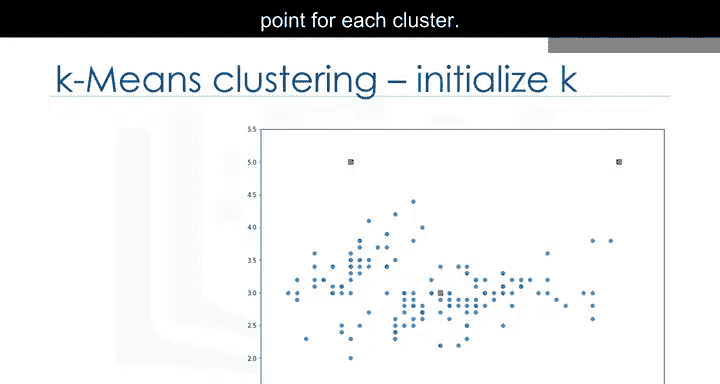

本质上，确定数据集中的簇数量（K值）是K均值中的一个难题，我们稍后会讨论。现在，让我们为示例数据集设K=3。这就像我们有三个代表簇的点。

这三个数据点称为簇的**质心**，其特征大小应与客户特征集相同。

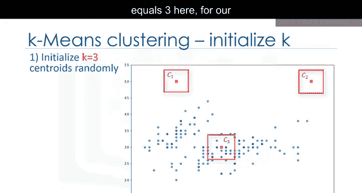

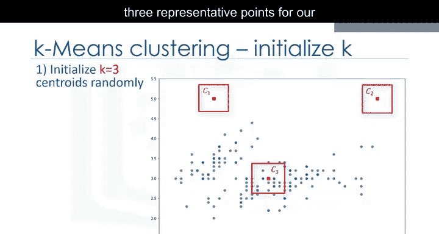

选择这些质心有两种方法：
1.  我们可以从数据中随机选择三个观测值，并将这些观测值作为初始均值。
2.  我们可以创建三个随机点作为簇的质心，这是我们的选择，在图中用红色显示。

### 第二步：将每个点分配到最近的质心

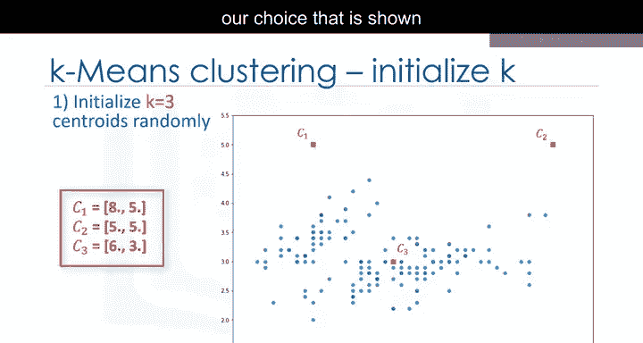

在初始化步骤（定义每个簇的质心）之后，我们必须将每个客户分配到最近的中心。为此，我们必须计算每个数据点（在我们的例子中是每个客户）到质心点的距离。

如前所述，根据数据的性质和聚类的目的，可以使用不同的距离度量将项目分配到簇中。因此，你将形成一个矩阵，其中每一行代表一个客户到每个质心的距离，这称为**距离矩阵**。

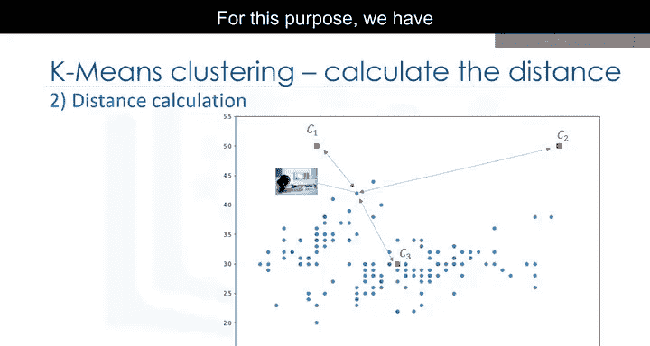

K均值聚类的主要目标是**最小化数据点与其所属簇质心的距离**，并**最大化与其他簇质心的距离**。

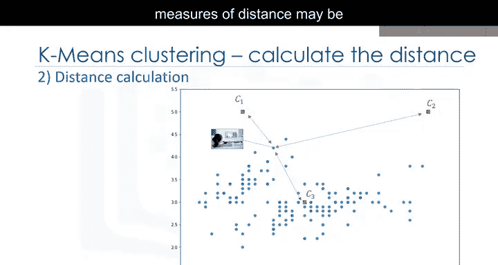

所以，在这一步中，我们必须找到每个数据点最近的质心。我们可以使用距离矩阵来找到数据点最近的质心。找到每个数据点最近的质心后，我们将每个数据点分配到该簇；换句话说，所有客户将根据他们与质心的距离落入一个簇。

### 第三步：重新计算质心位置

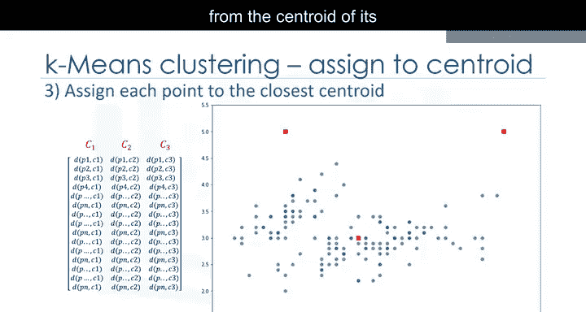

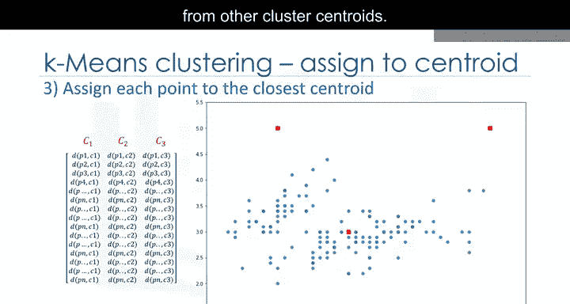

我们可以轻易地说，这不会产生好的簇，因为质心最初是随机选择的。实际上，模型会有很高的误差。这里的误差是每个点与其质心的总距离，可以表示为**簇内平方和误差**。直观上，我们试图减少这个误差，这意味着我们应该以这样的方式塑造簇：使簇中所有成员与其质心的总距离最小化。

那么，如何将其转变为误差更小的更好簇呢？答案是：我们移动质心。

在下一步中，每个簇中心将更新为其簇内数据点的平均值。实际上，每个质心根据其簇成员移动。换句话说，三个簇中每个簇的质心变为新的均值。

**示例**：
如果点A的坐标是（7.4， 3.6），点B的特征是（7.8， 3.8），那么这个包含两个点的簇的新质心将是它们的平均值，即（7.6， 3.7）。

### 第四步：迭代直至收敛

现在我们有了新的质心。正如你所猜测的，我们将再次计算所有点到新质心的距离。点被重新分配，质心再次移动。

这个过程持续进行，直到质心不再移动。请注意，每当质心移动时，都需要重新测量每个点到质心的距离。

是的，K均值是一个**迭代算法**，我们必须重复步骤2到4，直到算法收敛。

在每次迭代中，它将移动质心，计算到新质心的距离，并将数据点分配到最近的质心。这会产生误差最小或最密集的簇。

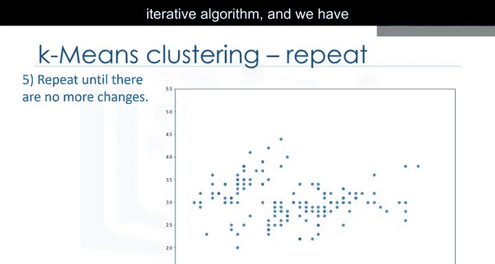

## 算法特性与注意事项 ⚠️

然而，由于它是一种启发式算法，不能保证收敛到全局最优解，结果可能依赖于初始簇。这意味着该算法保证收敛到一个结果，但该结果可能是局部最优解（即不一定是最好的可能结果）。

为了解决这个问题，通常使用不同的起始条件（即随机化的起始质心）多次运行整个过程。由于算法通常非常快，多次运行不会有任何问题。

## 总结

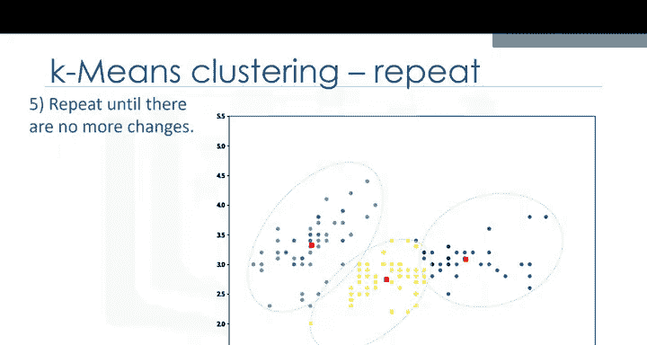

本节课中，我们一起学习了K均值聚类算法。我们了解了它是一种无监督的划分聚类方法，通过计算数据点之间的距离来形成簇。其核心步骤包括：确定簇数K、初始化质心、分配点到最近质心、重新计算质心位置，并迭代直至收敛。我们还讨论了距离度量的选择、算法可能收敛到局部最优解的特性，以及通过多次运行来改善结果的常见做法。