# 022：K均值进阶 🔍

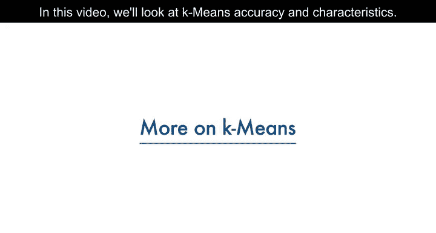

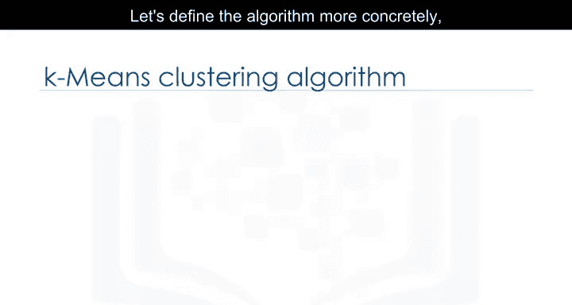

在本节课中，我们将学习K均值算法的准确性评估方法及其核心特性。我们将探讨如何衡量聚类效果，以及如何确定最佳的聚类数量K值。

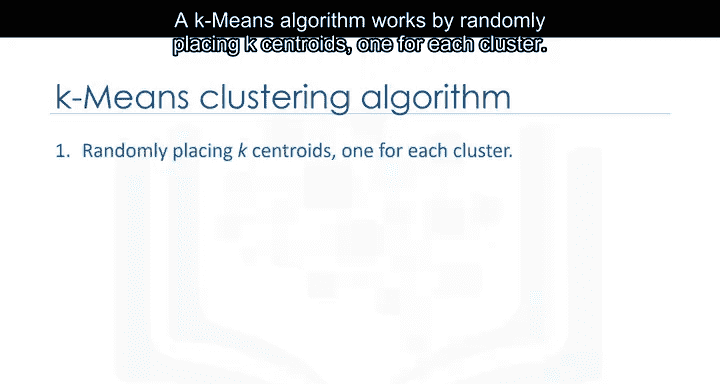

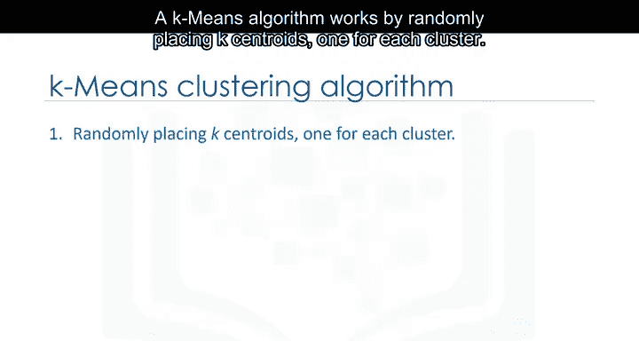

## 算法回顾与准确性评估 🎯

上一节我们介绍了K均值的基本概念，本节中我们来看看如何评估其准确性。

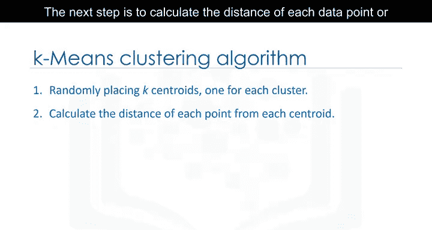

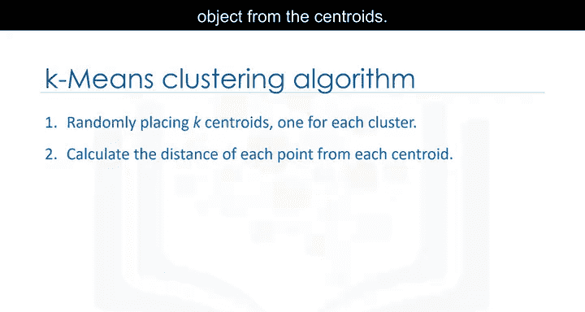

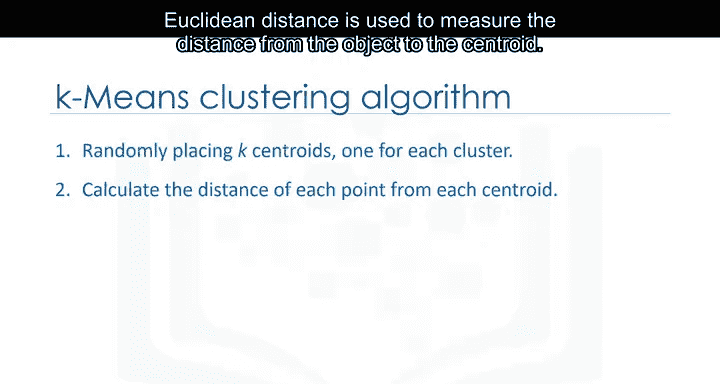

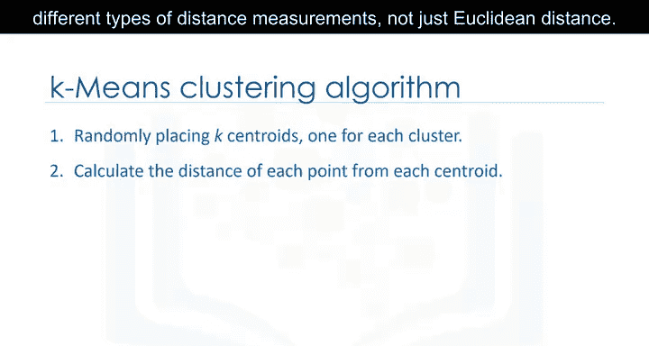

K均值算法首先随机放置K个质心，每个质心代表一个簇。质心初始位置相距越远，效果通常越好。

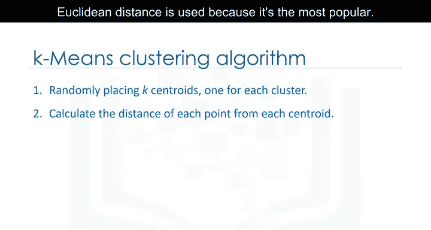

接下来，计算每个数据点到各个质心的距离。通常使用**欧几里得距离**来度量，其公式为：
\[
d(p, q) = \sqrt{\sum_{i=1}^{n} (q_i - p_i)^2}
\]
但请注意，也可以使用其他类型的距离度量方法，欧几里得距离只是最常用的一种。

然后，将每个数据点分配给最近的质心，形成初始分组。接着，根据每个组内所有点的均值重新计算K个质心的位置。重复此过程，直到质心不再移动。

现在的问题是：如何评估K均值形成的聚类质量？换句话说，如何计算K均值聚类的准确性？

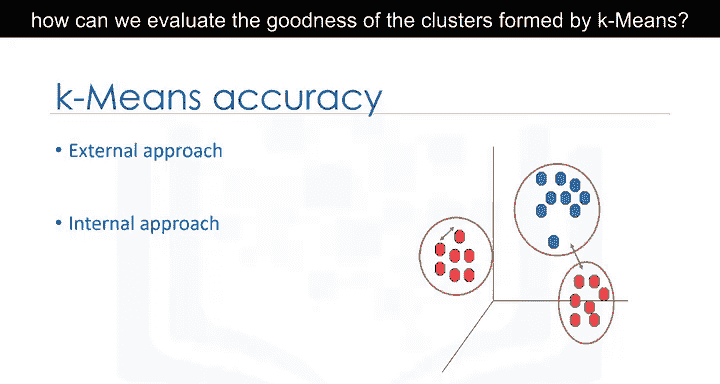

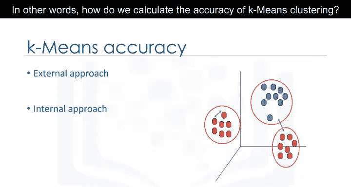

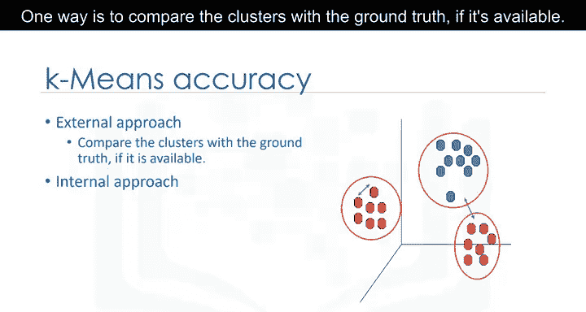

一种方法是与可用的真实标签进行比较。然而，由于K均值是无监督算法，在实际问题中通常没有真实标签可用。但仍有方法可以根据K均值的目标来评估每个聚类的“坏”程度。

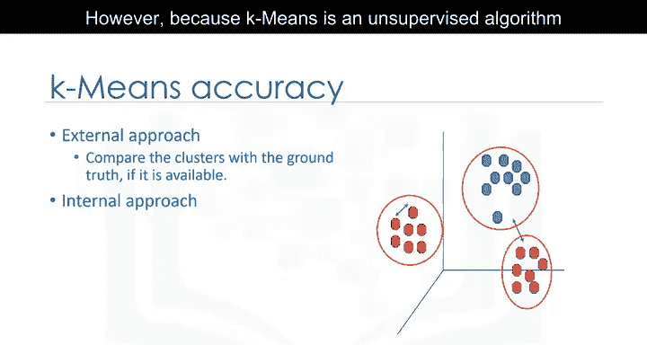

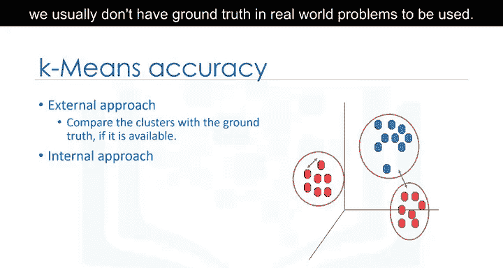

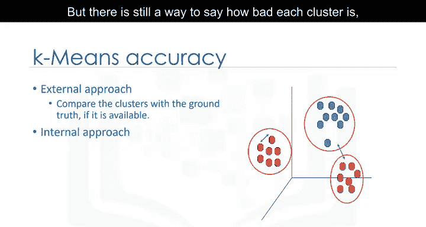

## 评估指标与K值选择 📊

评估聚类质量的一个关键指标是**簇内平均距离**，即数据点与其所属簇质心之间距离的平均值。这个值可以作为聚类算法误差的度量标准。

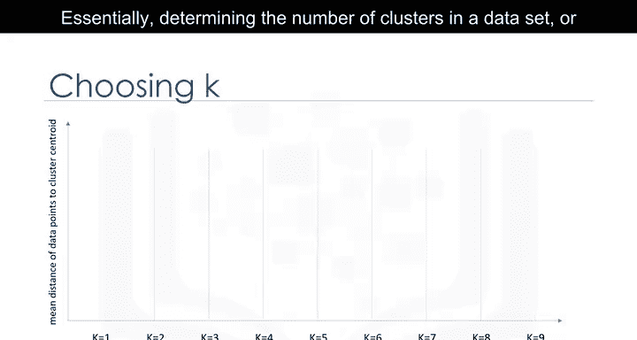

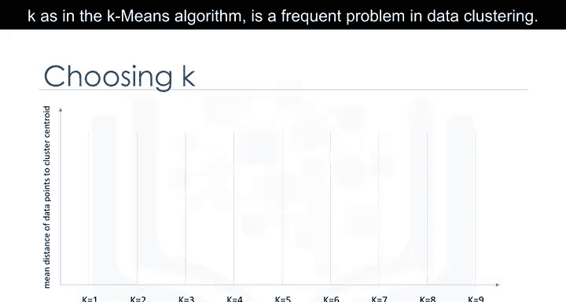

确定数据集中的聚类数量（即K值）是数据聚类中的一个常见问题。K的正确选择往往不明确，因为它高度依赖于数据集中点的分布形状和尺度。

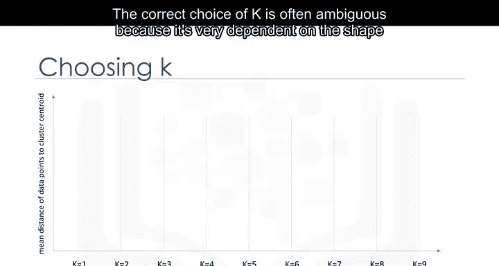

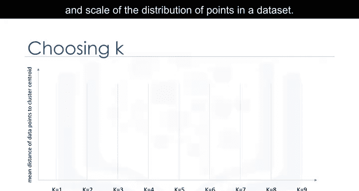

以下是解决此问题的一些常用方法：

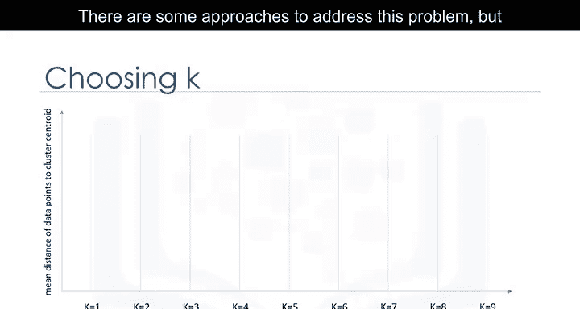

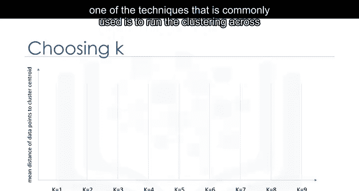

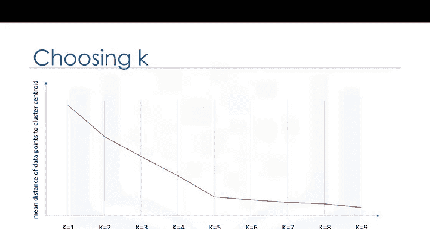

一种常见技术是针对不同的K值运行聚类，并观察聚类的准确性指标。该指标可以是数据点与其簇质心之间的平均距离，它反映了簇的密度或聚类误差的减小程度。

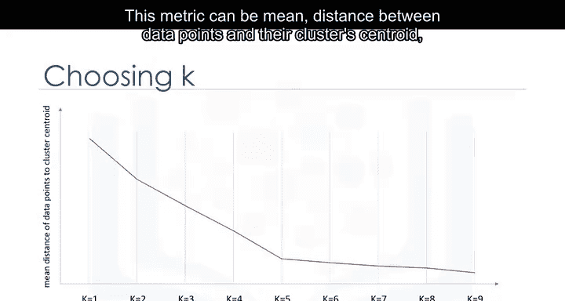

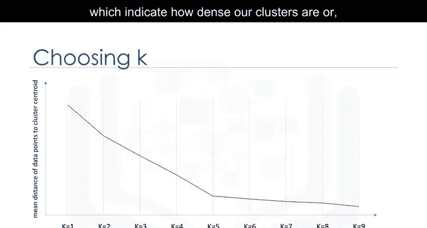

然后，通过观察该指标的变化，我们可以找到最佳的K值。但问题是，随着聚类数量的增加，质心到数据点的距离总会减小。这意味着增加K总会降低误差。

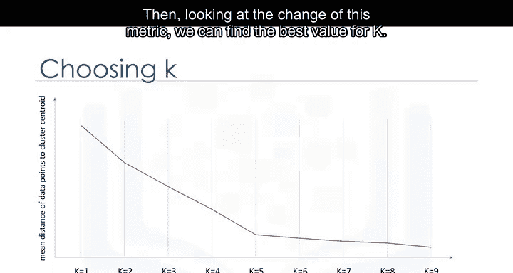

因此，我们将该指标作为K的函数绘制成图，并确定**拐点**——即下降率发生急剧变化的点。这个点对应的K值就是最佳的聚类数量。

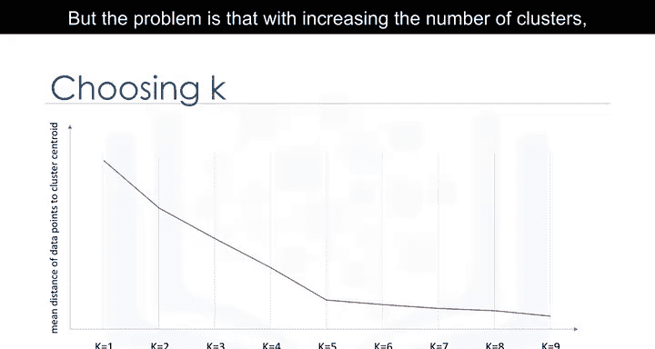

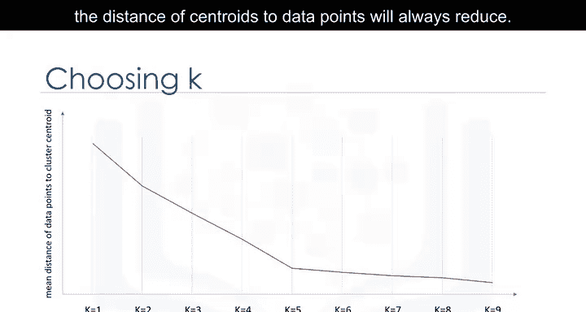

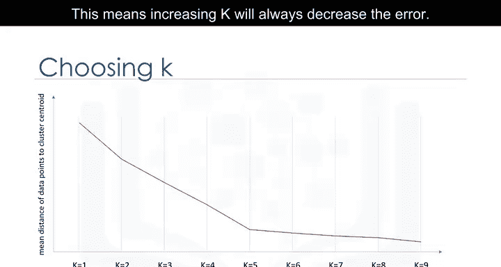

这种方法被称为**肘部法则**。

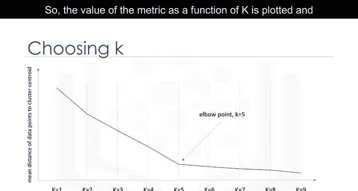

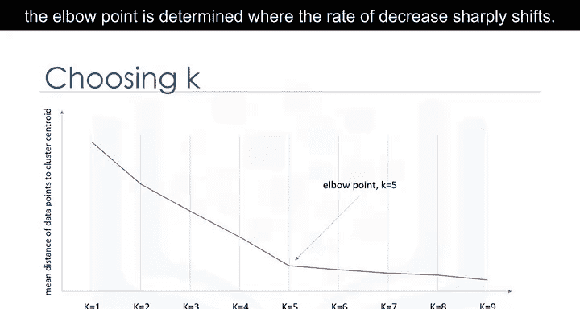

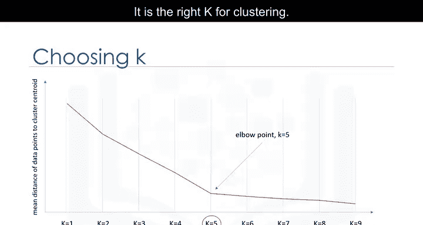

## 总结 📝

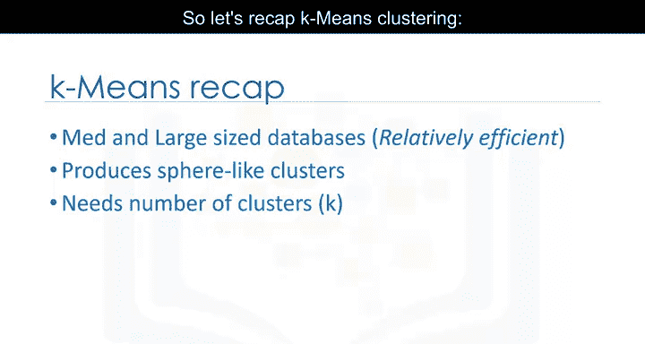

本节课中我们一起学习了K均值聚类算法的准确性评估与特性。

K均值是一种基于划分的聚类方法，对中型和大型数据集相对高效。它产生类球形的簇，因为簇是围绕质心形成的。其缺点是需要预先指定聚类数量，而这并非易事。

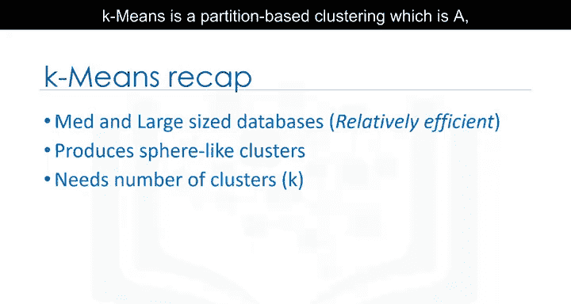

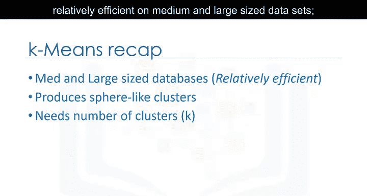

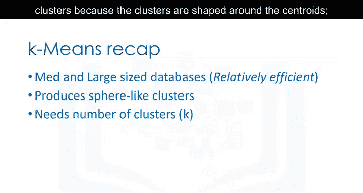

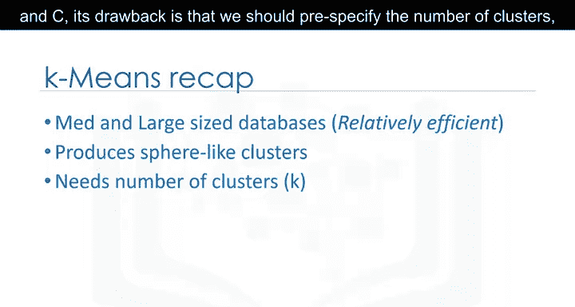

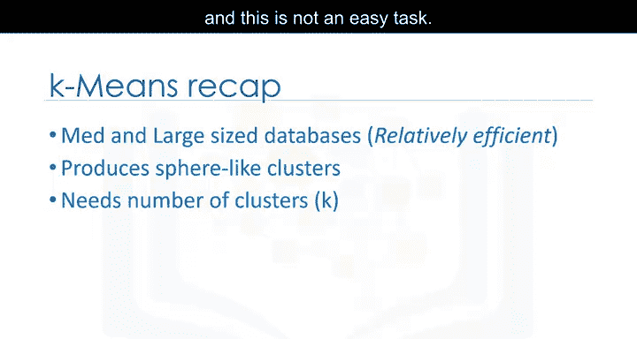

通过使用肘部法则等评估方法，我们可以更科学地确定最佳的K值，从而提升聚类效果。