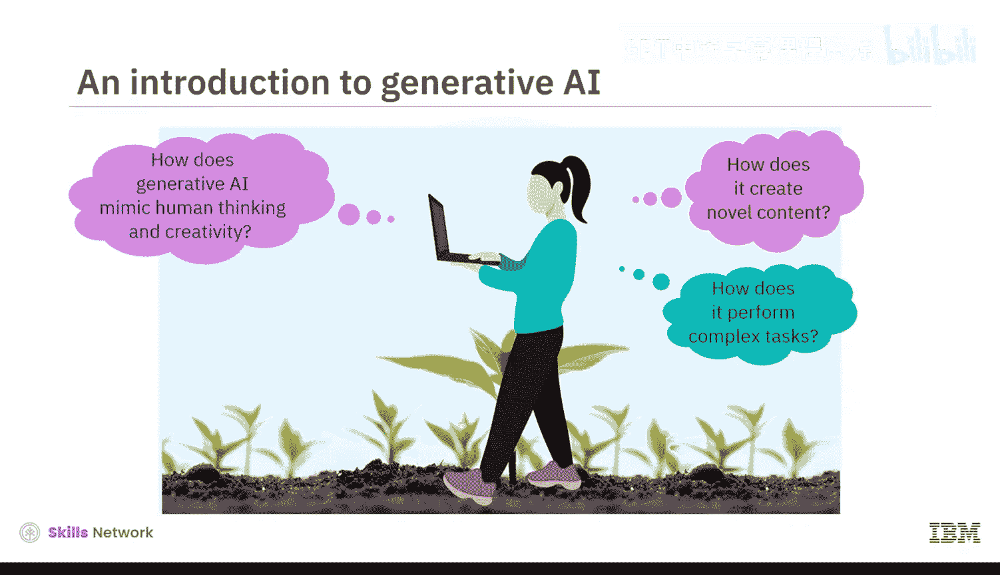
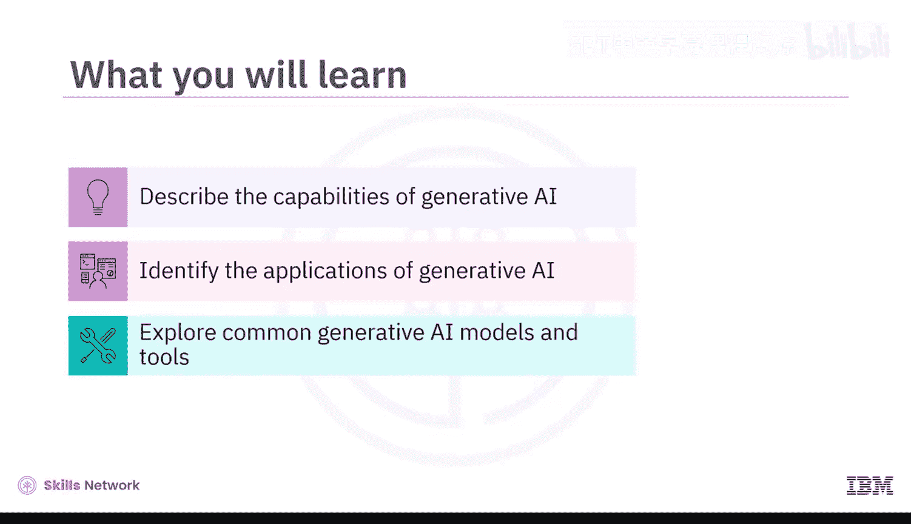
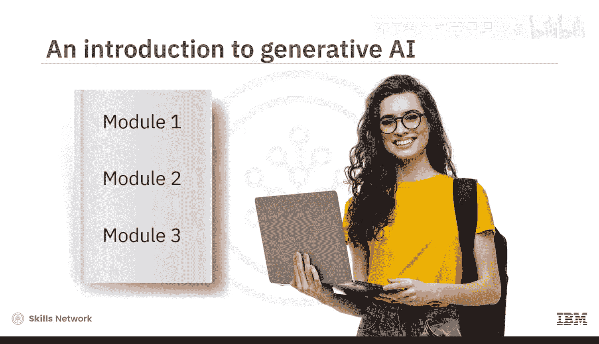
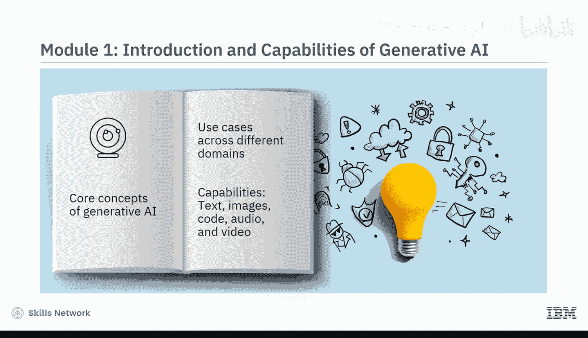
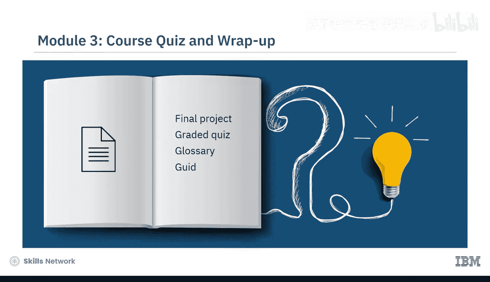
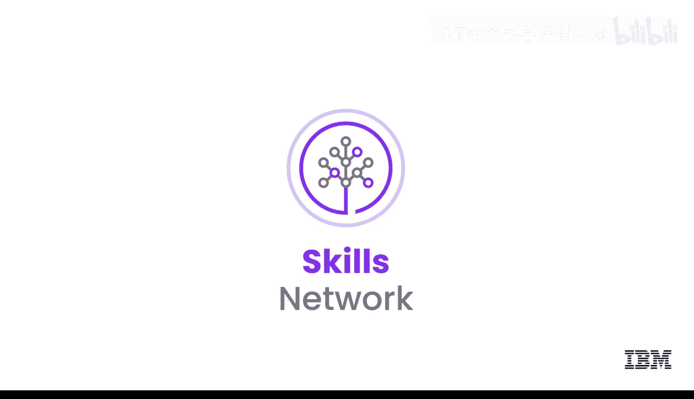

# 001：课程介绍 🚀

在本节课中，我们将要学习生成式AI的入门知识，了解其核心概念、应用潜力以及本课程的结构与目标。

想象一个由AI驱动的世界，它能让我们工作更高效、寿命更长、能源更清洁。这个世界已经到来。生成式AI对我们生活方式的各个方面都产生了巨大影响。

生成式AI模型能够模仿人类的思维和创造力，以生成新颖的内容并执行复杂的任务，就像你我一样。

组织可以利用生成式AI来提高生产力和盈利能力。个人可以使用生成式AI工具来提升效率，为工作增添实际价值，节省成本并最大化品牌价值。

如果你尚未涉足这一领域，本课程正适合你。我们邀请所有对快速发展的生成式AI领域抱有真诚兴趣的专业人士、爱好者、开发者和学生参与。无论你的背景或经验如何，这是一门面向所有人的课程。

本课程旨在让你对生成式AI的能力、应用、常见模型和工具有一个扎实的理解。在本课程结束时，你将能够描述生成式AI的能力及其在现实世界中的用例，识别生成式AI在不同领域和行业中的应用，并探索常见的生成式AI模型和工具。

## 课程结构 📚

这是一门精炼的课程，包含三个模块。预计每个模块需要花费一到两个小时完成。

在课程的第一个模块中，你将学习生成式AI的核心概念，了解其在不同领域的应用案例，并理解其在生成文本、图像、代码、音频和视频方面的能力。

在第二个模块中，你将探索不同行业和领域（如信息技术、娱乐、教育、金融和医疗保健）如何利用生成式AI。此外，在本模块中，你还将学习用于生成文本、图像、代码、音频和视频的常见模型和工具的功能与特性，例如 **ChatGPT**、**DALL-E** 和 **Synthesia**。

第三个模块要求你参与一个最终项目，并完成一个计分测验，以检验你对课程概念的理解。你还可以访问课程术语表，并获得关于后续学习路径的指导。

## 学习资源与方法 🛠️

本课程融合了概念讲解视频和辅助阅读材料。观看所有视频以充分掌握学习材料的潜力。

你将体验到动手实验和一个最终项目，这些内容展示了生成式AI在多个领域的常见用例。每节课后都有练习测验，帮助你巩固所学知识。课程结束时，你还需完成一个计分测验。

课程还提供了讨论论坛，方便你与课程工作人员联系并与同伴交流互动。最有趣的是，通过专家观点视频，你将听到经验丰富的从业者分享他们对生成式AI不同方面的见解。

## 课程价值与展望 ✨

当生成式AI正在增强全球个人、组织和社区的创造力表达与专业能力时，请不要驻足观望。本课程为你提供了一个创造新体验的机会。

本节课中，我们一起学习了生成式AI的基本介绍、课程目标、结构安排以及丰富的学习资源。现在，你已经准备好开启探索生成式AI世界的旅程了。