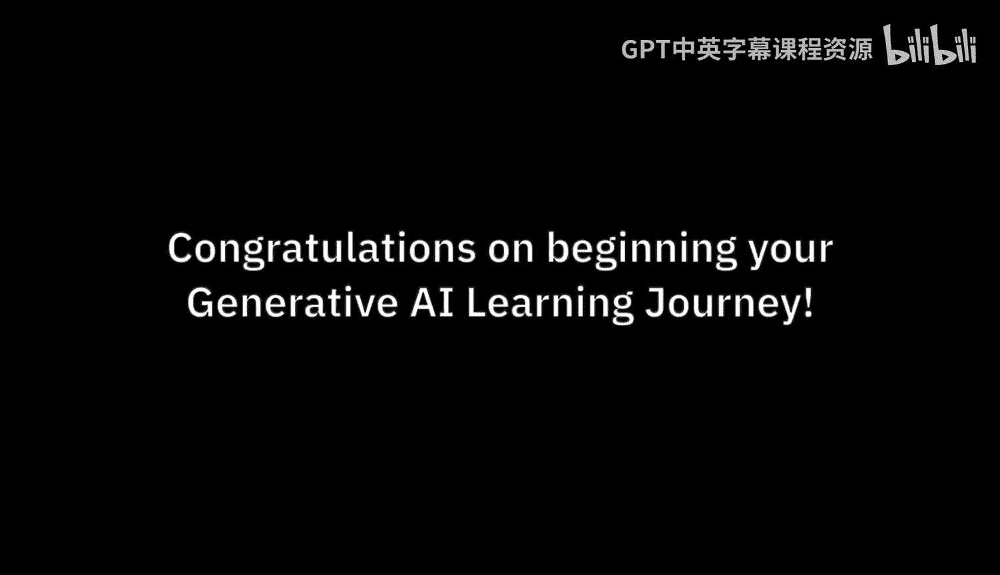
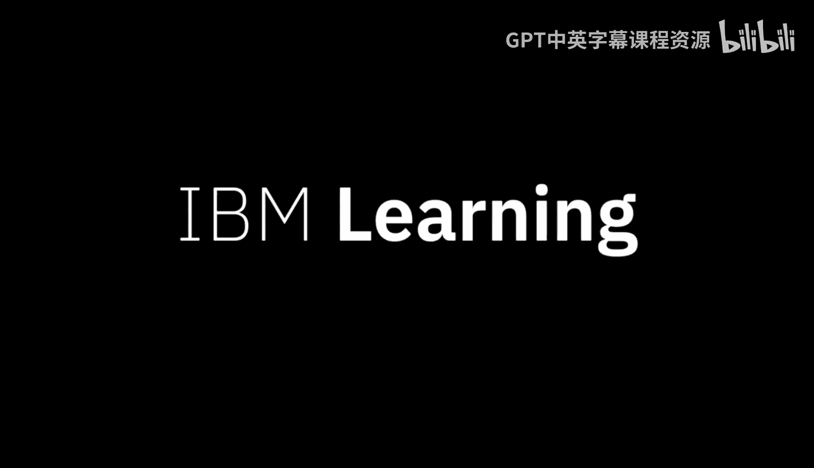

# 002：为何学习IBM生成式AI

在本节课中，我们将探讨生成式AI为何成为当今各行业领导者的关注焦点，以及学习IBM生成式AI课程对个人职业发展的重要性。

生成式AI是每一位领导者、每一个组织、企业或政府都在思考的议题。随之而来的关注也带来了机遇。各组织正在寻找理解这项技术的人才。更重要的是，他们需要具备应用这项技术技能的人才。

与以往许多趋势性技术不同，生成式AI几乎触及了每个职业中的每一个角色。生成式AI技能预计将变得非常重要，不仅对计算机科学家如此，对所有人都是如此。这些技能将变得像文字处理、电子表格甚至基本商业素养一样必不可少。这正是这些“面向所有人的生成式AI”课程设立的原因。

当前，人们对AI产生了许多新的兴趣。企业正在将目光超越消费级AI。聊天机器人界面是展示生成式AI潜力的绝佳方式。然而，现实生活中的用例是将生成式AI嵌入现有流程，并使其成为几乎每个业务工作流程中不可或缺的功能。

IBM很自豪能够帮助企业将生成式AI整合到其运营中。通过这些课程，你将获得的技能应有助于你的职业生涯，并能立即应用到你的工作中。

企业对生成式AI的潜力感到兴奋，但同时也对潜在的危险感到担忧。这项使命至关重要，不容有失。这些课程将赋予你处理AI伦理问题的技能，这些技能基于IBM开创的、负责任的、脚踏实地的研究方法。

---

本节课中，我们一起学习了生成式AI的广泛影响力及其成为必备技能的原因，了解了企业如何超越简单的聊天机器人应用，将AI深度整合到业务流程中，并认识到IBM课程在提供实用技能和负责任AI伦理观方面的重要价值。