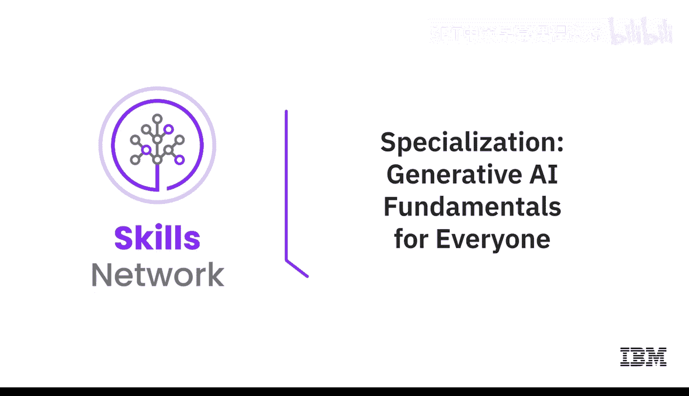
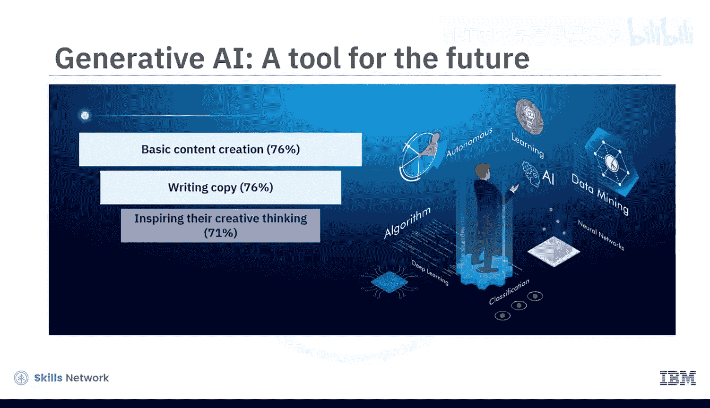
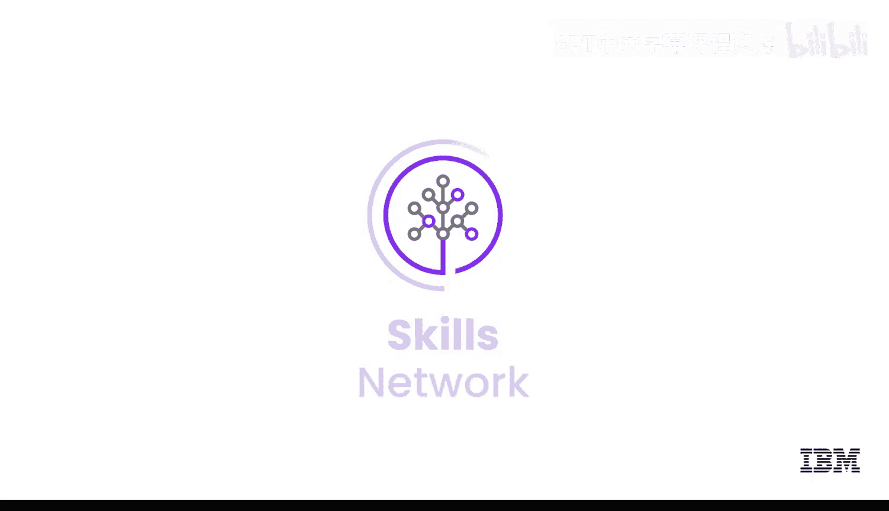

# 003：专项课程介绍 🚀

在本节课中，我们将全面了解IBM的《生成式AI基础》专项课程。该课程旨在帮助学习者，无论其技术背景如何，都能掌握生成式AI的核心概念、工具与应用，从而把握这一变革性技术带来的机遇。

你知道吗？全球的营销人员已经在使用生成式AI来创作内容、撰写文案、激发创意、分析市场数据以及生成图像。

根据彭博社的预测，生成式AI市场预计到2032年将达到1.3万亿美元。因此，深入了解生成式AI对你而言至关重要。那么，生成式AI适合所有人吗？答案是肯定的。你可以利用它的潜力，为自己创造更好的职业发展和生活。本专项课程面向所有渴望探索生成式AI力量的人，无需具备先前的AI技术知识或背景。即使是初学者也能从中受益，因为它全面涵盖了生成式AI的基本概念、模型、工具和应用。

完成本专项课程后，你将能够：
*   解释生成式AI基础模型的基本概念、能力、模型、工具、应用和平台。
*   描述提示工程，并应用强大的提示工程技术来编写有效的提示，从而从AI模型中生成期望的结果。
*   讨论生成式AI的局限性，并解释其伦理关切及负责任使用的考量。
*   认识到生成式AI在提升你职业生涯和帮助改进工作场所方面的能力。

本专项课程包含五门自定进度的课程，每门课程需要3到5小时完成。

---

## 课程一：生成式AI入门与应用领域

课程一是你理解生成式AI能力的第一步，其能力涵盖文本、图像、音频、视频、虚拟世界、代码和数据等多个领域。你将了解不同行业如何应用常见的生成式AI模型和工具，例如GPT、DALL-E、Stable Diffusion、IBM Granite和Synthesia。

---

## 课程二：提示工程的艺术

上一节我们介绍了生成式AI的广泛应用，本节中我们来看看如何有效地与AI交互。课程二介绍了提示工程的概念，以及它如何帮助你释放像ChatGPT这样的生成式AI工具的全部潜力。你将探索开发有效提示的技术、方法和最佳实践，并使用IBM Watsonx.ai、Spellbook和Dust等常用工具进行实践。

---

## 课程三：核心概念与构建模块

掌握了与AI对话的技巧后，我们需要深入理解其背后的原理。课程三专注于生成式AI的核心概念和构建模块，例如深度学习、基于Transformer架构的大语言模型、扩散模型和基础模型。你还将了解不同的生成式AI平台，如IBM Watsonx.ai和Hugging Face。

---

## 课程四：伦理考量与局限性

了解了技术原理，我们必须同时关注其带来的影响。课程四探讨与生成式AI相关的伦理考量：它如何影响数据隐私与安全、版权侵权、劳动力以及环境。你还会描述其局限性，例如数据偏见、缺乏可解释性、透明度和可理解性，并识别生成式AI的常见误用，如深度伪造和幻觉。

---

## 课程五：未来展望与职业机遇

最后，课程五讨论生成式AI的未来。你难道不想知道在那个未来里，你的职业机会有哪些吗？你将学习生成式AI如何影响和增强不同行业和领域的现有职能、技能和工作角色，以及如何利用生成式AI构建自己的应用程序，创造新的商业机会。

本专项课程的内容旨在吸引并赋能你。通过观看精选的概念视频、聆听AI专家分享他们的见解和技巧，以及在实验和项目中实践技术，你将在日常生活中使用生成式AI工具和应用程序时感到更加自信。

目前，65%的生成式AI用户是千禧一代或Z世代，72%是在职人员。通过本专项课程的学习，你将准备好加入生成式AI变革者的行列。

生成式AI，属于每一个人。

---

本节课中，我们一起学习了IBM《生成式AI基础》专项课程的整体架构与学习目标。该课程从入门应用、交互技巧、核心原理、伦理风险到未来展望，为你构建了完整的知识体系，帮助你自信地迈入生成式AI的世界，抓住未来的机遇。